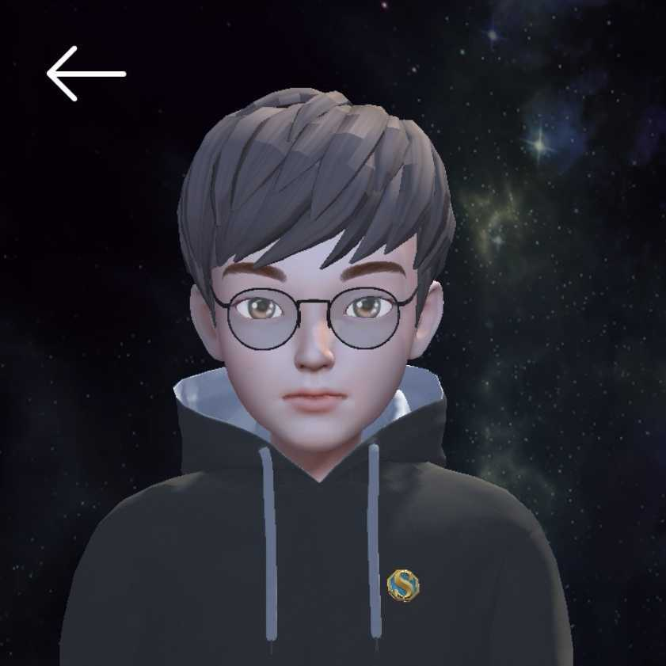

# Overview

Xu Lin is an AI engineer and computer vision practitioner focused on turning research ideas into dependable systems. The work spans multimodal learning, model development, data pipelines, evaluation, and the engineering needed to make those pieces useful in real settings.

## Snapshot

- Current focus: multimodal AI systems, computer vision, model deployment, and practical ML workflows
- Working style: research-minded, implementation-heavy, and strongly biased toward reproducible results
- Core stack: Python, PyTorch, TensorFlow, PaddlePaddle, SQL, Apache Spark, and production-facing data tooling
- Interest areas: computer vision, multimodal machine learning, data-centric AI, and open-source learning systems

## Experience

Xu Lin is currently an AI Engineer at Tencent Youtu Lab. Before that, there was project and internship experience with robotics and applied AI teams, including work connected to Keeko Robot and Strait Intelligence Robot. Across these roles, the common thread has been building models and systems that move beyond notebooks into usable products and workflows.

## What This Site Covers

- `Overview`: a concise introduction to background, interests, and current direction
- `Skills`: technical capabilities across modeling, tooling, and engineering
- `Experience`: role history and practical industry context
- `Projects`: selected work, experiments, and open-source repositories
- `Publications`: papers, technical output, and research traces
- `Docs`: notes, references, and supporting material

## Working Themes

### Research to Production

The strongest projects usually sit at the intersection of curiosity and utility. That means building with enough rigor for research exploration, while keeping the implementation clear enough to scale, reuse, and ship.

### Systems Thinking

Good ML work is rarely just model work. It includes datasets, data quality, evaluation, tooling, debugging, monitoring, and delivery. This portfolio reflects that broader view.

### Continuous Learning

The site is intentionally organized like a living workspace. It is not only a resume, but also a public record of what is being explored, learned, and refined over time.

## Contact

- GitHub: [github.com/isLinXu](https://github.com/isLinXu)
- LinkedIn: [linkedin.com/in/xu-lin-3b78a5251](https://www.linkedin.com/in/xu-lin-3b78a5251/)
- Medium: [medium.com/@isLinXu](https://medium.com/@isLinXu)
- Blog: [www.cnblogs.com/isLinXu](https://www.cnblogs.com/isLinXu/)
- Email: [linxu.official@gmail.com](mailto:linxu.official@gmail.com)
