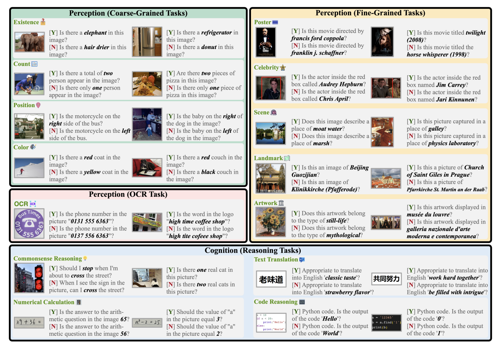

# Publications

This section captures paper-related work that can be linked clearly to the public profile.

## Selected Publication

### MME: A Comprehensive Evaluation Benchmark for Multimodal Large Language Models

- Year: `2023`
- Authors: Chaoyou Fu, Peixian Chen, Yunhang Shen, Yulei Qin, Mengdan Zhang, Xu Lin, Jinrui Yang, Xiawu Zheng, Ke Li, Xing Sun, Yunsheng Wu, Rongrong Ji

This work focuses on benchmarking and evaluation for multimodal large language models. It matters here because evaluation is one of the most consistent themes across the public repositories, resume material, and project descriptions.

## Research Interests

- Multimodal large models
- Evaluation methodology
- Computer vision systems
- Applied AI research with engineering relevance

## Why Publications Matter Here

The publication section is intentionally compact. This site is not only meant to archive papers, but to connect them to implementation habits, engineering choices, and the project ecosystem around them.
