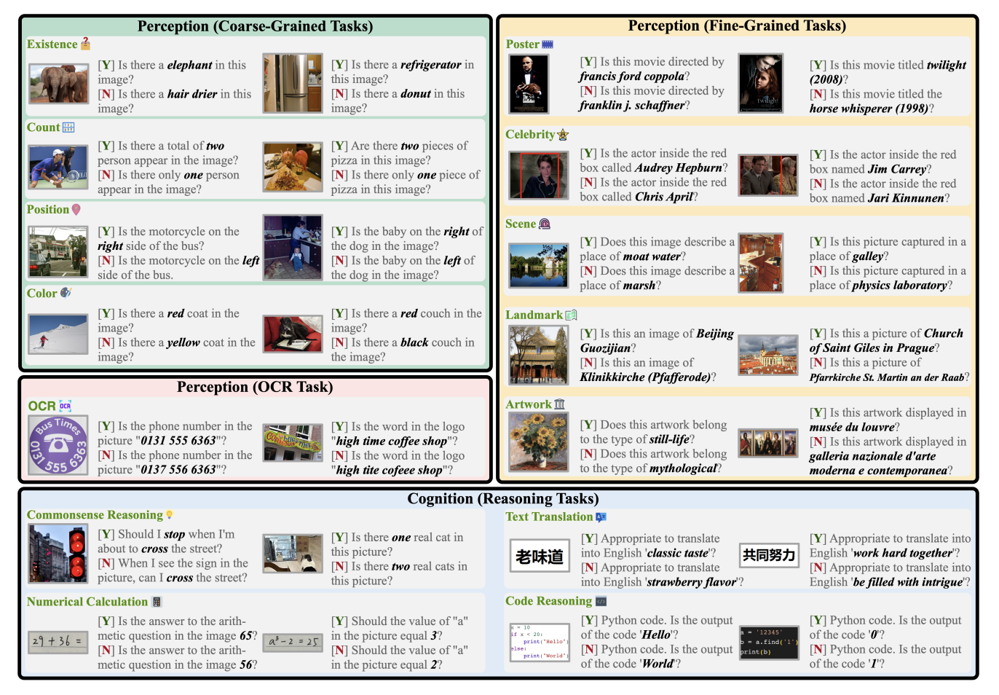

|  | `2023` [**MME: A Comprehensive Evaluation Benchmark for Multimodal Large Language Models**](**MME: A Comprehensive Evaluation Benchmark for Multimodal Large Language Models**) | Chaoyou Fu , Peixian Chen , Yunhang Shen , Yulei Qin , Mengdan Zhang , Xu Lin, Jinrui Yang , Xiawu Zheng , Ke Li*, Xing Sun , Yunsheng Wu , Rongrong Ji |
| ------------------------------------------------------------ | ------------------------------------------------------------ | ------------------------------------------------------------ |
|                                                              |                                                              |                                                              |
|                                                              |                                                              |                                                              |

