## DeepLabv3+训练模型学习总结

---

## 一、DeepLabs3+介绍

**DeepLabv3**是一种语义分割架构，它在[DeepLabv2](https://paperswithcode.com/method/deeplabv2)的基础上进行了一些修改。为了处理在多个尺度上分割对象的问题，设计了在级联或并行中采用多孔[卷积](https://paperswithcode.com/method/convolution)的模块，通过采用多个多孔速率来捕获多尺度上下文。此外，来自 DeepLabv2 的 Atrous [Spatial Pyramid Pooling](https://paperswithcode.com/method/spatial-pyramid-pooling)模块增加了编码全局上下文的图像级特征，并进一步提高了性能。

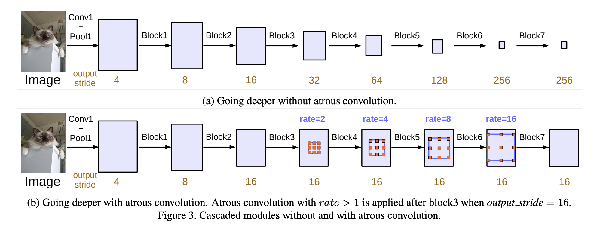


ASSP 模块的变化是作者在模型的最后一个特征图上应用[全局平均池](https://paperswithcode.com/method/global-average-pooling)化，将生成的图像级特征馈送到具有 256 个滤波器（和[批量归一化](https://paperswithcode.com/method/batch-normalization)）的 1×1 卷积，然后对模型进行双线性上采样特征到所需的空间维度。最后，改进的[ASPP](https://paperswithcode.com/method/aspp)由 (a) 一个 1×1 卷积和三个 3×3 卷积组成，当输出步幅 = 16 时，速率 = (6, 12, 18)（均具有 256 个滤波器和批量归一化），以及（ b) 图像级特征。

另一个有趣的区别是不再需要来自 DeepLabv2 的 DenseCRF 后处理。

---

## 二、DeepLabv3+图像语义分割原理

### 2.1 图像分割任务及常用数据集

#### 2.1.1 图像分割任务

**图像分割**（image segmentation）：根据某些规则将图片分成若干个特定的、具有独特性质的区域，并抽取出感兴趣目标。
• 目前图像分割任务发展出了以下几个子领域：
➢ **语义分割**（semantic segmentation）
➢ **实例分割**（instance segmentation）
➢ 以及刚兴起的新领域：**全景分割**（panoptic segmentation）

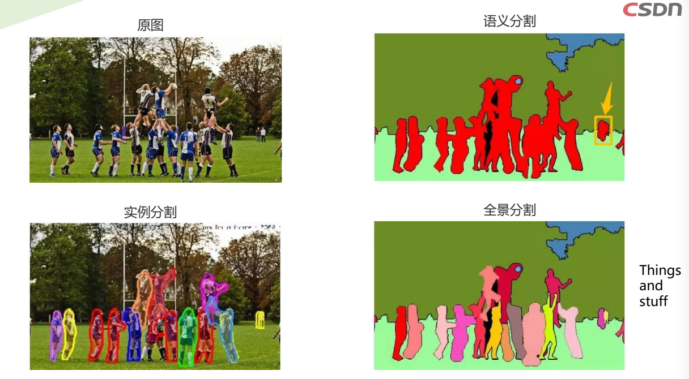


在这里DeepLabv3+就属于一种语义分割的架构模型，
语义分割从任务上来看，要实现的最终目标是：
从像素层次来识别图像，也即为图像中的每个像素指定类别标记。

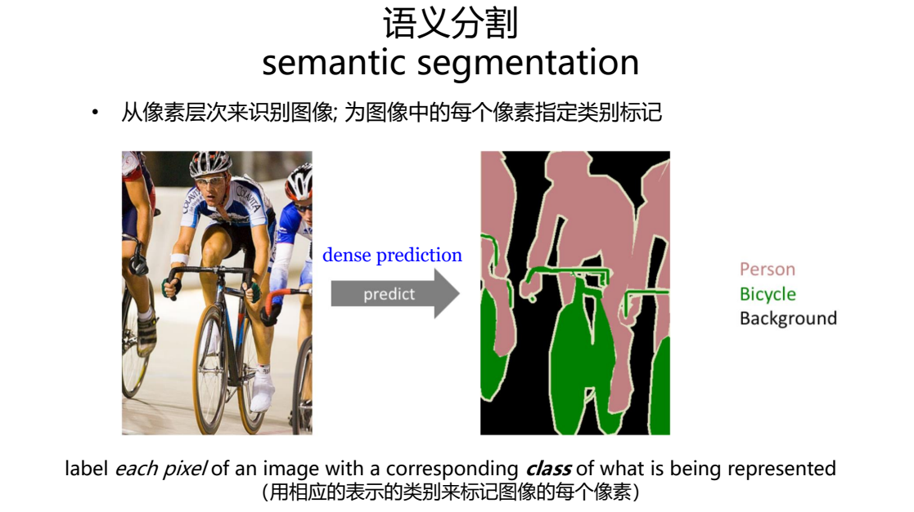

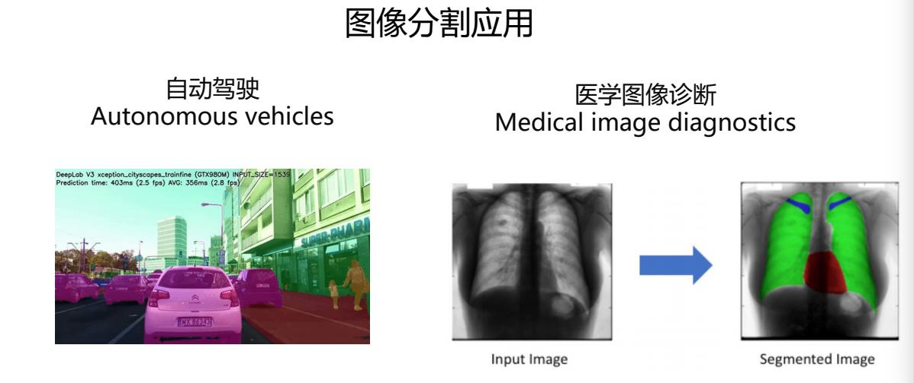

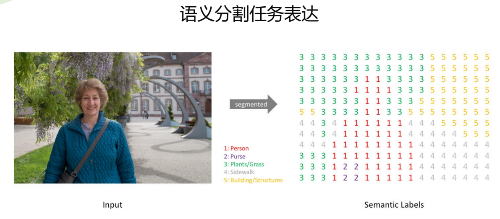

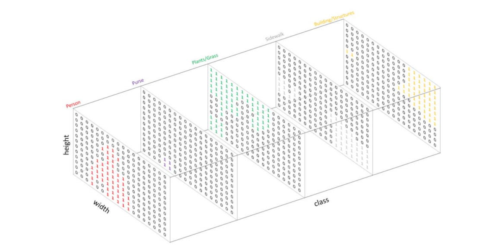

#### 2.1.2 常用数据集

常用数据集
• **PASCAL VOC 2012 Segmentation Competition**

> VOC2012数据集分为20类，包括背景为21类，分别如下：
>
> - 人 ：人
> - 动物：鸟、猫、牛、狗、马、羊
> - 车辆：飞机、自行车、船、巴士、汽车、摩托车、火车
> - 室内：瓶、椅子、餐桌、盆栽植物、沙发、电视/监视器
>
> **挑战任务：**
>
> 1. Classification/Detection Competitions
>
> 2. Segmentation Competition
>
> 3. Action Classification Competition
>
> 4. ImageNet Large Scale Visual Recognition Competition
>
> 5. Person Layout Taster Competition
>
> 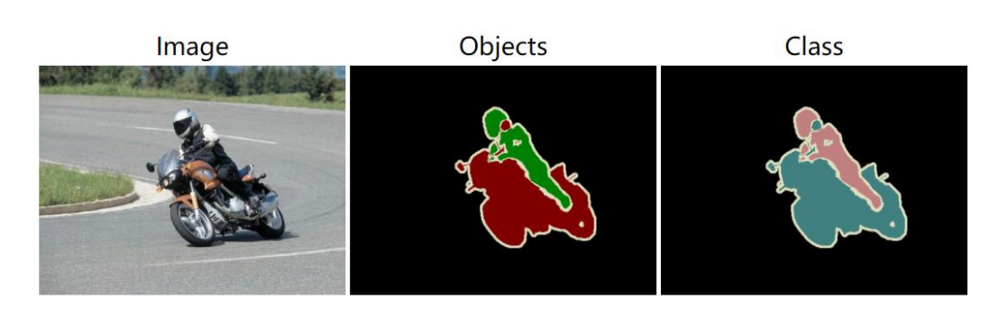
>
> ​    

• **COCO 2018 Stuff Segmentation Task**

> - MS COCO的全称是Microsoft Common Objects in Context，起源于是微软于2014年出资
>   标注的Microsoft COCO数据集，与ImageNet 竞赛一样，被视为是计算机视觉领域最受关
>   注和最权威的比赛之一。
>
> - 而在ImageNet竞赛停办后，COCO竞赛就成为是当前物体识别、检测等领域的一个最权威、
>   最重要的标杆，也是目前该领域在国际上唯一能汇集Google、微软、Facebook以及国内外
>   众多顶尖院校和优秀创新企业共同参与的大赛
>
> - 目前为止有语义分割的最大数据集，提供的类别有 80 类，有超过 33 万张图片，其中 20 万张有标注，
>   整个数据集中个体的数目超过 150 万个。
>
> - 官网：http://cocodataset.org/
>
>   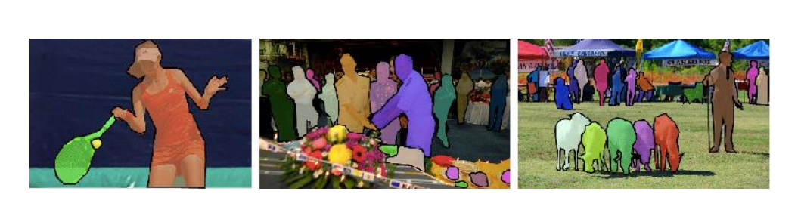
>

• **BDD100K: A Large-scale Diverse Driving Video Database**

> URL:https://bair.berkeley.edu/blog/2018/05/30/bdd/
>
> 2018年5月伯克利大学AI实验室（BAIR）发布了目前最大规模、内容最具多样性的公开驾驶数据集BDD100K，同时设计了一个图片标注系统。
> BDD100K 数据集包含10万段高清视频，每个视频约40秒，720p，30 fps 。每个视频的第10秒对关键帧进行采样，得到10万张图片（图片尺寸：1280720 ），并进行标注。
>
> 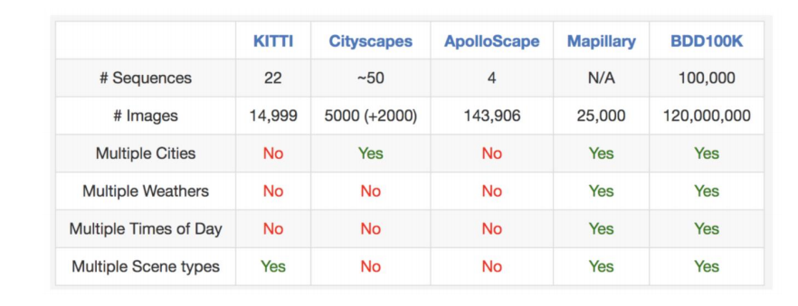
>
> 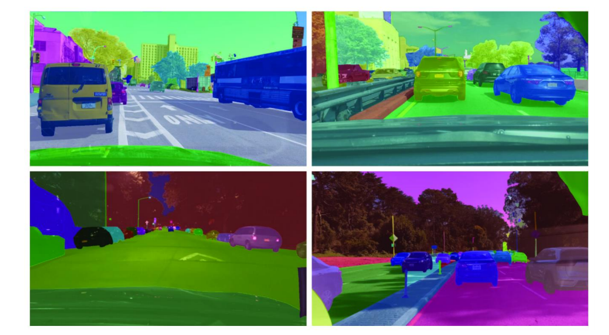

• **Cambridge-driving Labeled Video Database (CamVid)**

> CamVid是第一个具有目标类别语义标签的视频集合。 
> 数据库提供32个ground truth语义标签，将每个像素与语义类别之一相关联。
> 该数据库解决了对实验数据的需求，以定量评估新兴算法。 数据是从驾驶汽车的角度拍摄的。
> 包含戴姆勒在内的三家德国单位联合提供，包含50多个城市的立体视觉数据；像素级标注；提供算法评估接口。
>
> 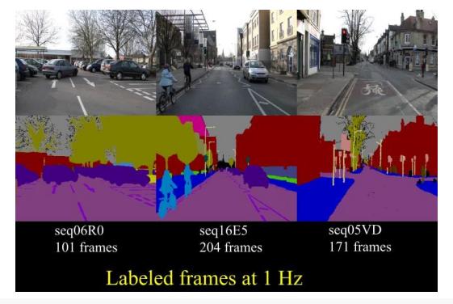
>
> 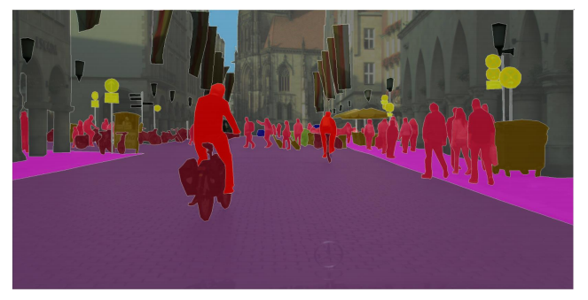
>


• **Cityscapes Dataset**

• **Mapillary Vistas Dataset**

Mapillary Vistas是世界上最大最多样化的像素精确和特定实例标注的街道级图像公开数据集。

>  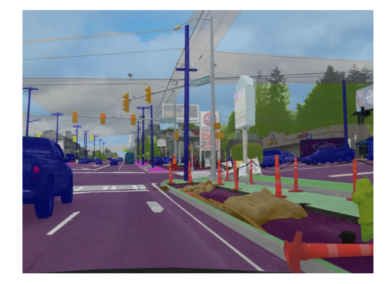


• **ApolloScape Scene Parsing**

> - 百度公司提供的ApolloScape数据集将包括具有高分辨率图像和每像素标注的RGB视频，具有语义
>   分割的测量级密集3D点，立体视频和全景图像。
>
> - Scene Parsing数据集是ApolloScape的一部分，它为高级自动驾驶研究提供了一套工具和数据集。
> - 场景解析旨在为图像中的每个像素或点云中的每个点分配类别（语义）标签。
>  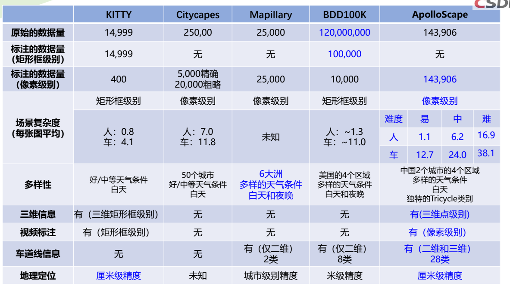


---

### 2.2 DeepLabv3+语义分割原理

#### 编码器/解码器(encoder/decoder)结构

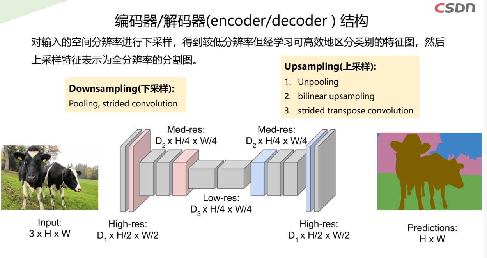


#### 卷积(Convolution)运算

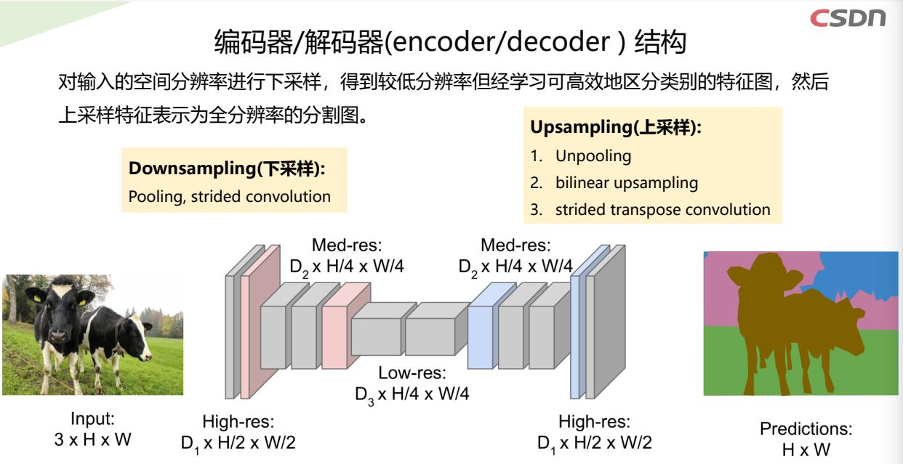

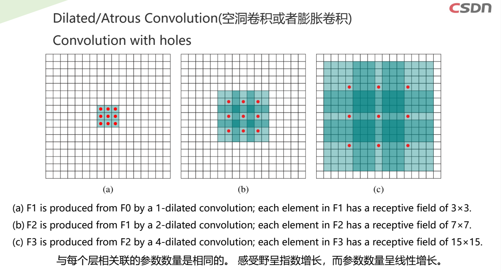


语义分割网络中引入膨胀卷积

- 增大网络的感受野
- 特征图像尺寸的损失

采用不同的方式来增大神经元的感受野

- 传统卷积通过添加池化层
- 膨胀卷积在卷积核中插入零元素，对卷积核上采样，可避免池化层引起的信息损失

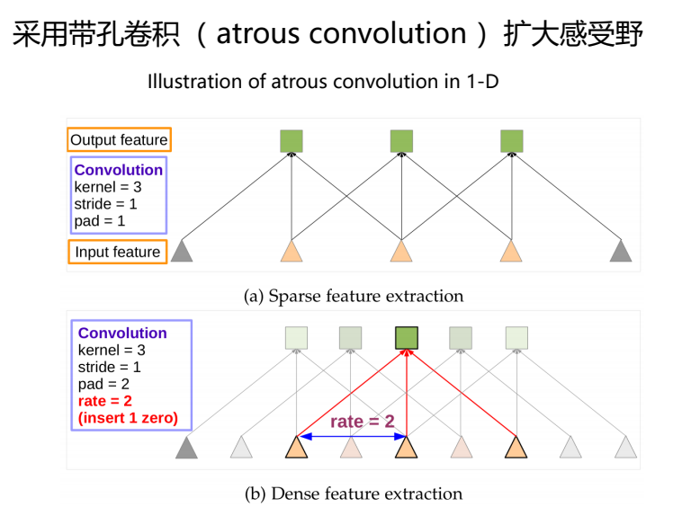

(a) 在低分辨率输入特征图上使用标准卷积(rate=1)进行稀疏特征提取
(b) 在高分辨率输入特征图上利用rate = 2的膨胀卷积进行密集特征提取

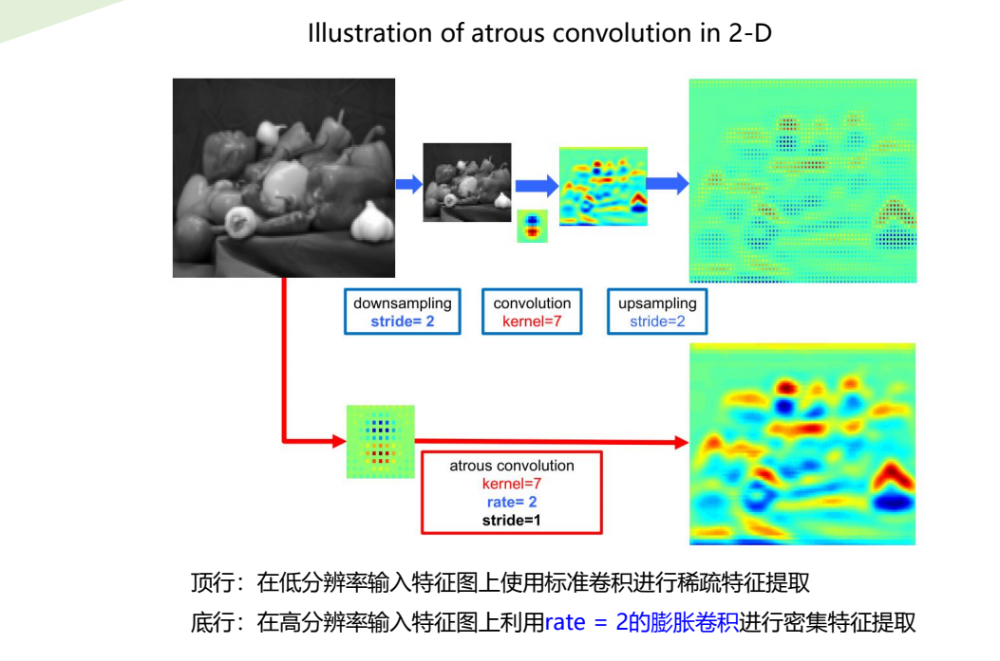

**顶行**：在低分辨率输入特征图上使用标准卷积进行稀疏特征提取
**底行**：在高分辨率输入特征图上利用r**ate = 2的膨胀卷积**进行密集特征提取


#### **DeepLabv3介绍**

> Liang-Chieh Chen, George Papandreou, Florian Schroff, Hartwig Adam.
> Rethinking Atrous Convolution for Semantic Image Segmentation. CVPR, 2017
> https://arxiv.org/abs/1706.05587

**主要特点**

- 采用预训练的ResNet-50, 或ResNet-101来提取特征
- 修改第4个残差块，采用膨胀卷积(模块内的三个卷积采用不同的膨胀率）
- 加入image-level的ASPP

---

**获取多尺度上下文的架构比较**

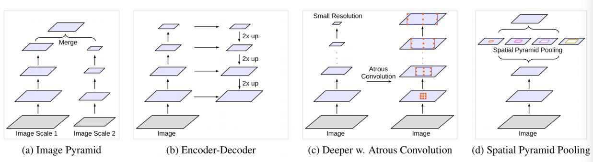

(a) **图像金字塔**(如SIFT) 
(b) **编码-解码框架**
(c) **采用不同尺度的膨胀卷积**
(d) **空间金字塔池化**
**空间金字塔池化**：使得任意大小的特征图利用多尺度特征提取都能够转换成固定大小的特征向量

---

**采用级联模块和带孔卷积提取多尺度信息**

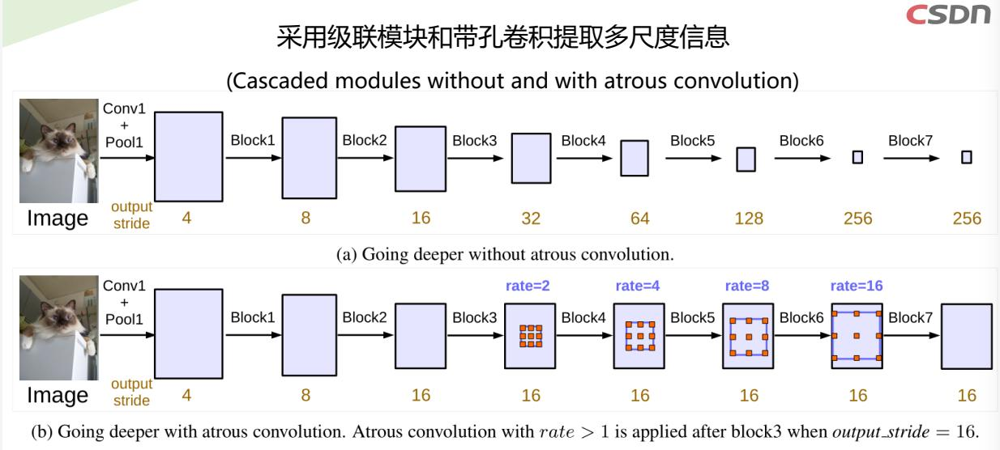


- (a) 传统卷积，随着深度增大，特征图尺寸减小
- (b) 采用带孔卷积，可避免特征图尺寸缩小
- output stride: the ratio of input image spatial resolution to the final output resolution 
  (before global pooling or fully connected layer). 


**采用有ASPP的并行模块增加图像级特征**

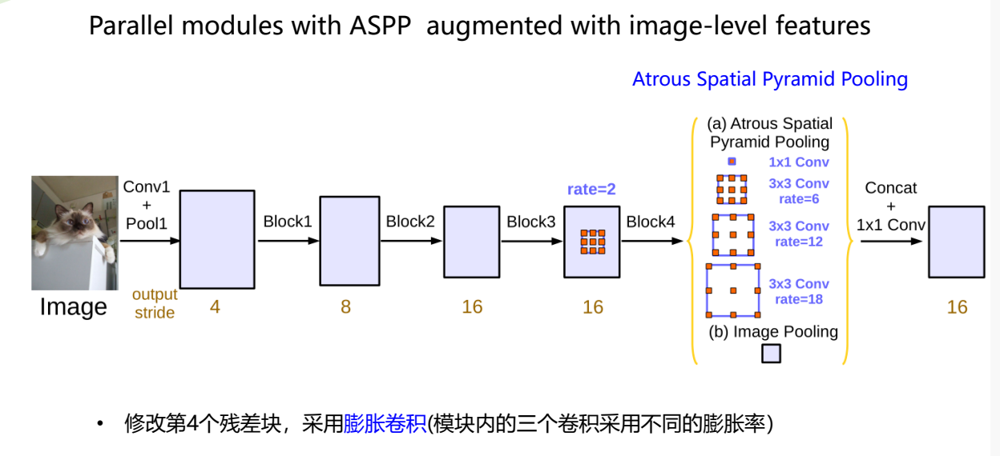

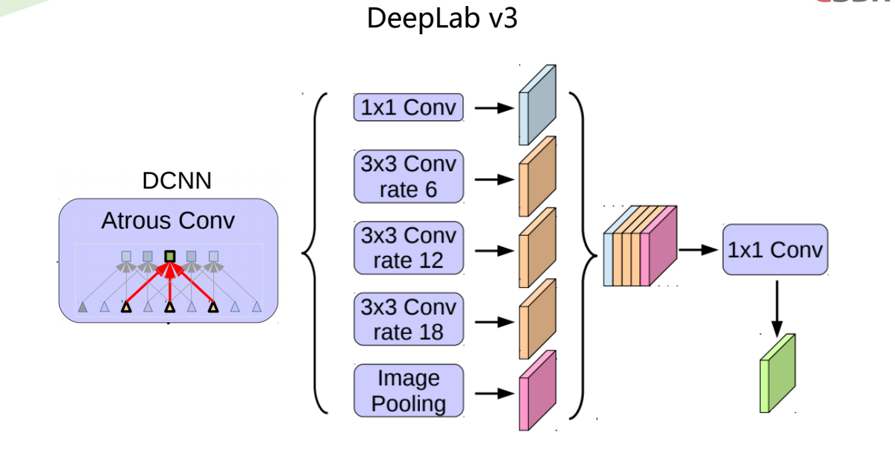

---

#### DeepLab-v3+介绍

> Liang-Chieh Chen, Yukun Zhu, George Papandreou, Florian Schroff, Hartwig Adam.
> Encoder-Decoder with Atrous Separable Convolution for Semantic Image Segmentation. Feb. 2018
> https://arxiv.org/abs/1802.02611v1

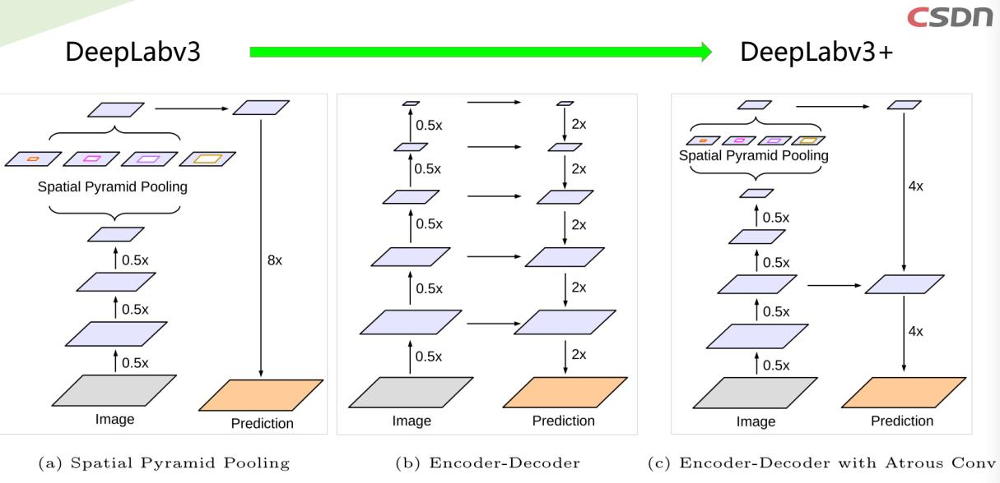

We improve DeepLabv3, which employs the spatial pyramid pooling module (a),
with the encoder-decoder structure (b).

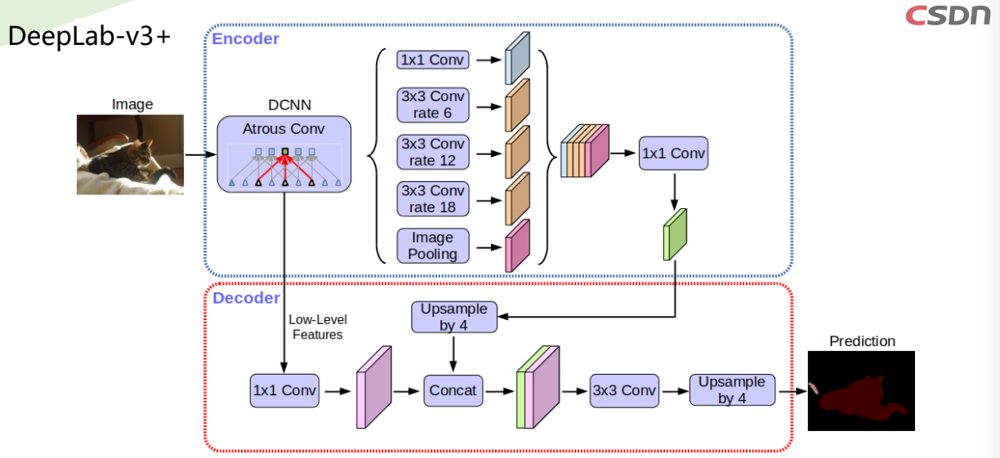


- 通过添加一个简单有效的解码器模块来扩展DeepLab-v3，以优化分割结果，尤其是沿着目标边界
- 将深度可分离卷积（参考Xception）应用于ASPP和解码器模块，从而产生用于语义分割的更快和更强的
  编码器 - 解码器网络

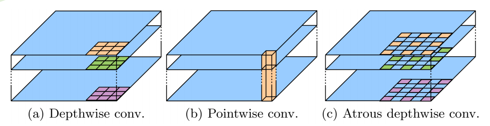


3×3 Depthwise separable convolution decomposes a standard convolution into
(a) a depthwise convolution (applying a single filter for each input channel) and 
(b) a pointwise convolution (combining the outputs from depthwise convolution across 
channels). 
(c) In this work, we explore atrous separable convolution where atrous convolution
is adopted in the depthwise convolution, as shown in (c) with rate = 2.

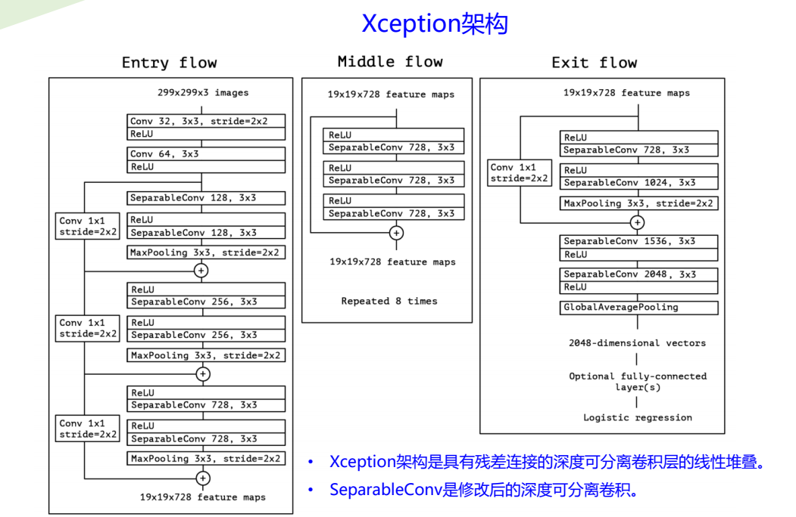

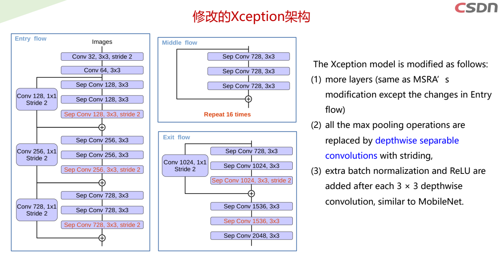

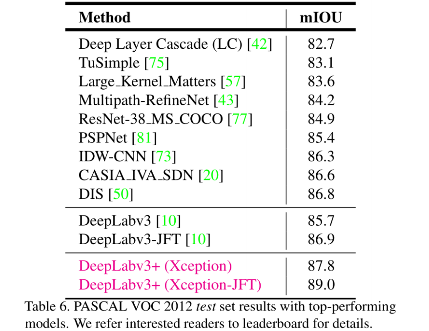

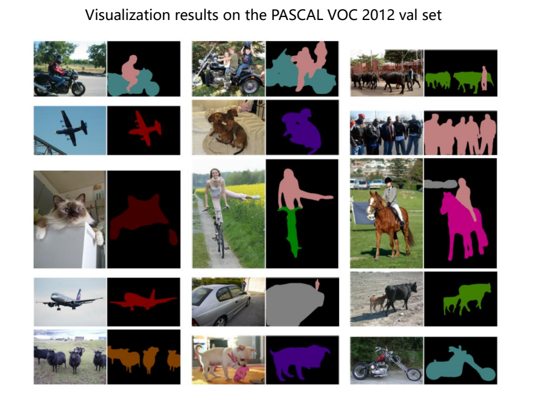

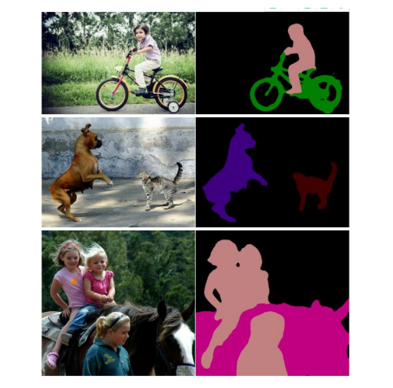

---

#### **DeepLab系列语义分割架构模型比较**

- 1.DeepLabv1：使用空洞卷积来明确控制在深度卷积神经网络中计算特征响应的分辨率。
- 1.DeepLabv2：使用ASPP以多个采样率和有效视野的滤波器对多个尺度的目标进行鲁棒分割
- 3.DeepLabv3：使用图像级别特征增强ASPP模块以捕获更长距离的信息。还引入BN，以促进训练。
- 4.DeepLabv3+：用一个简单有效的解码器模块扩展DeepLabv3优化细分结果，尤其是沿目标边界。
  此外，在这种编码器 - 解码器结构中，可以通过空洞卷积任意地控制所提取的编码器
  特征的分辨率，以折衷准确率和运行时间。


---

## 三、环境安装与测试

### 3.1 安装pytorch

#### 3.1.1 安装Anaconda

Anaconda 是一个用于科学计算的 Python 发行版，支持 Linux, Mac, Windows, 包含了众多流行的科学
计算、数据分析的 Python 包。

1. 先去官方地址下载好对应的安装包
   下载地址:https://www.anaconda.com/download/#linux

2. 然后安装anaconda

  ```shell
  bash ~/Downloads/Anaconda3-2021.05-Linux-x86_64.sh
  ```

  anaconda会自动将环境变量添加到PATH里面，如果后面你发现执行conda提示没有该命令，那么
  你需要执行命令 source ~/.bashrc 更新环境变量，就可以正常使用了。
  如果发现这样还是没用，那么需要添加环境变量。
  编辑~/.bashrc 文件，在最后面加上

  ```shell
  export PATH=/home/bai/anaconda3/bin:$PATH
  ```


  保存退出后执行： source ~/.bashrc
  再次输入 conda list 测试看看，应该没有问题。

---

#### 3.1.2 添加Anaconda国内镜像配置

清华TUNA提供了 Anaconda 仓库的镜像，运行以下命令:

```shell
conda config --add channels 
https://mirrors.tuna.tsinghua.edu.cn/anaconda/pkgs/free/
conda config --add channels 
https://mirrors.tuna.tsinghua.edu.cn/anaconda/pkgs/main/
conda config --set show_channel_urls yes
```

#### 3.1.3 安装Pytorch

首先创建一个anaconda虚拟环境，环境名字可自己确定，这里本人使用mypytorch作为环境名:

```shell
conda create -n mypytorch python=3.8
```

安装成功后激活mypytorch环境：

```shell
conda activate mypytorch
```

在所创建的虚拟环境下安装, 执行命令：

```shell
conda install pytorch torchvision cudatoolkit=10.2 -c pytorch
```

注意：10.2处应为cuda的安装版本号 
编辑~/.bashrc 文件，设置使用mypytorch环境下的python3.8

```shell
alias python='/home/linxu/anaconda3/envs/mypytorch/bin/python3.8'
```

注意：python路径应改为自己机器上的路径
保存退出后执行： `source ~/.bashrc`
该命令将自动回到base环境，再执行 conda activate mypytorch 到mypytorch环境。

---

### 3.2 安装Deeplabsv3+及测试

#### 3.2.1 克隆和安装deeplabv3+

```shell
git clone https://github.com/VainF/DeepLabV3Plus-Pytorch.git 
```

在路径DeepLabV3Plus-Pytorch下执行

```shell
pip install -r requirements.txt -i https://pypi.tuna.tsinghua.edu.cn/simple
```

#### 3.2.2 测试图片

##### 3.2.2.1 下载PASCAL VOC文件

说明：本课程数据集和程序文件可从百度网盘下载，网盘链接如下：

```baidu
链接：https://pan.baidu.com/s/1WWEyIT2aC8HB20uBhBsVbQ 
提取码：srpb 
```

从百度网盘下载, 下载到DeepLabV3Plus-Pytorch/datasets/data目录下并解压

- VOCtrainval_06-Nov-2007.tar 
- VOCtrainval_11-May-2012.tar 
- VOCtest_06-Nov-2007.tar

##### 3.2.2.2 解压建立数据集

```shell
tar xvf VOCtrainval_06-Nov-2007.tar
tar xvf VOCtest_06-Nov-2007.tar
tar xvf VOCtrainval_11-May-2012.tar
```

PASCAL VOC数据集的目录结构:
 建立文件夹层次为 VOCdevkit/VOC2007 和 VOCdevkit/VOC2012
 VOC2007和VOC2012下面的文件夹：Annotations，JPEGImages和ImageSets

其中JPEGImages放所有的数据集图片； 
Annotations放所有的xml标记文件；
SegmentationClass放标注的数据集掩码文件；
ImageSets/Segmentation下存放训练集、验证集、测试集划分文件
train.txt给出了训练集图片文件的列表（不含文件名后缀）
val.txt给出了验证集图片文件的列表
trainval.txt给出了训练集和验证集图片文件的列表 
test.txt给出了测试集图片文件的列表 


##### 3.2.2.3 下载预训练权重文件

放置在DeepLabV3Plus-Pytorch下新建的weights文件夹下，例如
best_deeplabv3plus_mobilenet_voc_os16.pth
best_deeplabv3_mobilenet_voc_os16.pth
best_deeplabv3plus_resnet50_voc_os16
best_deeplabv3plus_resnet101_voc_os16

##### 3.2.2.4 测试图片

使用deeplabv3plus_mobilenet模型

```shell
python predict.py --input datasets/data/VOCdevkit/VOC2007/JPEGImages/000001.jpg 
--dataset voc --model deeplabv3plus_mobilenet --ckpt 
weights/best_deeplabv3plus_mobilenet_voc_os16.pth --save_val_results_to 
test_results

```

使用deeplabv3_mobilenet模型

```shell
python predict.py --input datasets/data/VOCdevkit/VOC2007/JPEGImages/000001.jpg 
--dataset voc --model deeplabv3_mobilenet --ckpt 
weights/best_deeplabv3_mobilenet_voc_os16.pth --save_val_results_to test_results
```


---

## 四、labelme图像标注及格式转换

### 4.1 labelme图像标注工具的安装与使用

#### 4.1.1 安装图像标注工具labelme

Ubuntu下的安装：

```shell
pip install pyqt5
```

```shell
pip install labelme
```

如果安装过程中提示缺少某个包，可再安装上，如：

```shell
pip install pyyaml
```

如上述安装方法不能成功，使用下面的命令安装：

```shell
pip install git+https://github.com/wkentaro/labelme.git
```

#### 4.1.2 使用labelme进行图像标注

执行：

```shel
labelme
```

标注后生成json文件
课程pothole项目案例的数据集为1280*720的图片，136张用于训练，16张用于测试。
这里的数据集有5个类别："car", "dashedline", "midlane", "pothole", "rightlane"
数据集图像文件及标注的json文件放置在~/mydataset目录下


### 4.2 标注数据格式转换

#### 4.2.1 图像标注后的数据转换

在mydataset路径下执行

```shell
python labelme2voc.py roadscene_train roadscene_train/data_dataset_voc --labels labels.txt
```
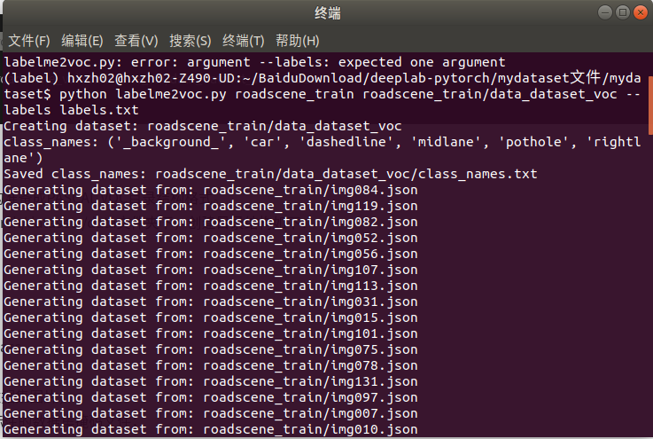
```
python labelme2voc.py roadscene_val roadscene_val/data_dataset_voc --labels labels.txt
```
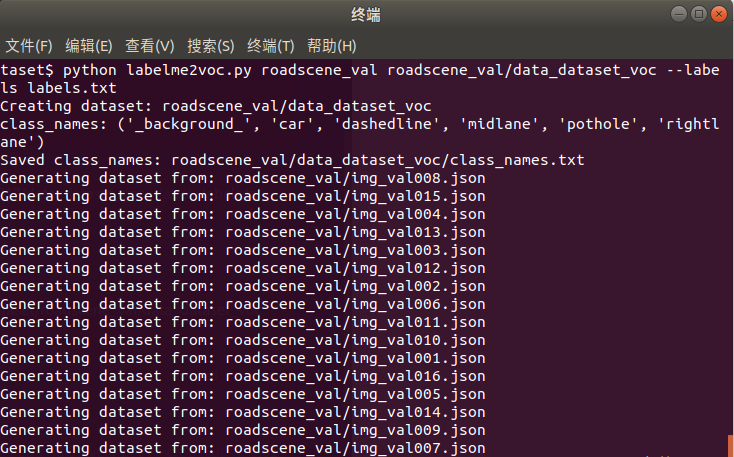

#### 4.2.2 项目数据准备

把转成数据集的目录结构准备成PASCAL VOC目录结构格式。
在DeepLabV3Plus-Pytorch/datasets/data文件夹下，创建目录结构如下：
└── VOCdevkit
 ├── VOC2007
 ├── ImageSets
 ├── JPEGImages
 └── SegmentationClass


其中：
JPEGImages放所有的数据集图片；
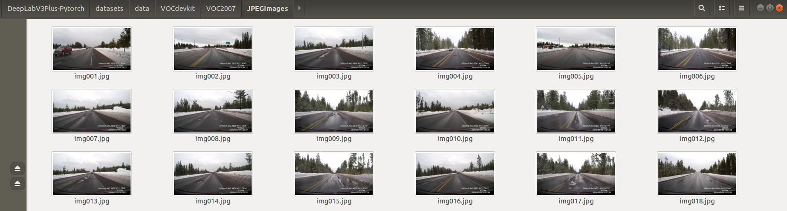
SegmentationClass放标注的数据集掩码文件；
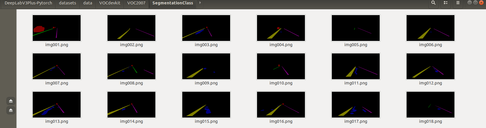
ImageSets/Segmentation下存放训练集、验证集、测试集划分文件
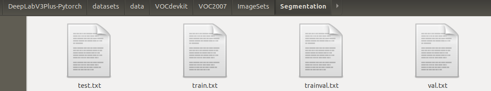
train.txt给出了训练集图片文件的列表（不含文件名后缀）
val.txt给出了验证集图片文件的列表
trainval.txt给出了训练集和验证集图片文件的列表 
test.txt给出了测试集图片文件的列表 
课程中train.txt包括136 张图片列表；
trainval.txt包括136 张+16张图片列表；
val.txt和test.txt内容相同，包括16张图片列表
---

## 五、deeplabv3+网络训练和测试

### 5.1 网络训练

#### 5.1.1 安装训练可视化工具visdom

1）下载static.zip文件到anaconda3/envs/mypytorch/lib/python3.8/site-packages/visdom并解压
更正：此处应该为anaconda3/envs/mypytorch/lib/python3.8/site-packages/visdom
2）注释掉server.py文件中函数download_scripts_and_run()中的一句
 #download_scripts()
3）启动visdom server

```shell
# Run visdom server 
python -m visdom.server
```

### 5.2 训练网络

**使用deeplabv3plus_mobilenet模型**

```shell
python main.py --model deeplabv3plus_mobilenet --enable_vis --vis_port 8097 --gpu_id 0 --year 2007 --crop_val --lr 0.01 --crop_size 513 --batch_size 16 --output_stride 16 --num_classes 6 --total_itrs 1000 --ckpt weights/best_deeplabv3plus_mobilenet_voc_os16.pth
```
如果出现RuntimeError: CUDA out of memory. Tried to allocate 338.00 MiB (GPU 0; 9.78 GiB total capacity; 7.36 GiB already allocated; 282.06 MiB free; 7.44 GiB reserved in total by PyTorch)，
说明GPU 显存不够，则可将crop_size 513适当调低，建议设置为300，224，112等。

其中num_classes设置为类别数+1
训练好的权重在checkpoints文件夹下

**使用deeplabv3_mobilenet模型**

```shell
python main.py --model deeplabv3_mobilenet --enable_vis --vis_port 8097 --gpu_id 
0 --year 2007 --crop_val --lr 0.01 --crop_size 513 --batch_size 16 --
output_stride 16 --num_classes 6 --total_itrs 1000 --ckpt 
weights/best_deeplabv3_mobilenet_voc_os16.pth
```

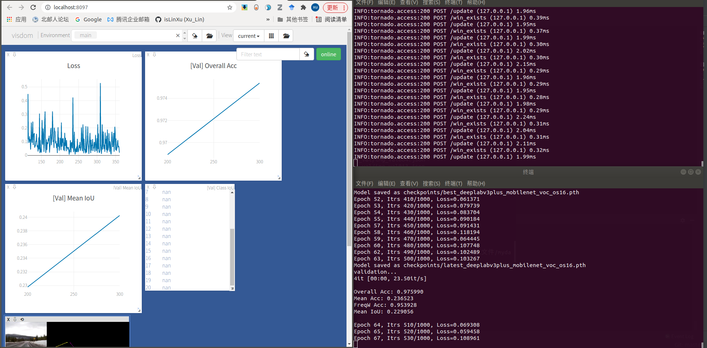


**使用deeplabv3plus_resnet50模型**

```shell
python main.py --model deeplabv3plus_resnet50 --enable_vis --vis_port 8097 --
gpu_id 0 --year 2007 --crop_val --lr 0.01 --crop_size 513 --batch_size 8 --
output_stride 16 --num_classes 6 --total_itrs 2000 --ckpt 
weights/best_deeplabv3plus_resnet50_voc_os16.pth
```

---

## 六、网络模型测试

#### 6.1 性能指标统计

```shell
python main.py --model deeplabv3plus_mobilenet --gpu_id 0 --year 2007 --crop_val 
--lr 0.01 --crop_size 513 --batch_size 16 --output_stride 16 --ckpt 
checkpoints/best_deeplabv3plus_mobilenet_voc_os16.pth --test_only --
save_val_results
```

#### 6.2 图片测试

##### 单张图片测试

```shell
python predict.py --input datasets/data/VOCdevkit/VOC2007/JPEGImages/img001.jpg --dataset voc --model deeplabv3plus_mobilenet --ckpt checkpoints/best_deeplabv3plus_mobilenet_voc_os16.pth --save_val_results_to test_results1 --crop_size 513
```


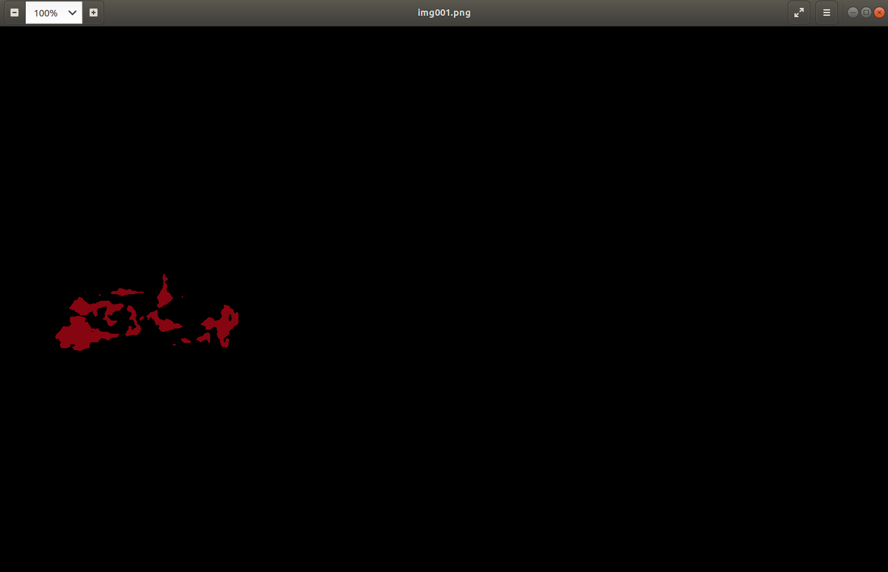


##### 多张图片测试

如果是jpg图片，修改predict.py中的一句

```shell
files = glob(os.path.join(opts.input, '**/*.png'), recursive=True)
```
为
```shell
 files = glob(os.path.join(opts.input, '**/*.jpg'), recursive=True)
```

然后，执行命令
使用deeplabv3plus_mobilenet模型

```shell
python predict.py --input datasets/data/VOCdevkit/VOC2007/JPEGImages --dataset 
voc --model deeplabv3plus_mobilenet --ckpt 
checkpoints/best_deeplabv3plus_mobilenet_voc_os16.pth --save_val_results_to 
test_results2 
```

使用deeplabv3plus_resnet50模型

```shell
python predict.py --input datasets/data/VOCdevkit/VOC2007/JPEGImages --dataset 
voc --model deeplabv3plus_resnet50 --ckpt 
checkpoints/best_deeplabv3plus_resnet50_voc_os16.pth --save_val_results_to 
test_results2 
```
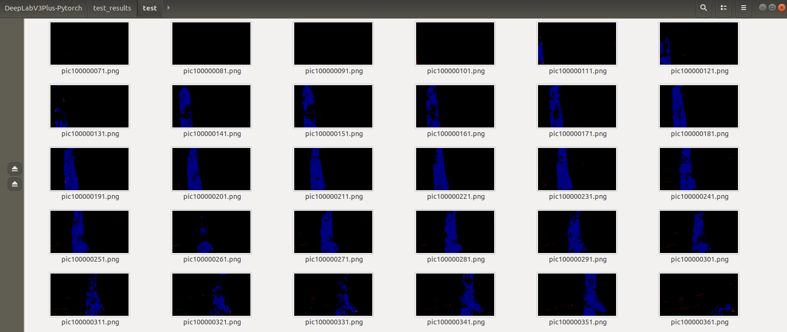

参考材料：
[1] 白勇老师课程及课件:https://edu.csdn.net/course/detail/36456
[2] https://paperswithcode.com/method/deeplabv3
[3] Code:https://github.com/VainF/DeepLabV3Plus-Pytorch