# Kaggle竞赛介绍

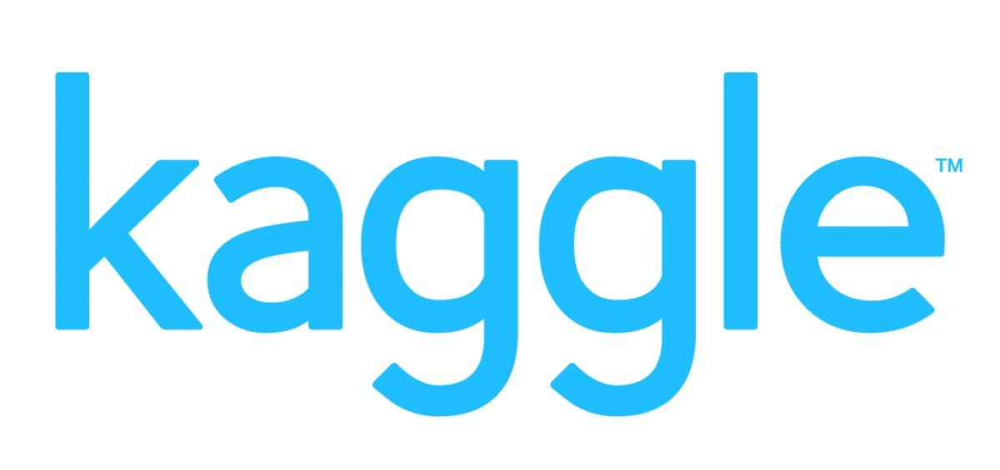

---

## Kaggle简介

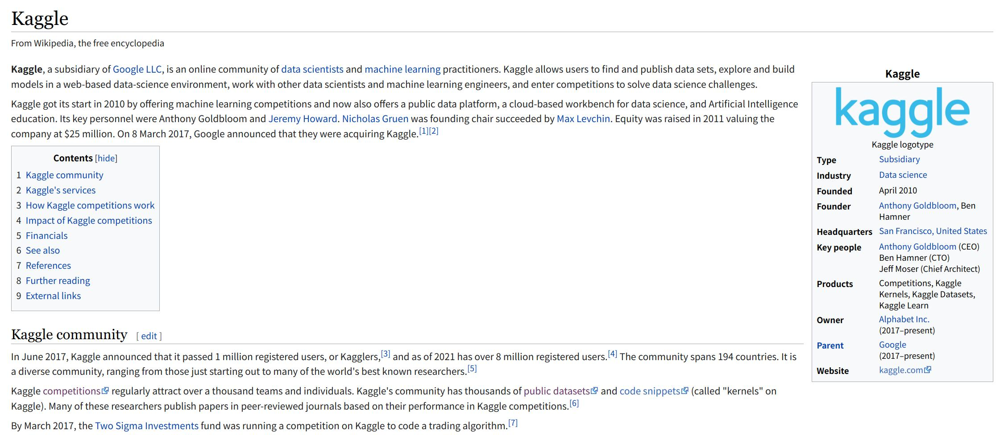

如果Github相当于是软件项目和工程的国际开源代码平台，
那么Kaggle就等同于是针对数据科学相关的国际集智与比赛平台。
一些大厂和研究机构等面临一些难题的时候，就会以类似的比赛形式众包出去发布在Kaggle。
用户会以个人或组队team的方式进行解决方案的挑战。

对于数据科学和人工智能平台，国内有阿里背书的TIANCHI天池竞赛、与CCF等合作的Datafountain以及DC竞赛、kesci等。
但从影响力和受众人群等方面来看，Kaggle面向全球且用户分布广泛众多，Kaggle作为一个比赛社区、比赛平台与国内的一些平台比赛有其独特的优势。

**推荐使用！Kaggle的几个理由**：

- 1.数据量和使用用户广泛
- 2.影响力大=>拿奖项的含金量高，认可度高
- 3.数据集和解决方案多，有庞大的交流社区

### Kaggle的几种常见赛题：

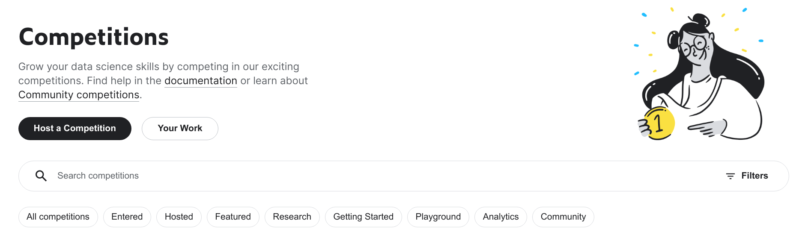

- **01.Featured**

  商业或科研难题，奖金一般较为丰厚
  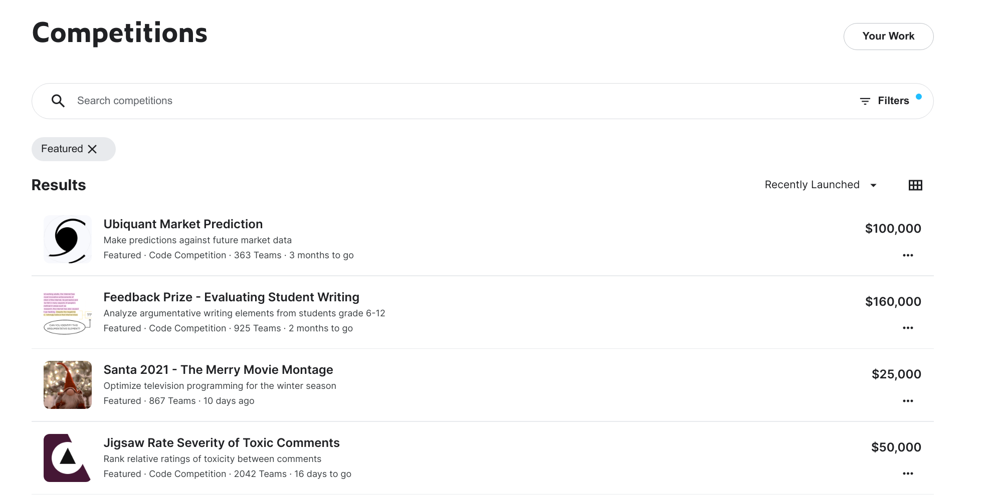

- **02.Analytics**
  主要针对数据分析与数据挖掘等任务
  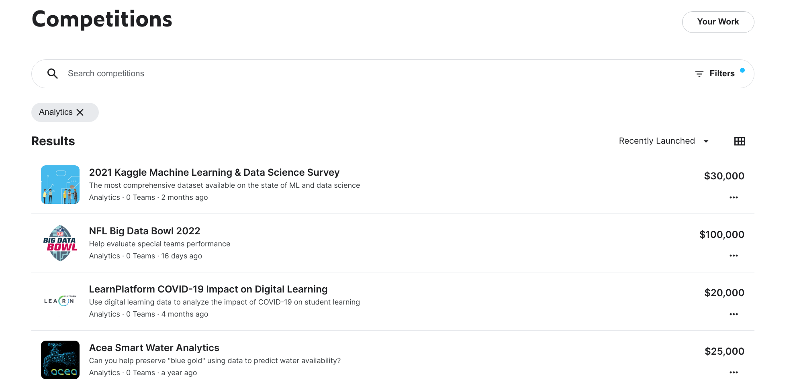

- **03.Research**
  科研和学术性较强的比赛，一般需要较强的领域和专业知识
  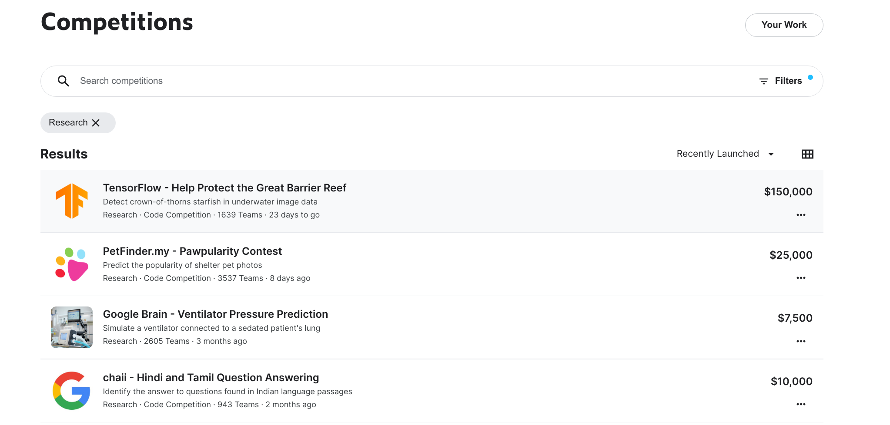

- **04.PlayGround**
  提供一些简单的任务用于熟悉平台和比赛
  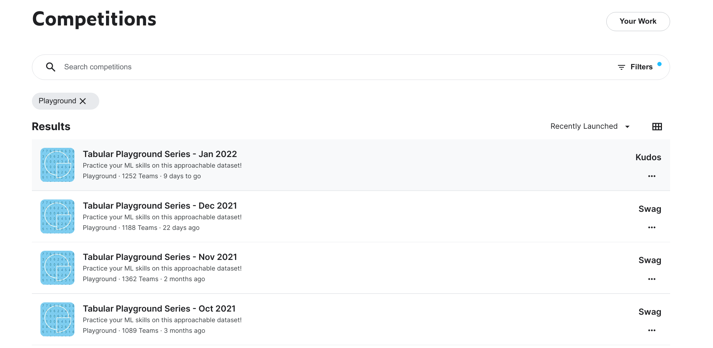

- **05.Getting Started**
  提供一些简单的任务用于熟悉平台和必死爱
  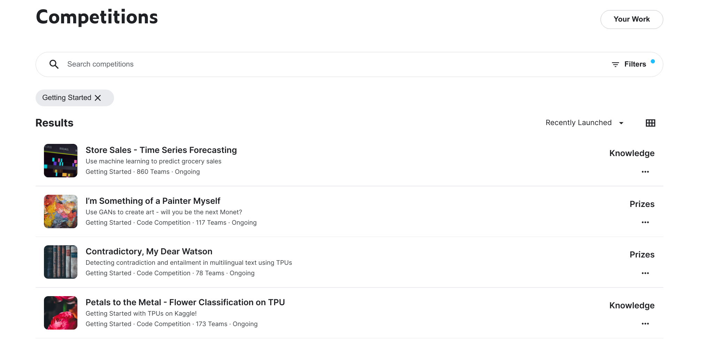

- **06.Community**
  适用于任何人都可以举办的社区比赛
  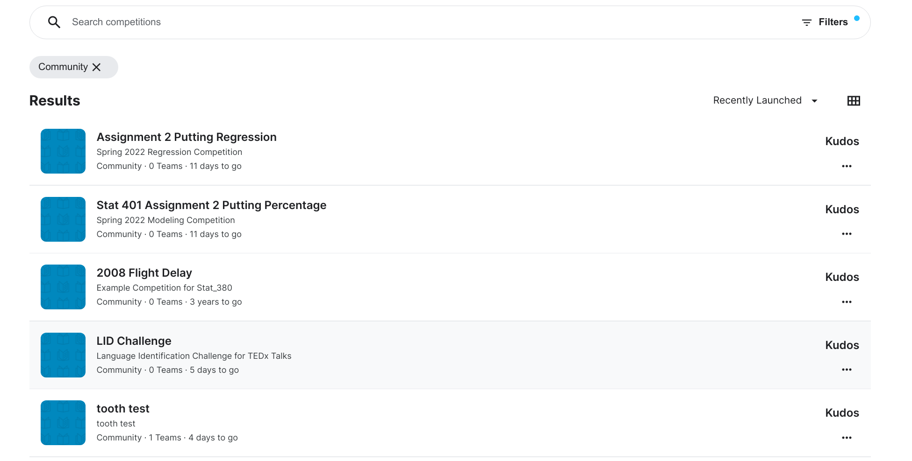

核心的打比赛主要是前三种：Featured、Recruitment、Research.

从难度上来看的排序是这样的：06<05<04<02<01=03

### 赛题分类2：根据比赛的提交方式进行分类

- **在线提交比赛**
  多数比赛为避免人工打标或作弊的情况，为保证公平性，以在线提交方式为主。
  一般以Notebook的方式进行提交，测试集对于参赛者是不可见的。
  提交之后以评估分数进行排名分为A榜、B榜，
  其中A榜是带有验证测试性质的，是支持实时更新的，可能会存在过拟合的情况。
  一般最终结果为B榜为主，
  但也会按一定比例参考A榜的数值进行最终成绩的统计。

- **离线提交比赛**
  离线给出数据集的相关预测和比赛评估参数，一般以CSV文件进行上传提交。

  

### 赛题分类3：根据比赛的任务进行分类

- **数据挖掘**
  对于结构化的数据进行算法挖掘与信息提取
- ** 图像相关**：计算机视觉领域相关任务
  例如图像分类、目标定位、目标检测、图像分割、实例分割等
- **语音相关**：语音信号处理相关
  例如语音识别、声纹识别等
- **自然语言**
  自然语言处理、自然语言理解、自然语言分析等

### 称号和奖牌

在打比赛的过程当中，如果能够排上榜单，就会得到相应的奖牌和称号：
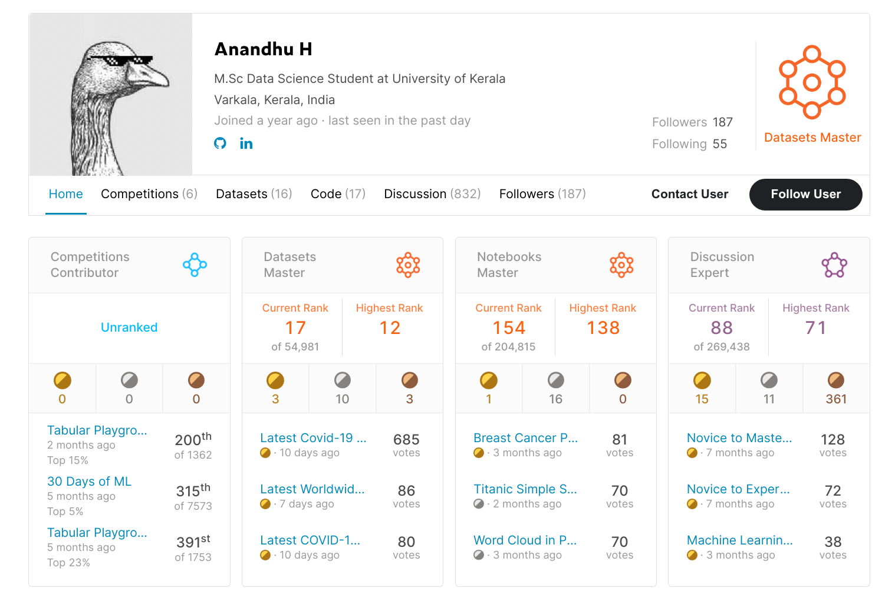

其中奖牌分为：金牌、银牌、铜牌
而称号则按照经验值和积分等，依次排为：
User => Nov => Con => EX => M => GM

### 初学者怎么用Kaggle

- **Overview**: 比赛方对这次比赛整体概况的介绍，主要需要解决什么样的问题以及难点是什么，
  并且说明比赛的评估方式和提交的时间节点等信息。
  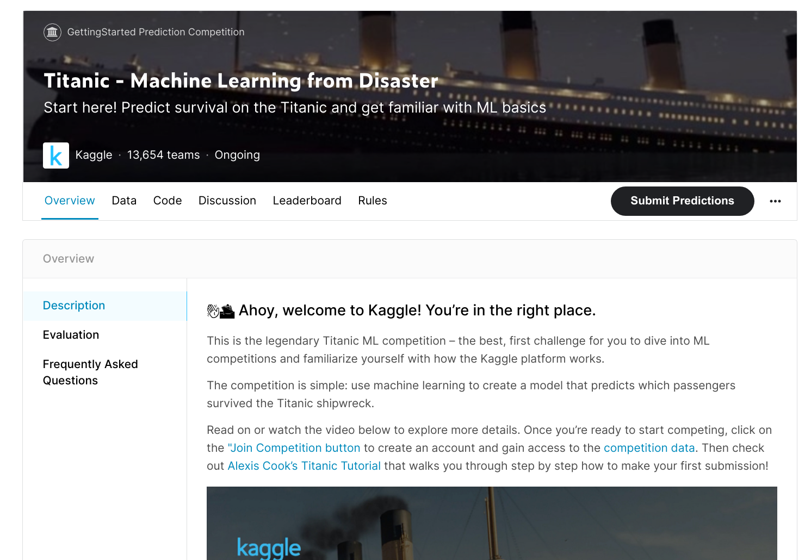

- **Data**: 对数据进行基本的介绍，提供数据预览和下载的地址
  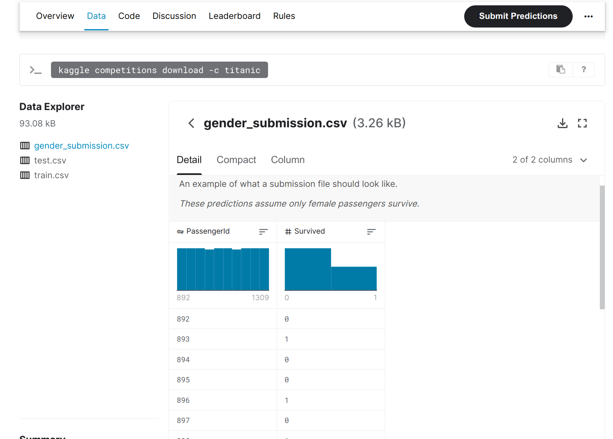

- **Code**: 参赛者在比赛中开源分享出来的代码,一般以Notebook为主
  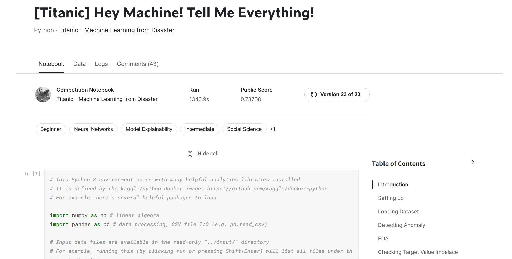

- **Discussion**：讨论交流社区
  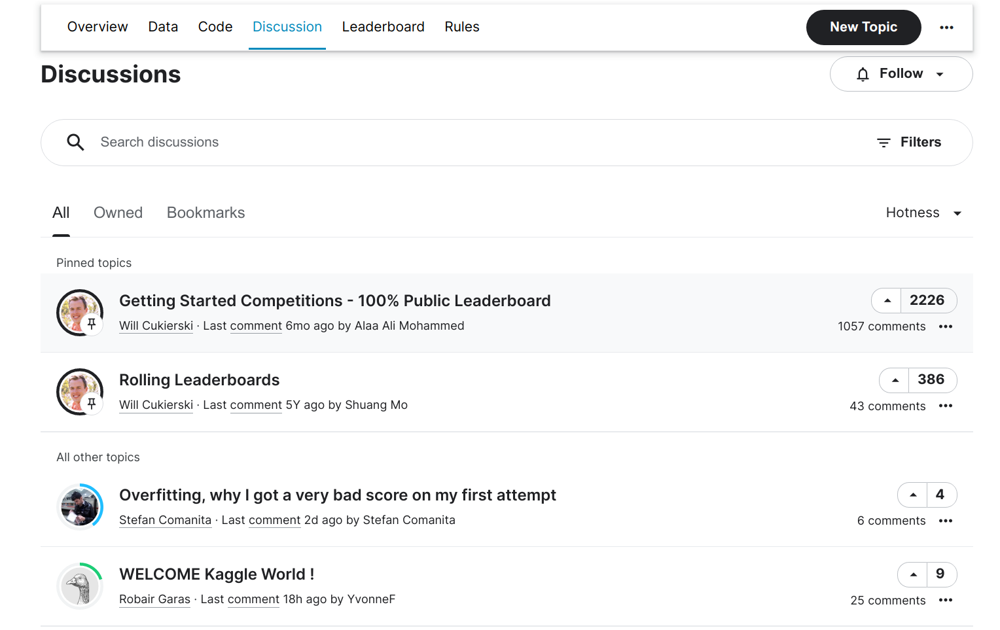

- **Leaderboard**: 排行榜：A榜|B榜
  A榜表现!=B榜表现
  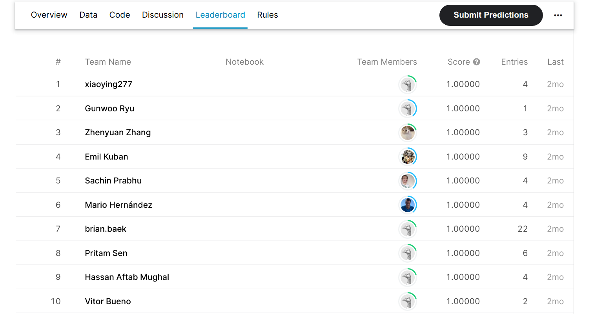

- **Rules**: 比赛相关细则
  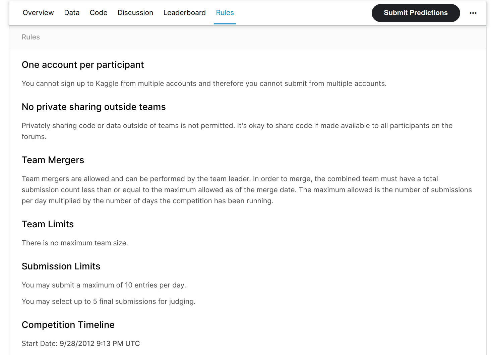

- **Team**: 参赛队伍