  ## Yolov5目标检测训练模型学习总结

### 一、YOLOv5介绍


YOLOv5是一系列在 COCO 数据集上预训练的对象检测架构和模型，代表[Ultralytics](https://ultralytics.com/) 对未来视觉 AI 方法的开源研究，结合了在数千小时的研究和开发中获得的经验教训和最佳实践。

下面是YOLOv5的具体表现：

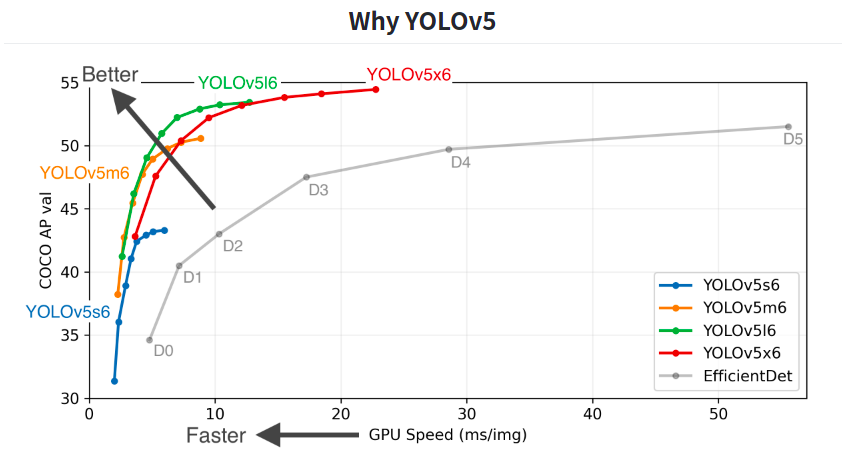

我们可以看到上面图像中，除了灰色折线为EfficientDet模型，剩余的四种都是YOLOv5系列的不同网络模型。
其中5s是最小的网络模型，5x是最大的网络模型，而5m与5l则介于两者之间。
相应地，5s的精度小模型小易于移植，而5x的精度高模型大比较臃肿。


#### Pretrained Checkpoints 预检查点
| Model                  | size(pixels) | $mAP^{val}$0.5:0.95 | $mAP^{test}$ | $mAP^{val}$0.5 | Speed v100 | params(M) | FLOPs  640(B) |
| ---------------------- | ------------ | ------------------- | ------------ | -------------- | ---------- | --------- | ------------- |
| [YOLOv5s][assets]      | 640          | 36.7                | 36.7         | 55.4           | **2.0**    | 7.3       | 17.0          |
| [YOLOv5m][assets]      | 640          | 44.5                | 44.5         | 63.1           | 2.7        | 21.4      | 51.3          |
| [YOLOv5l][assets]      | 640          | 48.2                | 48.2         | 66.9           | 3.8        | 47.0      | 115.4         |
| [YOLOv5x][assets]      | 640          | **50.4**            | **50.4**     | **68.8**       | 6.1        | 87.7      | 218.8         |
| [YOLOv5s6][assets]     | 1280         | 43.3                | 43.3         | 61.9           | **4.3**    | 12.7      | 17.4          |
| [YOLOv5m6][assets]     | 1280         | 50.5                | 50.5         | 68.7           | 8.4        | 35.9      | 52.4          |
| [YOLOv5l6][assets]     | 1280         | 53.4                | 53.4         | 71.1           | 12.3       | 77.2      | 117.7         |
| [YOLOv5x6][assets]     | 1280         | **54.4**            | **54.4**     | **72.0**       | 22.4       | 141.8     | 222.9         |
| [YOLOv5x6][assets] TTA | 1280         | **55.0**            | **55.0**     | **72.0**       | 70.8       |           |               |


- YOLOv5训练与预测技巧

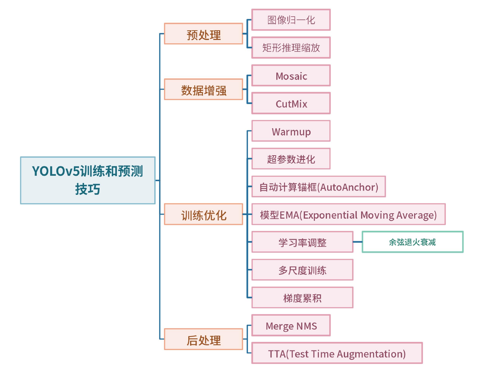


- YOLOv5功能增加

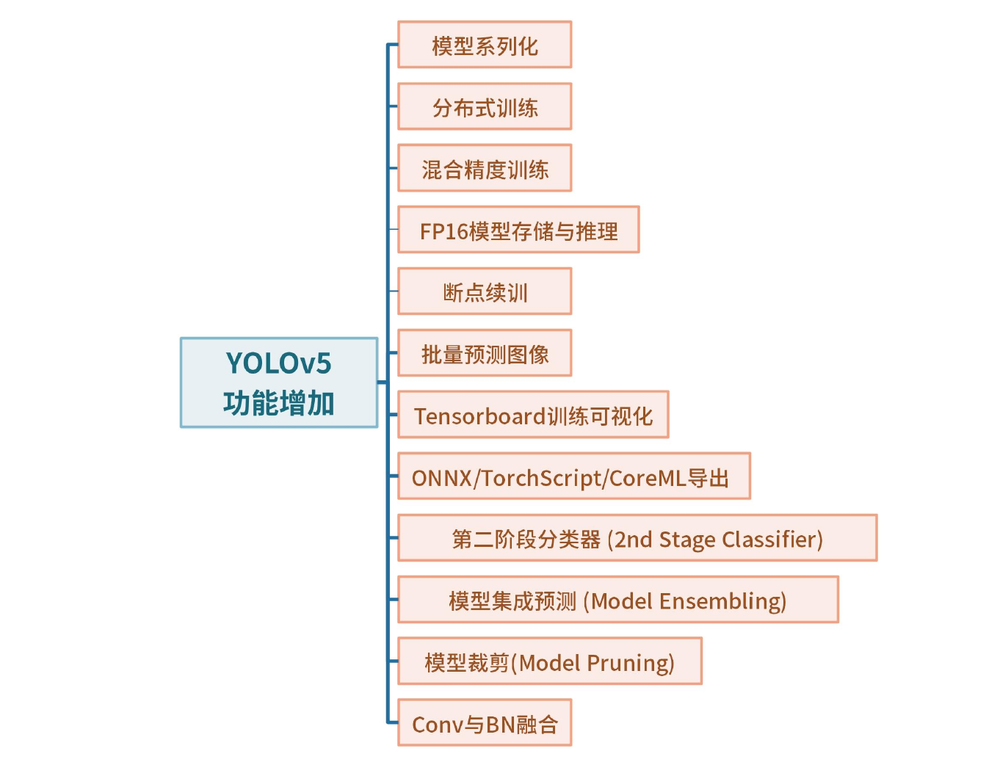

- 课程内容

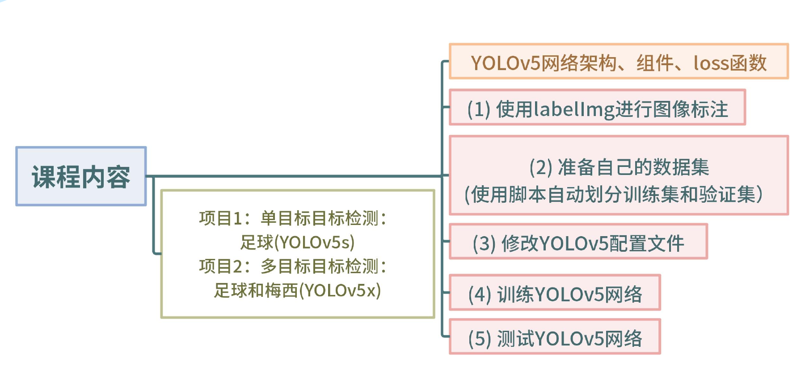

- YOLOv5网络模型图

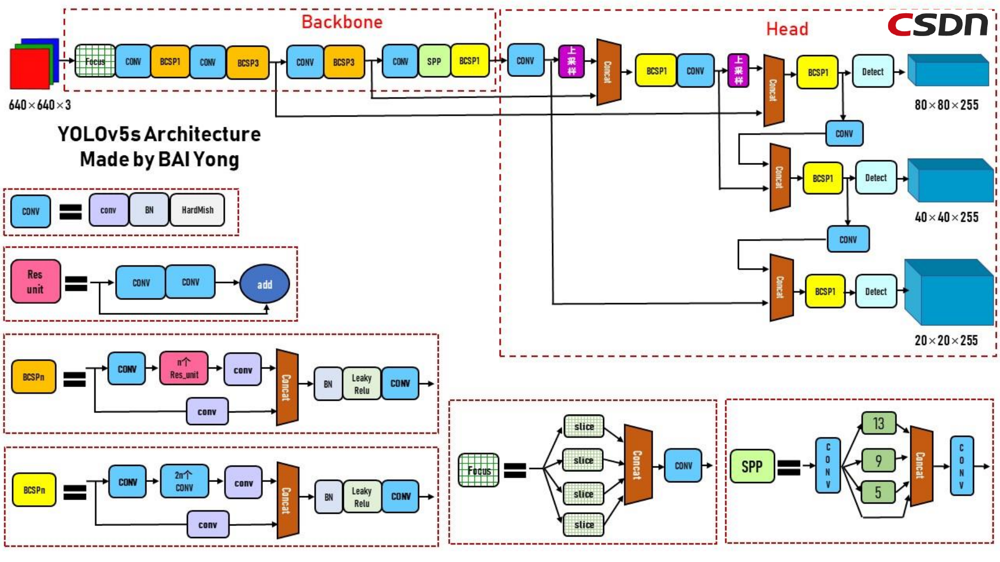


### 二、目标检测任务

从字面意义理解，所谓目标检测任务，就是定位并检测目标，也就是说计算机在处理图像的时候需要解决两个问题：
1.What? —— 图像中是什么东西？我们的目标是要检测什么东西？—— **识别** Recognition
2.Where? —— 在图像的什么位置？目标的定位坐标大致范围是多少？—— **定位** Localization

在YOLO系列算法中，通过**最小外接矩形**(Bounding box)来进行**目标定位**，同时利用预设**类别标签**(Category label)来进行目标对象类别的区分，于是这个图像检索的问题就被描述成，计算机在进行目标检测任务时，只需要识别出对应的框体和类别名称，即解决了当前图像的目标检测问题。


与其他类型(图像分类、实例分割)任务相比
从单目标对象的角度来看，分类仅针图像中的目标本身，而分类+定位则需要在分类的基础上框选其目标范围；
从多目标对象的角度来看，目标检测需要对图像中的不同目标进行最小外界矩形定位和标签分类，而实例分割则需要对图像中的不同目标边界轮廓进行包围标注和标签分类。

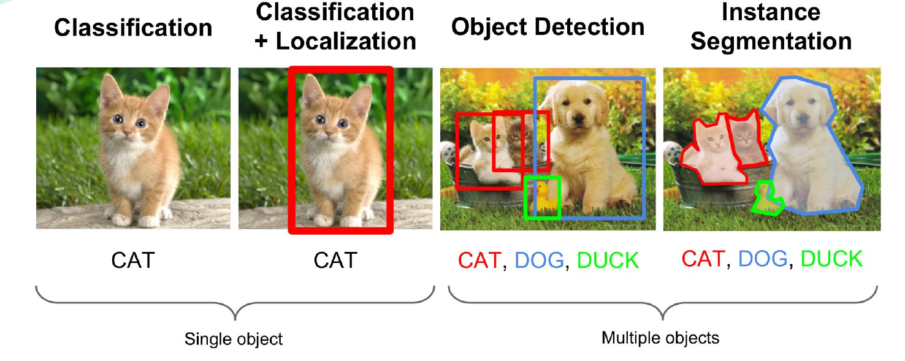

具体地来说，我们将定位和检测这两种不同的问题，描述为以下的任务：
定位和检测：

- **定位**：定位是找到检测图像中带有一个给定标签的**单个目标**

- **检测**：检测是找到图像中带有给定标签的**所有目标**。

  

### 三、目标检测—常用数据集

我们在利用模型检测实际应用问题的时候，通常需要使用自己标注和收集数据集来进行训练。
但对于不同算法性能的比较，我们常常需要一些基本的数据集来进行横向对比。

下列是一些常用的目标检测数据集:

- PASCAL VOC
- ImageNet
- COCO

#### 3.1 PASCAL VOC challange

PASCAL VOC挑战在2005年至2012年间展开。
该数据集中有20个分类，同时包含11530张用于训练和验证的图像，其中感兴趣区域有27450个标定目标，每个图像平均有2.4个目标。
以下是数据集中的20个分类：

- 人：人

- 动物：鸟、猫、牛、狗、马、羊

- 车辆：飞机、自行车、船、巴士、汽车、摩托车、火车

- 室内：瓶、椅子、餐桌、盆栽植物、沙发、电视/监视器

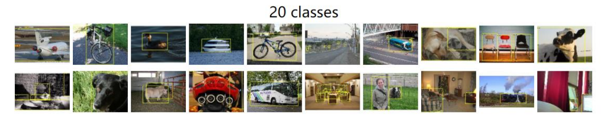

链接：http://host.robots.ox.ac.uk/pascal/VOC/voc2012/ 


#### 3.2 ImageNet数据集

ILSVRC 2010-2017为斯坦福大学的李飞飞教授主导并组建的数据集。

- ImageNet拥有用于分类、定位和检测任务评估的数据
- 与分类数据类似，定位任务有1000个类别。准确率是根据Top 5检测结果计算出来的。
- 对200个目标的检测问题有470000个图像，平均每个图像有1.1个目标。
  

#### 3.3 COCO数据集

- MS COCO的全称是Microsoft Common Objects in Context，起源于微软于2014年出资标注的Microsoft COCO数据集，与ImageNet竞赛一样，被视为计算机视觉领域最受关注和最权威的比赛之一。

- 在ImageNet竞赛停办后，COCO竞赛就成为是当前目标识别、检测等领域的一个最权威、最重要的标杆，也是目标该领域在国际上唯一能汇集Google、微软、Facebook以及国内外众多顶尖院校和优秀创新企业公共参与的大赛。

- COCO(Common Objects in Context)数据集包含20万图像

- 80个类别中有超过50万个目标标注。他是最广泛公开的目标检测数据集。

- 平均每个图像的目标数为7.2个。

  

  


链接：http://cocodataset.org 


### 四、目标检测——性能指标

- Precision(准确率，精度), Recall(召回率), F1 score(精确率和召回率的调和平均数，最大为1，最小为0。)
- loU(Intersection over Union)(交并比)
- P-R curve(Precision-Recall curve)(精度召回曲线)
- AP(Average Precision)(平均正确率)
- mAP(mean Average Precision)(平均精度均值)
- FPS(Frames Per Second)(每秒传输帧率)


#### 4.1 Precision, Recall, F1 score

我们将**预测情况**与**实际情况**作为两个维度进行考虑，其中预测会有两种结果，也即为Positive(肯定的)与Negative(否定的);同时实际情况也分为两种，即为True(是)或False(否)，分别将两个维度下的四种结果进行两两叠加即得下列的混淆矩阵：


- 精度Precision(查准率)是评估预测的准不准(看预测行)
- 召回率Recall(查全率)是评估找的全不全(看实际行)
- F1 score是精确率和召回率的调和平均数


#### 4.2 IoU(Intersection over Union)

对于目标检测任务而言，不仅包含分类，同时还有边界框回归。
为了评估边界框回归准确与否，这里使用IoU指标进行评估。


由图所示，我们令蓝色边框部分为Ground truth(基本事实)为标定的框，黄色边框部分为Prediction(预测结果)，那么如何来描述预测结果与基本事实之间吻合的程度呢？这里用一个参数比率IoU：**两个框的交集/两个框的并集来进行衡量**，也称作交并比。

**从IoU的角度来看Precision、Recall等**


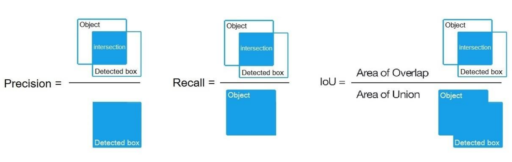


#### 4.3 P-R curve

　　P-R曲线是以召回率R为横轴，准确率P为纵轴，然后根据模型的预测结果对样本进行排序，把最有可能是正样本的个体排在前面，而后面的则是模型认为最不可能为正例的样本，再按此顺序逐个把样本作为“正例”进行预测并计算出当前的准确率和召回率得到的曲线。

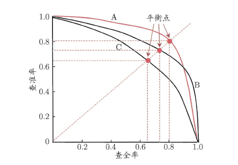

　　通过上图我们可以看到，当我们只把最可能为正例的个体预测为正样本时，其准确率最高位1.0，而此时的召回率则几乎为0，而我们如果把所有的个体都预测为正样本的时候，召回率为1.0，此时准确率则最低。


#### 4.4 AP(Average Precision)

用一个简单的例子来演示平均精度(AP)的计算。
假设数据集中总共有5个苹果。我们收集模型为苹果作的所有预测，并根据预测的置信水平(从最高到最低)对其进行排名。
第二列表示预测是否正确。如果它与ground truth匹配并且IoU$\ge$0.5，则是正确的。

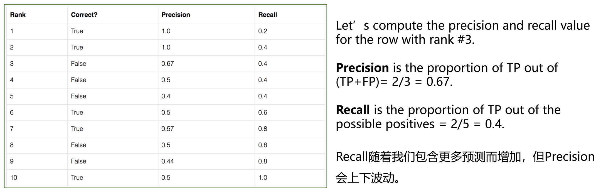

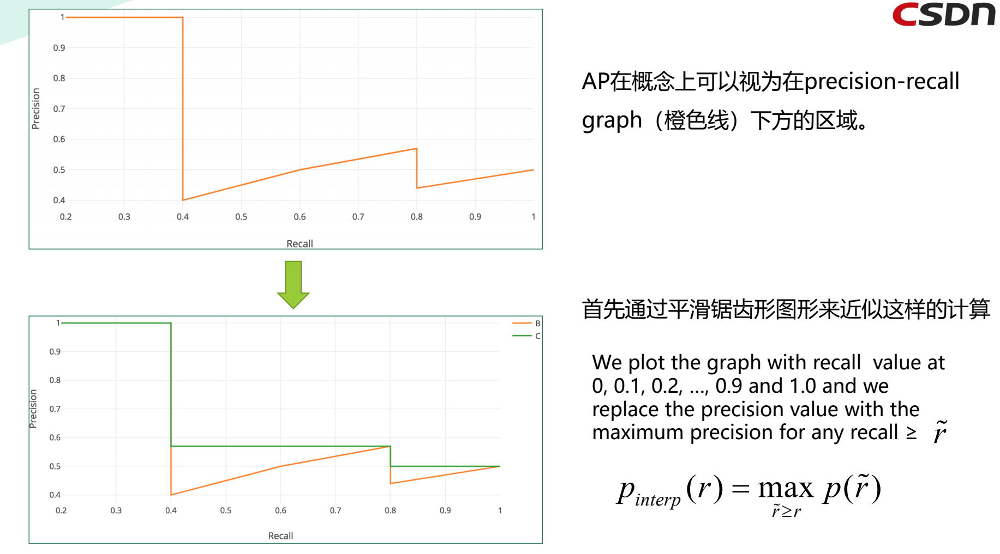

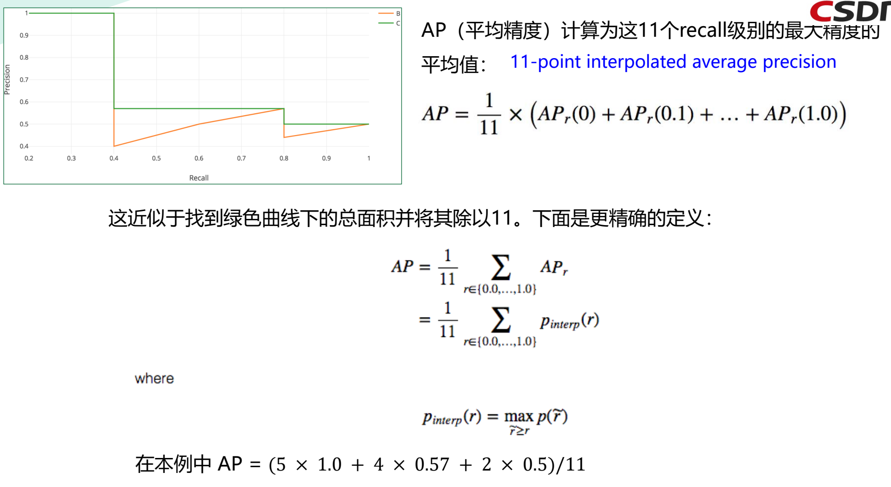

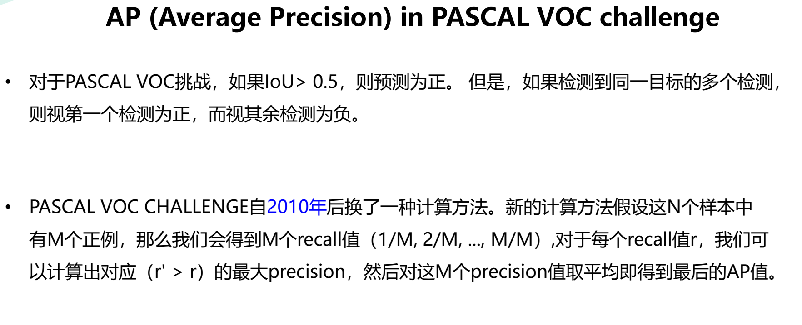

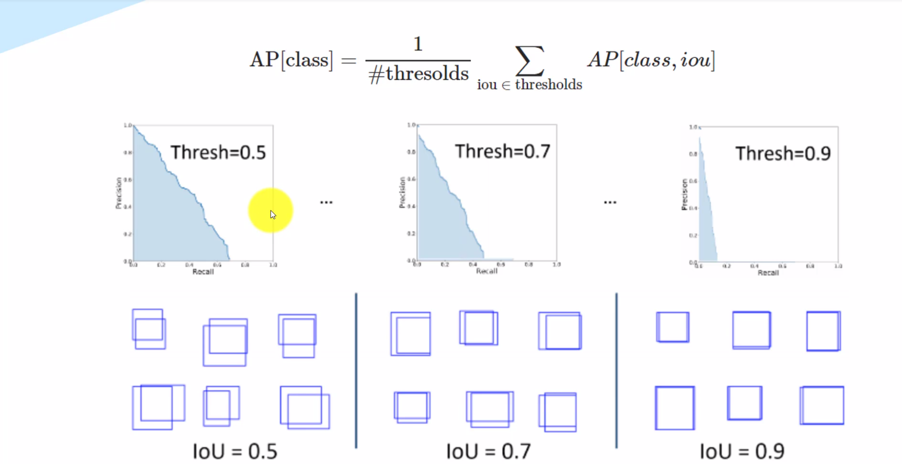


#### 4.5 mAP(mean Average Precision)
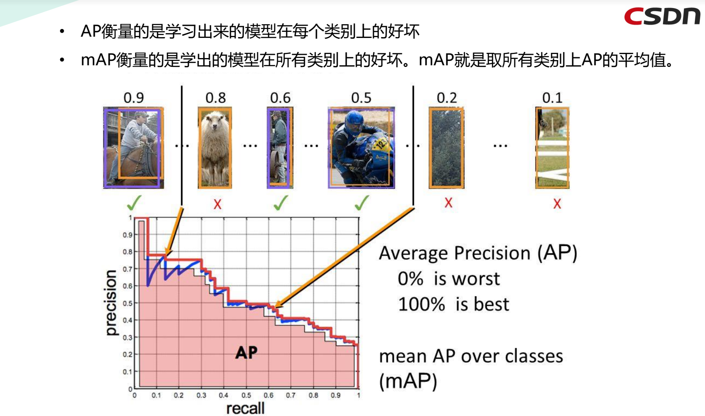

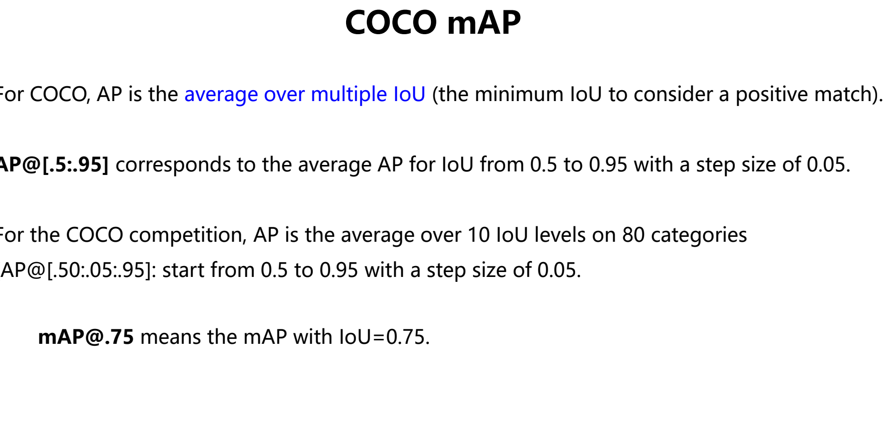

#### 4.6 FPS(Frames Per Second)

FPS是图像领域中的定义，是指画面每秒传输帧数，通俗来讲就是指动画或视频的画面数。FPS是测量用于保存、显示动态视频的信息数量。每秒钟帧数越多，所显示的动作就会越流畅。通常，要避免动作不流畅的最低是30。某些计算机视频格式，每秒只能提供15帧。

FPS也可以理解为我们常说的“刷新率（单位为Hz）”，例如我们常在游戏里说的“FPS值”。我们在装机选购显卡和显示器的时候，都会注意到“刷新率”。一般我们设置缺省刷新率都在75Hz（即75帧/秒）以上。例如：75Hz的刷新率刷也就是指屏幕一秒内只扫描75次，即75帧/秒。而当刷新率太低时我们肉眼都能感觉到屏幕的闪烁，不连贯，对图像显示效果和视觉感观产生不好的影响。

电影以每秒24张画面的速度播放，也就是一秒钟内在屏幕上连续投射出24张静止画面。有关动画播放速度的单位是fps，其中的f就是英文单词Frame（画面、帧），p就是Per（每），s就是Second（秒）。用中文表达就是多少帧每秒，或每秒多少帧。电影是24fps，通常简称为24帧。


结合以上性能指标描述，下面可以更容易理解下列表格中不同模型之间的性能差异及表现效果。


### 五、YOLO目标检测系列发展史

#### 5.1 目标检测的里程碑

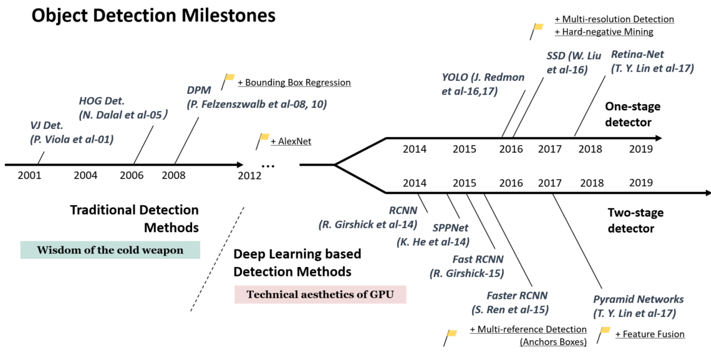

从整个时间轴上我们可以看到，在2012年之前，目标检测的主要算法还是建立在传统视觉方式之上的，AI也不曾像今日这般火热，这里将这段时期称为“冷兵器的时代”。而在2012年之后，就开始了j基于深度学习+卷积网络的方式尝试与探索，这里又根据识别阶段分为两类，一类是以YOLO、SSD等为代表的单阶段检测器，另一类是以Faster RCNN等为代表的双阶段检测器。

从原理上区分，我们又将双阶段检测器归为基于候选框的方法，而将单阶段检测器称为不基于候选框的方法。
如下图：
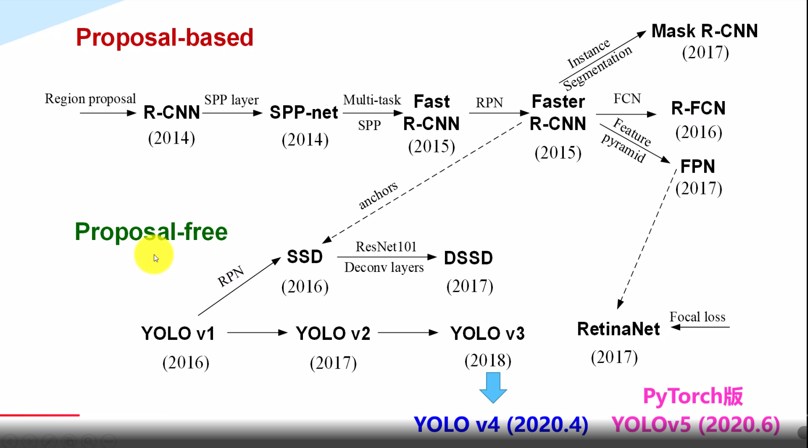

我们可以看到，两种不同方式的检测方法都在近些年得到了不断的发展，并且相互促进和进步。
这里重点关注YOLO系列的发展，最近的版本即为YOLOv4与YOLOv5，两者都是于2020年同期发布，并且较前几个版本效果优化差异明显。

#### 5.2 **Darknet**简要介绍

---

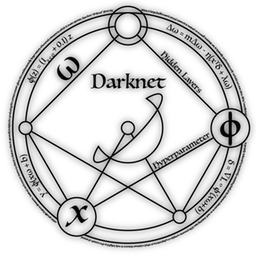

追根溯源，YOLO系列均是基于darknet这个框架来进行开发的。
Darknet is an open source neural network framework written in C and CUDA. It is fast, easy to install, and supports CPU and GPU computation.
Darknet是一个用C和CUDA编写的开源神经网络框架。它是快速，易于安装，并支持CPU和GPU计算。

Yolov4 paper：https://arxiv.org/abs/2004.10934 
Yolov4 sourcecode：https://github.com/alexeyab/darknet 


#### 5.3 YOLO 算法基本思想

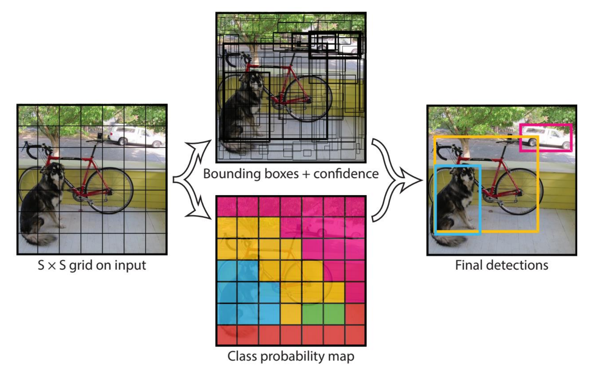

YOLO的基本思想是，将一副图像进行细化的网格划分，在划分的网格基础上进行边界框的预测，同时计算出目标的置信度以及类别的概率图，综合两者来进行最终的检测。

下面接着来看，假设我们要检测的对象还是那只狗，可以看到在黄色边界框中有不断迭代移动的红色网格，这个红色网格就负责处理对象的检测，在迭代过程中，红色网格被预测特征图(Prediction Feature Map)处理，其中这个预测特征图分为三个Box(不同尺度的边界框)，可用于计算不同类型的单元——(Box Co-ordinates 边界框坐标信息)、(Objectness Score置信度分数)、(Class Scores分类得分)

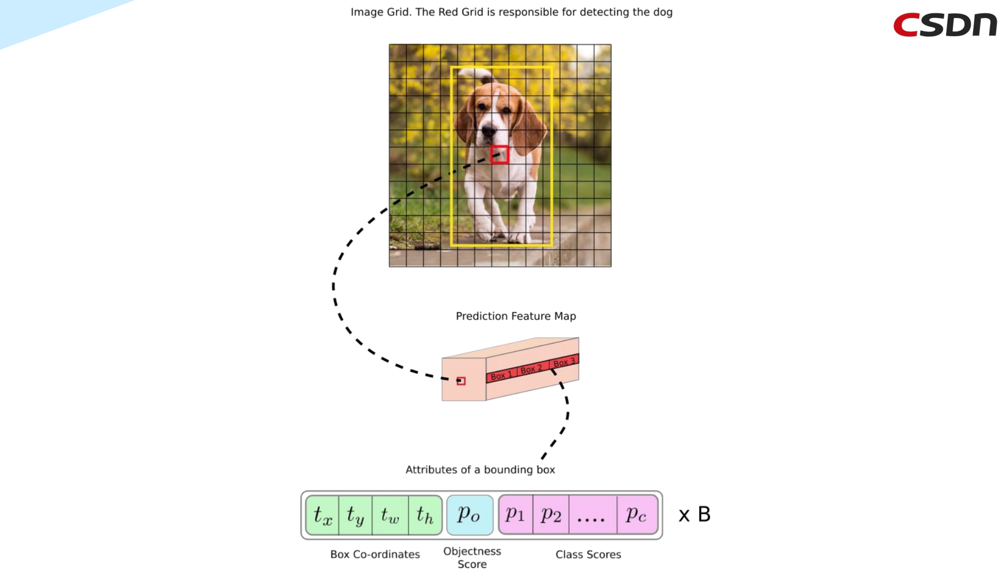


具体地来说，下面再来看一个过程。
假设我们要处理的图像为下图,尺寸大小为(608×608)，要检测的对象是图中这辆车，经过YOLO的Deep CNN(DCNN,深度卷积神经网络)之后，会对其进行32倍的下采样，从而可得到一个(19×19)的网格图，对应的每个小格子分别计算出其相应的坐标信息、目标性得分以及每个类别的分类概率，同时，还可以通过Box得到三个不同尺度的边界框的数据。

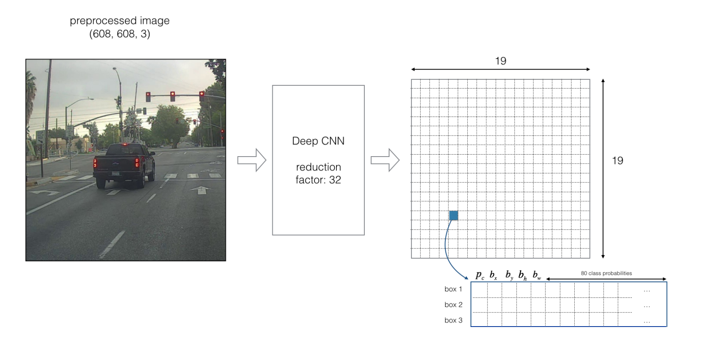


#### 5.4 YOLO v3/YOLO v4算法的基本思想

- 首先，通过特征提取网络对输入图像提取特征，得到一定大小的特征图，比如19×19(相当于608×608图片大小)，然后将输入图像分成19×19个grid cells网格单元，如果GT(Ground Truth标定边界框)中某个目标的中心坐标落在哪一个Grid cell中，那么就由该grid cell来预测该目标。
- 预测得到的输出特征图有两个维度是提取到的特征的维度，比如19×19，还有一个维度(深度)是B×(5+C)。
  其中**B**表示每个grid cell预测的边界框的数量(YOLO v3/v4中是3个，即B=3)；
  **C**表示边界框的类别数(没有背景类，所以对于VOC数据集是20)；
  **5**表示4个坐标信息和一个目标性得分。

**类别预测(Class Prediction)**

- 大多数分类器假设输出标签是互斥的。如果输出是互斥的目标类别，则确实如此。因此，YOLO应用softmax函数将得分转换为总和为1的概率。而YOLOv3/v4使用多标签分类。例如，输出标签可以是“行人”和“儿童”，它们不是非排他性的。(现在输出的总和可以大于1)。

- YOLOv3/v4用多个独立的逻辑(logistic)分类器替换softmax函数，以计算输出属于特定标签的可能性。在计算分类损失时，YOLOv3/v4对每个标签使用**二元交叉熵损失**。这也避免使用softmax函数而降低了计算复杂度。

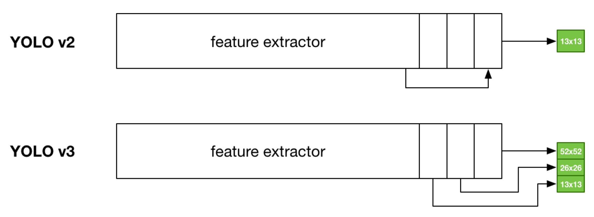

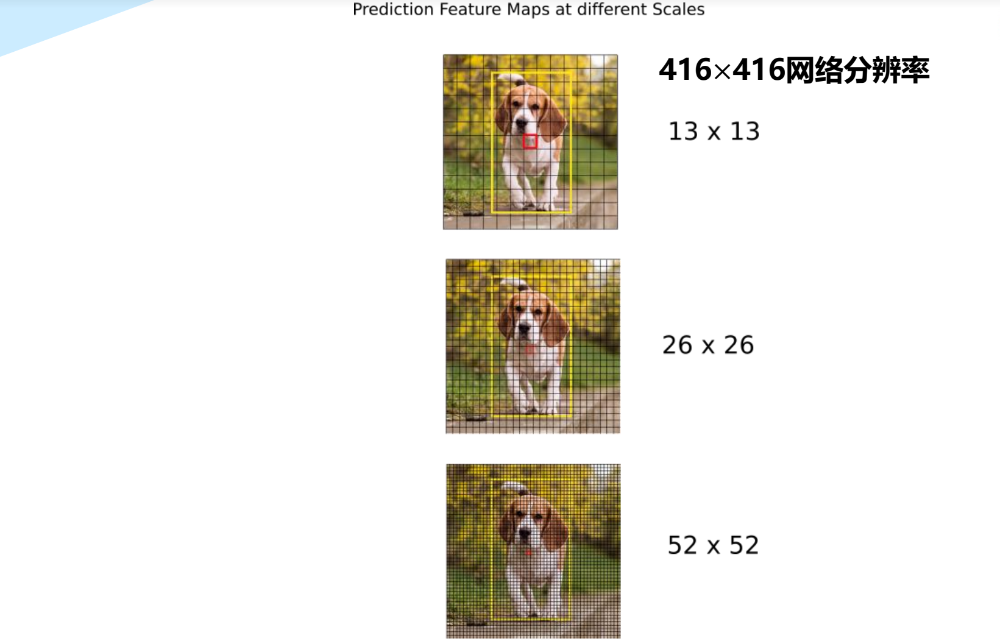

#### 5.5 YOLOv3网络架构

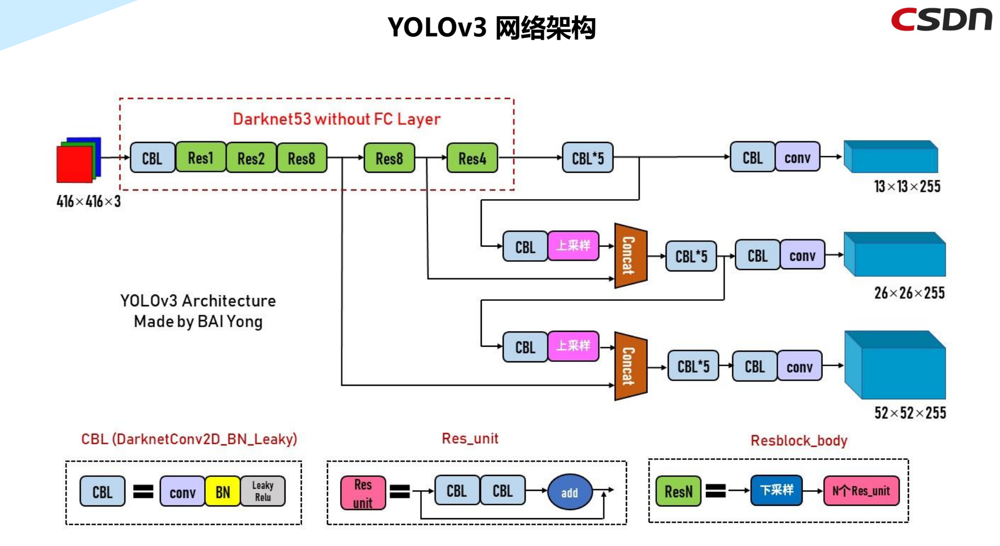

YOLOv3的主干网络是Darknet53，经过采样与卷积等计算，传到头部进行处理。


#### 5.6 YOLOv4网络架构

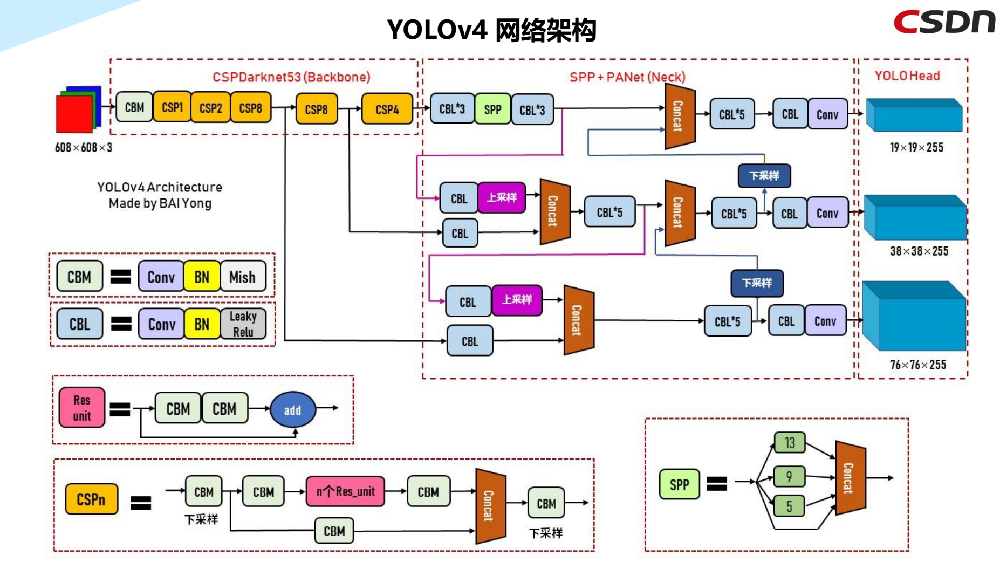

YOLOv4的主干网络是CSP组件+Darknet53，网络传播方式使用SPP+PANet，最终传输到YOLO Head。


### 六、YOLOv5网络架构及组件及Loss函数

YOLO系列属于单阶段目标探测器，与RCNN不同，它没有单独的区域建议网络（RPN），并且依赖于不同尺度的锚框。

**架构**可分为三个部分：骨架、颈部和头部。利用CSP（Cross-Stage Partial Networks）作为主干，从输入图像中提取特征。PANet被用作收集特征金字塔的主干，头部是最终的检测层，它使用特征上的锚框来检测对象。

YOLO架构使用的**激活函数**是Google Brains在2017年提出的Swish的变体，它看起来与ReLU非常相同，但与ReLU不同，它在x=0附近是平滑的。

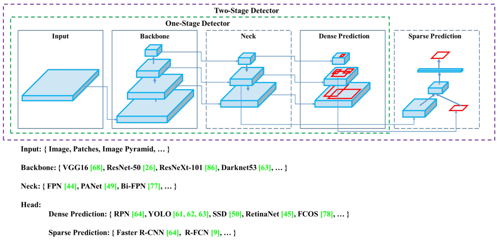

通过上图我们可以看到，
YOLOv5的Backbone骨干网络为{VGG16、ResNet-50、ResNet-101、DarkNet53，...};
颈部网络Backbone为{FPN、PANet、Bi-FPN，...};
头部网络Head为:
 	Dense Prediction：{RPN、YOLO、SSD、RetinaNet、FCOS、...}
	 Sparse Prediction：{Faster R-CNN、R-FCN、...}


YOLOv5包括：

- Backbone：Focus、BottleneckCSP、SPP
- Head：PANet+Detect(YOLOv3/v4 Head)


#### 6.1 网络可视化工具：Netron

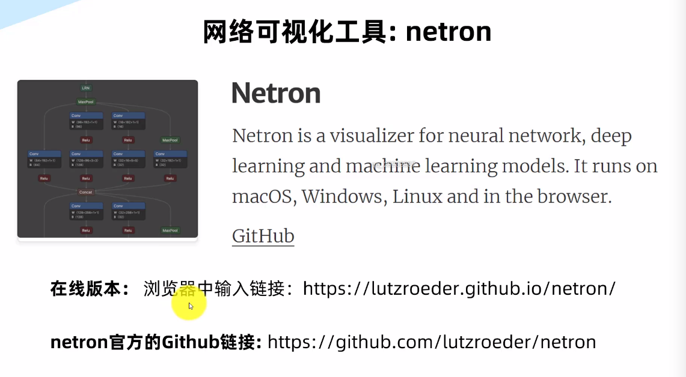

在线版本链接：https://lutzroeder.github.io/netron/
netron官方的Github链接：https://github.com/lutzroeder/netron

netron对pt格式的权重文件兼容性不好，直接使用netron工具打开，无法现实整个网络。
可使用YOLOv5代码中models/export.py脚本将pt权重文件转换为onnx格式，再用netron工具打开，就可以看YOLOv5的整体架构。

导出ONNX文件

```shell
pip install onnx>=1.7.0 -i https://pypi.tuna.tsinghua.edu.cn/simple #for ONNX export 
```

```shell
pip install coremltools==4.0-i https://pypi.tuna.tsinghua.edu.cn/simple #for Coreml export 
```

```shell
python models.export.py --weights weights.yolov5s.pt --img 640 --batch 1
```
预览YOLOv5在netron中的网络结构图：[链接](https://img2020.cnblogs.com/blog/1571518/202109/1571518-20210901105121131-1343162288.png)


借助于上面的Netron工具得到的网络结构图，我们可以画出下面这样的网络架构图，对此进行做一个全局把握。


其中Conv表示由Conv(卷积)、BN(Batch Normalization归一化)和Hard-swish(非线性激活)三个操作组合成的运算。
Bottleneck为瓶颈部分运算操作，若Bottleneck为True时，本操作为两个Conv操作相加得到的结果，若Bottleneck为False，则操作为两个Conv卷积。
同时，BCSPn为Conv->Bottleneck->conv与conv拼接，再进行BN(Batch Normalization)和后续的Relu(非饱和激活函数)卷积，防止“梯度消失”，加快收敛速度。
而Focus操作，需要对其进行四个Slice分片，再进行重新拼接后卷积。
SPP操作前后都需要conv，中间有三种不同尺度大小的层级进行选择处理。

图片从输入层开始传入模型，经过复杂的主干网络，最终流向Head头部网络的DarkNet去做处理。


#### 6.2 灵活配置不同复杂度的模型

(应用类似EfficientNet的channel和layer控制因子)

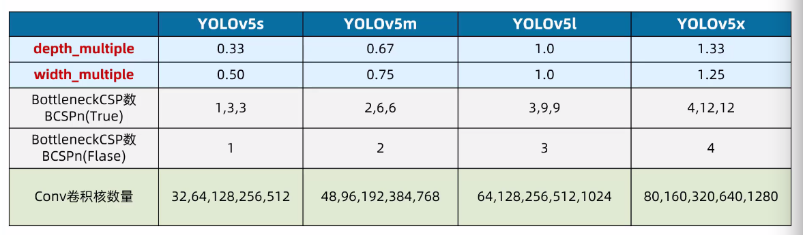

YOLOv5的四种网络结构是depth_multiple和width_multiple两个参数，来进行控制网络的深度和宽度。其中，depth_multiple控制网络的深度(BottleneckCSP数)，width_multiple控制网络的宽度(卷积核数量)。


#### 6.3 Focus机制

把数据切分为4份，每份数据都是相当于2倍下采样得到的，然后在channel维度进行拼接，最后进行卷积操作。

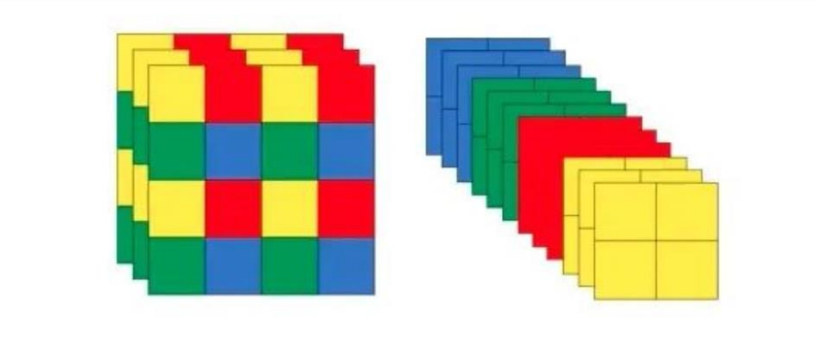

这里可以做一个小实验：

```python
# 新增一个tensor x
tensor([[[[11,12,13,14],
21,22,23,24],
31,32,33,34],
41,42,43,44]]]])
```

拆分后，得到四份数据

```
tensor([[[[11,13],[31,33]],
[[21,23],[41,43]],
[[12,14],[32,34]],
[[22,24],[42,44]]]])
```

 Focus() module模块被设计是用来减少FLOPS和增加速度，但不增加mAP。
在YOLOV5中，作者希望降低二维卷积Conv2d计算的成本，并实际使用张量reshape来减少空间（分辨率）和增加深度（通道数）

输入将按如下方式转换：[b，c，h，w]->[b，c*4，h//2，w//2]

以YOLOv5s的结构为例，原始640×640×3的图像输入Focus结构，采用切片结构，先变成320×320×12的特征图，再经过一次32个卷积核的卷积操作，最终变成320×320×32的特征图。
而YOLOv5m的Focus结构中的卷积操作使用了48个卷积核，因此Focus结构后的特征图变成320×320×48。YOLOv5l，YOLOv5x也是同样的道理。

#### 6.4 SPP(Spatial Pyramid Pooling)空间金字塔池化

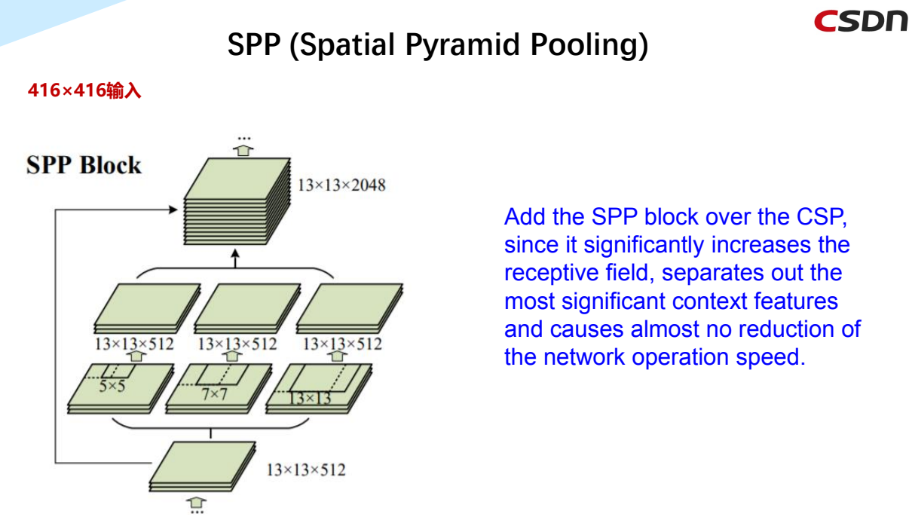

在CSP上添加SPP块，因为它显著增加了感受野，分离出最重要的上下文特征，并且几乎不会降低网络运行速度


#### 6.5 Hard Swish激活函数

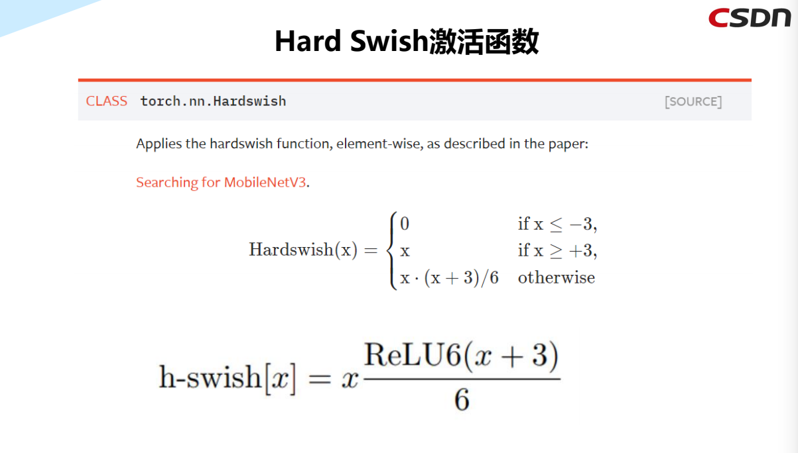
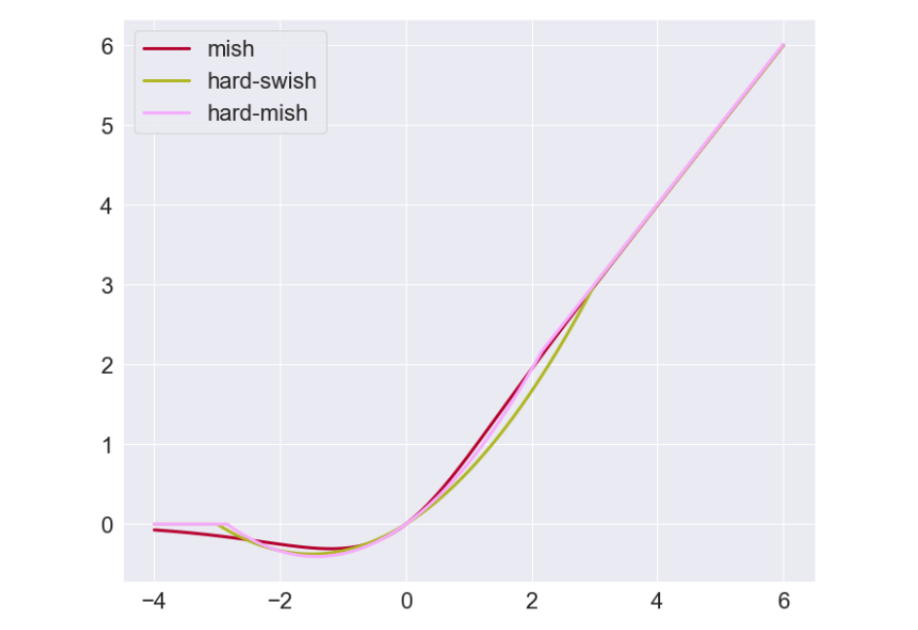


#### 6.6 PANet(Path-Aggregation Network)路径聚合网络
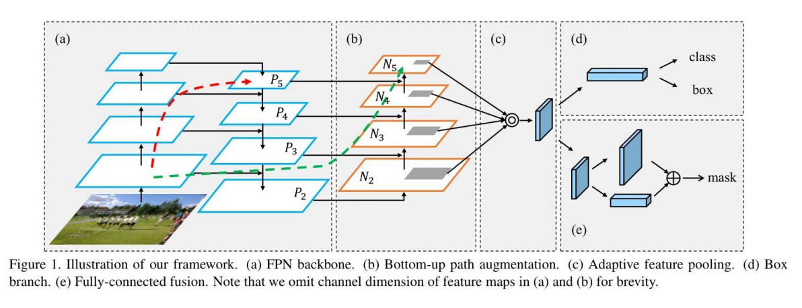

对上图进行以下说明：(注意，为了简洁起见，我们省略了(a)和(b)中特征映射的通道维度)
a) FPN backbone FPN主干网络
b) Bottom-up path augmentation 自底向上路径扩充
c) Adaptive feature pooling 自适应特征池
d) Box branch Box分支
e) Fully-connected fusion 全连通结合


#### 6.7 YOLOv5损失函数

YOLOv5损失函数包括：

- classification loss，分类损失
- localization loss，定位损失(预测框与GT(Ground Truth)框之间的误差)
- confidence loss，置信度损失(框的目标性；objectness of the box)

总的损失函数：
classification loss + localization loss + confidence loss

> YOLOv5使用二元交叉熵损失函数计算类别概率和目标置信度得分的损失。
> YOLOv5使用C-LoU Loss作为bounding box回归的损失。

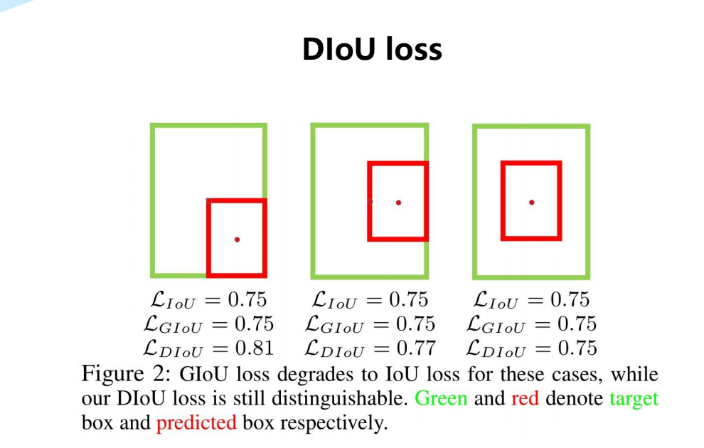

- 针对包围盒回归提出了一种距离lou损失，即Dlou损失，它比lou损失和Glou损失具有更快的收敛速度。

- 通过考虑重叠面积、中心点距离和纵横比这三个几何度量，进一步提出了完整的lou损失，即Clou损失，它更好地描述了矩形盒的回归。

### 七、YOLOv5 实战训练自己的数据集

#### 7.1 软件安装及环境配置

##### 7.1.1 安装Anaconda

Anaconda是一个用于科学计算的Python发行版，支持Linux、Mac、Windows，包含了众多流行的科学计算、数据分析的Python包。
安装步骤:
1.先去官方地址下载好对应的安装包
下载地址：https://www.anaconda.com/download/#linux

2.然后，安装anaconda

```shell
bash Anaconda3-2021.05-Linux-x86_64.sh
```

anaconda会自动将环境变量添加到PATH里面，如果后面你发现输入conda提示没有该命令，那么
你需要执行命令 `source ~/.bashrc` 更新环境变量，就可以正常使用了。
如果发现这样还是没用，那么需要添加环境变量。
编辑`~/.bashrc` 文件，在最后面加上

```shell
export PATH=/home/user/anaconda3/bin:$PATH
```

注意：路径应改为自己机器上的路径
保存退出后执行： `source ~/.bashrc`
再次输入 `conda list` 测试看看，应该没有问题。

##### 7.1.2 安装Anaconda国内镜像配置

清华TUNA提供了 Anaconda 仓库的镜像，运行以下三个命令:

```shell
conda config --add channels 
https://mirrors.tuna.tsinghua.edu.cn/anaconda/pkgs/free/
```

```shell
conda config --add channels 
https://mirrors.tuna.tsinghua.edu.cn/anaconda/pkgs/main/
```

```shell
conda config --set show_channel_urls yes
```

##### 7.1.3 安装pytorch

更新：如果使用yolov5版本v5.0以上的代码，使用pytorch1.8
首先为pytorch创建一个anaconda虚拟环境，环境名字可自己确定，这里本人使用pytrain作为环境
名:

```shell
conda create -n pytrain python=3.8
```

安装成功后激活pytrain环境：

```shell
conda activate pytrain
```

在所创建的pytorch环境下安装pytorch的1.8版本, 执行命令：

```shell
conda install pytorch torchvision cudatoolkit=10.2 -c pytorch
```

注意：10.2处应为cuda的安装版本号 
编辑`~/.bashrc` 文件，设置使用pytrain环境下的python3.8

```shell
alias python='/home/bai/anaconda3/envs/pytrain/bin/python3.8'
```

注意：python路径应改为自己机器上的路径
保存退出后执行： `source ~/.bashrc`
该命令将自动回到base环境，再执行 `conda activate pytrain` 到pytorch环境。

#### 7.2 YOLOv5项目克隆和安装

##### 7.2.1 克隆YOLOv5项目

网址: https://github.com/ultralytics/yolov5

```shell
git clone https://github.com/ultralytics/yolov5.git
```

或者直接下载YOLOv5的5.0版本的代码。
下载后可重命名项目文件夹

##### 7.2.2 安装所需库

在yolov5目录下执行：

```shell
pip install -r requirements.txt -i https://pypi.tuna.tsinghua.edu.cn/simple
```

注意：simple 不能少, 是 https 而不是 http

##### 7.2.3 下载预训练权重文件

下载yolov5s.pt，yolov5m.pt，yolov5l.pt，yolov5x.pt权重文件，并放置在weights文件夹下
百度网盘下载链接：
链接：https://pan.baidu.com/s/1p1HS0gpWZy55dShj3ihLRQ
提取码：0sao
更新：如果使用yolov5版本v5.0以上的代码，下载相应的权重。

7.2.4 安装测试

```shell
python detect.py --source ./data/images/ --weights weights/yolov5s.pt
```


#### 7.3 标注自己的数据集

##### 7.3.1 安装图像标注工具labelImg

这里的安装大致有两种方式，一种是直接pip install，另一种是克隆源码进行编译，推荐优先使用第一种。
第一种安装方式：

```shell
conda create -n label python=3.8
```

```shell
conda activate label
```

```shell
pip install labelImg
```

打开方式，在label环境下命令行输入labelImg打开即可。

第二种安装方式：
克隆labelImg

```shell
git clone https://github.com/tzutalin/labelImg.git
```

使用Anaconda安装
到labelImg路径下执行命令

```shell
conda install pyqt=5
pip install lxml
pyrcc5 -o libs/resources.py resources.qrc
python labelImg.py
```

##### 7.3.2 添加自定义类别

修改文件`labelImg/data/predefined_classes.txt`：

```shell
ball
messi
trophy
```


##### 7.3.3 使用labelImg进行图像标注

打开labelImg，可以看到如下界面：

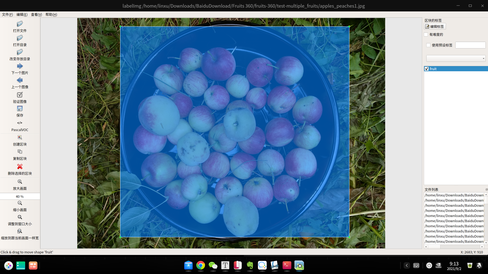

说明：由于这里是直接pip install安装，且系统语言又是中文，因此界面语言也保持一致。
最左边一栏相当于是标注的操作栏，我们通过创建区块，也即为标注边界框并界定分类标签名。
对一张样本图片操作完毕后，Ctrl+S进行保存，这时会采用默认的`PascalVOC`的格式，也即将标记信息存在同名的xml文件。

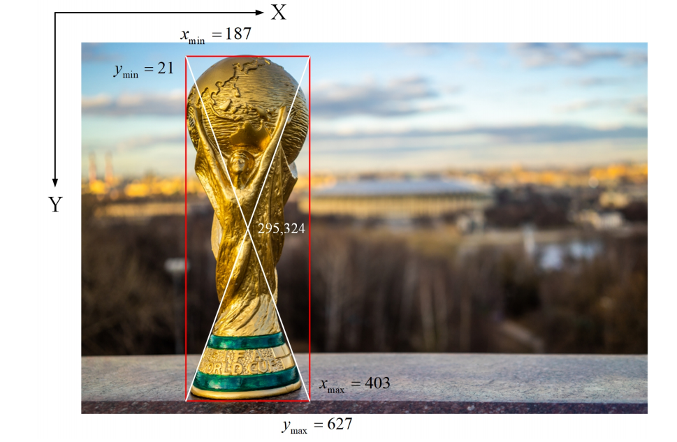

需要说明的是，对上图来说，图像的坐标原点在左上角，水平方向为X轴，竖直方向为Y轴。图中边界框由几个要素组成，即x_min,y_min,x_max,y_max,这些通过xml的结构存储为标注信息文件。


查看xml对应的格式，如下

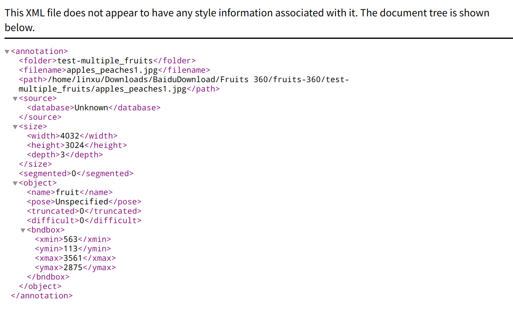

但由于YOLO系列对于标注文件的要求格式为YOLO类型的，因此还需要将其转换为对应的txt格式。

> YOLO格式的txt标记文件如下：
> class_id x y w h
> class_id: 类别的id编号
> x: 目标的中心点x坐标（横向）/图片总宽度
> y: 目标的中心的y坐标（纵向）/图片总高度
> w: 目标框的宽带/图片总宽度
> h: 目标框的高度/图片总高度

如下图所示:
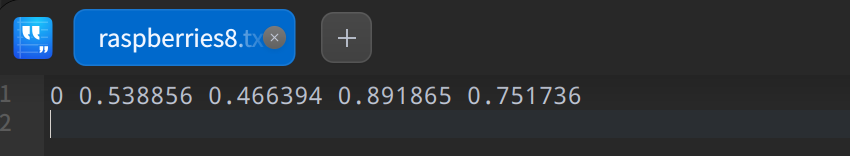


- 可以用python代码实现两种标记格式的转换：

```python
def convert(size, box):
    dw = 1./size[0]
    dh = 1./size[1]
	# box[0]：xmin,box[1]: xmax
    x = (box[0] + box[1])/2.0
	# box[2]: ymin,box[3]: ymax
    y = (box[2] + box[3])/2.0
    w = box[1] - box[0]
    h = box[3] - box[2]
    x = x*dw
    w = w*dw
    y = y*dh
    h = h*dh
    return (x,y,w,h)
```


当然，也可以在操作栏中直接更换保存为YOLO格式的txt文件，这样就可以直接使用，无需转换。

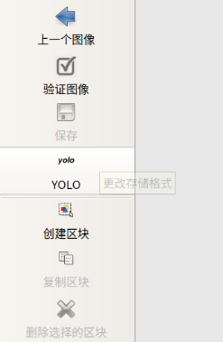

#### 7.4 准备自己的数据集

##### 7.4.1 下载项目文件

从百度文件下载到yolov5目录下并解压

- VOCdevkit_ball.zip
- testfiles.zip
- prepare_data.py

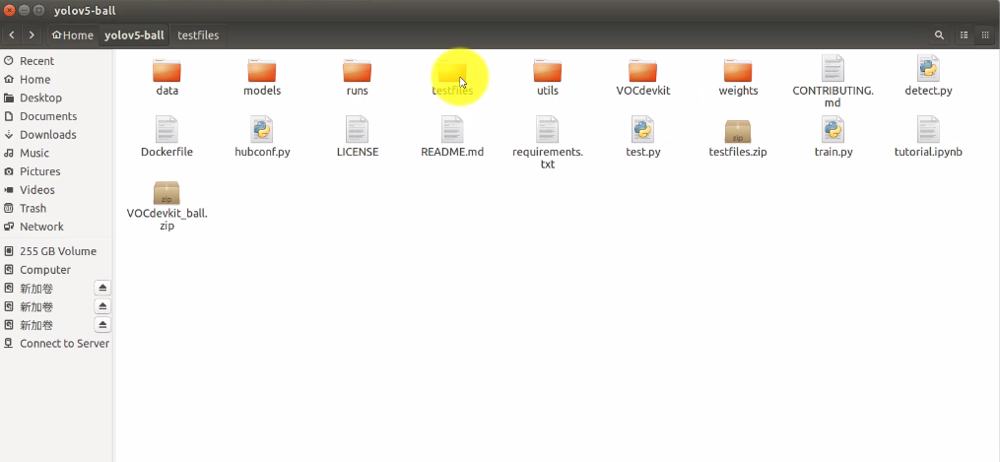


##### 7.4.2 解压建立或自行建立数据集

使用PASCAL VOC数据集的目录结构：
建立文件夹层次为`yolov5/data/VOCdevkit/VOC2007`
VOC2007下建立两个文件夹：`Annotations`和`JPEGImages`
`JPEGImages`放所有的训练和测试图片；
`Annotations`放所有的xml标记文件。

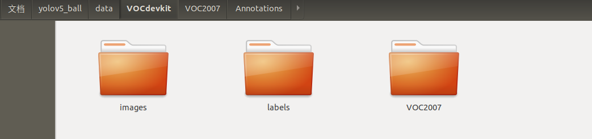

##### 7.4.3 生成训练集和验证集文件

新建Python脚本

```shell
touch prepare_data.py
```

```shell
gedit prepare_data.py
```

- prepare_data.py 

```python
import xml.etree.ElementTree as ET
import pickle
import os
from os import listdir, getcwd
from os.path import join
import random
from shutil import copyfile

# 分类类别
classes = ["ball", "messi"]
# classes=["ball"]

# 划分训练集比率
TRAIN_RATIO = 80


def clear_hidden_files(path):
    '''
    清除目录下隐藏文件
    :param path:
    :return:
    '''
    dir_list = os.listdir(path)
    for i in dir_list:
        abspath = os.path.join(os.path.abspath(path), i)
        if os.path.isfile(abspath):
            if i.startswith("._"):
                os.remove(abspath)
        else:
            clear_hidden_files(abspath)


def convert(size, box):
    '''
    转换格式
    :param size:
    :param box:
    :return:
    '''
    dw = 1. / size[0]
    dh = 1. / size[1]
    x = (box[0] + box[1]) / 2.0
    y = (box[2] + box[3]) / 2.0
    w = box[1] - box[0]
    h = box[3] - box[2]
    x = x * dw
    w = w * dw
    y = y * dh
    h = h * dh
    return (x, y, w, h)


def convert_annotation(image_id):
    '''
    转换annotation
    :param image_id:
    :return:
    '''
    in_file = open('data/VOCdevkit/VOC2007/Annotations/%s.xml' % image_id)
    out_file = open('data/VOCdevkit/VOC2007/YOLOLabels/%s.txt' % image_id, 'w')
    tree = ET.parse(in_file)
    root = tree.getroot()
    size = root.find('size')
    w = int(size.find('width').text)
    h = int(size.find('height').text)

    for obj in root.iter('object'):
        difficult = obj.find('difficult').text
        cls = obj.find('name').text
        if cls not in classes or int(difficult) == 1:
            continue
        cls_id = classes.index(cls)
        xmlbox = obj.find('bndbox')
        b = (float(xmlbox.find('xmin').text), float(xmlbox.find('xmax').text), float(xmlbox.find('ymin').text),
             float(xmlbox.find('ymax').text))
        bb = convert((w, h), b)
        out_file.write(str(cls_id) + " " + " ".join([str(a) for a in bb]) + '\n')
    in_file.close()
    out_file.close()

if __name__ == '__main__':
    
    wd = os.getcwd()
    data_base_dir = os.path.join(wd, "data/VOCdevkit/")
    if not os.path.isdir(data_base_dir):
        os.mkdir(data_base_dir)
    work_sapce_dir = os.path.join(data_base_dir, "VOC2007/")
    if not os.path.isdir(work_sapce_dir):
        os.mkdir(work_sapce_dir)
    annotation_dir = os.path.join(work_sapce_dir, "Annotations/")
    if not os.path.isdir(annotation_dir):
        os.mkdir(annotation_dir)
    clear_hidden_files(annotation_dir)
    image_dir = os.path.join(work_sapce_dir, "JPEGImages/")
    if not os.path.isdir(image_dir):
        os.mkdir(image_dir)
    clear_hidden_files(image_dir)
    yolo_labels_dir = os.path.join(work_sapce_dir, "YOLOLabels/")
    if not os.path.isdir(yolo_labels_dir):
        os.mkdir(yolo_labels_dir)
    clear_hidden_files(yolo_labels_dir)
    yolov5_images_dir = os.path.join(data_base_dir, "images/")
    if not os.path.isdir(yolov5_images_dir):
        os.mkdir(yolov5_images_dir)
    clear_hidden_files(yolov5_images_dir)
    yolov5_labels_dir = os.path.join(data_base_dir, "labels/")
    if not os.path.isdir(yolov5_labels_dir):
        os.mkdir(yolov5_labels_dir)
    clear_hidden_files(yolov5_labels_dir)
    yolov5_images_train_dir = os.path.join(yolov5_images_dir, "train/")
    if not os.path.isdir(yolov5_images_train_dir):
        os.mkdir(yolov5_images_train_dir)
    clear_hidden_files(yolov5_images_train_dir)
    yolov5_images_test_dir = os.path.join(yolov5_images_dir, "val/")
    if not os.path.isdir(yolov5_images_test_dir):
        os.mkdir(yolov5_images_test_dir)
    clear_hidden_files(yolov5_images_test_dir)
    yolov5_labels_train_dir = os.path.join(yolov5_labels_dir, "train/")
    if not os.path.isdir(yolov5_labels_train_dir):
        os.mkdir(yolov5_labels_train_dir)
    clear_hidden_files(yolov5_labels_train_dir)
    yolov5_labels_test_dir = os.path.join(yolov5_labels_dir, "val/")
    if not os.path.isdir(yolov5_labels_test_dir):
        os.mkdir(yolov5_labels_test_dir)
    clear_hidden_files(yolov5_labels_test_dir)
    
    train_file = open(os.path.join(wd, "data/yolov5_train.txt"), 'w')
    test_file = open(os.path.join(wd, "data/yolov5_val.txt"), 'w')
    train_file.close()
    test_file.close()
    train_file = open(os.path.join(wd, "data/yolov5_train.txt"), 'a')
    test_file = open(os.path.join(wd, "data/yolov5_val.txt"), 'a')
    list_imgs = os.listdir(image_dir)  # list image files
    prob = random.randint(1, 100)
    print("Probability: %d" % prob)
    for i in range(0, len(list_imgs)):
        path = os.path.join(image_dir, list_imgs[i])
        if os.path.isfile(path):
            image_path = image_dir + list_imgs[i]
            voc_path = list_imgs[i]
            (nameWithoutExtention, extention) = os.path.splitext(os.path.basename(image_path))
            (voc_nameWithoutExtention, voc_extention) = os.path.splitext(os.path.basename(voc_path))
            annotation_name = nameWithoutExtention + '.xml'
            annotation_path = os.path.join(annotation_dir, annotation_name)
            label_name = nameWithoutExtention + '.txt'
            label_path = os.path.join(yolo_labels_dir, label_name)
        prob = random.randint(1, 100)
        print("Probability: %d" % prob)
        
        # 训练集
        if (prob < TRAIN_RATIO):  
            if os.path.exists(annotation_path):
                train_file.write(image_path + '\n')
                # 转换label
                convert_annotation(nameWithoutExtention)  
                copyfile(image_path, yolov5_images_train_dir + voc_path)
                copyfile(label_path, yolov5_labels_train_dir + label_name)
        else: 
            # 测试集
            if os.path.exists(annotation_path):
                test_file.write(image_path + '\n')
                # 转换label
                convert_annotation(nameWithoutExtention)  
                copyfile(image_path, yolov5_images_test_dir + voc_path)
                copyfile(label_path, yolov5_labels_test_dir + label_name)
    train_file.close()
    test_file.close()
```


执行Python脚本:

```shell
python prepare_data.py
```

注意：classes=["ball","messi"]要根据自己的数据集类别做相应的修改

- 在VOCdevkit/VOC2007目录下可以看到生成了文件夹YOLOLabels 
  YOLOLabels下的文件是images文件夹下每一个图像的yolo格式的标注文件，这是由annotations的xml标注文件转换来的；

  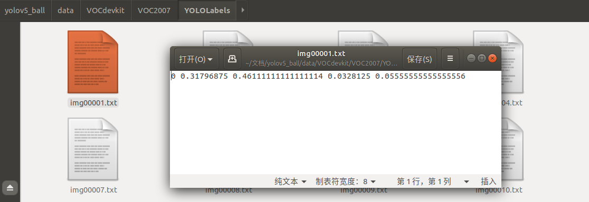

- **在VOCdevkit目录下生成了images和labels文件夹**
  **images文件夹下有train和val文件夹，分别放置训练集和验证集图片；**
  **labels文件夹有train和val文件夹，分别放置训练集和验证集标签（yolo格式）**
  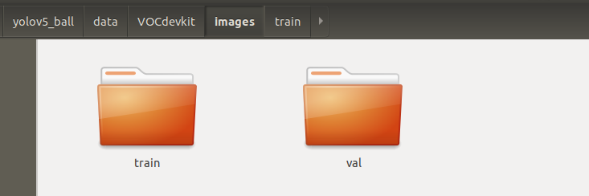


- 在yolov5下生成了两个文件yolov5_train.txt和yolov5_val.txt。
   yolov5_train.txt和yolov5_val.txt分别给出了训练图片文件和验证图片文件的列表，含有每个图片的路径和文件名。
   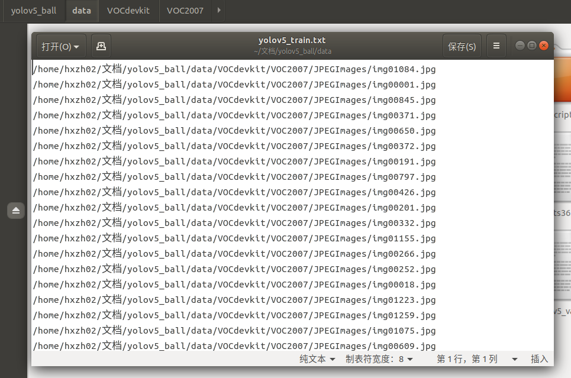


#### 7.5 修改配置文件

##### 7.5.1 新建文件data/voc_ball.yaml

为了对于定制数据集进行专门的训练，这里需要新建对应的配置文件。
可以复制data/voc.yaml再根据自己情况和需要进行修改；
将复制后得到的文件重命名为voc_ball.yaml
然后，修改配置参数

```yaml
# download command/URL (optional)
#download: bash data/scripts/get_voc.sh
# train and val data as 1) directory: path/images/, 2) file: path/images.txt, or 
3) list: [path1/images/, path2/images/]
train: ./VOCdevkit/images/train/   
val: ./VOCdevkit/images/val/  
# number of classes
nc: 1
# class names
names: ['ball']
```


##### 7.5.2 新建文件models.yolov5s_ball.yaml

可以复制models/yolov5s.yaml再根据自己的情况修改；
可以重命名为models/yolov5s_ball.yaml
然后，修改配置参数

```yaml
nc: 1  # number of classes
```


#### 7.6 使用wandb训练可视化工具

wandb(Weight&Biases)是一个类似于tensorboard的在线模型训练可视化工具。
YOLOv5(v4.0 release开始)集成了Weights&Biases，可以方便的追踪模型训练的整个过程，包括模型的性能、超参数、GPU的使用情况、模型预测等。

##### 7.6.1 注册和安装wandb

**注册wandb**
到其官网https://wandb.ai/home 注册
**安装wandb**
执行

```shell
pip install wandb
```

wandb: You can find your API key in your browser here: https://wandb.ai/authorize
wandb: Paste an API key from your profile and hit enter: 
登录后有 Copy this key and paste it into your command line to authorize it.

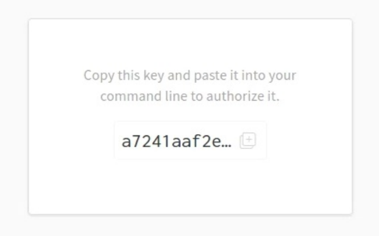


**本地使用wandb:**
wandb网站有时挺卡，wandb也有本地使用方式。参考：https://docs.wandb.ai/self-hosted/local，
配置好后可以本地访问。


**关闭wandb：**
如需要关闭wandb，可把代码文件utils/wandb_logging/wandb_utils.py中的

```python
try:
    import wandb
    from wandb import init, finish
except ImportError:
    wandb = None
```

修改为

```python
wandb = None
```


##### 7.6.2 在代码中修改项目名称

在utils/wandb_logging/wandb_utils.py中

```python
self.wandb_run = wandb.init(config=opt,resume="allow",project='YOLOv5-Ball-Ubuntu' if opt.project
== 'runs/train' else Path(opt.project).stem,
                                    name=name,
                                    job_type=job_type,
                                    id=run_id) if not wandb.run else wandb.run
```


#### 7.7 训练自己的数据集

##### 7.7.1 训练命令

在yolov5路径下执行：
使用YOLOv5s训练命令：

```shell
python train.py --data data/voc_ball.yaml --cfg models/yolov5s_ball.yaml --weights weights/yolov5s.pt --batch-size 16 --epochs 50 --workers 4 --name bm-yolov5s
```

使用YOLOv5x训练命令：

```shell
python train.py --data data/voc_ball.yaml --cfg models/yolov5x_ball.yaml --weights weights/yolov5x.pt --batch-size 8 --epochs 100 --workers 4 --name bm-yolov5x
```

注意：如果出现显存溢出，可减少batch-size

开始训练，如下所示

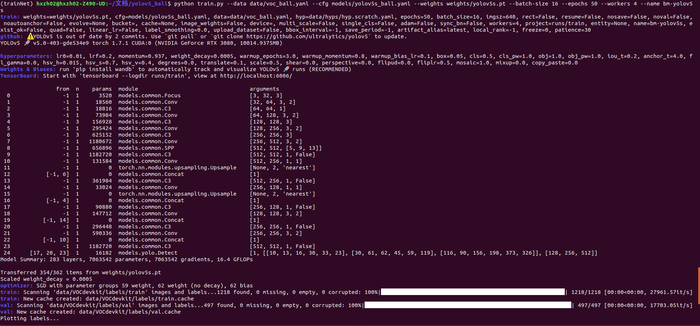
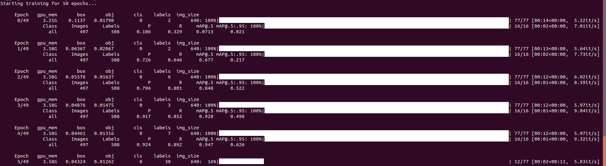


##### 7.7.2 训练过程可视化

在yolov5路径下执行：

```shell
tensorboard --logdir=./runs
```
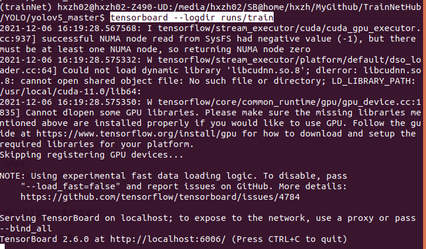

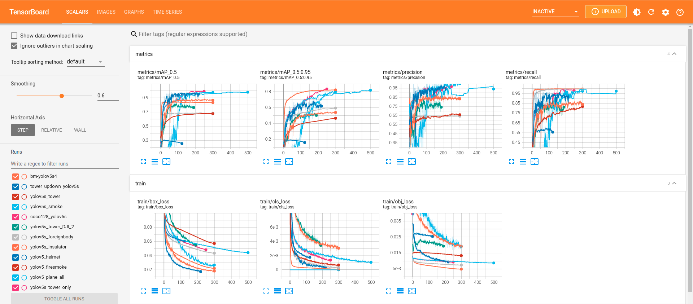


##### 7.7.3 训练结果的查看

查看runs目录下的文件
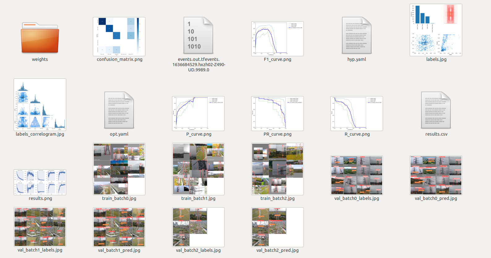

#### 7.8 测试训练出的网络模型

##### 7.8.1 测试图片

yolo5路径下执行:
使用yolov5s训练出的权重

```shell
python detect.py --source ./testfiles/img1.jpg --weights runs/train/bmyolov5s/weights/best.pt 
```

使用yolov5x训练出的权重

```shell
python detect.py --source ./testfiles/img1.jpg --weights runs/train/bmyolov5x/weights/best.pt 
```

##### 7.8.2 测试视频

yolov5路径下执行：
使用yolov5s训练出的权重

```shell
python detect.py --source ./testfiles/messi.mp4 --weights runs/train/bmyolov5s/weights/best.pt 
```

使用yolov5x训练出的权重

```shell
python detect.py --source ./testfiles/messi.mp4 --weights runs/train/bmyolov5x/weights/best.pt
```

注：

- 1)批量处理文件夹下的图片和视频可以指定文件夹的名字，如--source ./testfiles
- 2)命令后可加上目标的置信度阈值，如--conf-thres 0.4


##### 7.8.3 性能统计

yolo5路径下执行

使用yolov5s训练出的权重

```shell
python test.py --data data/voc_bm.yaml --weights runs/train/bmyolov5s/weights/best.pt --batch-size 16
```

使用yolov5x训练出的权重

```shell
python test.py --data data/voc_bm.yaml --weights runs/train/bmyolov5x/weights/best.pt --batch-size 16
```