# yolact训练模型学习总结

## 一、YOLACT介绍(**Y**ou **O**nly **L**ook **A**t **C**oefficien**T**s)


### 1.1 简要介绍

yolact是一种用于实时实例分割的简单、全卷积模型。
(A simple, fully convolutional model for real-time instance segmentation. 

论文摘要介绍**Abstract：**我们提出了一个用于实时实例分割的简单全卷积模型，在单个Titan Xp上以33 fps在MS COCO上实现了**29.8 mAP**，这比以前的任何算法都要快得多。此外，我们只在一个GPU上训练后获得此结果。我们通过将实例分割分成两个并行子任务：（1）生成一组原型掩膜（prototype mask）；（2）预测每个实例的掩膜系数（mask coefficients）。然后我们通过将原型与掩模系数线性组合来生成实例掩膜（instance masks）。我们发现因为这个过程不依赖于 repooling，所以这种方法可以产生非常高质量的掩模。此外，我们分析了 the emergent behavior of our prototypes，并表明他们学会以 translation variant manner 定位实例，尽管是完全卷积的。最后，我们还提出了快速NMS（Fast NMS），比标准NMS快12 ms，只有一点点性能损失。

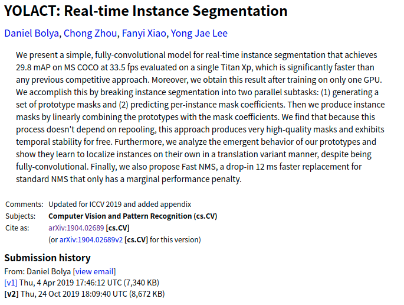


### 1.2 paper with code

下面是官方团队论文和代码(两个白线)：

- [YOLACT：实时实例分割](https://arxiv.org/abs/1904.02689)
- [YOLACT++：更好的实时实例分割](https://arxiv.org/abs/1912.06218)
- paper：[yolact](https://arxiv.org/pdf/1904.02689.pdf)
- github:[yolact](https://github.com/dbolya/yolact)

YOLACT++ (v1.2) 发布！([变更日志](https://gitee.com/moonharbour/yolact/blob/master/CHANGELOG.md))

YOLACT++ 的 resnet50 模型在 Titan Xp 上以 33.5 fps 运行，在 COCO 上达到 34.1 mAP `test-dev`（[在此处](https://arxiv.org/abs/1912.06218)查看我们的期刊论文）。

为了使用 YOLACT++，请确保编译 DCNv2 代码。（可见[安装](https://github.com/dbolya/yolact#installation)）

### 1.3 测试效果


下面是在coco数据集上的测试效果:

| 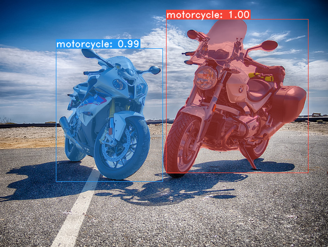 | 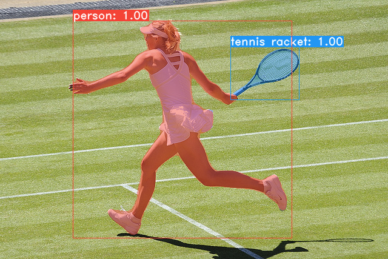 | 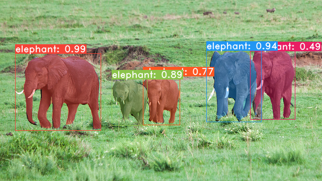 |
| :----------------------------------------------------------: | :----------------------------------------------------------: | ------------------------------------------------------------ |


此处是一个实时实例分割的Demo演示视频：

<iframe src="//player.bilibili.com/player.html?aid=720581661&bvid=BV19Q4y1r78q&cid=410345635&page=1" scrolling="no" border="0" frameborder="no" framespacing="0" allowfullscreen="true"> </iframe>


## 二、环境搭建及配置

### 2.1 搭建环境

- 搭建Python3环境。
  这里可以利用anaconda新建一个虚拟环境，然后参考`environment.yml`进行相应依赖库的安装。

  ```shell
  # 新建虚拟环境
  conda create -n train python=3.7
  # 激活虚拟环境
  conda activate train
  # 安装相应依赖库
  pip install opencv-python==4.5.3.56
  pip install matplotlib==3.4.3
  pip install pillow==8.3.1 
  pip install pycocotools==2.0.2 
  pip install PyQt5==5.9.2
  pip install torchvision==0.8.1
  pip install pytorch==1.7.1
  ```

  

- 安装 [Pytorch](http://pytorch.org/) 1.0.1（或更高版本）和 TorchVision。

- 安装一些其他软件包：

  ```shell
  # Cython needs to be installed before pycocotools
  pip install cython
  pip install opencv-python pillow pycocotools matplotlib 
  ```

- 克隆这个存储库并进入该目录：

  ```shell
  git clone https://github.com/dbolya/yolact.git
  cd yolact
  ```

- 如果您想训练 YOLACT，请下载COCO数据集和2014/2017注释。请注意，此脚本将需要一段时间并将 21gb 的文件转储到 `./data/coco`.
  下面是通过脚本下载COCO数据集的方式:

  ```shell
  sh data/scripts/COCO.sh
  ```

- 如果您想在 上评估 YOLACT `test-dev`，请`test-dev`使用此脚本下载。

  ```shell
  sh data/scripts/COCO_test.sh
  ```

- 如果要使用 YOLACT++，请编译可变形卷积层（来自[DCNv2](https://github.com/CharlesShang/DCNv2/tree/pytorch_1.0)）。确保您从[NVidia 的网站](https://developer.nvidia.com/cuda-toolkit)安装了最新的 CUDA 工具包。

  ```shell
  cd external/DCNv2 
  python setup.py build develop
  ```

  这里以上几步基本可以参考官方readme的步骤。在数据集下载的时候，也可直接通过`COCO.sh`脚本下的下载地址利用wget进行下载，解压文件之后存放到指定位置就好。

  在./data目录下执行：

  ```shell
  # 数据集与验证集下载
  wget http://images.cocodataset.org/zips/train2017.zip
  wget http://images.cocodataset.org/zips/val2017.zip
  unzip -qqjd ../images ../images/train2017.zip
  unzip -qqjd ../images ../images/val2017.zip
  # 数据集相关标注文件
  wget http://images.cocodataset.org/annotations/annotations_trainval2014.zip
  wget http://images.cocodataset.org/annotations/annotations_trainval2017.zip
  unzip -qqd .. ./annotations_trainval2014.zip
  unzip -qqd .. ./annotations_trainval2017.zip
  # 清除压缩文件
  rm ../images/train2017.zip
  rm ../images/val2017.zip
  rm ./annotations_trainval2014.zip
  rm ./annotations_trainval2017.zip
  ```


### 2.2 模型评估

在搭建完成基本环境与源码之后，我们需要下载官方作者开放的对应权重模型，也即为weights下的.pth文件，若yolact根目录下没有weights文件目录则需要自行创建。

#### 2.2.1 评估数据预览及权重文件下载

下面给出了yolact在不同Image Size大小下的FPS 和 mAP评估数据以及相应的权重文件(截止到2019 年 4 月 5 日)：

| Image Size |   Backbone    | FPS  | mAP  | Weights(谷歌云端硬盘)                                        | 镜像                                                         |
| :--------: | :-----------: | :--: | :--: | ------------------------------------------------------------ | ------------------------------------------------------------ |
|    550     | Resnet50-FPN  | 42.5 | 28.2 | [yolact_resnet50_54_800000.pth](https://drive.google.com/file/d/1yp7ZbbDwvMiFJEq4ptVKTYTI2VeRDXl0/view?usp=sharing) | [Mirror](https://ucdavis365-my.sharepoint.com/:u:/g/personal/yongjaelee_ucdavis_edu/EUVpxoSXaqNIlssoLKOEoCcB1m0RpzGq_Khp5n1VX3zcUw) |
|    550     | Darknet53-FPN | 40.0 | 28.7 | [yolact_darknet53_54_800000.pth](https://drive.google.com/file/d/1dukLrTzZQEuhzitGkHaGjphlmRJOjVnP/view?usp=sharing) | [Mirror](https://ucdavis365-my.sharepoint.com/:u:/g/personal/yongjaelee_ucdavis_edu/ERrao26c8llJn25dIyZPhwMBxUp2GdZTKIMUQA3t0djHLw) |
|    550     | Resnet101-FPN | 33.5 | 29.8 | [yolact_base_54_800000.pth](https://drive.google.com/file/d/1UYy3dMapbH1BnmtZU4WH1zbYgOzzHHf_/view?usp=sharing) | [Mirror](https://ucdavis365-my.sharepoint.com/:u:/g/personal/yongjaelee_ucdavis_edu/EYRWxBEoKU9DiblrWx2M89MBGFkVVB_drlRd_v5sdT3Hgg) |
|    700     | Resnet101-FPN | 23.6 | 31.2 | [yolact_im700_54_800000.pth](https://drive.google.com/file/d/1lE4Lz5p25teiXV-6HdTiOJSnS7u7GBzg/view?usp=sharing) | [Mirror](https://ucdavis365-my.sharepoint.com/:u:/g/personal/yongjaelee_ucdavis_edu/Eagg5RSc5hFEhp7sPtvLNyoBjhlf2feog7t8OQzHKKphjw) |


同上，下面是YOLACT++模型 (2019 年 12 月 16 日发布):

| Image Size |   Backbone    | FPS  | mAP  | Weights(谷歌云端硬盘地址)                                    | 镜像                                                         |
| :--------: | :-----------: | :--: | :--: | ------------------------------------------------------------ | ------------------------------------------------------------ |
|    550     | Resnet50-FPN  | 33.5 | 34.1 | [yolact_plus_resnet50_54_800000.pth](https://drive.google.com/file/d/1ZPu1YR2UzGHQD0o1rEqy-j5bmEm3lbyP/view?usp=sharing) | [Mirror](https://ucdavis365-my.sharepoint.com/:u:/g/personal/yongjaelee_ucdavis_edu/EcJAtMiEFlhAnVsDf00yWRIBUC4m8iE9NEEiV05XwtEoGw) |
|    550     | Resnet101-FPN | 27.3 | 34.6 | [yolact_plus_base_54_800000.pth](https://drive.google.com/file/d/15id0Qq5eqRbkD-N3ZjDZXdCvRyIaHpFB/view?usp=sharing) | [Mirror](https://ucdavis365-my.sharepoint.com/:u:/g/personal/yongjaelee_ucdavis_edu/EVQ62sF0SrJPrl_68onyHF8BpG7c05A8PavV4a849sZgEA) |

要评估模型，请将相应的权重文件放在`./weights`目录中并运行以下命令之一。每个配置的名称是文件名中数字之前的所有内容（例如，`yolact_base`for `yolact_base_54_800000.pth`）。


下面提供一段脚本代码进行这部分内容的整合，(由于Weights列中为谷歌云端硬盘的下载链接，因此这里设置的是Mirror镜像链接地址)
为方便下载，这里提供腾讯微云的下载链接: [yolact_weight](https://share.weiyun.com/uH6hSGX5)


如何去评估一个模型的好坏及其训练后的性能，我们需要对其数值数据上进行定性、定量及其最基准的评估与分析，同时直接对其进行图像与视频的预测测试。


#### 2.2.2 评估COCO数据集下的定量结果

杳在整个验证集上量化评估训练模型，需确保已按上述方式下载 COCO数据集。

```shell
##mAP。
#输出一个COCOEval json 提交给网站或者使用run_coco_eval.py 脚本。
#此命令将分别创建 './results/bbox_detections.json' 和 './results/mask_detections.json' 用于检测和实例分割。
python eval.py --trained_model=weights/yolact_base_54_800000.pth

#您可以在上一个命令中创建的文件上运行 COCOEval。性能应该与在 eval.py 中的实现相匹配。
python eval.py --trained_model=weights/yolact_base_54_800000.pth --output_coco_json

#要为 test-dev 输出 coco json 文件，请确保您已经从上面下载了 test-dev 并转到对应位置
python run_coco_eval.py

python eval.py --trained_model=weights/yolact_base_54_800000.pth --output_coco_json --dataset=coco2017_testdev_dataset
```


#### 2.2.3 评估COCO数据集下的定性结果

```shell
#在 COCO 上显示定性结果。从这里开始，我将使用 0.15 的置信阈值。
python eval.py --trained_model=weights/yolact_base_54_800000.pth --score_threshold=0.15 --top_k=15 --display
```


#### 2.2.4 评估COCO数据集下的基准测试

```shell
#只在验证集的前 1k 个图像上运行原始模型
python eval.py --trained_model=weights/yolact_base_54_800000.pth --benchmark --max_images=1000
```


#### 2.2.5 在COCO预训练数据模型上进行图像测试

```shell
# 在指定图像上显示定性结果# 对单张图片进行预测
python eval.py --trained_model=weights/yolact_base_54_800000.pth --score_threshold=0.15 --top_k=15 --image=my_image.png
# 处理一个图像并将其保存到另一个文件中
python eval.py --trained_model=weights/yolact_base_54_800000.pth --score_threshold=0.15 --top_k=15 --image=input_image.png:output_image.png
# 处理整个文件夹的图像
python eval.py --trained_model=weights/yolact_base_54_800000.pth --score_threshold=0.15 --top_k=15 --images=path/to/input/folder:path/to/output/folder
```

下面是COCO图像测试的结果：

| 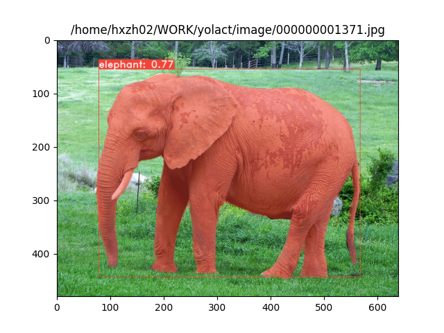 | 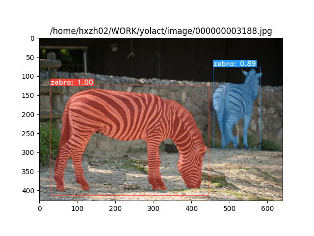 | 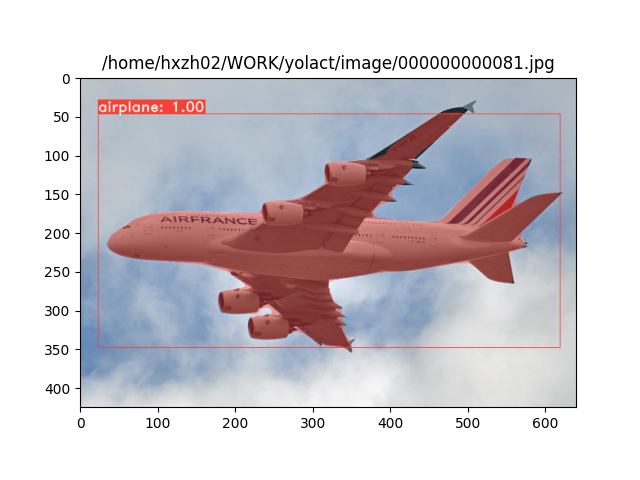 |
| ------------------------------------------------------------ | ------------------------------------------------------------ | ------------------------------------------------------------ |


#### 2.2.6 在COCO预训练数据模型上进行视频测试

```shell
#实时显示视频。“--video_multiframe”将一次处理那么多帧以提高性能。
#如果需要，可以使用“--display_fps”直接在帧上绘制FPS。
# 对指定视频进行推理预测
python eval.py --trained_model=weights/yolact_base_54_800000.pth --score_threshold=0.15 --top_k=15 --video_multiframe=4 --video=my_video.mp4

# 实时显示网络摄像头提要。如果您有多个网络摄像头，请传递您想要的网络摄像头索引而不是 0。
python eval.py --trained_model=weights/yolact_base_54_800000.pth --score_threshold=0.15 --top_k=15 --video_multiframe=4 --video=0

# 处理视频并将其保存到另一个文件。现在使用与上面相同的管道，所以速度很快！
python eval.py --trained_model=weights/yolact_base_54_800000.pth --score_threshold=0.15 --top_k=15 --video_multiframe=4 --video=input_video.mp4:output_video.mp4
```


下面是针对大象视频做图像分割的预测示例:

<iframe src="//player.bilibili.com/player.html?aid=805515750&bvid=BV1K34y1X7W6&cid=410761259&page=1" scrolling="no" border="0" frameborder="no" framespacing="0" allowfullscreen="true"> </iframe>


### 2.3 训练参数及其文件配置

默认情况下，我们在 COCO 上训练。训练前需确保已下载所用的整个数据集。

#### 2.3.1 训练说明

- 要进行训练，请获取一个 imagenet 预训练模型并将其放入`./weights`
  - 对于 Resnet101，请`resnet101_reducedfc.pth`从[这里](https://drive.google.com/file/d/1tvqFPd4bJtakOlmn-uIA492g2qurRChj/view?usp=sharing)下载。
  - 对于 Resnet50，`resnet50-19c8e357.pth`从[这里](https://drive.google.com/file/d/1Jy3yCdbatgXa5YYIdTCRrSV0S9V5g1rn/view?usp=sharing)下载。
  - 对于 Darknet53，请`darknet53.pth`从[这里](https://drive.google.com/file/d/17Y431j4sagFpSReuPNoFcj9h7azDTZFf/view?usp=sharing)下载。
- 运行以下训练命令之一。
  - 请注意，您可以在训练时按 ctrl+c，它将`*_interrupt.pth`在当前迭代中保存一个文件。
  - `./weights`默认情况下，所有权重都以文件名保存在目录中`<config>_<epoch>_<iter>.pth`。

#### 2.3.2 训练操作及参数配置

```shell
# 使用批量大小为 8（默认值）的基本配置进行训练。
python train.py --config=yolact_base_config

# 训练 yolact_base_config 的 batch_size 为 5。
# 对于 550px 模型，1 个批次占用大约 1.5 gig 的 VRAM，因此相应地指定。
python train.py --config=yolact_base_config --batch_size=5

# 使用特定的权重文件恢复训练 yolact_base，并从权重文件名中指定的迭代开始。
python train.py --config=yolact_base_config --resume=weights/yolact_base_10_32100.pth --start_iter=-1

# 使用帮助选项查看所有可用命令行参数的描述
python train.py --help
```

#### 2.3.3 使用多GPU支持训练

YOLACT 现在在训练期间无缝支持多个 GPU：

- 在运行任何脚本之前，运行： 

  ```
  export CUDA_VISIBLE_DEVICES=[gpus]
  ```

  - 您应该将 [gpus] 替换为您要使用的每个 GPU 的索引的逗号分隔列表（例如，0,1,2,3）。
  - 如果只使用 1 个 GPU，您仍然应该这样做。
  - 您可以使用`nvidia-smi`.

- 然后，只需

  ```
  8*num_gpus
  ```

  使用上面的训练命令将批量大小设置为。训练脚本会自动将超参数缩放到正确的值。

  - 如果您有空闲内存，您可以进一步增加批量大小，但将其保持为您正在使用的 GPU 数量的倍数。
  - 如果要为每个 GPU 分配特定于不同 GPU 的图像，可以使用`--batch_alloc=[alloc]`其中 [alloc] 是逗号分隔的列表，其中包含每个 GPU 上的图像数量。这必须总和为`batch_size`。

#### 2.3.4 训练日志记录

YOLACT 现在默认记录训练和验证信息。您可以使用`--no_log`. 如何进行可视化，这里官方作者没有进一步说明，但不妨参考一下`LogVizualizer`在`utils/logger.py`寻求帮助。

#### 2.3.5 训练示例Pascal SBD

这里还包括一个用于训练 Pascal SBD 注释的配置（用于快速实验或与其他方法进行比较）。要在 Pascal SBD 上进行训练，请继续执行以下步骤：

1. 从[这里](http://home.bharathh.info/pubs/codes/SBD/download.html)下载数据集。它是顶部“概述”部分中的第一个链接（该文件名为`benchmark.tgz`）。
2. 将数据集提取到某处。在数据集中应该有一个名为`dataset/img`. 创建目录`./data/sbd`（`.`YOLACT 的根目录在哪里）并复制`dataset/img`到`./data/sbd/img`.
3. 从[这里](https://drive.google.com/open?id=1ExrRSPVctHW8Nxrn0SofU1lVhK5Wn0_S)下载 COCO 风格的注释。
4. 将注释提取到`./data/sbd/`.
5. 现在您可以使用`--config=yolact_resnet50_pascal_config`. 检查该配置以了解如何将其扩展到其他模型。

转换注释的脚本位置在`./scripts/convert_sbd.py`.
如果想验证我们的结果，可以`yolact_resnet50_pascal_config`从[这里](https://drive.google.com/open?id=1yLVwtkRtNxyl0kxeMCtPXJsXFFyc_FHe)下载我们的权重。
这个模型应该得到 72.3 掩码 AP_50 和 56.2 掩码 AP_70。请注意，“所有”AP 与其他论文中为 pascal 报告的“vol”AP 不同（它们使用`0.1 - 0.9`增量阈值的平均值，`0.1`而不是 COCO 使用的阈值）。


#### 2.3.6 自定义数据集训练

您还可以按照以下步骤对自己的数据集进行训练：

##### 2.3.6.1 从预训练开始训练

- 为您的数据集创建一个 COCO 风格的对象检测 JSON 注释文件。可以在[此处](http://cocodataset.org/#format-data)找到[此](http://cocodataset.org/#format-data)规范。请注意，我们不使用某些字段，因此可以省略以下内容：
  - `info`
  - `liscense`
  - Under `image`: `license, flickr_url, coco_url, date_captured`
  - `categories` (we use our own format for categories, see below)

- 在`dataset_base`in下为您的数据集创建一个定义`data/config.py`（`dataset_base`有关每个字段的解释，请参阅 in中的注释）：

```yaml
my_custom_dataset = dataset_base.copy({
    'name': 'My Dataset',

    'train_images': 'path_to_training_images',
    'train_info':   'path_to_training_annotation',

    'valid_images': 'path_to_validation_images',
    'valid_info':   'path_to_validation_annotation',

    'has_gt': True,
    'class_names': ('my_class_id_1', 'my_class_id_2', 'my_class_id_3', ...)
})
```

- 需要注意的几点：
  - 注释文件中的类 ID 应从 1 开始并按`class_names`. 如果这不是您的注释文件（就像COCO）的情况下，看到现场`label_map`的`dataset_base`。
  - 如果您不想创建验证拆分，请使用相同的图像路径和注释文件进行验证。默认情况下（参见`python train.py --help`），`train.py`将每 2 个时期输出数据集中前 5000 个图像的验证 mAP。
- 最后，在`yolact_base_config`同一个文件中，更改`'dataset'`to`'my_custom_dataset'`或您在上面命名的配置对象的值。然后您可以使用上一节中的任何训练命令。


##### 2.3.6.2**从头开始创建自定义数据集**

这里使用Labelme 和 labelme2coco.py 可以很好地创建数据集。对于计划在自定义数据集上微调/训练模型的任何人，请按照以下步骤操作：

- 下载并安装 Labelme ( https://github.com/wkentaro/labelme )

- 使用提供的多边形标签( Create Polygons)选项进行标记

- 将为每个标记的图像创建一个 json 文件(与图像同名)

  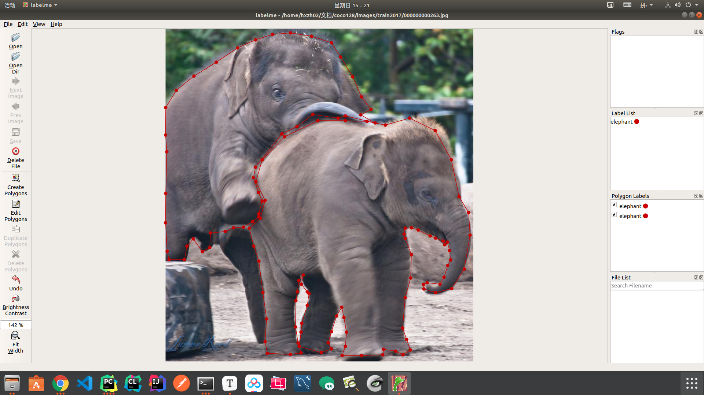

- 创建一个 label.txt

  例如下面这样形式:

  ```txt
  __ignore__
  _background_
  elephant
  bird
  dog
  cat
  person
  ```

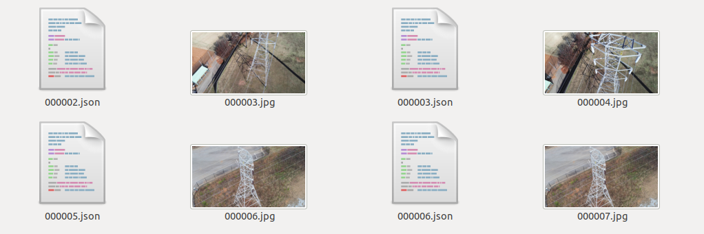


- 转换生成coco风格的 json 
  
  ```shell
  ./labelme2coco.py <labelled_data_folder> <out_folder> --labels labels.txt
  ```
  
  生成的内容如下:
  
  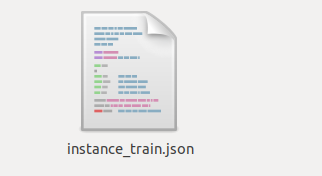

 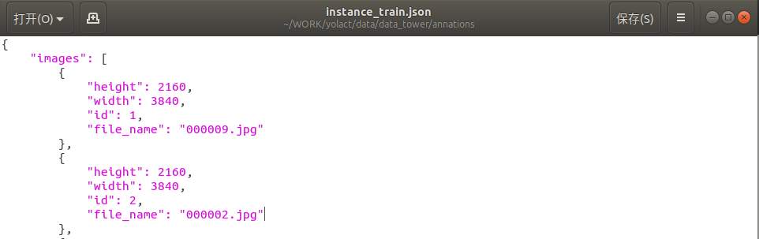

这部分的更多细节可见：[链接](https://github.com/wkentaro/labelme/tree/master/examples/instance_segmentation)


##### 2.3.6.3 配置configs数据集路径与训练参数

数据集制作好了之后，还不能直接进一步训练，这里还缺了关键的一步，就是在config配置文件中修改对应的参数与指定路径。


这里主要修改两部分：my_custom_dataset与yolact_im400_custom_cfg
具体如下：

###### 2.3.6.3.1 配置数据集

在DATASETS下面相应的加上下面的部分，用来设置自己的数据集。

```python
# TODO:setting my dataset
my_custom_dataset = dataset_base.copy({
    'name': 'my_custom_dataset',

    'train_images': '/home/hxzh02/WORK/yolact/data/data_tower/',
    'train_info': '/home/hxzh02/WORK/yolact/data/data_animal/annations/instance_train.json',

    'valid_images': '/home/hxzh02/WORK/yolact/data/data_animal/',
    'valid_info': '/home/hxzh02/WORK/yolact/data/data_animal/annations/instance_train.json',

    'has_gt': True,
    'class_names': ('elephant','bird','dog','cat','person')
})
```

说明：此处的`'name': 'my_custom_dataset'`是与后面的 `'dataset': my_custom_dataset`建立绑定关系的纽带，若设置出错则有可能读不到数据，或是出现其他类型报错等等异常。
另外需要说明的是，若需要检测的目标只有一类，也即为单分类时，需要将'class_names'的后面添加','作为区分，例如('dog')，否则程序会默认将'd', 'o', 'g'三个字母作为实例目标分类名称，从而得到的分类和分类数量都是错误的。若为多分类则可以不用加','，正常设置即可。


如下图:

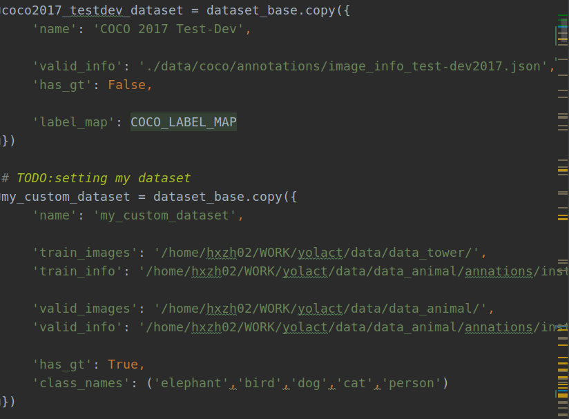


###### 2.3.6.3.2 配置训练设置cfg

在YOLACT v1.0 CONFIGS下对应的位置加上此段部分，用来建立配置文件与训练的关系。


```python
# TODO base_confid
yolact_im400_custom_cfg = yolact_base_config.copy({
    'name': 'yolact_im400',
    # Dataset stuff
    'dataset': my_custom_dataset, # 数据集定义
    'num_classes': len(my_custom_dataset.class_names) + 1, # 类别数
    'max_iter': 2000,               # 最大迭代次数
    'lr_steps': (500, 1000,1500),   # 学习率衰减区间
    'max_size': 416,
    'backbone': yolact_base_config.backbone.copy({
        'pred_scales': [[int(x[0] / yolact_base_config.max_size * 400)] for x in
                        yolact_base_config.backbone.pred_scales],
    }),
})
```

说明：此处的yolact_im400_custom_cfg即为config设置的可选项，定义后可直接在训练时进行调用。这里需要说明的是，程序中没有提供轮次的修改，可根据最大迭代次数进行计算。比如我的数据集只有2000张左右，批次给的是4，我设置了25000，大概迭代轮次为50轮，可以根据自己数据集数量依次类推设置，lr_steps是学习率衰减区间，也可以根据自己设置的最大迭代次数进行设置。至此，配置也修改完成了。


如下图：

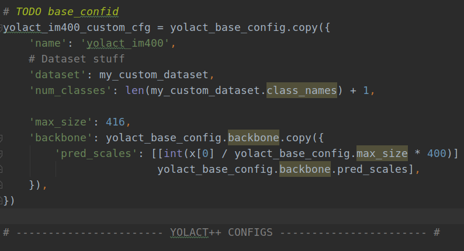

###### 2.3.6.3.3 开始训练

与config默认设置为yolact_base_config，训练时默认使用

```shell
python train.py --config=yolact_base_config
```

类似的，在训练自定义数据集时，只需要修改config的可选参数，再根据需要对其他参数进行相应的修改即可，如下所示：

```shell
python3 train.py --config=yolact_im400_custom_cfg 
```

```shell
python train.py --config=yolact_im400_custom_cfg --batch_size=5
```

成功开始训练会出现以下信息：
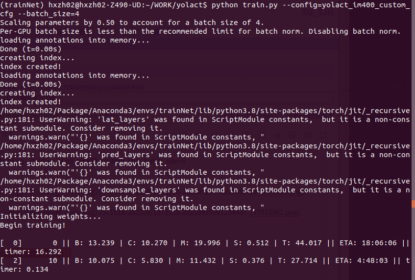
计算mAP
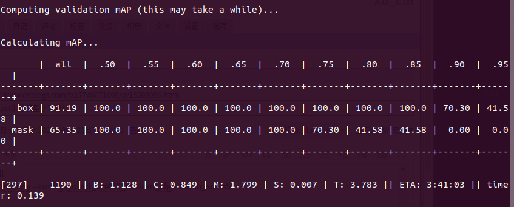

默认迭代10000次会保存一次模型，可以在传参时进行修改。如果训练中断可以使用–resume进行恢复训练：

```shell
python train.py --config=yolact_im400_custom_cfg --batch_size 4 --resume
```

训练过程完成后，或者提前打断时，相应地会在./weights目录下根据迭代次数等参数生成对应的权重文件，如下图:

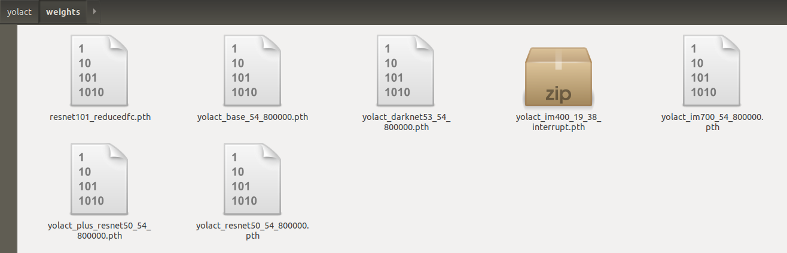

###### 2.3.6.3.4 评估训练模型

得到权重文件后，我们自然是希望评估模型在验证集上的性能及其他表现，那么类似上面的流程，我们可以通过以下命令来继续评估模型数值作为模型过程的参考。

```shell
python eval.py --trained_model=weights/yolact_im400_19_38_interrupt.pth
```


###### 2.3.6.3.5 测试训练模型

先来看默认设置是怎么测试单张图像：

```shell
python3 eval.py --trained_model=weights/yolact_im400_9999_50000.pth --score_threshold=0.3 --top_k=100 --image=/home/hxzh02/WORK/yolact/data/data_tower/000004.jpg
```

同理，我们也可以在自定义数据集训练后对其进行图像与视频测试，与默认设置的相比，区别只在于需要修改测试的图片路径以及权重的路径：
如下：

```shell
python3 eval.py --trained_model=weights/yolact_im400_7999_40000.pth --score_threshold=0.3 --top_k=100 --image=image/0000000000125.jpg
```