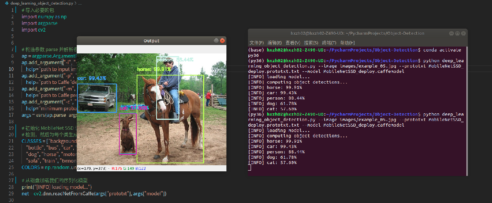
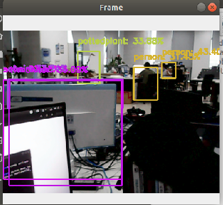

## 使用MobileNetSSD进行对象检测

### 1.单帧图片识别

- object_detection.py

```python
# 导入必要的包
import numpy as np
import argparse
import cv2

# 构造参数 parse 并解析参数
ap = argparse.ArgumentParser()
ap.add_argument("-i", "--image", required=True,
	help="path to input image")
ap.add_argument("-p", "--prototxt", required=True,
	help="path to Caffe 'deploy' prototxt file")
ap.add_argument("-m", "--model", required=True,
	help="path to Caffe pre-trained model")
ap.add_argument("-c", "--confidence", type=float, default=0.2,
	help="minimum probability to filter weak detections")
args = vars(ap.parse_args())

# 初始化 MobileNet SSD 训练的类标签列表
# 检测，然后为每个类生成一组边界框颜色
CLASSES = ["background", "aeroplane", "bicycle", "bird", "boat",
	"bottle", "bus", "car", "cat", "chair", "cow", "diningtable",
	"dog", "horse", "motorbike", "person", "pottedplant", "sheep",
	"sofa", "train", "tvmonitor"]
COLORS = np.random.uniform(0, 255, size=(len(CLASSES), 3))

# 从磁盘加载我们的序列化模型
print("[INFO] loading model...")
net = cv2.dnn.readNetFromCaffe(args["prototxt"], args["model"])

# 加载输入图像并为图像构造一个输入 blob
# 将大小调整为固定的 300x300 像素，然后对其进行标准化
#（注意：标准化是通过 MobileNet SSD 完成执行的
image = cv2.imread(args["image"])
(h, w) = image.shape[:2]
blob = cv2.dnn.blobFromImage(cv2.resize(image, (300, 300)), 0.007843, (300, 300), 127.5)

# 通过网络传递blob并获得检测
# 预测
print("[INFO] computing object detections...")
net.setInput(blob)
detections = net.forward()

# 循环检测
for i in np.arange(0, detections.shape[2]):
	# 提取与相关的置信度（即概率）
	confidence = detections[0, 0, i, 2]

	# 通过确保置信度大于最小置信度来过滤无效检测
	if confidence > args["confidence"]:
		# 从类标签detections中提取索引，
		# 然后计算物体边界框的 (x, y) 坐标
		idx = int(detections[0, 0, i, 1])
		box = detections[0, 0, i, 3:7] * np.array([w, h, w, h])
		(startX, startY, endX, endY) = box.astype("int")

		# 显示预测结果
		label = "{}: {:.2f}%".format(CLASSES[idx], confidence * 100)
		print("[INFO] {}".format(label))
		cv2.rectangle(image, (startX, startY), (endX, endY),
			COLORS[idx], 2)
		y = startY - 15 if startY - 15 > 15 else startY + 15
		cv2.putText(image, label, (startX, y),
			cv2.FONT_HERSHEY_SIMPLEX, 0.5, COLORS[idx], 2)

# 显示输出图像
cv2.imshow("Output", image)
cv2.waitKey(0)
```


- 调用方法:

```python
# 用法
python object_detection.py --image images/example_01.jpg --prototxt MobileNetSSD_deploy.prototxt.txt --model MobileNetSSD_deploy.caffemodel
```

- 测试效果




### 2.视频流实时检测对象

- real_time_object_detection.py

```python
# 导入必要的包
from imutils.video import VideoStream
from imutils.video import FPS
import numpy as np
import argparse
import imutils
import time
import cv2

# 构造参数 parse 并解析参数
ap = argparse.ArgumentParser()
ap.add_argument("-p", "--prototxt", required=True,
	help="path to Caffe 'deploy' prototxt file")
ap.add_argument("-m", "--model", required=True,
	help="path to Caffe pre-trained model")
ap.add_argument("-c", "--confidence", type=float, default=0.2,
	help="minimum probability to filter weak detections")
args = vars(ap.parse_args())

# 初始化 MobileNet SSD 训练的类标签列表
#  检测，然后为每个类生成一组边界框颜色
CLASSES = ["background", "aeroplane", "bicycle", "bird", "boat",
	"bottle", "bus", "car", "cat", "chair", "cow", "diningtable",
	"dog", "horse", "motorbike", "person", "pottedplant", "sheep",
	"sofa", "train", "tvmonitor"]
COLORS = np.random.uniform(0, 255, size=(len(CLASSES), 3))

#  从磁盘加载我们的序列化模型
print("[INFO] loading model...")
net = cv2.dnn.readNetFromCaffe(args["prototxt"], args["model"])

# 初始化视频流，允许摄像机传感器预加载，
# 并初始化 FPS 计数器
print("[INFO] starting video stream...")
vs = VideoStream(src=0).start()
time.sleep(2.0)
fps = FPS().start()

# 循环读取视频流中的帧
while True:
	# 从线程视频流中抓取帧并调整其大小
	# 最大宽度为 400 像素
	frame = vs.read()
	frame = imutils.resize(frame, width=400)

	# 获取帧尺寸并将其转换为 blob
	(h, w) = frame.shape[:2]
	blob = cv2.dnn.blobFromImage(cv2.resize(frame, (300, 300)),
		0.007843, (300, 300), 127.5)

	# 通过网络传递blob并获得检测
	# 预测
	net.setInput(blob)
	detections = net.forward()

	# 循环检测
	for i in np.arange(0, detections.shape[2]):
		# 提取与相关联的置信度（即概率）用来预测
		confidence = detections[0, 0, i, 2]

		# 通过确保置信度大于最小置信度来过滤无效检测
		if confidence > args["confidence"]:
			# 从类标签 detections中提取索引，然后计算物体的边界框 (x, y) 坐标
			idx = int(detections[0, 0, i, 1])
			box = detections[0, 0, i, 3:7] * np.array([w, h, w, h])
			(startX, startY, endX, endY) = box.astype("int")

			# 在当前帧上绘制预测
			label = "{}: {:.2f}%".format(CLASSES[idx],
				confidence * 100)
			cv2.rectangle(frame, (startX, startY), (endX, endY),
				COLORS[idx], 2)
			y = startY - 15 if startY - 15 > 15 else startY + 15
			cv2.putText(frame, label, (startX, y),
				cv2.FONT_HERSHEY_SIMPLEX, 0.5, COLORS[idx], 2)

	# 显示输出帧
	cv2.imshow("Frame", frame)
	key = cv2.waitKey(1) & 0xFF

	# 如果按下 `q` 键，则跳出循环
	if key == ord("q"):
		break

	# 更新 FPS 计数器
	fps.update()

# 停止定时器并显示 FPS 信息
fps.stop()
print("[INFO] elapsed time: {:.2f}".format(fps.elapsed()))
print("[INFO] approx. FPS: {:.2f}".format(fps.fps()))

# 做一些清理
cv2.destroyAllWindows()
vs.stop()
```

- 调用方法:

```python
# 用法
python real_time_object_detection.py --prototxt MobileNetSSD_deploy.prototxt.txt --model MobileNetSSD_deploy.caffemodel
```

- 测试效果：



### 3.配置文件

设置卷积层及其模型相关配置

- MobileNetSSD_deploy.prototxt.txt

```json
name: "MobileNet-SSD"
input: "data"
input_shape {
  dim: 1
  dim: 3
  dim: 300
  dim: 300
}
layer {
  name: "conv0"
  type: "Convolution"
  bottom: "data"
  top: "conv0"
  param {
    lr_mult: 1.0
    decay_mult: 1.0
  }
  param {
    lr_mult: 2.0
    decay_mult: 0.0
  }
  convolution_param {
    num_output: 32
    pad: 1
    kernel_size: 3
    stride: 2
    weight_filler {
      type: "msra"
    }
    bias_filler {
      type: "constant"
      value: 0.0
    }
  }
}
layer {
  name: "conv0/relu"
  type: "ReLU"
  bottom: "conv0"
  top: "conv0"
}
layer {
  name: "conv1/dw"
  type: "Convolution"
  bottom: "conv0"
  top: "conv1/dw"
  param {
    lr_mult: 1.0
    decay_mult: 1.0
  }
  param {
    lr_mult: 2.0
    decay_mult: 0.0
  }
  convolution_param {
    num_output: 32
    pad: 1
    kernel_size: 3
    group: 32
    engine: CAFFE
    weight_filler {
      type: "msra"
    }
    bias_filler {
      type: "constant"
      value: 0.0
    }
  }
}
layer {
  name: "conv1/dw/relu"
  type: "ReLU"
  bottom: "conv1/dw"
  top: "conv1/dw"
}
layer {
  name: "conv1"
  type: "Convolution"
  bottom: "conv1/dw"
  top: "conv1"
  param {
    lr_mult: 1.0
    decay_mult: 1.0
  }
  param {
    lr_mult: 2.0
    decay_mult: 0.0
  }
  convolution_param {
    num_output: 64
    kernel_size: 1
    weight_filler {
      type: "msra"
    }
    bias_filler {
      type: "constant"
      value: 0.0
    }
  }
}
layer {
  name: "conv1/relu"
  type: "ReLU"
  bottom: "conv1"
  top: "conv1"
}
layer {
  name: "conv2/dw"
  type: "Convolution"
  bottom: "conv1"
  top: "conv2/dw"
  param {
    lr_mult: 1.0
    decay_mult: 1.0
  }
  param {
    lr_mult: 2.0
    decay_mult: 0.0
  }
  convolution_param {
    num_output: 64
    pad: 1
    kernel_size: 3
    stride: 2
    group: 64
    engine: CAFFE
    weight_filler {
      type: "msra"
    }
    bias_filler {
      type: "constant"
      value: 0.0
    }
  }
}
layer {
  name: "conv2/dw/relu"
  type: "ReLU"
  bottom: "conv2/dw"
  top: "conv2/dw"
}
layer {
  name: "conv2"
  type: "Convolution"
  bottom: "conv2/dw"
  top: "conv2"
  param {
    lr_mult: 1.0
    decay_mult: 1.0
  }
  param {
    lr_mult: 2.0
    decay_mult: 0.0
  }
  convolution_param {
    num_output: 128
    kernel_size: 1
    weight_filler {
      type: "msra"
    }
    bias_filler {
      type: "constant"
      value: 0.0
    }
  }
}
layer {
  name: "conv2/relu"
  type: "ReLU"
  bottom: "conv2"
  top: "conv2"
}
layer {
  name: "conv3/dw"
  type: "Convolution"
  bottom: "conv2"
  top: "conv3/dw"
  param {
    lr_mult: 1.0
    decay_mult: 1.0
  }
  param {
    lr_mult: 2.0
    decay_mult: 0.0
  }
  convolution_param {
    num_output: 128
    pad: 1
    kernel_size: 3
    group: 128
    engine: CAFFE
    weight_filler {
      type: "msra"
    }
    bias_filler {
      type: "constant"
      value: 0.0
    }
  }
}
layer {
  name: "conv3/dw/relu"
  type: "ReLU"
  bottom: "conv3/dw"
  top: "conv3/dw"
}
layer {
  name: "conv3"
  type: "Convolution"
  bottom: "conv3/dw"
  top: "conv3"
  param {
    lr_mult: 1.0
    decay_mult: 1.0
  }
  param {
    lr_mult: 2.0
    decay_mult: 0.0
  }
  convolution_param {
    num_output: 128
    kernel_size: 1
    weight_filler {
      type: "msra"
    }
    bias_filler {
      type: "constant"
      value: 0.0
    }
  }
}
layer {
  name: "conv3/relu"
  type: "ReLU"
  bottom: "conv3"
  top: "conv3"
}
layer {
  name: "conv4/dw"
  type: "Convolution"
  bottom: "conv3"
  top: "conv4/dw"
  param {
    lr_mult: 1.0
    decay_mult: 1.0
  }
  param {
    lr_mult: 2.0
    decay_mult: 0.0
  }
  convolution_param {
    num_output: 128
    pad: 1
    kernel_size: 3
    stride: 2
    group: 128
    engine: CAFFE
    weight_filler {
      type: "msra"
    }
    bias_filler {
      type: "constant"
      value: 0.0
    }
  }
}
layer {
  name: "conv4/dw/relu"
  type: "ReLU"
  bottom: "conv4/dw"
  top: "conv4/dw"
}
layer {
  name: "conv4"
  type: "Convolution"
  bottom: "conv4/dw"
  top: "conv4"
  param {
    lr_mult: 1.0
    decay_mult: 1.0
  }
  param {
    lr_mult: 2.0
    decay_mult: 0.0
  }
  convolution_param {
    num_output: 256
    kernel_size: 1
    weight_filler {
      type: "msra"
    }
    bias_filler {
      type: "constant"
      value: 0.0
    }
  }
}
layer {
  name: "conv4/relu"
  type: "ReLU"
  bottom: "conv4"
  top: "conv4"
}
layer {
  name: "conv5/dw"
  type: "Convolution"
  bottom: "conv4"
  top: "conv5/dw"
  param {
    lr_mult: 1.0
    decay_mult: 1.0
  }
  param {
    lr_mult: 2.0
    decay_mult: 0.0
  }
  convolution_param {
    num_output: 256
    pad: 1
    kernel_size: 3
    group: 256
    engine: CAFFE
    weight_filler {
      type: "msra"
    }
    bias_filler {
      type: "constant"
      value: 0.0
    }
  }
}
layer {
  name: "conv5/dw/relu"
  type: "ReLU"
  bottom: "conv5/dw"
  top: "conv5/dw"
}
layer {
  name: "conv5"
  type: "Convolution"
  bottom: "conv5/dw"
  top: "conv5"
  param {
    lr_mult: 1.0
    decay_mult: 1.0
  }
  param {
    lr_mult: 2.0
    decay_mult: 0.0
  }
  convolution_param {
    num_output: 256
    kernel_size: 1
    weight_filler {
      type: "msra"
    }
    bias_filler {
      type: "constant"
      value: 0.0
    }
  }
}
layer {
  name: "conv5/relu"
  type: "ReLU"
  bottom: "conv5"
  top: "conv5"
}
layer {
  name: "conv6/dw"
  type: "Convolution"
  bottom: "conv5"
  top: "conv6/dw"
  param {
    lr_mult: 1.0
    decay_mult: 1.0
  }
  param {
    lr_mult: 2.0
    decay_mult: 0.0
  }
  convolution_param {
    num_output: 256
    pad: 1
    kernel_size: 3
    stride: 2
    group: 256
    engine: CAFFE
    weight_filler {
      type: "msra"
    }
    bias_filler {
      type: "constant"
      value: 0.0
    }
  }
}
layer {
  name: "conv6/dw/relu"
  type: "ReLU"
  bottom: "conv6/dw"
  top: "conv6/dw"
}
layer {
  name: "conv6"
  type: "Convolution"
  bottom: "conv6/dw"
  top: "conv6"
  param {
    lr_mult: 1.0
    decay_mult: 1.0
  }
  param {
    lr_mult: 2.0
    decay_mult: 0.0
  }
  convolution_param {
    num_output: 512
    kernel_size: 1
    weight_filler {
      type: "msra"
    }
    bias_filler {
      type: "constant"
      value: 0.0
    }
  }
}
layer {
  name: "conv6/relu"
  type: "ReLU"
  bottom: "conv6"
  top: "conv6"
}
layer {
  name: "conv7/dw"
  type: "Convolution"
  bottom: "conv6"
  top: "conv7/dw"
  param {
    lr_mult: 1.0
    decay_mult: 1.0
  }
  param {
    lr_mult: 2.0
    decay_mult: 0.0
  }
  convolution_param {
    num_output: 512
    pad: 1
    kernel_size: 3
    group: 512
    engine: CAFFE
    weight_filler {
      type: "msra"
    }
    bias_filler {
      type: "constant"
      value: 0.0
    }
  }
}
layer {
  name: "conv7/dw/relu"
  type: "ReLU"
  bottom: "conv7/dw"
  top: "conv7/dw"
}
layer {
  name: "conv7"
  type: "Convolution"
  bottom: "conv7/dw"
  top: "conv7"
  param {
    lr_mult: 1.0
    decay_mult: 1.0
  }
  param {
    lr_mult: 2.0
    decay_mult: 0.0
  }
  convolution_param {
    num_output: 512
    kernel_size: 1
    weight_filler {
      type: "msra"
    }
    bias_filler {
      type: "constant"
      value: 0.0
    }
  }
}
layer {
  name: "conv7/relu"
  type: "ReLU"
  bottom: "conv7"
  top: "conv7"
}
layer {
  name: "conv8/dw"
  type: "Convolution"
  bottom: "conv7"
  top: "conv8/dw"
  param {
    lr_mult: 1.0
    decay_mult: 1.0
  }
  param {
    lr_mult: 2.0
    decay_mult: 0.0
  }
  convolution_param {
    num_output: 512
    pad: 1
    kernel_size: 3
    group: 512
    engine: CAFFE
    weight_filler {
      type: "msra"
    }
    bias_filler {
      type: "constant"
      value: 0.0
    }
  }
}
layer {
  name: "conv8/dw/relu"
  type: "ReLU"
  bottom: "conv8/dw"
  top: "conv8/dw"
}
layer {
  name: "conv8"
  type: "Convolution"
  bottom: "conv8/dw"
  top: "conv8"
  param {
    lr_mult: 1.0
    decay_mult: 1.0
  }
  param {
    lr_mult: 2.0
    decay_mult: 0.0
  }
  convolution_param {
    num_output: 512
    kernel_size: 1
    weight_filler {
      type: "msra"
    }
    bias_filler {
      type: "constant"
      value: 0.0
    }
  }
}
layer {
  name: "conv8/relu"
  type: "ReLU"
  bottom: "conv8"
  top: "conv8"
}
layer {
  name: "conv9/dw"
  type: "Convolution"
  bottom: "conv8"
  top: "conv9/dw"
  param {
    lr_mult: 1.0
    decay_mult: 1.0
  }
  param {
    lr_mult: 2.0
    decay_mult: 0.0
  }
  convolution_param {
    num_output: 512
    pad: 1
    kernel_size: 3
    group: 512
    engine: CAFFE
    weight_filler {
      type: "msra"
    }
    bias_filler {
      type: "constant"
      value: 0.0
    }
  }
}
layer {
  name: "conv9/dw/relu"
  type: "ReLU"
  bottom: "conv9/dw"
  top: "conv9/dw"
}
layer {
  name: "conv9"
  type: "Convolution"
  bottom: "conv9/dw"
  top: "conv9"
  param {
    lr_mult: 1.0
    decay_mult: 1.0
  }
  param {
    lr_mult: 2.0
    decay_mult: 0.0
  }
  convolution_param {
    num_output: 512
    kernel_size: 1
    weight_filler {
      type: "msra"
    }
    bias_filler {
      type: "constant"
      value: 0.0
    }
  }
}
layer {
  name: "conv9/relu"
  type: "ReLU"
  bottom: "conv9"
  top: "conv9"
}
layer {
  name: "conv10/dw"
  type: "Convolution"
  bottom: "conv9"
  top: "conv10/dw"
  param {
    lr_mult: 1.0
    decay_mult: 1.0
  }
  param {
    lr_mult: 2.0
    decay_mult: 0.0
  }
  convolution_param {
    num_output: 512
    pad: 1
    kernel_size: 3
    group: 512
    engine: CAFFE
    weight_filler {
      type: "msra"
    }
    bias_filler {
      type: "constant"
      value: 0.0
    }
  }
}
layer {
  name: "conv10/dw/relu"
  type: "ReLU"
  bottom: "conv10/dw"
  top: "conv10/dw"
}
layer {
  name: "conv10"
  type: "Convolution"
  bottom: "conv10/dw"
  top: "conv10"
  param {
    lr_mult: 1.0
    decay_mult: 1.0
  }
  param {
    lr_mult: 2.0
    decay_mult: 0.0
  }
  convolution_param {
    num_output: 512
    kernel_size: 1
    weight_filler {
      type: "msra"
    }
    bias_filler {
      type: "constant"
      value: 0.0
    }
  }
}
layer {
  name: "conv10/relu"
  type: "ReLU"
  bottom: "conv10"
  top: "conv10"
}
layer {
  name: "conv11/dw"
  type: "Convolution"
  bottom: "conv10"
  top: "conv11/dw"
  param {
    lr_mult: 1.0
    decay_mult: 1.0
  }
  param {
    lr_mult: 2.0
    decay_mult: 0.0
  }
  convolution_param {
    num_output: 512
    pad: 1
    kernel_size: 3
    group: 512
    engine: CAFFE
    weight_filler {
      type: "msra"
    }
    bias_filler {
      type: "constant"
      value: 0.0
    }
  }
}
layer {
  name: "conv11/dw/relu"
  type: "ReLU"
  bottom: "conv11/dw"
  top: "conv11/dw"
}
layer {
  name: "conv11"
  type: "Convolution"
  bottom: "conv11/dw"
  top: "conv11"
  param {
    lr_mult: 1.0
    decay_mult: 1.0
  }
  param {
    lr_mult: 2.0
    decay_mult: 0.0
  }
  convolution_param {
    num_output: 512
    kernel_size: 1
    weight_filler {
      type: "msra"
    }
    bias_filler {
      type: "constant"
      value: 0.0
    }
  }
}
layer {
  name: "conv11/relu"
  type: "ReLU"
  bottom: "conv11"
  top: "conv11"
}
layer {
  name: "conv12/dw"
  type: "Convolution"
  bottom: "conv11"
  top: "conv12/dw"
  param {
    lr_mult: 1.0
    decay_mult: 1.0
  }
  param {
    lr_mult: 2.0
    decay_mult: 0.0
  }
  convolution_param {
    num_output: 512
    pad: 1
    kernel_size: 3
    stride: 2
    group: 512
    engine: CAFFE
    weight_filler {
      type: "msra"
    }
    bias_filler {
      type: "constant"
      value: 0.0
    }
  }
}
layer {
  name: "conv12/dw/relu"
  type: "ReLU"
  bottom: "conv12/dw"
  top: "conv12/dw"
}
layer {
  name: "conv12"
  type: "Convolution"
  bottom: "conv12/dw"
  top: "conv12"
  param {
    lr_mult: 1.0
    decay_mult: 1.0
  }
  param {
    lr_mult: 2.0
    decay_mult: 0.0
  }
  convolution_param {
    num_output: 1024
    kernel_size: 1
    weight_filler {
      type: "msra"
    }
    bias_filler {
      type: "constant"
      value: 0.0
    }
  }
}
layer {
  name: "conv12/relu"
  type: "ReLU"
  bottom: "conv12"
  top: "conv12"
}
layer {
  name: "conv13/dw"
  type: "Convolution"
  bottom: "conv12"
  top: "conv13/dw"
  param {
    lr_mult: 1.0
    decay_mult: 1.0
  }
  param {
    lr_mult: 2.0
    decay_mult: 0.0
  }
  convolution_param {
    num_output: 1024
    pad: 1
    kernel_size: 3
    group: 1024
    engine: CAFFE
    weight_filler {
      type: "msra"
    }
    bias_filler {
      type: "constant"
      value: 0.0
    }
  }
}
layer {
  name: "conv13/dw/relu"
  type: "ReLU"
  bottom: "conv13/dw"
  top: "conv13/dw"
}
layer {
  name: "conv13"
  type: "Convolution"
  bottom: "conv13/dw"
  top: "conv13"
  param {
    lr_mult: 1.0
    decay_mult: 1.0
  }
  param {
    lr_mult: 2.0
    decay_mult: 0.0
  }
  convolution_param {
    num_output: 1024
    kernel_size: 1
    weight_filler {
      type: "msra"
    }
    bias_filler {
      type: "constant"
      value: 0.0
    }
  }
}
layer {
  name: "conv13/relu"
  type: "ReLU"
  bottom: "conv13"
  top: "conv13"
}
layer {
  name: "conv14_1"
  type: "Convolution"
  bottom: "conv13"
  top: "conv14_1"
  param {
    lr_mult: 1.0
    decay_mult: 1.0
  }
  param {
    lr_mult: 2.0
    decay_mult: 0.0
  }
  convolution_param {
    num_output: 256
    kernel_size: 1
    weight_filler {
      type: "msra"
    }
    bias_filler {
      type: "constant"
      value: 0.0
    }
  }
}
layer {
  name: "conv14_1/relu"
  type: "ReLU"
  bottom: "conv14_1"
  top: "conv14_1"
}
layer {
  name: "conv14_2"
  type: "Convolution"
  bottom: "conv14_1"
  top: "conv14_2"
  param {
    lr_mult: 1.0
    decay_mult: 1.0
  }
  param {
    lr_mult: 2.0
    decay_mult: 0.0
  }
  convolution_param {
    num_output: 512
    pad: 1
    kernel_size: 3
    stride: 2
    weight_filler {
      type: "msra"
    }
    bias_filler {
      type: "constant"
      value: 0.0
    }
  }
}
layer {
  name: "conv14_2/relu"
  type: "ReLU"
  bottom: "conv14_2"
  top: "conv14_2"
}
layer {
  name: "conv15_1"
  type: "Convolution"
  bottom: "conv14_2"
  top: "conv15_1"
  param {
    lr_mult: 1.0
    decay_mult: 1.0
  }
  param {
    lr_mult: 2.0
    decay_mult: 0.0
  }
  convolution_param {
    num_output: 128
    kernel_size: 1
    weight_filler {
      type: "msra"
    }
    bias_filler {
      type: "constant"
      value: 0.0
    }
  }
}
layer {
  name: "conv15_1/relu"
  type: "ReLU"
  bottom: "conv15_1"
  top: "conv15_1"
}
layer {
  name: "conv15_2"
  type: "Convolution"
  bottom: "conv15_1"
  top: "conv15_2"
  param {
    lr_mult: 1.0
    decay_mult: 1.0
  }
  param {
    lr_mult: 2.0
    decay_mult: 0.0
  }
  convolution_param {
    num_output: 256
    pad: 1
    kernel_size: 3
    stride: 2
    weight_filler {
      type: "msra"
    }
    bias_filler {
      type: "constant"
      value: 0.0
    }
  }
}
layer {
  name: "conv15_2/relu"
  type: "ReLU"
  bottom: "conv15_2"
  top: "conv15_2"
}
layer {
  name: "conv16_1"
  type: "Convolution"
  bottom: "conv15_2"
  top: "conv16_1"
  param {
    lr_mult: 1.0
    decay_mult: 1.0
  }
  param {
    lr_mult: 2.0
    decay_mult: 0.0
  }
  convolution_param {
    num_output: 128
    kernel_size: 1
    weight_filler {
      type: "msra"
    }
    bias_filler {
      type: "constant"
      value: 0.0
    }
  }
}
layer {
  name: "conv16_1/relu"
  type: "ReLU"
  bottom: "conv16_1"
  top: "conv16_1"
}
layer {
  name: "conv16_2"
  type: "Convolution"
  bottom: "conv16_1"
  top: "conv16_2"
  param {
    lr_mult: 1.0
    decay_mult: 1.0
  }
  param {
    lr_mult: 2.0
    decay_mult: 0.0
  }
  convolution_param {
    num_output: 256
    pad: 1
    kernel_size: 3
    stride: 2
    weight_filler {
      type: "msra"
    }
    bias_filler {
      type: "constant"
      value: 0.0
    }
  }
}
layer {
  name: "conv16_2/relu"
  type: "ReLU"
  bottom: "conv16_2"
  top: "conv16_2"
}
layer {
  name: "conv17_1"
  type: "Convolution"
  bottom: "conv16_2"
  top: "conv17_1"
  param {
    lr_mult: 1.0
    decay_mult: 1.0
  }
  param {
    lr_mult: 2.0
    decay_mult: 0.0
  }
  convolution_param {
    num_output: 64
    kernel_size: 1
    weight_filler {
      type: "msra"
    }
    bias_filler {
      type: "constant"
      value: 0.0
    }
  }
}
layer {
  name: "conv17_1/relu"
  type: "ReLU"
  bottom: "conv17_1"
  top: "conv17_1"
}
layer {
  name: "conv17_2"
  type: "Convolution"
  bottom: "conv17_1"
  top: "conv17_2"
  param {
    lr_mult: 1.0
    decay_mult: 1.0
  }
  param {
    lr_mult: 2.0
    decay_mult: 0.0
  }
  convolution_param {
    num_output: 128
    pad: 1
    kernel_size: 3
    stride: 2
    weight_filler {
      type: "msra"
    }
    bias_filler {
      type: "constant"
      value: 0.0
    }
  }
}
layer {
  name: "conv17_2/relu"
  type: "ReLU"
  bottom: "conv17_2"
  top: "conv17_2"
}
layer {
  name: "conv11_mbox_loc"
  type: "Convolution"
  bottom: "conv11"
  top: "conv11_mbox_loc"
  param {
    lr_mult: 1.0
    decay_mult: 1.0
  }
  param {
    lr_mult: 2.0
    decay_mult: 0.0
  }
  convolution_param {
    num_output: 12
    kernel_size: 1
    weight_filler {
      type: "msra"
    }
    bias_filler {
      type: "constant"
      value: 0.0
    }
  }
}
layer {
  name: "conv11_mbox_loc_perm"
  type: "Permute"
  bottom: "conv11_mbox_loc"
  top: "conv11_mbox_loc_perm"
  permute_param {
    order: 0
    order: 2
    order: 3
    order: 1
  }
}
layer {
  name: "conv11_mbox_loc_flat"
  type: "Flatten"
  bottom: "conv11_mbox_loc_perm"
  top: "conv11_mbox_loc_flat"
  flatten_param {
    axis: 1
  }
}
layer {
  name: "conv11_mbox_conf"
  type: "Convolution"
  bottom: "conv11"
  top: "conv11_mbox_conf"
  param {
    lr_mult: 1.0
    decay_mult: 1.0
  }
  param {
    lr_mult: 2.0
    decay_mult: 0.0
  }
  convolution_param {
    num_output: 63
    kernel_size: 1
    weight_filler {
      type: "msra"
    }
    bias_filler {
      type: "constant"
      value: 0.0
    }
  }
}
layer {
  name: "conv11_mbox_conf_perm"
  type: "Permute"
  bottom: "conv11_mbox_conf"
  top: "conv11_mbox_conf_perm"
  permute_param {
    order: 0
    order: 2
    order: 3
    order: 1
  }
}
layer {
  name: "conv11_mbox_conf_flat"
  type: "Flatten"
  bottom: "conv11_mbox_conf_perm"
  top: "conv11_mbox_conf_flat"
  flatten_param {
    axis: 1
  }
}
layer {
  name: "conv11_mbox_priorbox"
  type: "PriorBox"
  bottom: "conv11"
  bottom: "data"
  top: "conv11_mbox_priorbox"
  prior_box_param {
    min_size: 60.0
    aspect_ratio: 2.0
    flip: true
    clip: false
    variance: 0.1
    variance: 0.1
    variance: 0.2
    variance: 0.2
    offset: 0.5
  }
}
layer {
  name: "conv13_mbox_loc"
  type: "Convolution"
  bottom: "conv13"
  top: "conv13_mbox_loc"
  param {
    lr_mult: 1.0
    decay_mult: 1.0
  }
  param {
    lr_mult: 2.0
    decay_mult: 0.0
  }
  convolution_param {
    num_output: 24
    kernel_size: 1
    weight_filler {
      type: "msra"
    }
    bias_filler {
      type: "constant"
      value: 0.0
    }
  }
}
layer {
  name: "conv13_mbox_loc_perm"
  type: "Permute"
  bottom: "conv13_mbox_loc"
  top: "conv13_mbox_loc_perm"
  permute_param {
    order: 0
    order: 2
    order: 3
    order: 1
  }
}
layer {
  name: "conv13_mbox_loc_flat"
  type: "Flatten"
  bottom: "conv13_mbox_loc_perm"
  top: "conv13_mbox_loc_flat"
  flatten_param {
    axis: 1
  }
}
layer {
  name: "conv13_mbox_conf"
  type: "Convolution"
  bottom: "conv13"
  top: "conv13_mbox_conf"
  param {
    lr_mult: 1.0
    decay_mult: 1.0
  }
  param {
    lr_mult: 2.0
    decay_mult: 0.0
  }
  convolution_param {
    num_output: 126
    kernel_size: 1
    weight_filler {
      type: "msra"
    }
    bias_filler {
      type: "constant"
      value: 0.0
    }
  }
}
layer {
  name: "conv13_mbox_conf_perm"
  type: "Permute"
  bottom: "conv13_mbox_conf"
  top: "conv13_mbox_conf_perm"
  permute_param {
    order: 0
    order: 2
    order: 3
    order: 1
  }
}
layer {
  name: "conv13_mbox_conf_flat"
  type: "Flatten"
  bottom: "conv13_mbox_conf_perm"
  top: "conv13_mbox_conf_flat"
  flatten_param {
    axis: 1
  }
}
layer {
  name: "conv13_mbox_priorbox"
  type: "PriorBox"
  bottom: "conv13"
  bottom: "data"
  top: "conv13_mbox_priorbox"
  prior_box_param {
    min_size: 105.0
    max_size: 150.0
    aspect_ratio: 2.0
    aspect_ratio: 3.0
    flip: true
    clip: false
    variance: 0.1
    variance: 0.1
    variance: 0.2
    variance: 0.2
    offset: 0.5
  }
}
layer {
  name: "conv14_2_mbox_loc"
  type: "Convolution"
  bottom: "conv14_2"
  top: "conv14_2_mbox_loc"
  param {
    lr_mult: 1.0
    decay_mult: 1.0
  }
  param {
    lr_mult: 2.0
    decay_mult: 0.0
  }
  convolution_param {
    num_output: 24
    kernel_size: 1
    weight_filler {
      type: "msra"
    }
    bias_filler {
      type: "constant"
      value: 0.0
    }
  }
}
layer {
  name: "conv14_2_mbox_loc_perm"
  type: "Permute"
  bottom: "conv14_2_mbox_loc"
  top: "conv14_2_mbox_loc_perm"
  permute_param {
    order: 0
    order: 2
    order: 3
    order: 1
  }
}
layer {
  name: "conv14_2_mbox_loc_flat"
  type: "Flatten"
  bottom: "conv14_2_mbox_loc_perm"
  top: "conv14_2_mbox_loc_flat"
  flatten_param {
    axis: 1
  }
}
layer {
  name: "conv14_2_mbox_conf"
  type: "Convolution"
  bottom: "conv14_2"
  top: "conv14_2_mbox_conf"
  param {
    lr_mult: 1.0
    decay_mult: 1.0
  }
  param {
    lr_mult: 2.0
    decay_mult: 0.0
  }
  convolution_param {
    num_output: 126
    kernel_size: 1
    weight_filler {
      type: "msra"
    }
    bias_filler {
      type: "constant"
      value: 0.0
    }
  }
}
layer {
  name: "conv14_2_mbox_conf_perm"
  type: "Permute"
  bottom: "conv14_2_mbox_conf"
  top: "conv14_2_mbox_conf_perm"
  permute_param {
    order: 0
    order: 2
    order: 3
    order: 1
  }
}
layer {
  name: "conv14_2_mbox_conf_flat"
  type: "Flatten"
  bottom: "conv14_2_mbox_conf_perm"
  top: "conv14_2_mbox_conf_flat"
  flatten_param {
    axis: 1
  }
}
layer {
  name: "conv14_2_mbox_priorbox"
  type: "PriorBox"
  bottom: "conv14_2"
  bottom: "data"
  top: "conv14_2_mbox_priorbox"
  prior_box_param {
    min_size: 150.0
    max_size: 195.0
    aspect_ratio: 2.0
    aspect_ratio: 3.0
    flip: true
    clip: false
    variance: 0.1
    variance: 0.1
    variance: 0.2
    variance: 0.2
    offset: 0.5
  }
}
layer {
  name: "conv15_2_mbox_loc"
  type: "Convolution"
  bottom: "conv15_2"
  top: "conv15_2_mbox_loc"
  param {
    lr_mult: 1.0
    decay_mult: 1.0
  }
  param {
    lr_mult: 2.0
    decay_mult: 0.0
  }
  convolution_param {
    num_output: 24
    kernel_size: 1
    weight_filler {
      type: "msra"
    }
    bias_filler {
      type: "constant"
      value: 0.0
    }
  }
}
layer {
  name: "conv15_2_mbox_loc_perm"
  type: "Permute"
  bottom: "conv15_2_mbox_loc"
  top: "conv15_2_mbox_loc_perm"
  permute_param {
    order: 0
    order: 2
    order: 3
    order: 1
  }
}
layer {
  name: "conv15_2_mbox_loc_flat"
  type: "Flatten"
  bottom: "conv15_2_mbox_loc_perm"
  top: "conv15_2_mbox_loc_flat"
  flatten_param {
    axis: 1
  }
}
layer {
  name: "conv15_2_mbox_conf"
  type: "Convolution"
  bottom: "conv15_2"
  top: "conv15_2_mbox_conf"
  param {
    lr_mult: 1.0
    decay_mult: 1.0
  }
  param {
    lr_mult: 2.0
    decay_mult: 0.0
  }
  convolution_param {
    num_output: 126
    kernel_size: 1
    weight_filler {
      type: "msra"
    }
    bias_filler {
      type: "constant"
      value: 0.0
    }
  }
}
layer {
  name: "conv15_2_mbox_conf_perm"
  type: "Permute"
  bottom: "conv15_2_mbox_conf"
  top: "conv15_2_mbox_conf_perm"
  permute_param {
    order: 0
    order: 2
    order: 3
    order: 1
  }
}
layer {
  name: "conv15_2_mbox_conf_flat"
  type: "Flatten"
  bottom: "conv15_2_mbox_conf_perm"
  top: "conv15_2_mbox_conf_flat"
  flatten_param {
    axis: 1
  }
}
layer {
  name: "conv15_2_mbox_priorbox"
  type: "PriorBox"
  bottom: "conv15_2"
  bottom: "data"
  top: "conv15_2_mbox_priorbox"
  prior_box_param {
    min_size: 195.0
    max_size: 240.0
    aspect_ratio: 2.0
    aspect_ratio: 3.0
    flip: true
    clip: false
    variance: 0.1
    variance: 0.1
    variance: 0.2
    variance: 0.2
    offset: 0.5
  }
}
layer {
  name: "conv16_2_mbox_loc"
  type: "Convolution"
  bottom: "conv16_2"
  top: "conv16_2_mbox_loc"
  param {
    lr_mult: 1.0
    decay_mult: 1.0
  }
  param {
    lr_mult: 2.0
    decay_mult: 0.0
  }
  convolution_param {
    num_output: 24
    kernel_size: 1
    weight_filler {
      type: "msra"
    }
    bias_filler {
      type: "constant"
      value: 0.0
    }
  }
}
layer {
  name: "conv16_2_mbox_loc_perm"
  type: "Permute"
  bottom: "conv16_2_mbox_loc"
  top: "conv16_2_mbox_loc_perm"
  permute_param {
    order: 0
    order: 2
    order: 3
    order: 1
  }
}
layer {
  name: "conv16_2_mbox_loc_flat"
  type: "Flatten"
  bottom: "conv16_2_mbox_loc_perm"
  top: "conv16_2_mbox_loc_flat"
  flatten_param {
    axis: 1
  }
}
layer {
  name: "conv16_2_mbox_conf"
  type: "Convolution"
  bottom: "conv16_2"
  top: "conv16_2_mbox_conf"
  param {
    lr_mult: 1.0
    decay_mult: 1.0
  }
  param {
    lr_mult: 2.0
    decay_mult: 0.0
  }
  convolution_param {
    num_output: 126
    kernel_size: 1
    weight_filler {
      type: "msra"
    }
    bias_filler {
      type: "constant"
      value: 0.0
    }
  }
}
layer {
  name: "conv16_2_mbox_conf_perm"
  type: "Permute"
  bottom: "conv16_2_mbox_conf"
  top: "conv16_2_mbox_conf_perm"
  permute_param {
    order: 0
    order: 2
    order: 3
    order: 1
  }
}
layer {
  name: "conv16_2_mbox_conf_flat"
  type: "Flatten"
  bottom: "conv16_2_mbox_conf_perm"
  top: "conv16_2_mbox_conf_flat"
  flatten_param {
    axis: 1
  }
}
layer {
  name: "conv16_2_mbox_priorbox"
  type: "PriorBox"
  bottom: "conv16_2"
  bottom: "data"
  top: "conv16_2_mbox_priorbox"
  prior_box_param {
    min_size: 240.0
    max_size: 285.0
    aspect_ratio: 2.0
    aspect_ratio: 3.0
    flip: true
    clip: false
    variance: 0.1
    variance: 0.1
    variance: 0.2
    variance: 0.2
    offset: 0.5
  }
}
layer {
  name: "conv17_2_mbox_loc"
  type: "Convolution"
  bottom: "conv17_2"
  top: "conv17_2_mbox_loc"
  param {
    lr_mult: 1.0
    decay_mult: 1.0
  }
  param {
    lr_mult: 2.0
    decay_mult: 0.0
  }
  convolution_param {
    num_output: 24
    kernel_size: 1
    weight_filler {
      type: "msra"
    }
    bias_filler {
      type: "constant"
      value: 0.0
    }
  }
}
layer {
  name: "conv17_2_mbox_loc_perm"
  type: "Permute"
  bottom: "conv17_2_mbox_loc"
  top: "conv17_2_mbox_loc_perm"
  permute_param {
    order: 0
    order: 2
    order: 3
    order: 1
  }
}
layer {
  name: "conv17_2_mbox_loc_flat"
  type: "Flatten"
  bottom: "conv17_2_mbox_loc_perm"
  top: "conv17_2_mbox_loc_flat"
  flatten_param {
    axis: 1
  }
}
layer {
  name: "conv17_2_mbox_conf"
  type: "Convolution"
  bottom: "conv17_2"
  top: "conv17_2_mbox_conf"
  param {
    lr_mult: 1.0
    decay_mult: 1.0
  }
  param {
    lr_mult: 2.0
    decay_mult: 0.0
  }
  convolution_param {
    num_output: 126
    kernel_size: 1
    weight_filler {
      type: "msra"
    }
    bias_filler {
      type: "constant"
      value: 0.0
    }
  }
}
layer {
  name: "conv17_2_mbox_conf_perm"
  type: "Permute"
  bottom: "conv17_2_mbox_conf"
  top: "conv17_2_mbox_conf_perm"
  permute_param {
    order: 0
    order: 2
    order: 3
    order: 1
  }
}
layer {
  name: "conv17_2_mbox_conf_flat"
  type: "Flatten"
  bottom: "conv17_2_mbox_conf_perm"
  top: "conv17_2_mbox_conf_flat"
  flatten_param {
    axis: 1
  }
}
layer {
  name: "conv17_2_mbox_priorbox"
  type: "PriorBox"
  bottom: "conv17_2"
  bottom: "data"
  top: "conv17_2_mbox_priorbox"
  prior_box_param {
    min_size: 285.0
    max_size: 300.0
    aspect_ratio: 2.0
    aspect_ratio: 3.0
    flip: true
    clip: false
    variance: 0.1
    variance: 0.1
    variance: 0.2
    variance: 0.2
    offset: 0.5
  }
}
layer {
  name: "mbox_loc"
  type: "Concat"
  bottom: "conv11_mbox_loc_flat"
  bottom: "conv13_mbox_loc_flat"
  bottom: "conv14_2_mbox_loc_flat"
  bottom: "conv15_2_mbox_loc_flat"
  bottom: "conv16_2_mbox_loc_flat"
  bottom: "conv17_2_mbox_loc_flat"
  top: "mbox_loc"
  concat_param {
    axis: 1
  }
}
layer {
  name: "mbox_conf"
  type: "Concat"
  bottom: "conv11_mbox_conf_flat"
  bottom: "conv13_mbox_conf_flat"
  bottom: "conv14_2_mbox_conf_flat"
  bottom: "conv15_2_mbox_conf_flat"
  bottom: "conv16_2_mbox_conf_flat"
  bottom: "conv17_2_mbox_conf_flat"
  top: "mbox_conf"
  concat_param {
    axis: 1
  }
}
layer {
  name: "mbox_priorbox"
  type: "Concat"
  bottom: "conv11_mbox_priorbox"
  bottom: "conv13_mbox_priorbox"
  bottom: "conv14_2_mbox_priorbox"
  bottom: "conv15_2_mbox_priorbox"
  bottom: "conv16_2_mbox_priorbox"
  bottom: "conv17_2_mbox_priorbox"
  top: "mbox_priorbox"
  concat_param {
    axis: 2
  }
}
layer {
  name: "mbox_conf_reshape"
  type: "Reshape"
  bottom: "mbox_conf"
  top: "mbox_conf_reshape"
  reshape_param {
    shape {
      dim: 0
      dim: -1
      dim: 21
    }
  }
}
layer {
  name: "mbox_conf_softmax"
  type: "Softmax"
  bottom: "mbox_conf_reshape"
  top: "mbox_conf_softmax"
  softmax_param {
    axis: 2
  }
}
layer {
  name: "mbox_conf_flatten"
  type: "Flatten"
  bottom: "mbox_conf_softmax"
  top: "mbox_conf_flatten"
  flatten_param {
    axis: 1
  }
}
layer {
  name: "detection_out"
  type: "DetectionOutput"
  bottom: "mbox_loc"
  bottom: "mbox_conf_flatten"
  bottom: "mbox_priorbox"
  top: "detection_out"
  include {
    phase: TEST
  }
  detection_output_param {
    num_classes: 21
    share_location: true
    background_label_id: 0
    nms_param {
      nms_threshold: 0.45
      top_k: 100
    }
    code_type: CENTER_SIZE
    keep_top_k: 100
    confidence_threshold: 0.25
  }
}
```


### 4.模型下载

MobileNetSSD_deploy.caffemodel: https://share.weiyun.com/Wi04sqO7