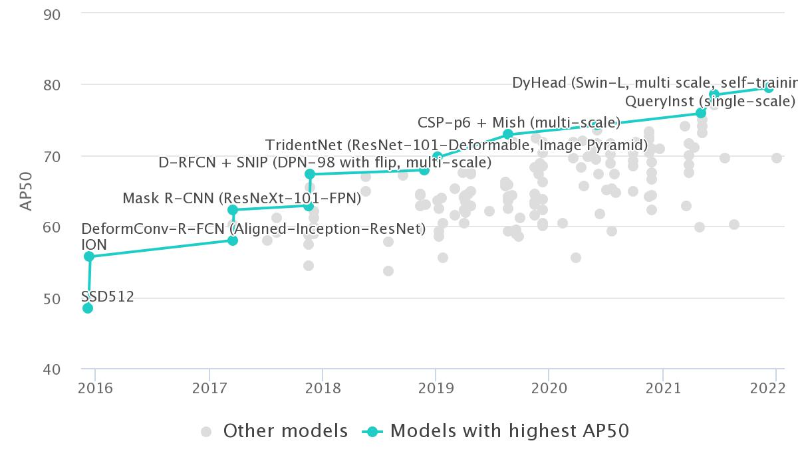
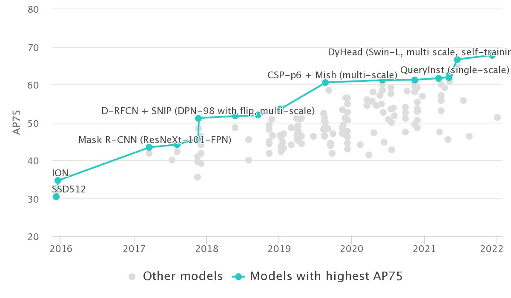
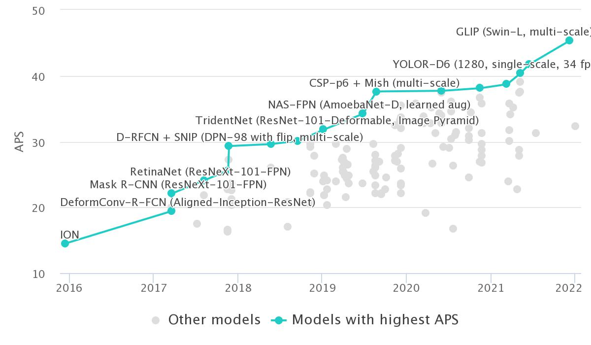

# 基于COCO数据集验证的目标检测算法天梯排行榜

---

## AP50

| Rank | Model                                                        | **box AP** | AP50 | Paper                                                        | Code                                                         | Result | Year | Tags                                                         |
| :--: | ------------------------------------------------------------ | ---------- | ---- | ------------------------------------------------------------ | ------------------------------------------------------------ | ------ | ---- | ------------------------------------------------------------ |
|  1   | [SwinV2-G (HTC++)](https://paperswithcode.com/paper/swin-transformer-v2-scaling-up-capacity-and) | 63.1       |      | [Swin Transformer V2: Scaling Up Capacity and Resolution](https://paperswithcode.com/paper/swin-transformer-v2-scaling-up-capacity-and) | [Link](https://paperswithcode.com/paper/swin-transformer-v2-scaling-up-capacity-and#code) |        | 2021 | **Swin-Transformer**                                         |
|  2   | [Florence-CoSwin-H](https://paperswithcode.com/paper/florence-a-new-foundation-model-for-computer) | 62.4       |      | [Florence: A New Foundation Model for Computer Vision](https://paperswithcode.com/paper/florence-a-new-foundation-model-for-computer) |                                                              |        | 2021 | **Swin-Transformer**                                         |
|  3   | [GLIP (Swin-L, multi-scale)](https://paperswithcode.com/paper/grounded-language-image-pre-training) | 61.5       | 79.5 | [Grounded Language-Image Pre-training](https://paperswithcode.com/paper/grounded-language-image-pre-training) |                                                              |        | 2021 | **multiscale**; Vision Language**; **Dynamic Head**; **BERT-Base |
|  4   | [Soft Teacher + Swin-L (HTC++, multi-scale)](https://paperswithcode.com/paper/end-to-end-semi-supervised-object-detection) | 61.3       |      | [End-to-End Semi-Supervised Object Detection with Soft Teacher](https://paperswithcode.com/paper/end-to-end-semi-supervised-object-detection) |                                                              |        | 2021 | **multiscale**; Swin-Transformer                        |
|  5   | [DyHead (Swin-L, multi scale, self-training)](https://paperswithcode.com/paper/dynamic-head-unifying-object-detection-heads) | 60.6       | 78.5 | [Dynamic Head: Unifying Object Detection Heads with Attentions](https://paperswithcode.com/paper/dynamic-head-unifying-object-detection-heads) |                                                              |        | 2021 | **multiscale**; Swin-Transformer                        |
|  6   | [Dual-Swin-L (HTC, multi-scale)](https://paperswithcode.com/paper/cbnetv2-a-composite-backbone-network) | 60.1       |      | [CBNetV2: A Composite Backbone Network Architecture for Object Detection](https://paperswithcode.com/paper/cbnetv2-a-composite-backbone-network) |                                                              |        | 2021 | **multiscale** Swin-Transformer                         |
|  7   | [Dual-Swin-L (HTC, single-scale)](https://paperswithcode.com/paper/cbnetv2-a-composite-backbone-network) | 59.4       |      | [CBNetV2: A Composite Backbone Network Architecture for Object Detection](https://paperswithcode.com/paper/cbnetv2-a-composite-backbone-network) |                                                              |        | 2021 | **Swin-Transformer**                                         |
|  8   | [Focal-L (DyHead, multi-scale)](https://paperswithcode.com/paper/focal-self-attention-for-local-global) | 58.9       |      | [Focal Self-attention for Local-Global Interactions in Vision Transformers](https://paperswithcode.com/paper/focal-self-attention-for-local-global) |                                                              |        | 2021 | **multiscale** Focal-Transformer                        |
|  9   | [DyHead (Swin-L, multi scale)](https://paperswithcode.com/paper/dynamic-head-unifying-object-detection-heads) | 58.7       | 77.1 | [Dynamic Head: Unifying Object Detection Heads with Attentions](https://paperswithcode.com/paper/dynamic-head-unifying-object-detection-heads) |                                                              |        | 2021 | **multiscale** Swin-Transformer                         |
|  10  | [Swin-L (HTC++, multi scale)](https://paperswithcode.com/paper/swin-transformer-hierarchical-vision) | 58.7       |      | [Swin Transformer: Hierarchical Vision Transformer using Shifted Windows](https://paperswithcode.com/paper/swin-transformer-hierarchical-vision) |                                                              |        | 2021 | **multiscale** **Swin-Transformer**                     |
|  11  | [Focal-L (HTC++, multi-scale)](https://paperswithcode.com/paper/focal-self-attention-for-local-global) | 58.4       |      | [Focal Self-attention for Local-Global Interactions in Vision Transformers](https://paperswithcode.com/paper/focal-self-attention-for-local-global) |                                                              |        | 2021 | **multiscale**                                               |
|  12  | [Swin-L (HTC++, single scale)](https://paperswithcode.com/paper/swin-transformer-hierarchical-vision) | 57.7       |      | [Swin Transformer: Hierarchical Vision Transformer using Shifted Windows](https://paperswithcode.com/paper/swin-transformer-hierarchical-vision) |                                                              |        | 2021 | **single scale** **Swin-Transformer**                   |
|  13  | [YOLOR-D6 (1280, single-scale, 34 fps)](https://paperswithcode.com/paper/you-only-learn-one-representation-unified) | 57.3       | 75.0 | [You Only Learn One Representation: Unified Network for Multiple Tasks](https://paperswithcode.com/paper/you-only-learn-one-representation-unified) |                                                              |        | 2021 | **single scale** YOLO                                   |
|  14  | [SOLQ (Swin-L, single)](https://paperswithcode.com/paper/solq-segmenting-objects-by-learning-queries) | 56.5       |      | [SOLQ: Segmenting Objects by Learning Queries](https://paperswithcode.com/paper/solq-segmenting-objects-by-learning-queries) |                                                              |        | 2021 | **Transformer** **single scale**                        |
|  15  | [YOLOR-E6 (1280, single-scale, 45 fps)](https://paperswithcode.com/paper/you-only-learn-one-representation-unified) | 56.4       | 74.1 | [You Only Learn One Representation: Unified Network for Multiple Tasks](https://paperswithcode.com/paper/you-only-learn-one-representation-unified) |                                                              |        | 2021 | **single scale** **YOLO**                               |
|  16  | [CenterNet2 (Res2Net-101-DCN-BiFPN, self-training, 1560 single-scale)](https://paperswithcode.com/paper/probabilistic-two-stage-detection) | 56.4       | 74.0 | [Probabilistic two-stage detection](https://paperswithcode.com/paper/probabilistic-two-stage-detection) |                                                              |        | 2021 | **single scale** **FPN** **DCN**                   |
|  17  | [QueryInst (single-scale)](https://paperswithcode.com/paper/queryinst-parallelly-supervised-mask-query) | 56.1       | 75.9 | [Instances as Queries](https://paperswithcode.com/paper/queryinst-parallelly-supervised-mask-query) |                                                              |        | 2021 |                                                              |
|  18  | [YOLOv4-P7 with TTA](https://paperswithcode.com/paper/scaled-yolov4-scaling-cross-stage-partial) | 55.8       | 73.2 | [Scaled-YOLOv4: Scaling Cross Stage Partial Network](https://paperswithcode.com/paper/scaled-yolov4-scaling-cross-stage-partial) |                                                              |        | 2020 | **multiscale** **YOLO**                                 |
|  19  | [DetectoRS (ResNeXt-101-64x4d, multi-scale)](https://paperswithcode.com/paper/detectors-detecting-objects-with-recursive-1) | 55.7       | 74.2 | [DetectoRS: Detecting Objects with Recursive Feature Pyramid and Switchable Atrous Convolution](https://paperswithcode.com/paper/detectors-detecting-objects-with-recursive-1) |                                                              |        | 2020 | **ResNeXt** **multiscale**                              |
|  20  | [YOLOR-W6 (1280, single-scale, 66 fps)](https://paperswithcode.com/paper/you-only-learn-one-representation-unified) | 55.5       | 73.2 | [You Only Learn One Representation: Unified Network for Multiple Tasks](https://paperswithcode.com/paper/you-only-learn-one-representation-unified) |                                                              |        | 2021 | **single scale** **YOLO**                               |
|  21  | [YOLOv4-P7 CSP-P7 (single-scale, 16 fps)](https://paperswithcode.com/paper/scaled-yolov4-scaling-cross-stage-partial) | 55.4       | 73.3 | [Scaled-YOLOv4: Scaling Cross Stage Partial Network](https://paperswithcode.com/paper/scaled-yolov4-scaling-cross-stage-partial) |                                                              |        | 2020 | **single scale** **YOLO**                               |
|  22  | [CSP-p6 + Mish (multi-scale)](https://paperswithcode.com/paper/mish-a-self-regularized-non-monotonic-neural) | 55.2       | 72.9 | [Mish: A Self Regularized Non-Monotonic Activation Function](https://paperswithcode.com/paper/mish-a-self-regularized-non-monotonic-neural) |                                                              |        | 2019 | **multiscale**                                               |
|  23  | [YOLOv4-P6 with TTA](https://paperswithcode.com/paper/scaled-yolov4-scaling-cross-stage-partial) | 54.9       | 72.6 | [Scaled-YOLOv4: Scaling Cross Stage Partial Network](https://paperswithcode.com/paper/scaled-yolov4-scaling-cross-stage-partial) |                                                              |        | 2020 | **multiscale** **YOLO**                                 |
|  24  | [Cascade Eff-B7 NAS-FPN (1280)](https://paperswithcode.com/paper/simple-copy-paste-is-a-strong-data) | 54.8       |      | [Simple Copy-Paste is a Strong Data Augmentation Method for Instance Segmentation](https://paperswithcode.com/paper/simple-copy-paste-is-a-strong-data) |                                                              |        | 2020 | **single scale** **NAS-FPN**                            |
|  25  | [DetectoRS (ResNeXt-101-32x4d, multi-scale)](https://paperswithcode.com/paper/detectors-detecting-objects-with-recursive-1) | 54.7       | 73.5 | [DetectoRS: Detecting Objects with Recursive Feature Pyramid and Switchable Atrous Convolution](https://paperswithcode.com/paper/detectors-detecting-objects-with-recursive-1) |                                                              |        | 2020 | **ResNeXt** **multiscale**                              |
|  26  | [YOLOv4-P6 CSP-P6 (single-scale, 32 fps)](https://paperswithcode.com/paper/scaled-yolov4-scaling-cross-stage-partial) | 54.3       | 72.3 | [Scaled-YOLOv4: Scaling Cross Stage Partial Network](https://paperswithcode.com/paper/scaled-yolov4-scaling-cross-stage-partial) |                                                              |        | 2020 | **single scale** **YOLO**                               |
|  27  | [SpineNet-190 (1280, with Self-training on OpenImages, single-scale)](https://paperswithcode.com/paper/rethinking-pre-training-and-self-training) | 54.3       |      | [Rethinking Pre-training and Self-training](https://paperswithcode.com/paper/rethinking-pre-training-and-self-training) |                                                              |        | 2020 | **single scale**                                             |
|  28  | [UniverseNet-20.08d (Res2Net-101, DCN, multi-scale)](https://paperswithcode.com/paper/usb-universal-scale-object-detection) | 54.1       | 71.6 | [USB: Universal-Scale Object Detection Benchmark](https://paperswithcode.com/paper/usb-universal-scale-object-detection) |                                                              |        | 2021 | **multiscale** **DCN**                                  |
|  29  | [EfficientDet-D7 (single-scale)](https://paperswithcode.com/paper/efficientdet-scalable-and-efficient-object) | 53.7       | 72.4 | [EfficientDet: Scalable and Efficient Object Detection](https://paperswithcode.com/paper/efficientdet-scalable-and-efficient-object) |                                                              |        | 2019 | **single scale**                                             |
|  30  | [PAA (ResNext-152-32x8d + DCN, multi-scale)](https://paperswithcode.com/paper/probabilistic-anchor-assignment-with-iou) | 53.5       | 71.6 | [Probabilistic Anchor Assignment with IoU Prediction for Object Detection](https://paperswithcode.com/paper/probabilistic-anchor-assignment-with-iou) |                                                              |        | 2020 | **ResNeXt** **multiscale** **DCN**                 |
|  31  | [LSNet (Res2Net-101+ DCN, multi-scale)](https://paperswithcode.com/paper/location-sensitive-visual-recognition-with) | 53.5       | 71.1 | [Location-Sensitive Visual Recognition with Cross-IOU Loss](https://paperswithcode.com/paper/location-sensitive-visual-recognition-with) |                                                              |        | 2021 | **multiscale** **DCN**                                  |
|  32  | [ResNeSt-200 (multi-scale)](https://paperswithcode.com/paper/resnest-split-attention-networks) | 53.3       | 72.0 | [ResNeSt: Split-Attention Networks](https://paperswithcode.com/paper/resnest-split-attention-networks) |                                                              |        | 2020 | **multiscale**                                               |
|  33  | [Cascade Mask R-CNN (Triple-ResNeXt152, multi-scale)](https://paperswithcode.com/paper/cbnet-a-novel-composite-backbone-network) | 53.3       | 71.9 | [CBNet: A Novel Composite Backbone Network Architecture for Object Detection](https://paperswithcode.com/paper/cbnet-a-novel-composite-backbone-network) |                                                              |        | 2019 | **multiscale**                                               |
|  34  | [DetectoRS (ResNeXt-101-32x4d, single-scale)](https://paperswithcode.com/paper/detectors-detecting-objects-with-recursive-1) | 53.3       | 71.6 | [DetectoRS: Detecting Objects with Recursive Feature Pyramid and Switchable Atrous Convolution](https://paperswithcode.com/paper/detectors-detecting-objects-with-recursive-1) |                                                              |        | 2020 | **ResNeXt** **single scale**                            |
|  35  | [GFLV2 (Res2Net-101, DCN, multiscale)](https://paperswithcode.com/paper/generalized-focal-loss-v2-learning-reliable) | 53.3       | 70.9 | [Generalized Focal Loss V2: Learning Reliable Localization Quality Estimation for Dense Object Detection](https://paperswithcode.com/paper/generalized-focal-loss-v2-learning-reliable) |                                                              |        | 2020 | **multiscale** **DCN**                                  |
|  36  | [RelationNet++ (ResNeXt-64x4d-101-DCN)](https://paperswithcode.com/paper/relationnet-bridging-visual-representations) | 52.7       |      | [RelationNet++: Bridging Visual Representations for Object Detection via Transformer Decoder](https://paperswithcode.com/paper/relationnet-bridging-visual-representations) |                                                              |        | 2020 | **ResNeXt** **DCN**                                     |
|  37  | [YOLOv4-P5 with TTA](https://paperswithcode.com/paper/scaled-yolov4-scaling-cross-stage-partial) | 52.5       | 70.3 | [Scaled-YOLOv4: Scaling Cross Stage Partial Network](https://paperswithcode.com/paper/scaled-yolov4-scaling-cross-stage-partial) |                                                              |        | 2020 | **multiscale** **YOLO**                                 |
|  38  | [Deformable DETR (ResNeXt-101+DCN)](https://paperswithcode.com/paper/deformable-detr-deformable-transformers-for-1) | 52.3       | 71.9 | [Deformable DETR: Deformable Transformers for End-to-End Object Detection](https://paperswithcode.com/paper/deformable-detr-deformable-transformers-for-1) |                                                              |        | 2020 | **ResNeXt** **DCN**                                     |
|  39  | [GCNet (ResNeXt-101 + DCN + cascade + GC r4)](https://paperswithcode.com/paper/global-context-networks) | 52.3       | 70.9 | [Global Context Networks](https://paperswithcode.com/paper/global-context-networks) |                                                              |        | 2020 | **ResNeXt** **DCN** **GCN**                        |
|  40  | [RetinaNet (SpineNet-190, 1280x1280)](https://paperswithcode.com/paper/spinenet-learning-scale-permuted-backbone-for) | 52.1       | 71.8 | [SpineNet: Learning Scale-Permuted Backbone for Recognition and Localization](https://paperswithcode.com/paper/spinenet-learning-scale-permuted-backbone-for) |                                                              |        | 2019 |                                                              |
|  41  | [RepPoints v2 (ResNeXt-101, DCN, multi-scale)](https://paperswithcode.com/paper/reppoints-v2-verification-meets-regression) | 52.1       | 70.1 | [RepPoints V2: Verification Meets Regression for Object Detection](https://paperswithcode.com/paper/reppoints-v2-verification-meets-regression) |                                                              |        | 2020 | **ResNeXt**; **multiscale** **DCN**                |
|      |                                                              |            |      |                                                              |                                                              |        |      |                                                              |
|      |                                                              |            |      |                                                              |                                                              |        |      |                                                              |
|  42  | [AC-FPN Cascade R-CNN (X-152-32x8d-FPN-IN5k, multi scale, only CEM)](https://paperswithcode.com/paper/attention-guided-context-feature-pyramid) | 51.9       | 70.4 | [Attention-guided Context Feature Pyramid Network for Object Detection](https://paperswithcode.com/paper/attention-guided-context-feature-pyramid) |                                                              |        | 2020 | **ResNeXt** **multiscale** **FPN**                 |
|  43  | [OTA (ResNeXt-101+DCN, multiscale)](https://paperswithcode.com/paper/ota-optimal-transport-assignment-for-object) | 51.5       | 68.6 | [OTA: Optimal Transport Assignment for Object Detection](https://paperswithcode.com/paper/ota-optimal-transport-assignment-for-object) |                                                              |        | 2021 |                                                              |
|  44  | [UniverseNet-20.08d (Res2Net-101, DCN, single-scale)](https://paperswithcode.com/paper/usb-universal-scale-object-detection) | 51.3       | 70.0 | [USB: Universal-Scale Object Detection Benchmark](https://paperswithcode.com/paper/usb-universal-scale-object-detection) |                                                              |        | 2021 | **single scale** **DCN**                                |
|  45  | [TSD (SENet154-DCN,multi-scale)](https://paperswithcode.com/paper/revisiting-the-sibling-head-in-object) | 51.2       | 71.9 | [Revisiting the Sibling Head in Object Detector](https://paperswithcode.com/paper/revisiting-the-sibling-head-in-object) |                                                              |        | 2020 | **multiscale** **DCN**                                  |
|  46  | [YOLOX-X (Modified CSP v5)](https://paperswithcode.com/paper/yolox-exceeding-yolo-series-in-2021) | 51.2       | 69.6 | [YOLOX: Exceeding YOLO Series in 2021](https://paperswithcode.com/paper/yolox-exceeding-yolo-series-in-2021) |                                                              |        | 2021 | **YOLO**                                                     |
|  47  | [RetinaNet (SpineNet-143, 1280x1280)](https://paperswithcode.com/paper/spinenet-learning-scale-permuted-backbone-for) | 50.7       | 70.4 | [SpineNet: Learning Scale-Permuted Backbone for Recognition and Localization](https://paperswithcode.com/paper/spinenet-learning-scale-permuted-backbone-for) |                                                              |        | 2019 |                                                              |
|  48  | [ATSS (ResNetXt-64x4d-101+DCN,multi-scale)](https://paperswithcode.com/paper/bridging-the-gap-between-anchor-based-and) | 50.7       | 68.9 | [Bridging the Gap Between Anchor-based and Anchor-free Detection via Adaptive Training Sample Selection](https://paperswithcode.com/paper/bridging-the-gap-between-anchor-based-and) |                                                              |        | 2019 | **ResNeXt** **multiscale** **DCN**                 |
|  49  | [NAS-FPN (AmoebaNet-D, learned aug)](https://paperswithcode.com/paper/learning-data-augmentation-strategies-for) | 50.7       |      | [Learning Data Augmentation Strategies for Object Detection](https://paperswithcode.com/paper/learning-data-augmentation-strategies-for) |                                                              |        | 2019 | **FPN**                                                      |
|  50  | [GFLV2 (Res2Net-101, DCN)](https://paperswithcode.com/paper/generalized-focal-loss-v2-learning-reliable) | 50.6       | 69   | [Generalized Focal Loss V2: Learning Reliable Localization Quality Estimation for Dense Object Detection](https://paperswithcode.com/paper/generalized-focal-loss-v2-learning-reliable) |                                                              |        | 2020 | **DCN**                                                      |
|  51  | [aLRP Loss (ResNext-101-64x4d, DCN, multiscale test)](https://paperswithcode.com/paper/a-ranking-based-balanced-loss-function) | 50.2       | 70.3 | [A Ranking-based, Balanced Loss Function Unifying Classification and Localisation in Object Detection](https://paperswithcode.com/paper/a-ranking-based-balanced-loss-function) |                                                              |        | 2020 | **ResNeXt** **multiscale** **DCN**                 |
|  52  | [FreeAnchor + SEPC (DCN, ResNext-101-64x4d)](https://paperswithcode.com/paper/scale-equalizing-pyramid-convolution-for) | 50.1       | 69.8 | [Scale-Equalizing Pyramid Convolution for Object Detection](https://paperswithcode.com/paper/scale-equalizing-pyramid-convolution-for) |                                                              |        | 2020 | **ResNeXt** **DCN**                                     |
|  53  | [D2Det (ResNet-101-DCN, multi-scale test)](https://paperswithcode.com/paper/d2det-towards-high-quality-object-detection) | 50.1       | 69.4 | [D2Det: Towards High Quality Object Detection and Instance Segmentation](https://paperswithcode.com/paper/d2det-towards-high-quality-object-detection) |                                                              |        | 2020 | **multiscale** **DCN** **ResNet**                  |
|  54  | [Dynamic R-CNN (ResNet-101-DCN, multi-scale)](https://paperswithcode.com/paper/dynamic-r-cnn-towards-high-quality-object) | 50.1       | 68.3 | [Dynamic R-CNN: Towards High Quality Object Detection via Dynamic Training](https://paperswithcode.com/paper/dynamic-r-cnn-towards-high-quality-object) |                                                              |        | 2020 | **multiscale** **DCN** **ResNet**                  |
|  55  | [TSD (ResNet-101-Deformable, Image Pyramid)](https://paperswithcode.com/paper/revisiting-the-sibling-head-in-object) | 49.4       | 69.6 | [Revisiting the Sibling Head in Object Detector](https://paperswithcode.com/paper/revisiting-the-sibling-head-in-object) |                                                              |        | 2020 | **ResNet**                                                   |
|  56  | [RepPoints v2 (ResNeXt-101, DCN)](https://paperswithcode.com/paper/reppoints-v2-verification-meets-regression) | 49.4       | 68.9 | [RepPoints V2: Verification Meets Regression for Object Detection](https://paperswithcode.com/paper/reppoints-v2-verification-meets-regression) |                                                              |        | 2020 | **ResNeXt** **DCN**                                     |
|  57  | [CPNDet (Hourglass-104, multi-scale)](https://paperswithcode.com/paper/corner-proposal-network-for-anchor-free-two) | 49.2       | 67.3 | [Corner Proposal Network for Anchor-free, Two-stage Object Detection](https://paperswithcode.com/paper/corner-proposal-network-for-anchor-free-two) |                                                              |        | 2020 | **multiscale**                                               |
|  58  | [GFLV2 (ResNeXt-101, 32x4d, DCN)](https://paperswithcode.com/paper/generalized-focal-loss-v2-learning-reliable) | 49         | 67.6 | [Generalized Focal Loss V2: Learning Reliable Localization Quality Estimation for Dense Object Detection](https://paperswithcode.com/paper/generalized-focal-loss-v2-learning-reliable) |                                                              |        | 2020 | **ResNeXt** **DCN**                                     |
|  59  | [aLRP Loss (ResNext-101-64x4d, DCN, single scale)](https://paperswithcode.com/paper/a-ranking-based-balanced-loss-function) | 48.9       | 69.3 | [A Ranking-based, Balanced Loss Function Unifying Classification and Localisation in Object Detection](https://paperswithcode.com/paper/a-ranking-based-balanced-loss-function) |                                                              |        | 2020 | **ResNeXt** **single scale** **DCN**               |
|  60  | [UniverseNet-20.08 (Res2Net-50, DCN, single-scale)](https://paperswithcode.com/paper/usb-universal-scale-object-detection) | 48.8       | 67.5 | [USB: Universal-Scale Object Detection Benchmark](https://paperswithcode.com/paper/usb-universal-scale-object-detection) |                                                              |        | 2021 | **single scale** **DCN**                                |
|  61  | [SOLQ (ResNet101, single scale)](https://paperswithcode.com/paper/solq-segmenting-objects-by-learning-queries) | 48.7       |      | [SOLQ: Segmenting Objects by Learning Queries](https://paperswithcode.com/paper/solq-segmenting-objects-by-learning-queries) |                                                              |        | 2021 | **Transformer** **single scale**                        |
|  62  | [RetinaNet (SpineNet-96, 1024x1024)](https://paperswithcode.com/paper/spinenet-learning-scale-permuted-backbone-for) | 48.6       | 68.4 | [SpineNet: Learning Scale-Permuted Backbone for Recognition and Localization](https://paperswithcode.com/paper/spinenet-learning-scale-permuted-backbone-for) |                                                              |        | 2019 |                                                              |
|  63  | [TridentNet (ResNet-101-Deformable, Image Pyramid)](https://paperswithcode.com/paper/scale-aware-trident-networks-for-object) | 48.4       | 69.7 | [Scale-Aware Trident Networks for Object Detection](https://paperswithcode.com/paper/scale-aware-trident-networks-for-object) |                                                              |        | 2019 | **ResNet**                                                   |
|  64  | [GCNet (ResNeXt-101 + DCN + cascade + GC r4)](https://paperswithcode.com/paper/gcnet-non-local-networks-meet-squeeze) | 48.4       | 67.6 | [GCNet: Non-local Networks Meet Squeeze-Excitation Networks and Beyond](https://paperswithcode.com/paper/gcnet-non-local-networks-meet-squeeze) |                                                              |        | 2019 | **ResNeXt** **DCN** **GCN**                        |
|  65  | [GFLV2 (ResNet-101-DCN)](https://paperswithcode.com/paper/generalized-focal-loss-v2-learning-reliable) | 48.3       | 66.5 | [Generalized Focal Loss V2: Learning Reliable Localization Quality Estimation for Dense Object Detection](https://paperswithcode.com/paper/generalized-focal-loss-v2-learning-reliable) |                                                              |        | 2020 | **DCN** **ResNet**                                      |
|  66  | [GFL (X-101-32x4d-DCN, single-scale)](https://paperswithcode.com/paper/generalized-focal-loss-learning-qualified-and) | 48.2       | 67.4 | [Generalized Focal Loss: Learning Qualified and Distributed Bounding Boxes for Dense Object Detection](https://paperswithcode.com/paper/generalized-focal-loss-learning-qualified-and) |                                                              |        | 2020 | **ResNeXt** **single scale** **DCN**               |
|  67  | [ISTR (ResNet101-FPN-3x, single-scale)](https://paperswithcode.com/paper/istr-end-to-end-instance-segmentation-with) | 48.1       |      | [ISTR: End-to-End Instance Segmentation with Transformers](https://paperswithcode.com/paper/istr-end-to-end-instance-segmentation-with) |                                                              |        | 2021 |                                                              |
|  68  | [aLRP Loss (ResNext-101-64x4d, single scale)](https://paperswithcode.com/paper/a-ranking-based-balanced-loss-function) | 47.8       | 68.4 | [A Ranking-based, Balanced Loss Function Unifying Classification and Localisation in Object Detection](https://paperswithcode.com/paper/a-ranking-based-balanced-loss-function) |                                                              |        | 2020 | **ResNeXt** **single scale**                            |
|  69  | [MatrixNet Corners (ResNet-152, multi-scale)](https://paperswithcode.com/paper/matrix-nets-a-new-deep-architecture-for) | 47.8       | 66.2 | [Matrix Nets: A New Deep Architecture for Object Detection](https://paperswithcode.com/paper/matrix-nets-a-new-deep-architecture-for) |                                                              |        | 2019 | **multiscale** **ResNet**                               |
|  70  | [SOLQ (ResNet50, single scale)](https://paperswithcode.com/paper/solq-segmenting-objects-by-learning-queries) | 47.8       |      | [SOLQ: Segmenting Objects by Learning Queries](https://paperswithcode.com/paper/solq-segmenting-objects-by-learning-queries) |                                                              |        | 2021 | **Transformer** **single scale**                        |
|  71  | [SAPD (ResNeXt-101, single-scale)](https://paperswithcode.com/paper/soft-anchor-point-object-detection) | 47.4       | 67.4 | [Soft Anchor-Point Object Detection](https://paperswithcode.com/paper/soft-anchor-point-object-detection) |                                                              |        | 2019 | **ResNeXt** **single scale**                            |
|  72  | [PANet (ResNeXt-101, multi-scale)](https://paperswithcode.com/paper/path-aggregation-network-for-instance) | 47.4       | 67.2 | [Path Aggregation Network for Instance Segmentation](https://paperswithcode.com/paper/path-aggregation-network-for-instance) |                                                              |        | 2018 | **ResNeXt** **multiscale**                              |
|  73  | [HTC (HRNetV2p-W48)](https://paperswithcode.com/paper/190807919) | 47.3       | 65.9 | [Deep High-Resolution Representation Learning for Visual Recognition](https://paperswithcode.com/paper/190807919) |                                                              |        | 2019 |                                                              |
|  74  | [HTC (ResNeXt-101-FPN)](https://paperswithcode.com/paper/hybrid-task-cascade-for-instance-segmentation) | 47.1       | 63.9 | [Hybrid Task Cascade for Instance Segmentation](https://paperswithcode.com/paper/hybrid-task-cascade-for-instance-segmentation) |                                                              |        | 2019 | **ResNeXt** **FPN**                                     |
|  75  | [CenterNet511 (Hourglass-104, multi-scale)](https://paperswithcode.com/paper/centernet-object-detection-with-keypoint) | 47.0       | 64.5 | [CenterNet: Keypoint Triplets for Object Detection](https://paperswithcode.com/paper/centernet-object-detection-with-keypoint) |                                                              |        | 2019 | **multiscale**                                               |
|  76  | [MAL (ResNeXt101, multi-scale)](https://paperswithcode.com/paper/multiple-anchor-learning-for-visual-object) | 47.0       |      | [Multiple Anchor Learning for Visual Object Detection](https://paperswithcode.com/paper/multiple-anchor-learning-for-visual-object) |                                                              |        | 2019 | **ResNeXt** **multiscale**                              |
|  77  | [ISTR (ResNet50-FPN-3x)](https://paperswithcode.com/paper/istr-end-to-end-instance-segmentation-with) | 46.8       |      | [ISTR: End-to-End Instance Segmentation with Transformers](https://paperswithcode.com/paper/istr-end-to-end-instance-segmentation-with) |                                                              |        | 2021 | **FPN** **ResNet**                                      |
|  78  | [RetinaNet (SpineNet-49, 896x896)](https://paperswithcode.com/paper/spinenet-learning-scale-permuted-backbone-for) | 46.7       | 66.3 | [SpineNet: Learning Scale-Permuted Backbone for Recognition and Localization](https://paperswithcode.com/paper/spinenet-learning-scale-permuted-backbone-for) |                                                              |        | 2019 |                                                              |
|  79  | [RPDet (ResNet-101-DCN, multi-scale)](https://paperswithcode.com/paper/reppoints-point-set-representation-for-object) | 46.5       | 67.4 | [RepPoints: Point Set Representation for Object Detection](https://paperswithcode.com/paper/reppoints-point-set-representation-for-object) |                                                              |        | 2019 | **multiscale** **DCN** **ResNet**                  |
|  80  | [HoughNet (MS)](https://paperswithcode.com/paper/houghnet-integrating-near-and-long-range) | 46.4       | 65.1 | [HoughNet: Integrating near and long-range evidence for bottom-up object detection](https://paperswithcode.com/paper/houghnet-integrating-near-and-long-range) |                                                              |        | 2020 | **multiscale**                                               |
|  81  | [PPDet (ResNeXt-101-FPN, multiscale)](https://paperswithcode.com/paper/reducing-label-noise-in-anchor-free-object) | 46.3       | 64.8 | [Reducing Label Noise in Anchor-Free Object Detection](https://paperswithcode.com/paper/reducing-label-noise-in-anchor-free-object) |                                                              |        | 2020 | **ResNeXt** **multiscale** **FPN**                 |
|  82  | [GFLV2 (ResNet-101)](https://paperswithcode.com/paper/generalized-focal-loss-v2-learning-reliable) | 46.2       | 64.3 | [Generalized Focal Loss V2: Learning Reliable Localization Quality Estimation for Dense Object Detection](https://paperswithcode.com/paper/generalized-focal-loss-v2-learning-reliable) |                                                              |        | 2020 | **ResNet**                                                   |
|  83  | [SNIPER (ResNet-101)](https://paperswithcode.com/paper/sniper-efficient-multi-scale-training) | 46.1       | 67.0 | [SNIPER: Efficient Multi-Scale Training](https://paperswithcode.com/paper/sniper-efficient-multi-scale-training) |                                                              |        | 2018 | **ResNet**                                                   |
|  84  | [Mask R-CNN (HRNetV2p-W48 + cascade)](https://paperswithcode.com/paper/190807919) | 46.1       | 64.0 | [Deep High-Resolution Representation Learning for Visual Recognition](https://paperswithcode.com/paper/190807919) |                                                              |        | 2019 |                                                              |
|  85  | [DCNv2 (ResNet-101, multi-scale)](https://paperswithcode.com/paper/deformable-convnets-v2-more-deformable-better) | 46.0       | 67.9 | [Deformable ConvNets v2: More Deformable, Better Results](https://paperswithcode.com/paper/deformable-convnets-v2-more-deformable-better) |                                                              |        | 2018 | **multiscale** **DCN** **ResNet**                  |
|  86  | [Gaussian-FCOS](https://paperswithcode.com/paper/localization-uncertainty-estimation-for) | 46         |      | [Localization Uncertainty Estimation for Anchor-Free Object Detection](https://paperswithcode.com/paper/localization-uncertainty-estimation-for) |                                                              |        | 2020 |                                                              |
|  87  | [Cascade R-CNN-FPN (ResNet-101, map-guided)](https://paperswithcode.com/paper/instaboost-boosting-instance-segmentation-via) | 45.9       | 64.2 | [InstaBoost: Boosting Instance Segmentation via Probability Map Guided Copy-Pasting](https://paperswithcode.com/paper/instaboost-boosting-instance-segmentation-via) |                                                              |        | 2019 | **FPN** **ResNet**                                      |
|  88  | [MAL (ResNeXt101, single-scale)](https://paperswithcode.com/paper/multiple-anchor-learning-for-visual-object) | 45.9       |      | [Multiple Anchor Learning for Visual Object Detection](https://paperswithcode.com/paper/multiple-anchor-learning-for-visual-object) |                                                              |        | 2019 | **ResNeXt** **single scale**                            |
|  89  | [CenterMask+VoVNetV2-99 (single-scale)](https://paperswithcode.com/paper/centermask-real-time-anchor-free-instance-1) | 45.8       | 64.5 | [CenterMask : Real-Time Anchor-Free Instance Segmentation](https://paperswithcode.com/paper/centermask-real-time-anchor-free-instance-1) |                                                              |        | 2019 | **single scale**                                             |
|  90  | [D-RFCN + SNIP (DPN-98 with flip, multi-scale)](https://paperswithcode.com/paper/an-analysis-of-scale-invariance-in-object-1) | 45.7       | 67.3 | [An Analysis of Scale Invariance in Object Detection - SNIP](https://paperswithcode.com/paper/an-analysis-of-scale-invariance-in-object-1) |                                                              |        | 2017 | **multiscale**                                               |
|  91  | [YOLOv4 (CD53)](https://paperswithcode.com/paper/scaled-yolov4-scaling-cross-stage-partial) | 45.5       | 64.1 | [Scaled-YOLOv4: Scaling Cross Stage Partial Network](https://paperswithcode.com/paper/scaled-yolov4-scaling-cross-stage-partial) |                                                              |        | 2020 | **single scale** **YOLO**                               |
|  92  | [PP-YOLO (608x608)](https://paperswithcode.com/paper/pp-yolo-an-effective-and-efficient) | 45.2       | 65.2 | [PP-YOLO: An Effective and Efficient Implementation of Object Detector](https://paperswithcode.com/paper/pp-yolo-an-effective-and-efficient) |                                                              |        | 2020 | **YOLO**                                                     |
|  93  | [AC-FPN Cascade R-CNN (ResNet-101, single scale)](https://paperswithcode.com/paper/attention-guided-context-feature-pyramid) | 45         | 64.4 | [Attention-guided Context Feature Pyramid Network for Object Detection](https://paperswithcode.com/paper/attention-guided-context-feature-pyramid) |                                                              |        | 2019 | **single scale** **FPN** **ResNet**                |
|  94  | [FreeAnchor (ResNeXt-101)](https://paperswithcode.com/paper/freeanchor-learning-to-match-anchors-for) | 44.8       | 64.3 | [FreeAnchor: Learning to Match Anchors for Visual Object Detection](https://paperswithcode.com/paper/freeanchor-learning-to-match-anchors-for) |                                                              |        | 2019 | **ResNeXt**                                                  |
|  95  | [FCOS (ResNeXt-64x4d-101-FPN 4 + improvements)](https://paperswithcode.com/paper/fcos-fully-convolutional-one-stage-object) | 44.7       | 64.1 | [FCOS: Fully Convolutional One-Stage Object Detection](https://paperswithcode.com/paper/fcos-fully-convolutional-one-stage-object) |                                                              |        | 2019 | **ResNeXt** **FPN**                                     |
|  96  | [CenterMask+VoVNet2-57 (single-scale)](https://paperswithcode.com/paper/centermask-real-time-anchor-free-instance-1) | 44.7       | 63.1 | [CenterMask : Real-Time Anchor-Free Instance Segmentation](https://paperswithcode.com/paper/centermask-real-time-anchor-free-instance-1) |                                                              |        | 2019 | **single scale**                                             |
|  97  | [FSAF (ResNeXt-101, multi-scale)](https://paperswithcode.com/paper/feature-selective-anchor-free-module-for) | 44.6       | 65.2 | [Feature Selective Anchor-Free Module for Single-Shot Object Detection](https://paperswithcode.com/paper/feature-selective-anchor-free-module-for) |                                                              |        | 2019 | **ResNeXt** **multiscale**                              |
|  98  | [aLRP Loss (ResNext-101, DCN, 500 scale)](https://paperswithcode.com/paper/a-ranking-based-balanced-loss-function) | 44.6       | 65.0 | [A Ranking-based, Balanced Loss Function Unifying Classification and Localisation in Object Detection](https://paperswithcode.com/paper/a-ranking-based-balanced-loss-function) |                                                              |        | 2020 | **ResNeXt** **DCN**                                     |
|  99  | [CenterMask + X-101-32x8d (single-scale)](https://paperswithcode.com/paper/centermask-real-time-anchor-free-instance-1) | 44.6       | 63.4 | [CenterMask : Real-Time Anchor-Free Instance Segmentation](https://paperswithcode.com/paper/centermask-real-time-anchor-free-instance-1) |                                                              |        | 2019 | **single scale**                                             |
| 100  | [RetinaNet (SpineNet-49, 640x640)](https://paperswithcode.com/paper/spinenet-learning-scale-permuted-backbone-for) | 44.3       | 63.8 | [SpineNet: Learning Scale-Permuted Backbone for Recognition and Localization](https://paperswithcode.com/paper/spinenet-learning-scale-permuted-backbone-for) |                                                              |        | 2019 |                                                              |
| 101  | [YOLOF-DC5](https://paperswithcode.com/paper/you-only-look-one-level-feature) | 44.3       | 62.9 | [You Only Look One-level Feature](https://paperswithcode.com/paper/you-only-look-one-level-feature) |                                                              |        | 2021 | **YOLO**                                                     |
| 102  | [GFLV2 (ResNet-50)](https://paperswithcode.com/paper/generalized-focal-loss-v2-learning-reliable) | 44.3       | 62.3 | [Generalized Focal Loss V2: Learning Reliable Localization Quality Estimation for Dense Object Detection](https://paperswithcode.com/paper/generalized-focal-loss-v2-learning-reliable) |                                                              |        | 2020 | **ResNet**                                                   |
| 103  | [InterNet (ResNet-101-FPN, multi-scale)](https://paperswithcode.com/paper/feature-intertwiner-for-object-detection-1) | 44.2       | 67.5 | [Feature Intertwiner for Object Detection](https://paperswithcode.com/paper/feature-intertwiner-for-object-detection-1) |                                                              |        | 2019 | **multiscale** **FPN** **ResNet**                  |
| 104  | [M2Det (VGG-16, multi-scale)](https://paperswithcode.com/paper/m2det-a-single-shot-object-detector-based-on) | 44.2       | 64.6 | [M2Det: A Single-Shot Object Detector based on Multi-Level Feature Pyramid Network](https://paperswithcode.com/paper/m2det-a-single-shot-object-detector-based-on) |                                                              |        | 2018 | **multiscale**                                               |
| 105  | [Faster R-CNN (LIP-ResNet-101-MD w FPN)](https://paperswithcode.com/paper/lip-local-importance-based-pooling) | 43.9       | 65.7 | [LIP: Local Importance-based Pooling](https://paperswithcode.com/paper/lip-local-importance-based-pooling) |                                                              |        | 2019 | **FPN**                                                      |
| 106  | [M2Det (ResNet-101, multi-scale)](https://paperswithcode.com/paper/m2det-a-single-shot-object-detector-based-on) | 43.9       | 64.4 | [M2Det: A Single-Shot Object Detector based on Multi-Level Feature Pyramid Network](https://paperswithcode.com/paper/m2det-a-single-shot-object-detector-based-on) |                                                              |        | 2018 | **multiscale** **ResNet**                               |
| 107  | [YOLOv3 @800 + ASFF* (Darknet-53)](https://paperswithcode.com/paper/learning-spatial-fusion-for-single-shot) | 43.9       | 64.1 | [Learning Spatial Fusion for Single-Shot Object Detection](https://paperswithcode.com/paper/learning-spatial-fusion-for-single-shot) |                                                              |        | 2019 | **YOLO**                                                     |
| 108  | [FoveaBox (ResNeXt-101)](https://paperswithcode.com/paper/foveabox-beyond-anchor-based-object-detector) | 43.9       | 63.5 | [FoveaBox: Beyond Anchor-based Object Detector](https://paperswithcode.com/paper/foveabox-beyond-anchor-based-object-detector) |                                                              |        | 2019 | **ResNeXt**                                                  |
| 109  | [ExtremeNet (Hourglass-104, multi-scale)](https://paperswithcode.com/paper/bottom-up-object-detection-by-grouping) | 43.7       | 60.5 | [Bottom-up Object Detection by Grouping Extreme and Center Points](https://paperswithcode.com/paper/bottom-up-object-detection-by-grouping) |                                                              |        | 2019 | **multiscale**                                               |
| 110  | [YOLOv4-608](https://paperswithcode.com/paper/yolov4-optimal-speed-and-accuracy-of-object) | 43.5       | 65.7 | [YOLOv4: Optimal Speed and Accuracy of Object Detection](https://paperswithcode.com/paper/yolov4-optimal-speed-and-accuracy-of-object) |                                                              |        | 2020 | **single scale** **YOLO**                               |
| 111  | [SNIPER (ResNet-50)](https://paperswithcode.com/paper/sniper-efficient-multi-scale-training) | 43.5       | 65.0 | [SNIPER: Efficient Multi-Scale Training](https://paperswithcode.com/paper/sniper-efficient-multi-scale-training) |                                                              |        | 2018 | **ResNet**                                                   |
| 112  | [CenterNet (HRNetV2-W48)](https://paperswithcode.com/paper/190807919) | 43.5       |      | [Deep High-Resolution Representation Learning for Visual Recognition](https://paperswithcode.com/paper/190807919) |                                                              |        | 2019 |                                                              |
| 113  | [D-RFCN + SNIP (ResNet-101, multi-scale)](https://paperswithcode.com/paper/an-analysis-of-scale-invariance-in-object-1) | 43.4       | 65.5 | [An Analysis of Scale Invariance in Object Detection - SNIP](https://paperswithcode.com/paper/an-analysis-of-scale-invariance-in-object-1) |                                                              |        | 2017 | **multiscale** **ResNet**                               |
| 114  | [Grid R-CNN (ResNeXt-101-FPN)](https://paperswithcode.com/paper/grid-r-cnn) | 43.2       | 63.0 | [Grid R-CNN](https://paperswithcode.com/paper/grid-r-cnn)    |                                                              |        | 2018 | **ResNeXt** **FPN**                                     |
| 115  | [FCOS (ResNeXt-101-64x4d-FPN)](https://paperswithcode.com/paper/fcos-fully-convolutional-one-stage-object) | 43.2       | 62.8 | [FCOS: Fully Convolutional One-Stage Object Detection](https://paperswithcode.com/paper/fcos-fully-convolutional-one-stage-object) |                                                              |        | 2019 | **ResNeXt** **FPN**                                     |
| 116  | [CornerNet-Saccade (Hourglass-104, multi-scale)](https://paperswithcode.com/paper/190408900) | 43.2       |      | [CornerNet-Lite: Efficient Keypoint Based Object Detection](https://paperswithcode.com/paper/190408900) |                                                              |        | 2019 | **multiscale**                                               |
| 117  | [Libra R-CNN (ResNeXt-101-FPN)](https://paperswithcode.com/paper/libra-r-cnn-towards-balanced-learning-for) | 43.0       | 64   | [Libra R-CNN: Towards Balanced Learning for Object Detection](https://paperswithcode.com/paper/libra-r-cnn-towards-balanced-learning-for) |                                                              |        | 2019 | **ResNeXt** **FPN**                                     |
| 118  | [RPDet (ResNet-101-DCN)](https://paperswithcode.com/paper/reppoints-point-set-representation-for-object) | 42.8       | 65.0 | [RepPoints: Point Set Representation for Object Detection](https://paperswithcode.com/paper/reppoints-point-set-representation-for-object) |                                                              |        | 2019 | **DCN** **ResNet**                                      |
| 119  | [SpineNet-49 (640, RetinaNet, single-scale)](https://paperswithcode.com/paper/spinenet-learning-scale-permuted-backbone-for) | 42.8       | 62.3 | [SpineNet: Learning Scale-Permuted Backbone for Recognition and Localization](https://paperswithcode.com/paper/spinenet-learning-scale-permuted-backbone-for) |                                                              |        | 2019 | **single scale**                                             |
| 120  | [Cascade R-CNN (ResNet-101-FPN+, cascade)](https://paperswithcode.com/paper/cascade-r-cnn-delving-into-high-quality) | 42.8       | 62.1 | [Cascade R-CNN: Delving into High Quality Object Detection](https://paperswithcode.com/paper/cascade-r-cnn-delving-into-high-quality) |                                                              |        | 2017 | **FPN** **ResNet**                                      |
| 121  | [Cascade R-CNN](https://paperswithcode.com/paper/cascade-r-cnn-high-quality-object-detection) | 42.8       | 62.1 | [Cascade R-CNN: High Quality Object Detection and Instance Segmentation](https://paperswithcode.com/paper/cascade-r-cnn-high-quality-object-detection) |                                                              |        | 2019 |                                                              |
| 122  | [TridentNet (ResNet-101)](https://paperswithcode.com/paper/scale-aware-trident-networks-for-object) | 42.7       | 63.6 | [Scale-Aware Trident Networks for Object Detection](https://paperswithcode.com/paper/scale-aware-trident-networks-for-object) |                                                              |        | 2019 | **ResNet**                                                   |
| 123  | [FCOS (ResNeXt-32x8d-101-FPN)](https://paperswithcode.com/paper/fcos-fully-convolutional-one-stage-object) | 42.7       | 62.2 | [FCOS: Fully Convolutional One-Stage Object Detection](https://paperswithcode.com/paper/fcos-fully-convolutional-one-stage-object) |                                                              |        | 2019 | **ResNeXt** **FPN**                                     |
| 124  | [RetinaMask (ResNeXt-101-FPN-GN)](https://paperswithcode.com/paper/retinamask-learning-to-predict-masks-improves) | 42.6       | 62.5 | [RetinaMask: Learning to predict masks improves state-of-the-art single-shot detection for free](https://paperswithcode.com/paper/retinamask-learning-to-predict-masks-improves) |                                                              |        | 2019 | **ResNeXt** **FPN**                                     |
| 125  | [TAL + TAP](https://paperswithcode.com/paper/tood-task-aligned-one-stage-object-detection) | 42.5       | 60.3 | [TOOD: Task-aligned One-stage Object Detection](https://paperswithcode.com/paper/tood-task-aligned-one-stage-object-detection) |                                                              |        | 2021 |                                                              |
| 126  | [Faster R-CNN (HRNetV2p-W48)](https://paperswithcode.com/paper/190807919) | 42.4       | 63.6 | [Deep High-Resolution Representation Learning for Visual Recognition](https://paperswithcode.com/paper/190807919) |                                                              |        | 2019 |                                                              |
| 127  | [HSD (Rest101, 768x768, single-scale test)](https://paperswithcode.com/paper/hierarchical-shot-detector) | 42.3       | 61.2 | [Hierarchical Shot Detector](https://paperswithcode.com/paper/hierarchical-shot-detector) |                                                              |        | 2019 | **single scale**                                             |
| 128  | [CornerNet511 (Hourglass-104, multi-scale)](https://paperswithcode.com/paper/cornernet-detecting-objects-as-paired) | 42.1       | 57.8 | [CornerNet: Detecting Objects as Paired Keypoints](https://paperswithcode.com/paper/cornernet-detecting-objects-as-paired) |                                                              |        | 2018 | **multiscale**                                               |
| 129  | [FoveaBox (ResNeXt-101)](https://paperswithcode.com/paper/foveabox-beyond-anchor-based-object-detector) | 42.1       |      | [FoveaBox: Beyond Anchor-based Object Detector](https://paperswithcode.com/paper/foveabox-beyond-anchor-based-object-detector) |                                                              |        | 2019 | **ResNeXt**                                                  |
| 130  | [FCOS (HRNet-W32-5l)](https://paperswithcode.com/paper/fcos-fully-convolutional-one-stage-object) | 42.0       | 60.4 | [FCOS: Fully Convolutional One-Stage Object Detection](https://paperswithcode.com/paper/fcos-fully-convolutional-one-stage-object) |                                                              |        | 2019 |                                                              |
| 131  | [RefineDet512+ (ResNet-101)](https://paperswithcode.com/paper/single-shot-refinement-neural-network-for) | 41.8       | 62.9 | [Single-Shot Refinement Neural Network for Object Detection](https://paperswithcode.com/paper/single-shot-refinement-neural-network-for) |                                                              |        | 2017 | **ResNet**                                                   |
| 132  | [GHM-C + GHM-R (RetinaNet-FPN-ResNeXt-101)](https://paperswithcode.com/paper/gradient-harmonized-single-stage-detector) | 41.6       | 62.8 | [Gradient Harmonized Single-stage Detector](https://paperswithcode.com/paper/gradient-harmonized-single-stage-detector) |                                                              |        | 2018 | **FPN**                                                      |
| 133  | [CenterNet-DLA (DLA-34, multi-scale)](https://paperswithcode.com/paper/objects-as-points) | 41.6       |      | [Objects as Points](https://paperswithcode.com/paper/objects-as-points) |                                                              |        | 2019 | **multiscale**                                               |
| 134  | [RetinaNet (SpineNet-49S, 640x640)](https://paperswithcode.com/paper/spinenet-learning-scale-permuted-backbone-for) | 41.5       | 60.5 | [SpineNet: Learning Scale-Permuted Backbone for Recognition and Localization](https://paperswithcode.com/paper/spinenet-learning-scale-permuted-backbone-for) |                                                              |        | 2019 |                                                              |
| 135  | [RPDet (ResNet-101)](https://paperswithcode.com/paper/reppoints-point-set-representation-for-object) | 41         | 62.9 | [RepPoints: Point Set Representation for Object Detection](https://paperswithcode.com/paper/reppoints-point-set-representation-for-object) |                                                              |        | 2019 | **ResNet**                                                   |
| 136  | [M2Det (VGG-16, single-scale)](https://paperswithcode.com/paper/m2det-a-single-shot-object-detector-based-on) | 41.0       | 59.7 | [M2Det: A Single-Shot Object Detector based on Multi-Level Feature Pyramid Network](https://paperswithcode.com/paper/m2det-a-single-shot-object-detector-based-on) |                                                              |        | 2018 | **single scale**                                             |
| 137  | [FSAF (ResNet-101, single-scale)](https://paperswithcode.com/paper/feature-selective-anchor-free-module-for) | 40.9       | 61.5 | [Feature Selective Anchor-Free Module for Single-Shot Object Detection](https://paperswithcode.com/paper/feature-selective-anchor-free-module-for) |                                                              |        | 2019 | **single scale** **ResNet**                             |
| 138  | [RetinaNet (ResNeXt-101-FPN)](https://paperswithcode.com/paper/focal-loss-for-dense-object-detection) | 40.8       | 61.1 | [Focal Loss for Dense Object Detection](https://paperswithcode.com/paper/focal-loss-for-dense-object-detection) |                                                              |        | 2017 | **ResNeXt** **FPN**                                     |
| 139  | [Cascade R-CNN (ResNet-50-FPN+, cascade)](https://paperswithcode.com/paper/cascade-r-cnn-delving-into-high-quality) | 40.6       | 59.9 | [Cascade R-CNN: Delving into High Quality Object Detection](https://paperswithcode.com/paper/cascade-r-cnn-delving-into-high-quality) |                                                              |        | 2017 | **FPN** **ResNet**                                      |
| 140  | [Faster R-CNN (Cascade RPN)](https://paperswithcode.com/paper/cascade-rpn-delving-into-high-quality-region) | 40.6       | 58.9 | [Cascade RPN: Delving into High-Quality Region Proposal Network with Adaptive Convolution](https://paperswithcode.com/paper/cascade-rpn-delving-into-high-quality-region) |                                                              |        | 2019 |                                                              |
| 141  | [ResNet-50-DW-DPN (Deformable Kernels)](https://paperswithcode.com/paper/deformable-kernels-adapting-effective) | 40.6       |      | [Deformable Kernels: Adapting Effective Receptive Fields for Object Deformation](https://paperswithcode.com/paper/deformable-kernels-adapting-effective) |                                                              |        | 2019 | **ResNet**                                                   |
| 142  | [IoU-Net](https://paperswithcode.com/paper/acquisition-of-localization-confidence-for) | 40.6       |      | [Acquisition of Localization Confidence for Accurate Object Detection](https://paperswithcode.com/paper/acquisition-of-localization-confidence-for) |                                                              |        | 2018 |                                                              |
| 143  | [FCOS (HRNetV2p-W48)](https://paperswithcode.com/paper/190807919) | 40.5       | 59.3 | [Deep High-Resolution Representation Learning for Visual Recognition](https://paperswithcode.com/paper/190807919) |                                                              |        | 2019 |                                                              |
| 144  | [ResNet-50-FPN Mask R-CNN + KL Loss + var voting + soft-NMS](https://paperswithcode.com/paper/softer-nms-rethinking-bounding-box-regression) | 40.4       |      | [Bounding Box Regression with Uncertainty for Accurate Object Detection](https://paperswithcode.com/paper/softer-nms-rethinking-bounding-box-regression) |                                                              |        | 2018 | **FPN** **ResNet**                                      |
| 145  | [RDSNet (ResNet-101, RetinaNet, mask, MBRM)](https://paperswithcode.com/paper/rdsnet-a-new-deep-architecture-for-reciprocal) | 40.3       | 60.1 | [RDSNet: A New Deep Architecture for Reciprocal Object Detection and Instance Segmentation](https://paperswithcode.com/paper/rdsnet-a-new-deep-architecture-for-reciprocal) |                                                              |        | 2019 | **ResNet**                                                   |
| 146  | [ExtremeNet (Hourglass-104, single-scale)](https://paperswithcode.com/paper/bottom-up-object-detection-by-grouping) | 40.2       | 55.5 | [Bottom-up Object Detection by Grouping Extreme and Center Points](https://paperswithcode.com/paper/bottom-up-object-detection-by-grouping) |                                                              |        | 2019 | **single scale**                                             |
| 147  | [Mask R-CNN (ResNet-101-FPN, CBN)](https://paperswithcode.com/paper/cross-iteration-batch-normalization) | 40.1       | 60.5 | [Cross-Iteration Batch Normalization](https://paperswithcode.com/paper/cross-iteration-batch-normalization) |                                                              |        | 2020 | **FPN** **ResNet**                                      |
| 148  | [Fast R-CNN (Cascade RPN)](https://paperswithcode.com/paper/cascade-rpn-delving-into-high-quality-region) | 40.1       | 59.4 | [Cascade RPN: Delving into High-Quality Region Proposal Network with Adaptive Convolution](https://paperswithcode.com/paper/cascade-rpn-delving-into-high-quality-region) |                                                              |        | 2019 |                                                              |
| 149  | [Mask R-CNN (ResNeXt-101-FPN)](https://paperswithcode.com/paper/mask-r-cnn) | 39.8       | 62.3 | [Mask R-CNN](https://paperswithcode.com/paper/mask-r-cnn)    |                                                              |        | 2017 | **ResNeXt** **FPN**                                     |
| 150  | [GA-Faster-RCNN](https://paperswithcode.com/paper/region-proposal-by-guided-anchoring) | 39.8       | 59.2 | [Region Proposal by Guided Anchoring](https://paperswithcode.com/paper/region-proposal-by-guided-anchoring) |                                                              |        | 2019 |                                                              |
| 151  | [FPN (ResNet101 backbone)](https://paperswithcode.com/paper/chainercv-a-library-for-deep-learning-in) | 39.5       |      | [ChainerCV: a Library for Deep Learning in Computer Vision](https://paperswithcode.com/paper/chainercv-a-library-for-deep-learning-in) |                                                              |        | 2017 | **FPN** **ResNet**                                      |
| 152  | [RetinaMask (ResNet-50-FPN)](https://paperswithcode.com/paper/retinamask-learning-to-predict-masks-improves) | 39.4       | 58.6 | [RetinaMask: Learning to predict masks improves state-of-the-art single-shot detection for free](https://paperswithcode.com/paper/retinamask-learning-to-predict-masks-improves) |                                                              |        | 2019 | **FPN** **ResNet**                                      |
| 153  | [PP-YOLO (320x320)](https://paperswithcode.com/paper/pp-yolo-an-effective-and-efficient) | 39.3       | 59.3 | [PP-YOLO: An Effective and Efficient Implementation of Object Detector](https://paperswithcode.com/paper/pp-yolo-an-effective-and-efficient) |                                                              |        | 2020 | **YOLO**                                                     |
| 154  | [AA-ResNet-10 + RetinaNet](https://paperswithcode.com/paper/190409925) | 39.2       |      | [Attention Augmented Convolutional Networks](https://paperswithcode.com/paper/190409925) |                                                              |        | 2019 |                                                              |
| 155  | [MAL (ResNet50, single-scale)](https://paperswithcode.com/paper/multiple-anchor-learning-for-visual-object) | 39.2       |      | [Multiple Anchor Learning for Visual Object Detection](https://paperswithcode.com/paper/multiple-anchor-learning-for-visual-object) |                                                              |        | 2019 | **single scale** **ResNet**                             |
| 156  | [RetinaNet (ResNet-101-FPN)](https://paperswithcode.com/paper/focal-loss-for-dense-object-detection) | 39.1       | 59.1 | [Focal Loss for Dense Object Detection](https://paperswithcode.com/paper/focal-loss-for-dense-object-detection) |                                                              |        | 2017 | **FPN** **ResNet**                                      |
| 157  | [Cascade R-CNN (ResNet-101-FPN+)](https://paperswithcode.com/paper/cascade-r-cnn-delving-into-high-quality) | 38.8       | 61.1 | [Cascade R-CNN: Delving into High Quality Object Detection](https://paperswithcode.com/paper/cascade-r-cnn-delving-into-high-quality) |                                                              |        | 2017 | **FPN** **ResNet**                                      |
| 158  | [M2Det (ResNet-101, single-scale)](https://paperswithcode.com/paper/m2det-a-single-shot-object-detector-based-on) | 38.8       | 59.4 | [M2Det: A Single-Shot Object Detector based on Multi-Level Feature Pyramid Network](https://paperswithcode.com/paper/m2det-a-single-shot-object-detector-based-on) |                                                              |        | 2018 | **single scale** **ResNet**                             |
| 159  | [SaccadeNet (DLA-34-DCN)](https://paperswithcode.com/paper/saccadenet-a-fast-and-accurate-object) | 38.5       | 55.6 | [SaccadeNet: A Fast and Accurate Object Detector](https://paperswithcode.com/paper/saccadenet-a-fast-and-accurate-object) |                                                              |        | 2020 | **DCN**                                                      |
| 160  | [Mask R-CNN (ResNet-101-FPN)](https://paperswithcode.com/paper/mask-r-cnn) | 38.2       | 60.3 | [Mask R-CNN](https://paperswithcode.com/paper/mask-r-cnn)    |                                                              |        | 2017 | **FPN** **ResNet**                                      |
| 161  | [WSMA-Seg](https://paperswithcode.com/paper/segmentation-is-all-you-need) | 38.1       |      | [Segmentation is All You Need](https://paperswithcode.com/paper/segmentation-is-all-you-need) |                                                              |        | 2019 |                                                              |
| 162  | [Faster R-CNN + FPN + CGD](https://paperswithcode.com/paper/compact-global-descriptor-for-neural-networks) | 37.9       |      | [Compact Global Descriptor for Neural Networks](https://paperswithcode.com/paper/compact-global-descriptor-for-neural-networks) |                                                              |        | 2019 | **FPN**                                                      |
| 163  | [CornerNet511 (Hourglass-52, single-scale)](https://paperswithcode.com/paper/cornernet-detecting-objects-as-paired) | 37.8       | 53.7 | [CornerNet: Detecting Objects as Paired Keypoints](https://paperswithcode.com/paper/cornernet-detecting-objects-as-paired) |                                                              |        | 2018 | **single scale**                                             |
| 164  | [RefineDet512+ (VGG-16)](https://paperswithcode.com/paper/single-shot-refinement-neural-network-for) | 37.6       | 58.7 | [Single-Shot Refinement Neural Network for Object Detection](https://paperswithcode.com/paper/single-shot-refinement-neural-network-for) |                                                              |        | 2017 |                                                              |
| 165  | [DeformConv-R-FCN (Aligned-Inception-ResNet)](https://paperswithcode.com/paper/deformable-convolutional-networks) | 37.5       | 58.0 | [Deformable Convolutional Networks](https://paperswithcode.com/paper/deformable-convolutional-networks) |                                                              |        | 2017 |                                                              |
| 166  | [Faster R-CNN (ImageNet+300M)](https://paperswithcode.com/paper/revisiting-unreasonable-effectiveness-of-data) | 37.4       | 58   | [Revisiting Unreasonable Effectiveness of Data in Deep Learning Era](https://paperswithcode.com/paper/revisiting-unreasonable-effectiveness-of-data) |                                                              |        | 2017 |                                                              |
| 167  | [Mask R-CNN (Bottleneck-injected ResNet-50, FPN)](https://paperswithcode.com/paper/torchdistill-a-modular-configuration-driven) | 36.9       |      | [torchdistill: A Modular, Configuration-Driven Framework for Knowledge Distillation](https://paperswithcode.com/paper/torchdistill-a-modular-configuration-driven) |                                                              |        | 2020 | **FPN** **ResNet**                                      |
| 168  | [Faster R-CNN + TDM](https://paperswithcode.com/paper/beyond-skip-connections-top-down-modulation) | 36.8       |      | [Beyond Skip Connections: Top-Down Modulation for Object Detection](https://paperswithcode.com/paper/beyond-skip-connections-top-down-modulation) |                                                              |        | 2016 |                                                              |
| 169  | [Cascade R-CNN (ResNet-50-FPN+)](https://paperswithcode.com/paper/cascade-r-cnn-delving-into-high-quality) | 36.5       | 59   | [Cascade R-CNN: Delving into High Quality Object Detection](https://paperswithcode.com/paper/cascade-r-cnn-delving-into-high-quality) |                                                              |        | 2017 | **FPN**; **ResNet**                                     |
| 170  | [RefineDet512 (ResNet-101)](https://paperswithcode.com/paper/single-shot-refinement-neural-network-for) | 36.4       | 57.5 | [Single-Shot Refinement Neural Network for Object Detection](https://paperswithcode.com/paper/single-shot-refinement-neural-network-for) |                                                              |        | 2017 | **ResNet**                                                   |
| 171  | [Faster R-CNN + FPN](https://paperswithcode.com/paper/feature-pyramid-networks-for-object-detection) | 36.2       |      | [Feature Pyramid Networks for Object Detection](https://paperswithcode.com/paper/feature-pyramid-networks-for-object-detection) |                                                              |        | 2016 | **FPN**                                                      |
| 172  | [Faster R-CNN (Bottleneck-injected ResNet-50 and FPN)](https://paperswithcode.com/paper/torchdistill-a-modular-configuration-driven) | 35.9       |      | [torchdistill: A Modular, Configuration-Driven Framework for Knowledge Distillation](https://paperswithcode.com/paper/torchdistill-a-modular-configuration-driven) |                                                              |        | 2020 | **FPN**; **ResNet**                                     |
| 173  | [Faster R-CNN (box refinement, context, multi-scale testing)](https://paperswithcode.com/paper/deep-residual-learning-for-image-recognition) | 34.9       |      | [Deep Residual Learning for Image Recognition](https://paperswithcode.com/paper/deep-residual-learning-for-image-recognition) |                                                              |        | 2015 | **multiscale**                                               |
| 174  | [Faster R-CNN](https://paperswithcode.com/paper/speedaccuracy-trade-offs-for-modern) | 34.7       |      | [Speed/accuracy trade-offs for modern convolutional object detectors](https://paperswithcode.com/paper/speedaccuracy-trade-offs-for-modern) |                                                              |        | 2016 |                                                              |
| 175  | [CornerNet-Squeeze](https://paperswithcode.com/paper/190408900) | 34.4       |      | [CornerNet-Lite: Efficient Keypoint Based Object Detection](https://paperswithcode.com/paper/190408900) |                                                              |        | 2019 |                                                              |
| 176  | [MultiPath Network](https://paperswithcode.com/paper/a-multipath-network-for-object-detection) | 33.2       |      | [A MultiPath Network for Object Detection](https://paperswithcode.com/paper/a-multipath-network-for-object-detection) |                                                              |        | 2016 |                                                              |
| 177  | [ION](https://paperswithcode.com/paper/inside-outside-net-detecting-objects-in) | 33.1       | 55.7 | [Inside-Outside Net: Detecting Objects in Context with Skip Pooling and Recurrent Neural Networks](https://paperswithcode.com/paper/inside-outside-net-detecting-objects-in) |                                                              |        | 2015 |                                                              |
| 178  | [RefineDet512 (VGG-16)](https://paperswithcode.com/paper/single-shot-refinement-neural-network-for) | 33         | 54.5 | [Single-Shot Refinement Neural Network for Object Detection](https://paperswithcode.com/paper/single-shot-refinement-neural-network-for) |                                                              |        | 2017 |                                                              |
| 179  | [YOLOv3 + Darknet-53](https://paperswithcode.com/paper/yolov3-an-incremental-improvement) | 33.0       |      | [YOLOv3: An Incremental Improvement](https://paperswithcode.com/paper/yolov3-an-incremental-improvement) |                                                              |        | 2018 | **YOLO**                                                     |
| 180  | [SSD512](https://paperswithcode.com/paper/ssd-single-shot-multibox-detector) | 28.8       | 48.5 | [SSD: Single Shot MultiBox Detector](https://paperswithcode.com/paper/ssd-single-shot-multibox-detector) |                                                              |        | 2015 |                                                              |
| 181  | [MnasFPN (MobileNetV2)](https://paperswithcode.com/paper/mnasfpn-learning-latency-aware-pyramid) | 26.1       |      | [MnasFPN: Learning Latency-aware Pyramid Architecture for Object Detection on Mobile Devices](https://paperswithcode.com/paper/mnasfpn-learning-latency-aware-pyramid) |                                                              |        | 2019 | **FPN**                                                      |
| 182  | [ESPNetv2-512](https://paperswithcode.com/paper/espnetv2-a-light-weight-power-efficient-and) | 26.0       |      | [ESPNetv2: A Light-weight, Power Efficient, and General Purpose Convolutional Neural Network](https://paperswithcode.com/paper/espnetv2-a-light-weight-power-efficient-and) |                                                              |        | 2018 |                                                              |
| 183  | [MnasFPN (MobileNetV3)](https://paperswithcode.com/paper/mnasfpn-learning-latency-aware-pyramid) | 25.5       |      | [MnasFPN: Learning Latency-aware Pyramid Architecture for Object Detection on Mobile Devices](https://paperswithcode.com/paper/mnasfpn-learning-latency-aware-pyramid) |                                                              |        | 2019 | **FPN**                                                      |
| 184  | [MnasFPN (MNASNet-B1)](https://paperswithcode.com/paper/mnasfpn-learning-latency-aware-pyramid) | 24.6       |      | [MnasFPN: Learning Latency-aware Pyramid Architecture for Object Detection on Mobile Devices](https://paperswithcode.com/paper/mnasfpn-learning-latency-aware-pyramid) |                                                              |        | 2019 | **FPN**                                                      |
| 185  | [MnasFPN x0.7 (MobileNetV2)](https://paperswithcode.com/paper/mnasfpn-learning-latency-aware-pyramid) | 23.8       |      | [MnasFPN: Learning Latency-aware Pyramid Architecture for Object Detection on Mobile Devices](https://paperswithcode.com/paper/mnasfpn-learning-latency-aware-pyramid) |                                                              |        | 2019 | **FPN**                                                      |
| 186  | [MobielNet-v1-SSD-300x300+CGD](https://paperswithcode.com/paper/compact-global-descriptor-for-neural-networks) | 21.4       |      | [Compact Global Descriptor for Neural Networks](https://paperswithcode.com/paper/compact-global-descriptor-for-neural-networks) |                                                              |        | 2019 |                                                              |
| 187  | [Fast-RCNN](https://paperswithcode.com/paper/fast-r-cnn)     | 19.7       |      | [Fast R-CNN](https://paperswithcode.com/paper/fast-r-cnn)    |                                                              |        | 2015 |                                                              |
| 188  | [MobileNet](https://paperswithcode.com/paper/mobilenets-efficient-convolutional-neural) | 19.3       |      | [MobileNets: Efficient Convolutional Neural Networks for Mobile Vision Applications](https://paperswithcode.com/paper/mobilenets-efficient-convolutional-neural) |                                                              |        | 2017 |                                                              |
| 189  | [DAT-S (RetinaNet)](https://paperswithcode.com/paper/vision-transformer-with-deformable-attention) |            | 69.6 | [Vision Transformer with Deformable Attention](https://paperswithcode.com/paper/vision-transformer-with-deformable-attention) |                                                              |        | 2022 |                                                              |
| 190  | [CenterMask-VoVNet99 (multi-scale)](https://paperswithcode.com/paper/centermask-real-time-anchor-free-instance-1) |            | 68.3 | [CenterMask : Real-Time Anchor-Free Instance Segmentation](https://paperswithcode.com/paper/centermask-real-time-anchor-free-instance-1) |                                                              |        | 2019 | **multiscale**                                               |
| 191  | [Mask R-CNN (HRNetV2p-W32 + cascade)](https://paperswithcode.com/paper/190807919) |            | 62.5 | [Deep High-Resolution Representation Learning for Visual Recognition](https://paperswithcode.com/paper/190807919) |                                                              |        | 2019 |                                                              |
| 192  | [FoveaBox (ResNeXt-101)](https://paperswithcode.com/paper/foveabox-beyond-anchor-based-object-detector) |            | 61.9 | [FoveaBox: Beyond Anchor-based Object Detector](https://paperswithcode.com/paper/foveabox-beyond-anchor-based-object-detector) |                                                              |        | 2019 | **ResNeXt**                                                  |
| 193  | [VirTex Mask R-CNN (ResNet-50-FPN)](https://paperswithcode.com/paper/virtex-learning-visual-representations-from) |            | 61.7 | [VirTex: Learning Visual Representations from Textual Annotations](https://paperswithcode.com/paper/virtex-learning-visual-representations-from) |                                                              |        | 2020 | **FPN**; **ResNet**                                     |
| 194  | [Centermask + ResNet101](https://paperswithcode.com/paper/centermask-real-time-anchor-free-instance-1) |            | 61.6 | [CenterMask : Real-Time Anchor-Free Instance Segmentation](https://paperswithcode.com/paper/centermask-real-time-anchor-free-instance-1) |                                                              |        | 2019 | **ResNet**                                                   |
| 195  | [PAFNet (ResNet50-vd)](https://paperswithcode.com/paper/pafnet-an-efficient-anchor-free-object) |            | 59.8 | [PAFNet: An Efficient Anchor-Free Object Detector Guidance](https://paperswithcode.com/paper/pafnet-an-efficient-anchor-free-object) |                                                              |        | 2021 | **ResNet**                                                   |
| 196  | [IoU-Net+EnergyRegression](https://paperswithcode.com/paper/dctd-deep-conditional-target-densities-for) |            | 58.5 | [Energy-Based Models for Deep Probabilistic Regression](https://paperswithcode.com/paper/dctd-deep-conditional-target-densities-for) |                                                              |        | 2019 |                                                              |
| 197  | [Cascade R-CNN (HRNetV2p-W48)](https://paperswithcode.com/paper/190807919) |            |      | [Deep High-Resolution Representation Learning for Visual Recognition](https://paperswithcode.com/paper/190807919) |                                                              |        | 2019 |                                                              |
| 198  | [ISTR (ResNet50-FPN-3x, single-scale)](https://paperswithcode.com/paper/istr-end-to-end-instance-segmentation-with) |            |      | [ISTR: End-to-End Instance Segmentation with Transformers](https://paperswithcode.com/paper/istr-end-to-end-instance-segmentation-with) |                                                              |        | 2021 |                                                              |
| 199  | [FoveaBox (ResNeXt-101)](https://paperswithcode.com/paper/foveabox-beyond-anchor-based-object-detector) |            |      | [FoveaBox: Beyond Anchor-based Object Detector](https://paperswithcode.com/paper/foveabox-beyond-anchor-based-object-detector) |                                                              |        | 2019 | **ResNeXt**                                                  |
| 200  | [EfficientDet-D7x (single-scale)](https://paperswithcode.com/paper/efficientdet-scalable-and-efficient-object) |            |      | [EfficientDet: Scalable and Efficient Object Detection](https://paperswithcode.com/paper/efficientdet-scalable-and-efficient-object) |                                                              |        | 2019 | **single scale**                                             |

## AP75

| Rank | Model                                                        | **box AP** | AP75 | Paper                                                        | Code                                                         | Result | Year | Tags                                                         |
| :--: | ------------------------------------------------------------ | ---------- | ---- | ------------------------------------------------------------ | ------------------------------------------------------------ | ------ | ---- | ------------------------------------------------------------ |
|  1   | [SwinV2-G (HTC++)](https://paperswithcode.com/paper/swin-transformer-v2-scaling-up-capacity-and) | 63.1       |      | [Swin Transformer V2: Scaling Up Capacity and Resolution](https://paperswithcode.com/paper/swin-transformer-v2-scaling-up-capacity-and) | [Link](https://paperswithcode.com/paper/swin-transformer-v2-scaling-up-capacity-and#code) |        | 2021 | **Swin-Transformer**                                         |
|  2   | [Florence-CoSwin-H](https://paperswithcode.com/paper/florence-a-new-foundation-model-for-computer) | 62.4       |      | [Florence: A New Foundation Model for Computer Vision](https://paperswithcode.com/paper/florence-a-new-foundation-model-for-computer) |                                                              |        | 2021 | **Swin-Transformer**                                         |
|  3   | [GLIP (Swin-L, multi-scale)](https://paperswithcode.com/paper/grounded-language-image-pre-training) | 61.5       | 67.7 | [Grounded Language-Image Pre-training](https://paperswithcode.com/paper/grounded-language-image-pre-training) |                                                              |        | 2021 | **multiscale**; Vision Language**; **Dynamic Head**; **BERT-Base |
|  4   | [Soft Teacher + Swin-L (HTC++, multi-scale)](https://paperswithcode.com/paper/end-to-end-semi-supervised-object-detection) | 61.3       |      | [End-to-End Semi-Supervised Object Detection with Soft Teacher](https://paperswithcode.com/paper/end-to-end-semi-supervised-object-detection) |                                                              |        | 2021 | **multiscale**; Swin-Transformer                        |
|  5   | [DyHead (Swin-L, multi scale, self-training)](https://paperswithcode.com/paper/dynamic-head-unifying-object-detection-heads) | 60.6       | 66.6 | [Dynamic Head: Unifying Object Detection Heads with Attentions](https://paperswithcode.com/paper/dynamic-head-unifying-object-detection-heads) |                                                              |        | 2021 | **multiscale**; Swin-Transformer                        |
|  6   | [Dual-Swin-L (HTC, multi-scale)](https://paperswithcode.com/paper/cbnetv2-a-composite-backbone-network) | 60.1       |      | [CBNetV2: A Composite Backbone Network Architecture for Object Detection](https://paperswithcode.com/paper/cbnetv2-a-composite-backbone-network) |                                                              |        | 2021 | **multiscale** Swin-Transformer                         |
|  7   | [Dual-Swin-L (HTC, single-scale)](https://paperswithcode.com/paper/cbnetv2-a-composite-backbone-network) | 59.4       |      | [CBNetV2: A Composite Backbone Network Architecture for Object Detection](https://paperswithcode.com/paper/cbnetv2-a-composite-backbone-network) |                                                              |        | 2021 | **Swin-Transformer**                                         |
|  8   | [Focal-L (DyHead, multi-scale)](https://paperswithcode.com/paper/focal-self-attention-for-local-global) | 58.9       |      | [Focal Self-attention for Local-Global Interactions in Vision Transformers](https://paperswithcode.com/paper/focal-self-attention-for-local-global) |                                                              |        | 2021 | **multiscale** Focal-Transformer                        |
|  9   | [DyHead (Swin-L, multi scale)](https://paperswithcode.com/paper/dynamic-head-unifying-object-detection-heads) | 58.7       | 64.5 | [Dynamic Head: Unifying Object Detection Heads with Attentions](https://paperswithcode.com/paper/dynamic-head-unifying-object-detection-heads) |                                                              |        | 2021 | **multiscale** Swin-Transformer                         |
|  10  | [Swin-L (HTC++, multi scale)](https://paperswithcode.com/paper/swin-transformer-hierarchical-vision) | 58.7       |      | [Swin Transformer: Hierarchical Vision Transformer using Shifted Windows](https://paperswithcode.com/paper/swin-transformer-hierarchical-vision) |                                                              |        | 2021 | **multiscale** **Swin-Transformer**                     |
|  11  | [Focal-L (HTC++, multi-scale)](https://paperswithcode.com/paper/focal-self-attention-for-local-global) | 58.4       |      | [Focal Self-attention for Local-Global Interactions in Vision Transformers](https://paperswithcode.com/paper/focal-self-attention-for-local-global) |                                                              |        | 2021 | **multiscale**                                               |
|  12  | [Swin-L (HTC++, single scale)](https://paperswithcode.com/paper/swin-transformer-hierarchical-vision) | 57.7       |      | [Swin Transformer: Hierarchical Vision Transformer using Shifted Windows](https://paperswithcode.com/paper/swin-transformer-hierarchical-vision) |                                                              |        | 2021 | **single scale** **Swin-Transformer**                   |
|  13  | [YOLOR-D6 (1280, single-scale, 34 fps)](https://paperswithcode.com/paper/you-only-learn-one-representation-unified) | 57.3       | 62.7 | [You Only Learn One Representation: Unified Network for Multiple Tasks](https://paperswithcode.com/paper/you-only-learn-one-representation-unified) |                                                              |        | 2021 | **single scale** YOLO                                   |
|  14  | [SOLQ (Swin-L, single)](https://paperswithcode.com/paper/solq-segmenting-objects-by-learning-queries) | 56.5       |      | [SOLQ: Segmenting Objects by Learning Queries](https://paperswithcode.com/paper/solq-segmenting-objects-by-learning-queries) |                                                              |        | 2021 | **Transformer** **single scale**                        |
|  15  | [YOLOR-E6 (1280, single-scale, 45 fps)](https://paperswithcode.com/paper/you-only-learn-one-representation-unified) | 56.4       | 61.6 | [You Only Learn One Representation: Unified Network for Multiple Tasks](https://paperswithcode.com/paper/you-only-learn-one-representation-unified) |                                                              |        | 2021 | **single scale** **YOLO**                               |
|  16  | [CenterNet2 (Res2Net-101-DCN-BiFPN, self-training, 1560 single-scale)](https://paperswithcode.com/paper/probabilistic-two-stage-detection) | 56.4       | 61.6 | [Probabilistic two-stage detection](https://paperswithcode.com/paper/probabilistic-two-stage-detection) |                                                              |        | 2021 | **single scale** **FPN** **DCN**                   |
|  17  | [QueryInst (single-scale)](https://paperswithcode.com/paper/queryinst-parallelly-supervised-mask-query) | 56.1       | 61.9 | [Instances as Queries](https://paperswithcode.com/paper/queryinst-parallelly-supervised-mask-query) |                                                              |        | 2021 |                                                              |
|  18  | [YOLOv4-P7 with TTA](https://paperswithcode.com/paper/scaled-yolov4-scaling-cross-stage-partial) | 55.8       | 61.2 | [Scaled-YOLOv4: Scaling Cross Stage Partial Network](https://paperswithcode.com/paper/scaled-yolov4-scaling-cross-stage-partial) |                                                              |        | 2020 | **multiscale** **YOLO**                                 |
|  19  | [DetectoRS (ResNeXt-101-64x4d, multi-scale)](https://paperswithcode.com/paper/detectors-detecting-objects-with-recursive-1) | 55.7       | 61.1 | [DetectoRS: Detecting Objects with Recursive Feature Pyramid and Switchable Atrous Convolution](https://paperswithcode.com/paper/detectors-detecting-objects-with-recursive-1) |                                                              |        | 2020 | **ResNeXt** **multiscale**                              |
|  20  | [YOLOR-W6 (1280, single-scale, 66 fps)](https://paperswithcode.com/paper/you-only-learn-one-representation-unified) | 55.5       | 60.6 | [You Only Learn One Representation: Unified Network for Multiple Tasks](https://paperswithcode.com/paper/you-only-learn-one-representation-unified) |                                                              |        | 2021 | **single scale** **YOLO**                               |
|  21  | [YOLOv4-P7 CSP-P7 (single-scale, 16 fps)](https://paperswithcode.com/paper/scaled-yolov4-scaling-cross-stage-partial) | 55.4       | 60.7 | [Scaled-YOLOv4: Scaling Cross Stage Partial Network](https://paperswithcode.com/paper/scaled-yolov4-scaling-cross-stage-partial) |                                                              |        | 2020 | **single scale** **YOLO**                               |
|  22  | [CSP-p6 + Mish (multi-scale)](https://paperswithcode.com/paper/mish-a-self-regularized-non-monotonic-neural) | 55.2       | 60.5 | [Mish: A Self Regularized Non-Monotonic Activation Function](https://paperswithcode.com/paper/mish-a-self-regularized-non-monotonic-neural) |                                                              |        | 2019 | **multiscale**                                               |
|  23  | [YOLOv4-P6 with TTA](https://paperswithcode.com/paper/scaled-yolov4-scaling-cross-stage-partial) | 54.9       | 60.2 | [Scaled-YOLOv4: Scaling Cross Stage Partial Network](https://paperswithcode.com/paper/scaled-yolov4-scaling-cross-stage-partial) |                                                              |        | 2020 | **multiscale** **YOLO**                                 |
|  24  | [Cascade Eff-B7 NAS-FPN (1280)](https://paperswithcode.com/paper/simple-copy-paste-is-a-strong-data) | 54.8       |      | [Simple Copy-Paste is a Strong Data Augmentation Method for Instance Segmentation](https://paperswithcode.com/paper/simple-copy-paste-is-a-strong-data) |                                                              |        | 2020 | **single scale** **NAS-FPN**                            |
|  25  | [DetectoRS (ResNeXt-101-32x4d, multi-scale)](https://paperswithcode.com/paper/detectors-detecting-objects-with-recursive-1) | 54.7       | 60.1 | [DetectoRS: Detecting Objects with Recursive Feature Pyramid and Switchable Atrous Convolution](https://paperswithcode.com/paper/detectors-detecting-objects-with-recursive-1) |                                                              |        | 2020 | **ResNeXt** **multiscale**                              |
|  26  | [YOLOv4-P6 CSP-P6 (single-scale, 32 fps)](https://paperswithcode.com/paper/scaled-yolov4-scaling-cross-stage-partial) | 54.3       | 59.5 | [Scaled-YOLOv4: Scaling Cross Stage Partial Network](https://paperswithcode.com/paper/scaled-yolov4-scaling-cross-stage-partial) |                                                              |        | 2020 | **single scale** **YOLO**                               |
|  27  | [SpineNet-190 (1280, with Self-training on OpenImages, single-scale)](https://paperswithcode.com/paper/rethinking-pre-training-and-self-training) | 54.3       |      | [Rethinking Pre-training and Self-training](https://paperswithcode.com/paper/rethinking-pre-training-and-self-training) |                                                              |        | 2020 | **single scale**                                             |
|  28  | [UniverseNet-20.08d (Res2Net-101, DCN, multi-scale)](https://paperswithcode.com/paper/usb-universal-scale-object-detection) | 54.1       | 59.9 | [USB: Universal-Scale Object Detection Benchmark](https://paperswithcode.com/paper/usb-universal-scale-object-detection) |                                                              |        | 2021 | **multiscale** **DCN**                                  |
|  29  | [EfficientDet-D7 (single-scale)](https://paperswithcode.com/paper/efficientdet-scalable-and-efficient-object) | 53.7       |      | [EfficientDet: Scalable and Efficient Object Detection](https://paperswithcode.com/paper/efficientdet-scalable-and-efficient-object) |                                                              |        | 2019 | **single scale**                                             |
|  30  | [PAA (ResNext-152-32x8d + DCN, multi-scale)](https://paperswithcode.com/paper/probabilistic-anchor-assignment-with-iou) | 53.5       | 59.1 | [Probabilistic Anchor Assignment with IoU Prediction for Object Detection](https://paperswithcode.com/paper/probabilistic-anchor-assignment-with-iou) |                                                              |        | 2020 | **ResNeXt** **multiscale** **DCN**                 |
|  31  | [LSNet (Res2Net-101+ DCN, multi-scale)](https://paperswithcode.com/paper/location-sensitive-visual-recognition-with) | 53.5       | 59.2 | [Location-Sensitive Visual Recognition with Cross-IOU Loss](https://paperswithcode.com/paper/location-sensitive-visual-recognition-with) |                                                              |        | 2021 | **multiscale** **DCN**                                  |
|  32  | [ResNeSt-200 (multi-scale)](https://paperswithcode.com/paper/resnest-split-attention-networks) | 53.3       | 58.0 | [ResNeSt: Split-Attention Networks](https://paperswithcode.com/paper/resnest-split-attention-networks) |                                                              |        | 2020 | **multiscale**                                               |
|  33  | [Cascade Mask R-CNN (Triple-ResNeXt152, multi-scale)](https://paperswithcode.com/paper/cbnet-a-novel-composite-backbone-network) | 53.3       | 58.5 | [CBNet: A Novel Composite Backbone Network Architecture for Object Detection](https://paperswithcode.com/paper/cbnet-a-novel-composite-backbone-network) |                                                              |        | 2019 | **multiscale**                                               |
|  34  | [DetectoRS (ResNeXt-101-32x4d, single-scale)](https://paperswithcode.com/paper/detectors-detecting-objects-with-recursive-1) | 53.3       | 58.5 | [DetectoRS: Detecting Objects with Recursive Feature Pyramid and Switchable Atrous Convolution](https://paperswithcode.com/paper/detectors-detecting-objects-with-recursive-1) |                                                              |        | 2020 | **ResNeXt** **single scale**                            |
|  35  | [GFLV2 (Res2Net-101, DCN, multiscale)](https://paperswithcode.com/paper/generalized-focal-loss-v2-learning-reliable) | 53.3       | 59.2 | [Generalized Focal Loss V2: Learning Reliable Localization Quality Estimation for Dense Object Detection](https://paperswithcode.com/paper/generalized-focal-loss-v2-learning-reliable) |                                                              |        | 2020 | **multiscale** **DCN**                                  |
|  36  | [RelationNet++ (ResNeXt-64x4d-101-DCN)](https://paperswithcode.com/paper/relationnet-bridging-visual-representations) | 52.7       |      | [RelationNet++: Bridging Visual Representations for Object Detection via Transformer Decoder](https://paperswithcode.com/paper/relationnet-bridging-visual-representations) |                                                              |        | 2020 | **ResNeXt** **DCN**                                     |
|  37  | [YOLOv4-P5 with TTA](https://paperswithcode.com/paper/scaled-yolov4-scaling-cross-stage-partial) | 52.5       | 58   | [Scaled-YOLOv4: Scaling Cross Stage Partial Network](https://paperswithcode.com/paper/scaled-yolov4-scaling-cross-stage-partial) |                                                              |        | 2020 | **multiscale** **YOLO**                                 |
|  38  | [Deformable DETR (ResNeXt-101+DCN)](https://paperswithcode.com/paper/deformable-detr-deformable-transformers-for-1) | 52.3       | 58.1 | [Deformable DETR: Deformable Transformers for End-to-End Object Detection](https://paperswithcode.com/paper/deformable-detr-deformable-transformers-for-1) |                                                              |        | 2020 | **ResNeXt** **DCN**                                     |
|  39  | [GCNet (ResNeXt-101 + DCN + cascade + GC r4)](https://paperswithcode.com/paper/global-context-networks) | 52.3       | 56.9 | [Global Context Networks](https://paperswithcode.com/paper/global-context-networks) |                                                              |        | 2020 | **ResNeXt** **DCN** **GCN**                        |
|  40  | [RetinaNet (SpineNet-190, 1280x1280)](https://paperswithcode.com/paper/spinenet-learning-scale-permuted-backbone-for) | 52.1       | 56.5 | [SpineNet: Learning Scale-Permuted Backbone for Recognition and Localization](https://paperswithcode.com/paper/spinenet-learning-scale-permuted-backbone-for) |                                                              |        | 2019 |                                                              |
|  41  | [RepPoints v2 (ResNeXt-101, DCN, multi-scale)](https://paperswithcode.com/paper/reppoints-v2-verification-meets-regression) | 52.1       | 57.5 | [RepPoints V2: Verification Meets Regression for Object Detection](https://paperswithcode.com/paper/reppoints-v2-verification-meets-regression) |                                                              |        | 2020 | **ResNeXt**; **multiscale** **DCN**                |
|      |                                                              |            |      |                                                              |                                                              |        |      |                                                              |
|      |                                                              |            |      |                                                              |                                                              |        |      |                                                              |
|  42  | [AC-FPN Cascade R-CNN (X-152-32x8d-FPN-IN5k, multi scale, only CEM)](https://paperswithcode.com/paper/attention-guided-context-feature-pyramid) | 51.9       | 57   | [Attention-guided Context Feature Pyramid Network for Object Detection](https://paperswithcode.com/paper/attention-guided-context-feature-pyramid) |                                                              |        | 2020 | **ResNeXt** **multiscale** **FPN**                 |
|  43  | [OTA (ResNeXt-101+DCN, multiscale)](https://paperswithcode.com/paper/ota-optimal-transport-assignment-for-object) | 51.5       | 57.1 | [OTA: Optimal Transport Assignment for Object Detection](https://paperswithcode.com/paper/ota-optimal-transport-assignment-for-object) |                                                              |        | 2021 |                                                              |
|  44  | [UniverseNet-20.08d (Res2Net-101, DCN, single-scale)](https://paperswithcode.com/paper/usb-universal-scale-object-detection) | 51.3       | 55.8 | [USB: Universal-Scale Object Detection Benchmark](https://paperswithcode.com/paper/usb-universal-scale-object-detection) |                                                              |        | 2021 | **single scale** **DCN**                                |
|  45  | [TSD (SENet154-DCN,multi-scale)](https://paperswithcode.com/paper/revisiting-the-sibling-head-in-object) | 51.2       | 56.0 | [Revisiting the Sibling Head in Object Detector](https://paperswithcode.com/paper/revisiting-the-sibling-head-in-object) |                                                              |        | 2020 | **multiscale** **DCN**                                  |
|  46  | [YOLOX-X (Modified CSP v5)](https://paperswithcode.com/paper/yolox-exceeding-yolo-series-in-2021) | 51.2       | 55.7 | [YOLOX: Exceeding YOLO Series in 2021](https://paperswithcode.com/paper/yolox-exceeding-yolo-series-in-2021) |                                                              |        | 2021 | **YOLO**                                                     |
|  47  | [RetinaNet (SpineNet-143, 1280x1280)](https://paperswithcode.com/paper/spinenet-learning-scale-permuted-backbone-for) | 50.7       | 54.9 | [SpineNet: Learning Scale-Permuted Backbone for Recognition and Localization](https://paperswithcode.com/paper/spinenet-learning-scale-permuted-backbone-for) |                                                              |        | 2019 |                                                              |
|  48  | [ATSS (ResNetXt-64x4d-101+DCN,multi-scale)](https://paperswithcode.com/paper/bridging-the-gap-between-anchor-based-and) | 50.7       | 56.3 | [Bridging the Gap Between Anchor-based and Anchor-free Detection via Adaptive Training Sample Selection](https://paperswithcode.com/paper/bridging-the-gap-between-anchor-based-and) |                                                              |        | 2019 | **ResNeXt** **multiscale** **DCN**                 |
|  49  | [NAS-FPN (AmoebaNet-D, learned aug)](https://paperswithcode.com/paper/learning-data-augmentation-strategies-for) | 50.7       |      | [Learning Data Augmentation Strategies for Object Detection](https://paperswithcode.com/paper/learning-data-augmentation-strategies-for) |                                                              |        | 2019 | **FPN**                                                      |
|  50  | [GFLV2 (Res2Net-101, DCN)](https://paperswithcode.com/paper/generalized-focal-loss-v2-learning-reliable) | 50.6       | 55.3 | [Generalized Focal Loss V2: Learning Reliable Localization Quality Estimation for Dense Object Detection](https://paperswithcode.com/paper/generalized-focal-loss-v2-learning-reliable) |                                                              |        | 2020 | **DCN**                                                      |
|  51  | [aLRP Loss (ResNext-101-64x4d, DCN, multiscale test)](https://paperswithcode.com/paper/a-ranking-based-balanced-loss-function) | 50.2       | 53.9 | [A Ranking-based, Balanced Loss Function Unifying Classification and Localisation in Object Detection](https://paperswithcode.com/paper/a-ranking-based-balanced-loss-function) |                                                              |        | 2020 | **ResNeXt** **multiscale** **DCN**                 |
|  52  | [FreeAnchor + SEPC (DCN, ResNext-101-64x4d)](https://paperswithcode.com/paper/scale-equalizing-pyramid-convolution-for) | 50.1       | 54.3 | [Scale-Equalizing Pyramid Convolution for Object Detection](https://paperswithcode.com/paper/scale-equalizing-pyramid-convolution-for) |                                                              |        | 2020 | **ResNeXt** **DCN**                                     |
|  53  | [D2Det (ResNet-101-DCN, multi-scale test)](https://paperswithcode.com/paper/d2det-towards-high-quality-object-detection) | 50.1       | 54.9 | [D2Det: Towards High Quality Object Detection and Instance Segmentation](https://paperswithcode.com/paper/d2det-towards-high-quality-object-detection) |                                                              |        | 2020 | **multiscale** **DCN** **ResNet**                  |
|  54  | [Dynamic R-CNN (ResNet-101-DCN, multi-scale)](https://paperswithcode.com/paper/dynamic-r-cnn-towards-high-quality-object) | 50.1       | 55.6 | [Dynamic R-CNN: Towards High Quality Object Detection via Dynamic Training](https://paperswithcode.com/paper/dynamic-r-cnn-towards-high-quality-object) |                                                              |        | 2020 | **multiscale** **DCN** **ResNet**                  |
|  55  | [TSD (ResNet-101-Deformable, Image Pyramid)](https://paperswithcode.com/paper/revisiting-the-sibling-head-in-object) | 49.4       | 54.4 | [Revisiting the Sibling Head in Object Detector](https://paperswithcode.com/paper/revisiting-the-sibling-head-in-object) |                                                              |        | 2020 | **ResNet**                                                   |
|  56  | [RepPoints v2 (ResNeXt-101, DCN)](https://paperswithcode.com/paper/reppoints-v2-verification-meets-regression) | 49.4       | 53.4 | [RepPoints V2: Verification Meets Regression for Object Detection](https://paperswithcode.com/paper/reppoints-v2-verification-meets-regression) |                                                              |        | 2020 | **ResNeXt** **DCN**                                     |
|  57  | [CPNDet (Hourglass-104, multi-scale)](https://paperswithcode.com/paper/corner-proposal-network-for-anchor-free-two) | 49.2       | 53.7 | [Corner Proposal Network for Anchor-free, Two-stage Object Detection](https://paperswithcode.com/paper/corner-proposal-network-for-anchor-free-two) |                                                              |        | 2020 | **multiscale**                                               |
|  58  | [GFLV2 (ResNeXt-101, 32x4d, DCN)](https://paperswithcode.com/paper/generalized-focal-loss-v2-learning-reliable) | 49         | 53.5 | [Generalized Focal Loss V2: Learning Reliable Localization Quality Estimation for Dense Object Detection](https://paperswithcode.com/paper/generalized-focal-loss-v2-learning-reliable) |                                                              |        | 2020 | **ResNeXt** **DCN**                                     |
|  59  | [aLRP Loss (ResNext-101-64x4d, DCN, single scale)](https://paperswithcode.com/paper/a-ranking-based-balanced-loss-function) | 48.9       | 52.5 | [A Ranking-based, Balanced Loss Function Unifying Classification and Localisation in Object Detection](https://paperswithcode.com/paper/a-ranking-based-balanced-loss-function) |                                                              |        | 2020 | **ResNeXt** **single scale** **DCN**               |
|  60  | [UniverseNet-20.08 (Res2Net-50, DCN, single-scale)](https://paperswithcode.com/paper/usb-universal-scale-object-detection) | 48.8       | 53.0 | [USB: Universal-Scale Object Detection Benchmark](https://paperswithcode.com/paper/usb-universal-scale-object-detection) |                                                              |        | 2021 | **single scale** **DCN**                                |
|  61  | [SOLQ (ResNet101, single scale)](https://paperswithcode.com/paper/solq-segmenting-objects-by-learning-queries) | 48.7       |      | [SOLQ: Segmenting Objects by Learning Queries](https://paperswithcode.com/paper/solq-segmenting-objects-by-learning-queries) |                                                              |        | 2021 | **Transformer** **single scale**                        |
|  62  | [RetinaNet (SpineNet-96, 1024x1024)](https://paperswithcode.com/paper/spinenet-learning-scale-permuted-backbone-for) | 48.6       | 52.5 | [SpineNet: Learning Scale-Permuted Backbone for Recognition and Localization](https://paperswithcode.com/paper/spinenet-learning-scale-permuted-backbone-for) |                                                              |        | 2019 |                                                              |
|  63  | [TridentNet (ResNet-101-Deformable, Image Pyramid)](https://paperswithcode.com/paper/scale-aware-trident-networks-for-object) | 48.4       | 53.5 | [Scale-Aware Trident Networks for Object Detection](https://paperswithcode.com/paper/scale-aware-trident-networks-for-object) |                                                              |        | 2019 | **ResNet**                                                   |
|  64  | [GCNet (ResNeXt-101 + DCN + cascade + GC r4)](https://paperswithcode.com/paper/gcnet-non-local-networks-meet-squeeze) | 48.4       | 52.7 | [GCNet: Non-local Networks Meet Squeeze-Excitation Networks and Beyond](https://paperswithcode.com/paper/gcnet-non-local-networks-meet-squeeze) |                                                              |        | 2019 | **ResNeXt** **DCN** **GCN**                        |
|  65  | [GFLV2 (ResNet-101-DCN)](https://paperswithcode.com/paper/generalized-focal-loss-v2-learning-reliable) | 48.3       | 52.8 | [Generalized Focal Loss V2: Learning Reliable Localization Quality Estimation for Dense Object Detection](https://paperswithcode.com/paper/generalized-focal-loss-v2-learning-reliable) |                                                              |        | 2020 | **DCN** **ResNet**                                      |
|  66  | [GFL (X-101-32x4d-DCN, single-scale)](https://paperswithcode.com/paper/generalized-focal-loss-learning-qualified-and) | 48.2       | 52.6 | [Generalized Focal Loss: Learning Qualified and Distributed Bounding Boxes for Dense Object Detection](https://paperswithcode.com/paper/generalized-focal-loss-learning-qualified-and) |                                                              |        | 2020 | **ResNeXt** **single scale** **DCN**               |
|  67  | [ISTR (ResNet101-FPN-3x, single-scale)](https://paperswithcode.com/paper/istr-end-to-end-instance-segmentation-with) | 48.1       |      | [ISTR: End-to-End Instance Segmentation with Transformers](https://paperswithcode.com/paper/istr-end-to-end-instance-segmentation-with) |                                                              |        | 2021 |                                                              |
|  68  | [aLRP Loss (ResNext-101-64x4d, single scale)](https://paperswithcode.com/paper/a-ranking-based-balanced-loss-function) | 47.8       | 51.1 | [A Ranking-based, Balanced Loss Function Unifying Classification and Localisation in Object Detection](https://paperswithcode.com/paper/a-ranking-based-balanced-loss-function) |                                                              |        | 2020 | **ResNeXt** **single scale**                            |
|  69  | [MatrixNet Corners (ResNet-152, multi-scale)](https://paperswithcode.com/paper/matrix-nets-a-new-deep-architecture-for) | 47.8       | 52.3 | [Matrix Nets: A New Deep Architecture for Object Detection](https://paperswithcode.com/paper/matrix-nets-a-new-deep-architecture-for) |                                                              |        | 2019 | **multiscale** **ResNet**                               |
|  70  | [SOLQ (ResNet50, single scale)](https://paperswithcode.com/paper/solq-segmenting-objects-by-learning-queries) | 47.8       |      | [SOLQ: Segmenting Objects by Learning Queries](https://paperswithcode.com/paper/solq-segmenting-objects-by-learning-queries) |                                                              |        | 2021 | **Transformer** **single scale**                        |
|  71  | [SAPD (ResNeXt-101, single-scale)](https://paperswithcode.com/paper/soft-anchor-point-object-detection) | 47.4       | 51.1 | [Soft Anchor-Point Object Detection](https://paperswithcode.com/paper/soft-anchor-point-object-detection) |                                                              |        | 2019 | **ResNeXt** **single scale**                            |
|  72  | [PANet (ResNeXt-101, multi-scale)](https://paperswithcode.com/paper/path-aggregation-network-for-instance) | 47.4       | 51.8 | [Path Aggregation Network for Instance Segmentation](https://paperswithcode.com/paper/path-aggregation-network-for-instance) |                                                              |        | 2018 | **ResNeXt** **multiscale**                              |
|  73  | [HTC (HRNetV2p-W48)](https://paperswithcode.com/paper/190807919) | 47.3       | 51.2 | [Deep High-Resolution Representation Learning for Visual Recognition](https://paperswithcode.com/paper/190807919) |                                                              |        | 2019 |                                                              |
|  74  | [HTC (ResNeXt-101-FPN)](https://paperswithcode.com/paper/hybrid-task-cascade-for-instance-segmentation) | 47.1       | 44.7 | [Hybrid Task Cascade for Instance Segmentation](https://paperswithcode.com/paper/hybrid-task-cascade-for-instance-segmentation) |                                                              |        | 2019 | **ResNeXt** **FPN**                                     |
|  75  | [CenterNet511 (Hourglass-104, multi-scale)](https://paperswithcode.com/paper/centernet-object-detection-with-keypoint) | 47.0       | 50.7 | [CenterNet: Keypoint Triplets for Object Detection](https://paperswithcode.com/paper/centernet-object-detection-with-keypoint) |                                                              |        | 2019 | **multiscale**                                               |
|  76  | [MAL (ResNeXt101, multi-scale)](https://paperswithcode.com/paper/multiple-anchor-learning-for-visual-object) | 47.0       |      | [Multiple Anchor Learning for Visual Object Detection](https://paperswithcode.com/paper/multiple-anchor-learning-for-visual-object) |                                                              |        | 2019 | **ResNeXt** **multiscale**                              |
|  77  | [ISTR (ResNet50-FPN-3x)](https://paperswithcode.com/paper/istr-end-to-end-instance-segmentation-with) | 46.8       |      | [ISTR: End-to-End Instance Segmentation with Transformers](https://paperswithcode.com/paper/istr-end-to-end-instance-segmentation-with) |                                                              |        | 2021 | **FPN** **ResNet**                                      |
|  78  | [RetinaNet (SpineNet-49, 896x896)](https://paperswithcode.com/paper/spinenet-learning-scale-permuted-backbone-for) | 46.7       | 50.6 | [SpineNet: Learning Scale-Permuted Backbone for Recognition and Localization](https://paperswithcode.com/paper/spinenet-learning-scale-permuted-backbone-for) |                                                              |        | 2019 |                                                              |
|  79  | [RPDet (ResNet-101-DCN, multi-scale)](https://paperswithcode.com/paper/reppoints-point-set-representation-for-object) | 46.5       | 50.9 | [RepPoints: Point Set Representation for Object Detection](https://paperswithcode.com/paper/reppoints-point-set-representation-for-object) |                                                              |        | 2019 | **multiscale** **DCN** **ResNet**                  |
|  80  | [HoughNet (MS)](https://paperswithcode.com/paper/houghnet-integrating-near-and-long-range) | 46.4       | 50.7 | [HoughNet: Integrating near and long-range evidence for bottom-up object detection](https://paperswithcode.com/paper/houghnet-integrating-near-and-long-range) |                                                              |        | 2020 | **multiscale**                                               |
|  81  | [PPDet (ResNeXt-101-FPN, multiscale)](https://paperswithcode.com/paper/reducing-label-noise-in-anchor-free-object) | 46.3       | 51.6 | [Reducing Label Noise in Anchor-Free Object Detection](https://paperswithcode.com/paper/reducing-label-noise-in-anchor-free-object) |                                                              |        | 2020 | **ResNeXt** **multiscale** **FPN**                 |
|  82  | [GFLV2 (ResNet-101)](https://paperswithcode.com/paper/generalized-focal-loss-v2-learning-reliable) | 46.2       | 50.5 | [Generalized Focal Loss V2: Learning Reliable Localization Quality Estimation for Dense Object Detection](https://paperswithcode.com/paper/generalized-focal-loss-v2-learning-reliable) |                                                              |        | 2020 | **ResNet**                                                   |
|  83  | [SNIPER (ResNet-101)](https://paperswithcode.com/paper/sniper-efficient-multi-scale-training) | 46.1       | 51.6 | [SNIPER: Efficient Multi-Scale Training](https://paperswithcode.com/paper/sniper-efficient-multi-scale-training) |                                                              |        | 2018 | **ResNet**                                                   |
|  84  | [Mask R-CNN (HRNetV2p-W48 + cascade)](https://paperswithcode.com/paper/190807919) | 46.1       | 50.3 | [Deep High-Resolution Representation Learning for Visual Recognition](https://paperswithcode.com/paper/190807919) |                                                              |        | 2019 |                                                              |
|  85  | [DCNv2 (ResNet-101, multi-scale)](https://paperswithcode.com/paper/deformable-convnets-v2-more-deformable-better) | 46.0       | 50.8 | [Deformable ConvNets v2: More Deformable, Better Results](https://paperswithcode.com/paper/deformable-convnets-v2-more-deformable-better) |                                                              |        | 2018 | **multiscale** **DCN** **ResNet**                  |
|  86  | [Gaussian-FCOS](https://paperswithcode.com/paper/localization-uncertainty-estimation-for) | 46         |      | [Localization Uncertainty Estimation for Anchor-Free Object Detection](https://paperswithcode.com/paper/localization-uncertainty-estimation-for) |                                                              |        | 2020 |                                                              |
|  87  | [Cascade R-CNN-FPN (ResNet-101, map-guided)](https://paperswithcode.com/paper/instaboost-boosting-instance-segmentation-via) | 45.9       | 50   | [InstaBoost: Boosting Instance Segmentation via Probability Map Guided Copy-Pasting](https://paperswithcode.com/paper/instaboost-boosting-instance-segmentation-via) |                                                              |        | 2019 | **FPN** **ResNet**                                      |
|  88  | [MAL (ResNeXt101, single-scale)](https://paperswithcode.com/paper/multiple-anchor-learning-for-visual-object) | 45.9       |      | [Multiple Anchor Learning for Visual Object Detection](https://paperswithcode.com/paper/multiple-anchor-learning-for-visual-object) |                                                              |        | 2019 | **ResNeXt** **single scale**                            |
|  89  | [CenterMask+VoVNetV2-99 (single-scale)](https://paperswithcode.com/paper/centermask-real-time-anchor-free-instance-1) | 45.8       |      | [CenterMask : Real-Time Anchor-Free Instance Segmentation](https://paperswithcode.com/paper/centermask-real-time-anchor-free-instance-1) |                                                              |        | 2019 | **single scale**                                             |
|  90  | [D-RFCN + SNIP (DPN-98 with flip, multi-scale)](https://paperswithcode.com/paper/an-analysis-of-scale-invariance-in-object-1) | 45.7       | 51.1 | [An Analysis of Scale Invariance in Object Detection - SNIP](https://paperswithcode.com/paper/an-analysis-of-scale-invariance-in-object-1) |                                                              |        | 2017 | **multiscale**                                               |
|  91  | [YOLOv4 (CD53)](https://paperswithcode.com/paper/scaled-yolov4-scaling-cross-stage-partial) | 45.5       | 49.5 | [Scaled-YOLOv4: Scaling Cross Stage Partial Network](https://paperswithcode.com/paper/scaled-yolov4-scaling-cross-stage-partial) |                                                              |        | 2020 | **single scale** **YOLO**                               |
|  92  | [PP-YOLO (608x608)](https://paperswithcode.com/paper/pp-yolo-an-effective-and-efficient) | 45.2       | 49.9 | [PP-YOLO: An Effective and Efficient Implementation of Object Detector](https://paperswithcode.com/paper/pp-yolo-an-effective-and-efficient) |                                                              |        | 2020 | **YOLO**                                                     |
|  93  | [AC-FPN Cascade R-CNN (ResNet-101, single scale)](https://paperswithcode.com/paper/attention-guided-context-feature-pyramid) | 45         | 49   | [Attention-guided Context Feature Pyramid Network for Object Detection](https://paperswithcode.com/paper/attention-guided-context-feature-pyramid) |                                                              |        | 2019 | **single scale** **FPN** **ResNet**                |
|  94  | [FreeAnchor (ResNeXt-101)](https://paperswithcode.com/paper/freeanchor-learning-to-match-anchors-for) | 44.8       | 48.4 | [FreeAnchor: Learning to Match Anchors for Visual Object Detection](https://paperswithcode.com/paper/freeanchor-learning-to-match-anchors-for) |                                                              |        | 2019 | **ResNeXt**                                                  |
|  95  | [FCOS (ResNeXt-64x4d-101-FPN 4 + improvements)](https://paperswithcode.com/paper/fcos-fully-convolutional-one-stage-object) | 44.7       | 48.4 | [FCOS: Fully Convolutional One-Stage Object Detection](https://paperswithcode.com/paper/fcos-fully-convolutional-one-stage-object) |                                                              |        | 2019 | **ResNeXt** **FPN**                                     |
|  96  | [CenterMask+VoVNet2-57 (single-scale)](https://paperswithcode.com/paper/centermask-real-time-anchor-free-instance-1) | 44.7       | 48.6 | [CenterMask : Real-Time Anchor-Free Instance Segmentation](https://paperswithcode.com/paper/centermask-real-time-anchor-free-instance-1) |                                                              |        | 2019 | **single scale**                                             |
|  97  | [FSAF (ResNeXt-101, multi-scale)](https://paperswithcode.com/paper/feature-selective-anchor-free-module-for) | 44.6       | 48.6 | [Feature Selective Anchor-Free Module for Single-Shot Object Detection](https://paperswithcode.com/paper/feature-selective-anchor-free-module-for) |                                                              |        | 2019 | **ResNeXt** **multiscale**                              |
|  98  | [aLRP Loss (ResNext-101, DCN, 500 scale)](https://paperswithcode.com/paper/a-ranking-based-balanced-loss-function) | 44.6       | 47.5 | [A Ranking-based, Balanced Loss Function Unifying Classification and Localisation in Object Detection](https://paperswithcode.com/paper/a-ranking-based-balanced-loss-function) |                                                              |        | 2020 | **ResNeXt** **DCN**                                     |
|  99  | [CenterMask + X-101-32x8d (single-scale)](https://paperswithcode.com/paper/centermask-real-time-anchor-free-instance-1) | 44.6       | 48.4 | [CenterMask : Real-Time Anchor-Free Instance Segmentation](https://paperswithcode.com/paper/centermask-real-time-anchor-free-instance-1) |                                                              |        | 2019 | **single scale**                                             |
| 100  | [RetinaNet (SpineNet-49, 640x640)](https://paperswithcode.com/paper/spinenet-learning-scale-permuted-backbone-for) | 44.3       | 47.6 | [SpineNet: Learning Scale-Permuted Backbone for Recognition and Localization](https://paperswithcode.com/paper/spinenet-learning-scale-permuted-backbone-for) |                                                              |        | 2019 |                                                              |
| 101  | [YOLOF-DC5](https://paperswithcode.com/paper/you-only-look-one-level-feature) | 44.3       | 47.5 | [You Only Look One-level Feature](https://paperswithcode.com/paper/you-only-look-one-level-feature) |                                                              |        | 2021 | **YOLO**                                                     |
| 102  | [GFLV2 (ResNet-50)](https://paperswithcode.com/paper/generalized-focal-loss-v2-learning-reliable) | 44.3       | 48.5 | [Generalized Focal Loss V2: Learning Reliable Localization Quality Estimation for Dense Object Detection](https://paperswithcode.com/paper/generalized-focal-loss-v2-learning-reliable) |                                                              |        | 2020 | **ResNet**                                                   |
| 103  | [InterNet (ResNet-101-FPN, multi-scale)](https://paperswithcode.com/paper/feature-intertwiner-for-object-detection-1) | 44.2       | 51.1 | [Feature Intertwiner for Object Detection](https://paperswithcode.com/paper/feature-intertwiner-for-object-detection-1) |                                                              |        | 2019 | **multiscale** **FPN** **ResNet**                  |
| 104  | [M2Det (VGG-16, multi-scale)](https://paperswithcode.com/paper/m2det-a-single-shot-object-detector-based-on) | 44.2       | 49.3 | [M2Det: A Single-Shot Object Detector based on Multi-Level Feature Pyramid Network](https://paperswithcode.com/paper/m2det-a-single-shot-object-detector-based-on) |                                                              |        | 2018 | **multiscale**                                               |
| 105  | [Faster R-CNN (LIP-ResNet-101-MD w FPN)](https://paperswithcode.com/paper/lip-local-importance-based-pooling) | 43.9       | 48.1 | [LIP: Local Importance-based Pooling](https://paperswithcode.com/paper/lip-local-importance-based-pooling) |                                                              |        | 2019 | **FPN**                                                      |
| 106  | [M2Det (ResNet-101, multi-scale)](https://paperswithcode.com/paper/m2det-a-single-shot-object-detector-based-on) | 43.9       | 48   | [M2Det: A Single-Shot Object Detector based on Multi-Level Feature Pyramid Network](https://paperswithcode.com/paper/m2det-a-single-shot-object-detector-based-on) |                                                              |        | 2018 | **multiscale** **ResNet**                               |
| 107  | [YOLOv3 @800 + ASFF* (Darknet-53)](https://paperswithcode.com/paper/learning-spatial-fusion-for-single-shot) | 43.9       | 49.2 | [Learning Spatial Fusion for Single-Shot Object Detection](https://paperswithcode.com/paper/learning-spatial-fusion-for-single-shot) |                                                              |        | 2019 | **YOLO**                                                     |
| 108  | [FoveaBox (ResNeXt-101)](https://paperswithcode.com/paper/foveabox-beyond-anchor-based-object-detector) | 43.9       | 47.7 | [FoveaBox: Beyond Anchor-based Object Detector](https://paperswithcode.com/paper/foveabox-beyond-anchor-based-object-detector) |                                                              |        | 2019 | **ResNeXt**                                                  |
| 109  | [ExtremeNet (Hourglass-104, multi-scale)](https://paperswithcode.com/paper/bottom-up-object-detection-by-grouping) | 43.7       | 47.0 | [Bottom-up Object Detection by Grouping Extreme and Center Points](https://paperswithcode.com/paper/bottom-up-object-detection-by-grouping) |                                                              |        | 2019 | **multiscale**                                               |
| 110  | [YOLOv4-608](https://paperswithcode.com/paper/yolov4-optimal-speed-and-accuracy-of-object) | 43.5       | 47.3 | [YOLOv4: Optimal Speed and Accuracy of Object Detection](https://paperswithcode.com/paper/yolov4-optimal-speed-and-accuracy-of-object) |                                                              |        | 2020 | **single scale** **YOLO**                               |
| 111  | [SNIPER (ResNet-50)](https://paperswithcode.com/paper/sniper-efficient-multi-scale-training) | 43.5       | 48.6 | [SNIPER: Efficient Multi-Scale Training](https://paperswithcode.com/paper/sniper-efficient-multi-scale-training) |                                                              |        | 2018 | **ResNet**                                                   |
| 112  | [CenterNet (HRNetV2-W48)](https://paperswithcode.com/paper/190807919) | 43.5       | 46.5 | [Deep High-Resolution Representation Learning for Visual Recognition](https://paperswithcode.com/paper/190807919) |                                                              |        | 2019 |                                                              |
| 113  | [D-RFCN + SNIP (ResNet-101, multi-scale)](https://paperswithcode.com/paper/an-analysis-of-scale-invariance-in-object-1) | 43.4       | 48.4 | [An Analysis of Scale Invariance in Object Detection - SNIP](https://paperswithcode.com/paper/an-analysis-of-scale-invariance-in-object-1) |                                                              |        | 2017 | **multiscale** **ResNet**                               |
| 114  | [Grid R-CNN (ResNeXt-101-FPN)](https://paperswithcode.com/paper/grid-r-cnn) | 43.2       | 46.6 | [Grid R-CNN](https://paperswithcode.com/paper/grid-r-cnn)    |                                                              |        | 2018 | **ResNeXt** **FPN**                                     |
| 115  | [FCOS (ResNeXt-101-64x4d-FPN)](https://paperswithcode.com/paper/fcos-fully-convolutional-one-stage-object) | 43.2       | 46.6 | [FCOS: Fully Convolutional One-Stage Object Detection](https://paperswithcode.com/paper/fcos-fully-convolutional-one-stage-object) |                                                              |        | 2019 | **ResNeXt** **FPN**                                     |
| 116  | [CornerNet-Saccade (Hourglass-104, multi-scale)](https://paperswithcode.com/paper/190408900) | 43.2       |      | [CornerNet-Lite: Efficient Keypoint Based Object Detection](https://paperswithcode.com/paper/190408900) |                                                              |        | 2019 | **multiscale**                                               |
| 117  | [Libra R-CNN (ResNeXt-101-FPN)](https://paperswithcode.com/paper/libra-r-cnn-towards-balanced-learning-for) | 43.0       | 47   | [Libra R-CNN: Towards Balanced Learning for Object Detection](https://paperswithcode.com/paper/libra-r-cnn-towards-balanced-learning-for) |                                                              |        | 2019 | **ResNeXt** **FPN**                                     |
| 118  | [RPDet (ResNet-101-DCN)](https://paperswithcode.com/paper/reppoints-point-set-representation-for-object) | 42.8       | 46.3 | [RepPoints: Point Set Representation for Object Detection](https://paperswithcode.com/paper/reppoints-point-set-representation-for-object) |                                                              |        | 2019 | **DCN** **ResNet**                                      |
| 119  | [SpineNet-49 (640, RetinaNet, single-scale)](https://paperswithcode.com/paper/spinenet-learning-scale-permuted-backbone-for) | 42.8       | 46.1 | [SpineNet: Learning Scale-Permuted Backbone for Recognition and Localization](https://paperswithcode.com/paper/spinenet-learning-scale-permuted-backbone-for) |                                                              |        | 2019 | **single scale**                                             |
| 120  | [Cascade R-CNN (ResNet-101-FPN+, cascade)](https://paperswithcode.com/paper/cascade-r-cnn-delving-into-high-quality) | 42.8       | 46.3 | [Cascade R-CNN: Delving into High Quality Object Detection](https://paperswithcode.com/paper/cascade-r-cnn-delving-into-high-quality) |                                                              |        | 2017 | **FPN** **ResNet**                                      |
| 121  | [Cascade R-CNN](https://paperswithcode.com/paper/cascade-r-cnn-high-quality-object-detection) | 42.8       | 46.3 | [Cascade R-CNN: High Quality Object Detection and Instance Segmentation](https://paperswithcode.com/paper/cascade-r-cnn-high-quality-object-detection) |                                                              |        | 2019 |                                                              |
| 122  | [TridentNet (ResNet-101)](https://paperswithcode.com/paper/scale-aware-trident-networks-for-object) | 42.7       | 46.5 | [Scale-Aware Trident Networks for Object Detection](https://paperswithcode.com/paper/scale-aware-trident-networks-for-object) |                                                              |        | 2019 | **ResNet**                                                   |
| 123  | [FCOS (ResNeXt-32x8d-101-FPN)](https://paperswithcode.com/paper/fcos-fully-convolutional-one-stage-object) | 42.7       | 46.1 | [FCOS: Fully Convolutional One-Stage Object Detection](https://paperswithcode.com/paper/fcos-fully-convolutional-one-stage-object) |                                                              |        | 2019 | **ResNeXt** **FPN**                                     |
| 124  | [RetinaMask (ResNeXt-101-FPN-GN)](https://paperswithcode.com/paper/retinamask-learning-to-predict-masks-improves) | 42.6       | 46.0 | [RetinaMask: Learning to predict masks improves state-of-the-art single-shot detection for free](https://paperswithcode.com/paper/retinamask-learning-to-predict-masks-improves) |                                                              |        | 2019 | **ResNeXt** **FPN**                                     |
| 125  | [TAL + TAP](https://paperswithcode.com/paper/tood-task-aligned-one-stage-object-detection) | 42.5       | 46.4 | [TOOD: Task-aligned One-stage Object Detection](https://paperswithcode.com/paper/tood-task-aligned-one-stage-object-detection) |                                                              |        | 2021 |                                                              |
| 126  | [Faster R-CNN (HRNetV2p-W48)](https://paperswithcode.com/paper/190807919) | 42.4       | 46.4 | [Deep High-Resolution Representation Learning for Visual Recognition](https://paperswithcode.com/paper/190807919) |                                                              |        | 2019 |                                                              |
| 127  | [HSD (Rest101, 768x768, single-scale test)](https://paperswithcode.com/paper/hierarchical-shot-detector) | 42.3       | 46.9 | [Hierarchical Shot Detector](https://paperswithcode.com/paper/hierarchical-shot-detector) |                                                              |        | 2019 | **single scale**                                             |
| 128  | [CornerNet511 (Hourglass-104, multi-scale)](https://paperswithcode.com/paper/cornernet-detecting-objects-as-paired) | 42.1       | 45.3 | [CornerNet: Detecting Objects as Paired Keypoints](https://paperswithcode.com/paper/cornernet-detecting-objects-as-paired) |                                                              |        | 2018 | **multiscale**                                               |
| 129  | [FoveaBox (ResNeXt-101)](https://paperswithcode.com/paper/foveabox-beyond-anchor-based-object-detector) | 42.1       |      | [FoveaBox: Beyond Anchor-based Object Detector](https://paperswithcode.com/paper/foveabox-beyond-anchor-based-object-detector) |                                                              |        | 2019 | **ResNeXt**                                                  |
| 130  | [FCOS (HRNet-W32-5l)](https://paperswithcode.com/paper/fcos-fully-convolutional-one-stage-object) | 42.0       | 45.3 | [FCOS: Fully Convolutional One-Stage Object Detection](https://paperswithcode.com/paper/fcos-fully-convolutional-one-stage-object) |                                                              |        | 2019 |                                                              |
| 131  | [RefineDet512+ (ResNet-101)](https://paperswithcode.com/paper/single-shot-refinement-neural-network-for) | 41.8       | 45.7 | [Single-Shot Refinement Neural Network for Object Detection](https://paperswithcode.com/paper/single-shot-refinement-neural-network-for) |                                                              |        | 2017 | **ResNet**                                                   |
| 132  | [GHM-C + GHM-R (RetinaNet-FPN-ResNeXt-101)](https://paperswithcode.com/paper/gradient-harmonized-single-stage-detector) | 41.6       | 44.2 | [Gradient Harmonized Single-stage Detector](https://paperswithcode.com/paper/gradient-harmonized-single-stage-detector) |                                                              |        | 2018 | **FPN**                                                      |
| 133  | [CenterNet-DLA (DLA-34, multi-scale)](https://paperswithcode.com/paper/objects-as-points) | 41.6       |      | [Objects as Points](https://paperswithcode.com/paper/objects-as-points) |                                                              |        | 2019 | **multiscale**                                               |
| 134  | [RetinaNet (SpineNet-49S, 640x640)](https://paperswithcode.com/paper/spinenet-learning-scale-permuted-backbone-for) | 41.5       | 44.6 | [SpineNet: Learning Scale-Permuted Backbone for Recognition and Localization](https://paperswithcode.com/paper/spinenet-learning-scale-permuted-backbone-for) |                                                              |        | 2019 |                                                              |
| 135  | [RPDet (ResNet-101)](https://paperswithcode.com/paper/reppoints-point-set-representation-for-object) | 41         | 44.3 | [RepPoints: Point Set Representation for Object Detection](https://paperswithcode.com/paper/reppoints-point-set-representation-for-object) |                                                              |        | 2019 | **ResNet**                                                   |
| 136  | [M2Det (VGG-16, single-scale)](https://paperswithcode.com/paper/m2det-a-single-shot-object-detector-based-on) | 41.0       | 45   | [M2Det: A Single-Shot Object Detector based on Multi-Level Feature Pyramid Network](https://paperswithcode.com/paper/m2det-a-single-shot-object-detector-based-on) |                                                              |        | 2018 | **single scale**                                             |
| 137  | [FSAF (ResNet-101, single-scale)](https://paperswithcode.com/paper/feature-selective-anchor-free-module-for) | 40.9       | 44   | [Feature Selective Anchor-Free Module for Single-Shot Object Detection](https://paperswithcode.com/paper/feature-selective-anchor-free-module-for) |                                                              |        | 2019 | **single scale** **ResNet**                             |
| 138  | [RetinaNet (ResNeXt-101-FPN)](https://paperswithcode.com/paper/focal-loss-for-dense-object-detection) | 40.8       | 44.1 | [Focal Loss for Dense Object Detection](https://paperswithcode.com/paper/focal-loss-for-dense-object-detection) |                                                              |        | 2017 | **ResNeXt** **FPN**                                     |
| 139  | [Cascade R-CNN (ResNet-50-FPN+, cascade)](https://paperswithcode.com/paper/cascade-r-cnn-delving-into-high-quality) | 40.6       | 44   | [Cascade R-CNN: Delving into High Quality Object Detection](https://paperswithcode.com/paper/cascade-r-cnn-delving-into-high-quality) |                                                              |        | 2017 | **FPN** **ResNet**                                      |
| 140  | [Faster R-CNN (Cascade RPN)](https://paperswithcode.com/paper/cascade-rpn-delving-into-high-quality-region) | 40.6       | 44.5 | [Cascade RPN: Delving into High-Quality Region Proposal Network with Adaptive Convolution](https://paperswithcode.com/paper/cascade-rpn-delving-into-high-quality-region) |                                                              |        | 2019 |                                                              |
| 141  | [ResNet-50-DW-DPN (Deformable Kernels)](https://paperswithcode.com/paper/deformable-kernels-adapting-effective) | 40.6       |      | [Deformable Kernels: Adapting Effective Receptive Fields for Object Deformation](https://paperswithcode.com/paper/deformable-kernels-adapting-effective) |                                                              |        | 2019 | **ResNet**                                                   |
| 142  | [IoU-Net](https://paperswithcode.com/paper/acquisition-of-localization-confidence-for) | 40.6       |      | [Acquisition of Localization Confidence for Accurate Object Detection](https://paperswithcode.com/paper/acquisition-of-localization-confidence-for) |                                                              |        | 2018 |                                                              |
| 143  | [FCOS (HRNetV2p-W48)](https://paperswithcode.com/paper/190807919) | 40.5       |      | [Deep High-Resolution Representation Learning for Visual Recognition](https://paperswithcode.com/paper/190807919) |                                                              |        | 2019 |                                                              |
| 144  | [ResNet-50-FPN Mask R-CNN + KL Loss + var voting + soft-NMS](https://paperswithcode.com/paper/softer-nms-rethinking-bounding-box-regression) | 40.4       |      | [Bounding Box Regression with Uncertainty for Accurate Object Detection](https://paperswithcode.com/paper/softer-nms-rethinking-bounding-box-regression) |                                                              |        | 2018 | **FPN** **ResNet**                                      |
| 145  | [RDSNet (ResNet-101, RetinaNet, mask, MBRM)](https://paperswithcode.com/paper/rdsnet-a-new-deep-architecture-for-reciprocal) | 40.3       | 43   | [RDSNet: A New Deep Architecture for Reciprocal Object Detection and Instance Segmentation](https://paperswithcode.com/paper/rdsnet-a-new-deep-architecture-for-reciprocal) |                                                              |        | 2019 | **ResNet**                                                   |
| 146  | [ExtremeNet (Hourglass-104, single-scale)](https://paperswithcode.com/paper/bottom-up-object-detection-by-grouping) | 40.2       | 43.2 | [Bottom-up Object Detection by Grouping Extreme and Center Points](https://paperswithcode.com/paper/bottom-up-object-detection-by-grouping) |                                                              |        | 2019 | **single scale**                                             |
| 147  | [Mask R-CNN (ResNet-101-FPN, CBN)](https://paperswithcode.com/paper/cross-iteration-batch-normalization) | 40.1       | 44.1 | [Cross-Iteration Batch Normalization](https://paperswithcode.com/paper/cross-iteration-batch-normalization) |                                                              |        | 2020 | **FPN** **ResNet**                                      |
| 148  | [Fast R-CNN (Cascade RPN)](https://paperswithcode.com/paper/cascade-rpn-delving-into-high-quality-region) | 40.1       | 43.8 | [Cascade RPN: Delving into High-Quality Region Proposal Network with Adaptive Convolution](https://paperswithcode.com/paper/cascade-rpn-delving-into-high-quality-region) |                                                              |        | 2019 |                                                              |
| 149  | [Mask R-CNN (ResNeXt-101-FPN)](https://paperswithcode.com/paper/mask-r-cnn) | 39.8       | 43.4 | [Mask R-CNN](https://paperswithcode.com/paper/mask-r-cnn)    |                                                              |        | 2017 | **ResNeXt** **FPN**                                     |
| 150  | [GA-Faster-RCNN](https://paperswithcode.com/paper/region-proposal-by-guided-anchoring) | 39.8       | 43.5 | [Region Proposal by Guided Anchoring](https://paperswithcode.com/paper/region-proposal-by-guided-anchoring) |                                                              |        | 2019 |                                                              |
| 151  | [FPN (ResNet101 backbone)](https://paperswithcode.com/paper/chainercv-a-library-for-deep-learning-in) | 39.5       |      | [ChainerCV: a Library for Deep Learning in Computer Vision](https://paperswithcode.com/paper/chainercv-a-library-for-deep-learning-in) |                                                              |        | 2017 | **FPN** **ResNet**                                      |
| 152  | [RetinaMask (ResNet-50-FPN)](https://paperswithcode.com/paper/retinamask-learning-to-predict-masks-improves) | 39.4       | 42.3 | [RetinaMask: Learning to predict masks improves state-of-the-art single-shot detection for free](https://paperswithcode.com/paper/retinamask-learning-to-predict-masks-improves) |                                                              |        | 2019 | **FPN** **ResNet**                                      |
| 153  | [PP-YOLO (320x320)](https://paperswithcode.com/paper/pp-yolo-an-effective-and-efficient) | 39.3       | 42.7 | [PP-YOLO: An Effective and Efficient Implementation of Object Detector](https://paperswithcode.com/paper/pp-yolo-an-effective-and-efficient) |                                                              |        | 2020 | **YOLO**                                                     |
| 154  | [AA-ResNet-10 + RetinaNet](https://paperswithcode.com/paper/190409925) | 39.2       |      | [Attention Augmented Convolutional Networks](https://paperswithcode.com/paper/190409925) |                                                              |        | 2019 |                                                              |
| 155  | [MAL (ResNet50, single-scale)](https://paperswithcode.com/paper/multiple-anchor-learning-for-visual-object) | 39.2       |      | [Multiple Anchor Learning for Visual Object Detection](https://paperswithcode.com/paper/multiple-anchor-learning-for-visual-object) |                                                              |        | 2019 | **single scale** **ResNet**                             |
| 156  | [RetinaNet (ResNet-101-FPN)](https://paperswithcode.com/paper/focal-loss-for-dense-object-detection) | 39.1       | 42.3 | [Focal Loss for Dense Object Detection](https://paperswithcode.com/paper/focal-loss-for-dense-object-detection) |                                                              |        | 2017 | **FPN** **ResNet**                                      |
| 157  | [Cascade R-CNN (ResNet-101-FPN+)](https://paperswithcode.com/paper/cascade-r-cnn-delving-into-high-quality) | 38.8       | 41.9 | [Cascade R-CNN: Delving into High Quality Object Detection](https://paperswithcode.com/paper/cascade-r-cnn-delving-into-high-quality) |                                                              |        | 2017 | **FPN** **ResNet**                                      |
| 158  | [M2Det (ResNet-101, single-scale)](https://paperswithcode.com/paper/m2det-a-single-shot-object-detector-based-on) | 38.8       | 41.7 | [M2Det: A Single-Shot Object Detector based on Multi-Level Feature Pyramid Network](https://paperswithcode.com/paper/m2det-a-single-shot-object-detector-based-on) |                                                              |        | 2018 | **single scale** **ResNet**                             |
| 159  | [SaccadeNet (DLA-34-DCN)](https://paperswithcode.com/paper/saccadenet-a-fast-and-accurate-object) | 38.5       | 41.4 | [SaccadeNet: A Fast and Accurate Object Detector](https://paperswithcode.com/paper/saccadenet-a-fast-and-accurate-object) |                                                              |        | 2020 | **DCN**                                                      |
| 160  | [Mask R-CNN (ResNet-101-FPN)](https://paperswithcode.com/paper/mask-r-cnn) | 38.2       | 41.7 | [Mask R-CNN](https://paperswithcode.com/paper/mask-r-cnn)    |                                                              |        | 2017 | **FPN** **ResNet**                                      |
| 161  | [WSMA-Seg](https://paperswithcode.com/paper/segmentation-is-all-you-need) | 38.1       |      | [Segmentation is All You Need](https://paperswithcode.com/paper/segmentation-is-all-you-need) |                                                              |        | 2019 |                                                              |
| 162  | [Faster R-CNN + FPN + CGD](https://paperswithcode.com/paper/compact-global-descriptor-for-neural-networks) | 37.9       |      | [Compact Global Descriptor for Neural Networks](https://paperswithcode.com/paper/compact-global-descriptor-for-neural-networks) |                                                              |        | 2019 | **FPN**                                                      |
| 163  | [CornerNet511 (Hourglass-52, single-scale)](https://paperswithcode.com/paper/cornernet-detecting-objects-as-paired) | 37.8       | 40.1 | [CornerNet: Detecting Objects as Paired Keypoints](https://paperswithcode.com/paper/cornernet-detecting-objects-as-paired) |                                                              |        | 2018 | **single scale**                                             |
| 164  | [RefineDet512+ (VGG-16)](https://paperswithcode.com/paper/single-shot-refinement-neural-network-for) | 37.6       | 40.8 | [Single-Shot Refinement Neural Network for Object Detection](https://paperswithcode.com/paper/single-shot-refinement-neural-network-for) |                                                              |        | 2017 |                                                              |
| 165  | [DeformConv-R-FCN (Aligned-Inception-ResNet)](https://paperswithcode.com/paper/deformable-convolutional-networks) | 37.5       |      | [Deformable Convolutional Networks](https://paperswithcode.com/paper/deformable-convolutional-networks) |                                                              |        | 2017 |                                                              |
| 166  | [Faster R-CNN (ImageNet+300M)](https://paperswithcode.com/paper/revisiting-unreasonable-effectiveness-of-data) | 37.4       | 40.1 | [Revisiting Unreasonable Effectiveness of Data in Deep Learning Era](https://paperswithcode.com/paper/revisiting-unreasonable-effectiveness-of-data) |                                                              |        | 2017 |                                                              |
| 167  | [Mask R-CNN (Bottleneck-injected ResNet-50, FPN)](https://paperswithcode.com/paper/torchdistill-a-modular-configuration-driven) | 36.9       |      | [torchdistill: A Modular, Configuration-Driven Framework for Knowledge Distillation](https://paperswithcode.com/paper/torchdistill-a-modular-configuration-driven) |                                                              |        | 2020 | **FPN** ！！**ResNet**                                  |
| 168  | [Faster R-CNN + TDM](https://paperswithcode.com/paper/beyond-skip-connections-top-down-modulation) | 36.8       |      | [Beyond Skip Connections: Top-Down Modulation for Object Detection](https://paperswithcode.com/paper/beyond-skip-connections-top-down-modulation) |                                                              |        | 2016 |                                                              |
| 169  | [Cascade R-CNN (ResNet-50-FPN+)](https://paperswithcode.com/paper/cascade-r-cnn-delving-into-high-quality) | 36.5       | 39.2 | [Cascade R-CNN: Delving into High Quality Object Detection](https://paperswithcode.com/paper/cascade-r-cnn-delving-into-high-quality) |                                                              |        | 2017 | **FPN**; **ResNet**                                     |
| 170  | [RefineDet512 (ResNet-101)](https://paperswithcode.com/paper/single-shot-refinement-neural-network-for) | 36.4       | 39.5 | [Single-Shot Refinement Neural Network for Object Detection](https://paperswithcode.com/paper/single-shot-refinement-neural-network-for) |                                                              |        | 2017 | **ResNet**                                                   |
| 171  | [Faster R-CNN + FPN](https://paperswithcode.com/paper/feature-pyramid-networks-for-object-detection) | 36.2       |      | [Feature Pyramid Networks for Object Detection](https://paperswithcode.com/paper/feature-pyramid-networks-for-object-detection) |                                                              |        | 2016 | **FPN**                                                      |
| 172  | [Faster R-CNN (Bottleneck-injected ResNet-50 and FPN)](https://paperswithcode.com/paper/torchdistill-a-modular-configuration-driven) | 35.9       |      | [torchdistill: A Modular, Configuration-Driven Framework for Knowledge Distillation](https://paperswithcode.com/paper/torchdistill-a-modular-configuration-driven) |                                                              |        | 2020 | **FPN**; **ResNet**                                     |
| 173  | [Faster R-CNN (box refinement, context, multi-scale testing)](https://paperswithcode.com/paper/deep-residual-learning-for-image-recognition) | 34.9       |      | [Deep Residual Learning for Image Recognition](https://paperswithcode.com/paper/deep-residual-learning-for-image-recognition) |                                                              |        | 2015 | **multiscale**                                               |
| 174  | [Faster R-CNN](https://paperswithcode.com/paper/speedaccuracy-trade-offs-for-modern) | 34.7       |      | [Speed/accuracy trade-offs for modern convolutional object detectors](https://paperswithcode.com/paper/speedaccuracy-trade-offs-for-modern) |                                                              |        | 2016 |                                                              |
| 175  | [CornerNet-Squeeze](https://paperswithcode.com/paper/190408900) | 34.4       |      | [CornerNet-Lite: Efficient Keypoint Based Object Detection](https://paperswithcode.com/paper/190408900) |                                                              |        | 2019 |                                                              |
| 176  | [MultiPath Network](https://paperswithcode.com/paper/a-multipath-network-for-object-detection) | 33.2       |      | [A MultiPath Network for Object Detection](https://paperswithcode.com/paper/a-multipath-network-for-object-detection) |                                                              |        | 2016 |                                                              |
| 177  | [ION](https://paperswithcode.com/paper/inside-outside-net-detecting-objects-in) | 33.1       | 34.6 | [Inside-Outside Net: Detecting Objects in Context with Skip Pooling and Recurrent Neural Networks](https://paperswithcode.com/paper/inside-outside-net-detecting-objects-in) |                                                              |        | 2015 |                                                              |
| 178  | [RefineDet512 (VGG-16)](https://paperswithcode.com/paper/single-shot-refinement-neural-network-for) | 33         | 35.5 | [Single-Shot Refinement Neural Network for Object Detection](https://paperswithcode.com/paper/single-shot-refinement-neural-network-for) |                                                              |        | 2017 |                                                              |
| 179  | [YOLOv3 + Darknet-53](https://paperswithcode.com/paper/yolov3-an-incremental-improvement) | 33.0       |      | [YOLOv3: An Incremental Improvement](https://paperswithcode.com/paper/yolov3-an-incremental-improvement) |                                                              |        | 2018 | **YOLO**                                                     |
| 180  | [SSD512](https://paperswithcode.com/paper/ssd-single-shot-multibox-detector) | 28.8       | 30.3 | [SSD: Single Shot MultiBox Detector](https://paperswithcode.com/paper/ssd-single-shot-multibox-detector) |                                                              |        | 2015 |                                                              |
| 181  | [MnasFPN (MobileNetV2)](https://paperswithcode.com/paper/mnasfpn-learning-latency-aware-pyramid) | 26.1       |      | [MnasFPN: Learning Latency-aware Pyramid Architecture for Object Detection on Mobile Devices](https://paperswithcode.com/paper/mnasfpn-learning-latency-aware-pyramid) |                                                              |        | 2019 | **FPN**                                                      |
| 182  | [ESPNetv2-512](https://paperswithcode.com/paper/espnetv2-a-light-weight-power-efficient-and) | 26.0       |      | [ESPNetv2: A Light-weight, Power Efficient, and General Purpose Convolutional Neural Network](https://paperswithcode.com/paper/espnetv2-a-light-weight-power-efficient-and) |                                                              |        | 2018 |                                                              |
| 183  | [MnasFPN (MobileNetV3)](https://paperswithcode.com/paper/mnasfpn-learning-latency-aware-pyramid) | 25.5       |      | [MnasFPN: Learning Latency-aware Pyramid Architecture for Object Detection on Mobile Devices](https://paperswithcode.com/paper/mnasfpn-learning-latency-aware-pyramid) |                                                              |        | 2019 | **FPN**                                                      |
| 184  | [MnasFPN (MNASNet-B1)](https://paperswithcode.com/paper/mnasfpn-learning-latency-aware-pyramid) | 24.6       |      | [MnasFPN: Learning Latency-aware Pyramid Architecture for Object Detection on Mobile Devices](https://paperswithcode.com/paper/mnasfpn-learning-latency-aware-pyramid) |                                                              |        | 2019 | **FPN**                                                      |
| 185  | [MnasFPN x0.7 (MobileNetV2)](https://paperswithcode.com/paper/mnasfpn-learning-latency-aware-pyramid) | 23.8       |      | [MnasFPN: Learning Latency-aware Pyramid Architecture for Object Detection on Mobile Devices](https://paperswithcode.com/paper/mnasfpn-learning-latency-aware-pyramid) |                                                              |        | 2019 | **FPN**                                                      |
| 186  | [MobielNet-v1-SSD-300x300+CGD](https://paperswithcode.com/paper/compact-global-descriptor-for-neural-networks) | 21.4       |      | [Compact Global Descriptor for Neural Networks](https://paperswithcode.com/paper/compact-global-descriptor-for-neural-networks) |                                                              |        | 2019 |                                                              |
| 187  | [Fast-RCNN](https://paperswithcode.com/paper/fast-r-cnn)     | 19.7       |      | [Fast R-CNN](https://paperswithcode.com/paper/fast-r-cnn)    |                                                              |        | 2015 |                                                              |
| 188  | [MobileNet](https://paperswithcode.com/paper/mobilenets-efficient-convolutional-neural) | 19.3       |      | [MobileNets: Efficient Convolutional Neural Networks for Mobile Vision Applications](https://paperswithcode.com/paper/mobilenets-efficient-convolutional-neural) |                                                              |        | 2017 |                                                              |
| 189  | [DAT-S (RetinaNet)](https://paperswithcode.com/paper/vision-transformer-with-deformable-attention) |            | 51.2 | [Vision Transformer with Deformable Attention](https://paperswithcode.com/paper/vision-transformer-with-deformable-attention) |                                                              |        | 2022 |                                                              |
| 190  | [CenterMask-VoVNet99 (multi-scale)](https://paperswithcode.com/paper/centermask-real-time-anchor-free-instance-1) |            | 53.2 | [CenterMask : Real-Time Anchor-Free Instance Segmentation](https://paperswithcode.com/paper/centermask-real-time-anchor-free-instance-1) |                                                              |        | 2019 | **multiscale**                                               |
| 191  | [Mask R-CNN (HRNetV2p-W32 + cascade)](https://paperswithcode.com/paper/190807919) |            | 48.6 | [Deep High-Resolution Representation Learning for Visual Recognition](https://paperswithcode.com/paper/190807919) |                                                              |        | 2019 |                                                              |
| 192  | [FoveaBox (ResNeXt-101)](https://paperswithcode.com/paper/foveabox-beyond-anchor-based-object-detector) |            | 45.2 | [FoveaBox: Beyond Anchor-based Object Detector](https://paperswithcode.com/paper/foveabox-beyond-anchor-based-object-detector) |                                                              |        | 2019 | **ResNeXt**                                                  |
| 193  | [VirTex Mask R-CNN (ResNet-50-FPN)](https://paperswithcode.com/paper/virtex-learning-visual-representations-from) |            | 44.8 | [VirTex: Learning Visual Representations from Textual Annotations](https://paperswithcode.com/paper/virtex-learning-visual-representations-from) |                                                              |        | 2020 | **FPN**; **ResNet**                                     |
| 194  | [Centermask + ResNet101](https://paperswithcode.com/paper/centermask-real-time-anchor-free-instance-1) |            | 46.9 | [CenterMask : Real-Time Anchor-Free Instance Segmentation](https://paperswithcode.com/paper/centermask-real-time-anchor-free-instance-1) |                                                              |        | 2019 | **ResNet**                                                   |
| 195  | [PAFNet (ResNet50-vd)](https://paperswithcode.com/paper/pafnet-an-efficient-anchor-free-object) |            | 45.3 | [PAFNet: An Efficient Anchor-Free Object Detector Guidance](https://paperswithcode.com/paper/pafnet-an-efficient-anchor-free-object) |                                                              |        | 2021 | **ResNet**                                                   |
| 196  | [IoU-Net+EnergyRegression](https://paperswithcode.com/paper/dctd-deep-conditional-target-densities-for) |            | 41.8 | [Energy-Based Models for Deep Probabilistic Regression](https://paperswithcode.com/paper/dctd-deep-conditional-target-densities-for) |                                                              |        | 2019 |                                                              |
| 197  | [Cascade R-CNN (HRNetV2p-W48)](https://paperswithcode.com/paper/190807919) |            | 48.6 | [Deep High-Resolution Representation Learning for Visual Recognition](https://paperswithcode.com/paper/190807919) |                                                              |        | 2019 |                                                              |
| 198  | [ISTR (ResNet50-FPN-3x, single-scale)](https://paperswithcode.com/paper/istr-end-to-end-instance-segmentation-with) |            |      | [ISTR: End-to-End Instance Segmentation with Transformers](https://paperswithcode.com/paper/istr-end-to-end-instance-segmentation-with) |                                                              |        | 2021 |                                                              |
| 199  | [FoveaBox (ResNeXt-101)](https://paperswithcode.com/paper/foveabox-beyond-anchor-based-object-detector) |            |      | [FoveaBox: Beyond Anchor-based Object Detector](https://paperswithcode.com/paper/foveabox-beyond-anchor-based-object-detector) |                                                              |        | 2019 | **ResNeXt**                                                  |
| 200  | [EfficientDet-D7x (single-scale)](https://paperswithcode.com/paper/efficientdet-scalable-and-efficient-object) |            |      | [EfficientDet: Scalable and Efficient Object Detection](https://paperswithcode.com/paper/efficientdet-scalable-and-efficient-object) |                                                              |        | 2019 | **single scale**                                             |

---

## APS

| Rank | Model                                                        | **box AP** | APS  | Paper                                                        | Code                                                         | Result | Year | Tags                                                         |
| :--: | ------------------------------------------------------------ | ---------- | ---- | ------------------------------------------------------------ | ------------------------------------------------------------ | ------ | ---- | ------------------------------------------------------------ |
|  1   | [SwinV2-G (HTC++)](https://paperswithcode.com/paper/swin-transformer-v2-scaling-up-capacity-and) | 63.1       |      | [Swin Transformer V2: Scaling Up Capacity and Resolution](https://paperswithcode.com/paper/swin-transformer-v2-scaling-up-capacity-and) | [Link](https://paperswithcode.com/paper/swin-transformer-v2-scaling-up-capacity-and#code) |        | 2021 | **Swin-Transformer**                                         |
|  2   | [Florence-CoSwin-H](https://paperswithcode.com/paper/florence-a-new-foundation-model-for-computer) | 62.4       |      | [Florence: A New Foundation Model for Computer Vision](https://paperswithcode.com/paper/florence-a-new-foundation-model-for-computer) |                                                              |        | 2021 | **Swin-Transformer**                                         |
|  3   | [GLIP (Swin-L, multi-scale)](https://paperswithcode.com/paper/grounded-language-image-pre-training) | 61.5       | 45.3 | [Grounded Language-Image Pre-training](https://paperswithcode.com/paper/grounded-language-image-pre-training) |                                                              |        | 2021 | **multiscale**; Vision Language**; **Dynamic Head**; **BERT-Base |
|  4   | [Soft Teacher + Swin-L (HTC++, multi-scale)](https://paperswithcode.com/paper/end-to-end-semi-supervised-object-detection) | 61.3       |      | [End-to-End Semi-Supervised Object Detection with Soft Teacher](https://paperswithcode.com/paper/end-to-end-semi-supervised-object-detection) |                                                              |        | 2021 | **multiscale**; Swin-Transformer                        |
|  5   | [DyHead (Swin-L, multi scale, self-training)](https://paperswithcode.com/paper/dynamic-head-unifying-object-detection-heads) | 60.6       |      | [Dynamic Head: Unifying Object Detection Heads with Attentions](https://paperswithcode.com/paper/dynamic-head-unifying-object-detection-heads) |                                                              |        | 2021 | **multiscale**; Swin-Transformer                        |
|  6   | [Dual-Swin-L (HTC, multi-scale)](https://paperswithcode.com/paper/cbnetv2-a-composite-backbone-network) | 60.1       |      | [CBNetV2: A Composite Backbone Network Architecture for Object Detection](https://paperswithcode.com/paper/cbnetv2-a-composite-backbone-network) |                                                              |        | 2021 | **multiscale** Swin-Transformer                         |
|  7   | [Dual-Swin-L (HTC, single-scale)](https://paperswithcode.com/paper/cbnetv2-a-composite-backbone-network) | 59.4       |      | [CBNetV2: A Composite Backbone Network Architecture for Object Detection](https://paperswithcode.com/paper/cbnetv2-a-composite-backbone-network) |                                                              |        | 2021 | **Swin-Transformer**                                         |
|  8   | [Focal-L (DyHead, multi-scale)](https://paperswithcode.com/paper/focal-self-attention-for-local-global) | 58.9       |      | [Focal Self-attention for Local-Global Interactions in Vision Transformers](https://paperswithcode.com/paper/focal-self-attention-for-local-global) |                                                              |        | 2021 | **multiscale** Focal-Transformer                        |
|  9   | [DyHead (Swin-L, multi scale)](https://paperswithcode.com/paper/dynamic-head-unifying-object-detection-heads) | 58.7       | 41.7 | [Dynamic Head: Unifying Object Detection Heads with Attentions](https://paperswithcode.com/paper/dynamic-head-unifying-object-detection-heads) |                                                              |        | 2021 | **multiscale** Swin-Transformer                         |
|  10  | [Swin-L (HTC++, multi scale)](https://paperswithcode.com/paper/swin-transformer-hierarchical-vision) | 58.7       |      | [Swin Transformer: Hierarchical Vision Transformer using Shifted Windows](https://paperswithcode.com/paper/swin-transformer-hierarchical-vision) |                                                              |        | 2021 | **multiscale** **Swin-Transformer**                     |
|  11  | [Focal-L (HTC++, multi-scale)](https://paperswithcode.com/paper/focal-self-attention-for-local-global) | 58.4       |      | [Focal Self-attention for Local-Global Interactions in Vision Transformers](https://paperswithcode.com/paper/focal-self-attention-for-local-global) |                                                              |        | 2021 | **multiscale**                                               |
|  12  | [Swin-L (HTC++, single scale)](https://paperswithcode.com/paper/swin-transformer-hierarchical-vision) | 57.7       |      | [Swin Transformer: Hierarchical Vision Transformer using Shifted Windows](https://paperswithcode.com/paper/swin-transformer-hierarchical-vision) |                                                              |        | 2021 | **single scale** **Swin-Transformer**                   |
|  13  | [YOLOR-D6 (1280, single-scale, 34 fps)](https://paperswithcode.com/paper/you-only-learn-one-representation-unified) | 57.3       | 40.4 | [You Only Learn One Representation: Unified Network for Multiple Tasks](https://paperswithcode.com/paper/you-only-learn-one-representation-unified) |                                                              |        | 2021 | **single scale** YOLO                                   |
|  14  | [SOLQ (Swin-L, single)](https://paperswithcode.com/paper/solq-segmenting-objects-by-learning-queries) | 56.5       |      | [SOLQ: Segmenting Objects by Learning Queries](https://paperswithcode.com/paper/solq-segmenting-objects-by-learning-queries) |                                                              |        | 2021 | **Transformer** **single scale**                        |
|  15  | [YOLOR-E6 (1280, single-scale, 45 fps)](https://paperswithcode.com/paper/you-only-learn-one-representation-unified) | 56.4       | 39.1 | [You Only Learn One Representation: Unified Network for Multiple Tasks](https://paperswithcode.com/paper/you-only-learn-one-representation-unified) |                                                              |        | 2021 | **single scale** **YOLO**                               |
|  16  | [CenterNet2 (Res2Net-101-DCN-BiFPN, self-training, 1560 single-scale)](https://paperswithcode.com/paper/probabilistic-two-stage-detection) | 56.4       | 38.7 | [Probabilistic two-stage detection](https://paperswithcode.com/paper/probabilistic-two-stage-detection) |                                                              |        | 2021 | **single scale** **FPN** **DCN**                   |
|  17  | [QueryInst (single-scale)](https://paperswithcode.com/paper/queryinst-parallelly-supervised-mask-query) | 56.1       | 37.4 | [Instances as Queries](https://paperswithcode.com/paper/queryinst-parallelly-supervised-mask-query) |                                                              |        | 2021 |                                                              |
|  18  | [YOLOv4-P7 with TTA](https://paperswithcode.com/paper/scaled-yolov4-scaling-cross-stage-partial) | 55.8       |      | [Scaled-YOLOv4: Scaling Cross Stage Partial Network](https://paperswithcode.com/paper/scaled-yolov4-scaling-cross-stage-partial) |                                                              |        | 2020 | **multiscale** **YOLO**                                 |
|  19  | [DetectoRS (ResNeXt-101-64x4d, multi-scale)](https://paperswithcode.com/paper/detectors-detecting-objects-with-recursive-1) | 55.7       | 37.7 | [DetectoRS: Detecting Objects with Recursive Feature Pyramid and Switchable Atrous Convolution](https://paperswithcode.com/paper/detectors-detecting-objects-with-recursive-1) |                                                              |        | 2020 | **ResNeXt** **multiscale**                              |
|  20  | [YOLOR-W6 (1280, single-scale, 66 fps)](https://paperswithcode.com/paper/you-only-learn-one-representation-unified) | 55.5       | 37.6 | [You Only Learn One Representation: Unified Network for Multiple Tasks](https://paperswithcode.com/paper/you-only-learn-one-representation-unified) |                                                              |        | 2021 | **single scale** **YOLO**                               |
|  21  | [YOLOv4-P7 CSP-P7 (single-scale, 16 fps)](https://paperswithcode.com/paper/scaled-yolov4-scaling-cross-stage-partial) | 55.4       | 38.1 | [Scaled-YOLOv4: Scaling Cross Stage Partial Network](https://paperswithcode.com/paper/scaled-yolov4-scaling-cross-stage-partial) |                                                              |        | 2020 | **single scale** **YOLO**                               |
|  22  | [CSP-p6 + Mish (multi-scale)](https://paperswithcode.com/paper/mish-a-self-regularized-non-monotonic-neural) | 55.2       | 37.6 | [Mish: A Self Regularized Non-Monotonic Activation Function](https://paperswithcode.com/paper/mish-a-self-regularized-non-monotonic-neural) |                                                              |        | 2019 | **multiscale**                                               |
|  23  | [YOLOv4-P6 with TTA](https://paperswithcode.com/paper/scaled-yolov4-scaling-cross-stage-partial) | 54.9       |      | [Scaled-YOLOv4: Scaling Cross Stage Partial Network](https://paperswithcode.com/paper/scaled-yolov4-scaling-cross-stage-partial) |                                                              |        | 2020 | **multiscale** **YOLO**                                 |
|  24  | [Cascade Eff-B7 NAS-FPN (1280)](https://paperswithcode.com/paper/simple-copy-paste-is-a-strong-data) | 54.8       |      | [Simple Copy-Paste is a Strong Data Augmentation Method for Instance Segmentation](https://paperswithcode.com/paper/simple-copy-paste-is-a-strong-data) |                                                              |        | 2020 | **single scale** **NAS-FPN**                            |
|  25  | [DetectoRS (ResNeXt-101-32x4d, multi-scale)](https://paperswithcode.com/paper/detectors-detecting-objects-with-recursive-1) | 54.7       | 37.4 | [DetectoRS: Detecting Objects with Recursive Feature Pyramid and Switchable Atrous Convolution](https://paperswithcode.com/paper/detectors-detecting-objects-with-recursive-1) |                                                              |        | 2020 | **ResNeXt** **multiscale**                              |
|  26  | [YOLOv4-P6 CSP-P6 (single-scale, 32 fps)](https://paperswithcode.com/paper/scaled-yolov4-scaling-cross-stage-partial) | 54.3       | 36.6 | [Scaled-YOLOv4: Scaling Cross Stage Partial Network](https://paperswithcode.com/paper/scaled-yolov4-scaling-cross-stage-partial) |                                                              |        | 2020 | **single scale** **YOLO**                               |
|  27  | [SpineNet-190 (1280, with Self-training on OpenImages, single-scale)](https://paperswithcode.com/paper/rethinking-pre-training-and-self-training) | 54.3       |      | [Rethinking Pre-training and Self-training](https://paperswithcode.com/paper/rethinking-pre-training-and-self-training) |                                                              |        | 2020 | **single scale**                                             |
|  28  | [UniverseNet-20.08d (Res2Net-101, DCN, multi-scale)](https://paperswithcode.com/paper/usb-universal-scale-object-detection) | 54.1       | 35.8 | [USB: Universal-Scale Object Detection Benchmark](https://paperswithcode.com/paper/usb-universal-scale-object-detection) |                                                              |        | 2021 | **multiscale** **DCN**                                  |
|  29  | [EfficientDet-D7 (single-scale)](https://paperswithcode.com/paper/efficientdet-scalable-and-efficient-object) | 53.7       |      | [EfficientDet: Scalable and Efficient Object Detection](https://paperswithcode.com/paper/efficientdet-scalable-and-efficient-object) |                                                              |        | 2019 | **single scale**                                             |
|  30  | [PAA (ResNext-152-32x8d + DCN, multi-scale)](https://paperswithcode.com/paper/probabilistic-anchor-assignment-with-iou) | 53.5       | 36.0 | [Probabilistic Anchor Assignment with IoU Prediction for Object Detection](https://paperswithcode.com/paper/probabilistic-anchor-assignment-with-iou) |                                                              |        | 2020 | **ResNeXt** **multiscale** **DCN**                 |
|  31  | [LSNet (Res2Net-101+ DCN, multi-scale)](https://paperswithcode.com/paper/location-sensitive-visual-recognition-with) | 53.5       | 35.2 | [Location-Sensitive Visual Recognition with Cross-IOU Loss](https://paperswithcode.com/paper/location-sensitive-visual-recognition-with) |                                                              |        | 2021 | **multiscale** **DCN**                                  |
|  32  | [ResNeSt-200 (multi-scale)](https://paperswithcode.com/paper/resnest-split-attention-networks) | 53.3       | 35.1 | [ResNeSt: Split-Attention Networks](https://paperswithcode.com/paper/resnest-split-attention-networks) |                                                              |        | 2020 | **multiscale**                                               |
|  33  | [Cascade Mask R-CNN (Triple-ResNeXt152, multi-scale)](https://paperswithcode.com/paper/cbnet-a-novel-composite-backbone-network) | 53.3       | 35.5 | [CBNet: A Novel Composite Backbone Network Architecture for Object Detection](https://paperswithcode.com/paper/cbnet-a-novel-composite-backbone-network) |                                                              |        | 2019 | **multiscale**                                               |
|  34  | [DetectoRS (ResNeXt-101-32x4d, single-scale)](https://paperswithcode.com/paper/detectors-detecting-objects-with-recursive-1) | 53.3       | 33.9 | [DetectoRS: Detecting Objects with Recursive Feature Pyramid and Switchable Atrous Convolution](https://paperswithcode.com/paper/detectors-detecting-objects-with-recursive-1) |                                                              |        | 2020 | **ResNeXt** **single scale**                            |
|  35  | [GFLV2 (Res2Net-101, DCN, multiscale)](https://paperswithcode.com/paper/generalized-focal-loss-v2-learning-reliable) | 53.3       | 35.7 | [Generalized Focal Loss V2: Learning Reliable Localization Quality Estimation for Dense Object Detection](https://paperswithcode.com/paper/generalized-focal-loss-v2-learning-reliable) |                                                              |        | 2020 | **multiscale** **DCN**                                  |
|  36  | [RelationNet++ (ResNeXt-64x4d-101-DCN)](https://paperswithcode.com/paper/relationnet-bridging-visual-representations) | 52.7       |      | [RelationNet++: Bridging Visual Representations for Object Detection via Transformer Decoder](https://paperswithcode.com/paper/relationnet-bridging-visual-representations) |                                                              |        | 2020 | **ResNeXt** **DCN**                                     |
|  37  | [YOLOv4-P5 with TTA](https://paperswithcode.com/paper/scaled-yolov4-scaling-cross-stage-partial) | 52.5       |      | [Scaled-YOLOv4: Scaling Cross Stage Partial Network](https://paperswithcode.com/paper/scaled-yolov4-scaling-cross-stage-partial) |                                                              |        | 2020 | **multiscale** **YOLO**                                 |
|  38  | [Deformable DETR (ResNeXt-101+DCN)](https://paperswithcode.com/paper/deformable-detr-deformable-transformers-for-1) | 52.3       | 34.4 | [Deformable DETR: Deformable Transformers for End-to-End Object Detection](https://paperswithcode.com/paper/deformable-detr-deformable-transformers-for-1) |                                                              |        | 2020 | **ResNeXt** **DCN**                                     |
|  39  | [GCNet (ResNeXt-101 + DCN + cascade + GC r4)](https://paperswithcode.com/paper/global-context-networks) | 52.3       |      | [Global Context Networks](https://paperswithcode.com/paper/global-context-networks) |                                                              |        | 2020 | **ResNeXt** **DCN** **GCN**                        |
|  40  | [RetinaNet (SpineNet-190, 1280x1280)](https://paperswithcode.com/paper/spinenet-learning-scale-permuted-backbone-for) | 52.1       | 35.4 | [SpineNet: Learning Scale-Permuted Backbone for Recognition and Localization](https://paperswithcode.com/paper/spinenet-learning-scale-permuted-backbone-for) |                                                              |        | 2019 |                                                              |
|  41  | [RepPoints v2 (ResNeXt-101, DCN, multi-scale)](https://paperswithcode.com/paper/reppoints-v2-verification-meets-regression) | 52.1       | 34.5 | [RepPoints V2: Verification Meets Regression for Object Detection](https://paperswithcode.com/paper/reppoints-v2-verification-meets-regression) |                                                              |        | 2020 | **ResNeXt**; **multiscale** **DCN**                |
|      |                                                              |            |      |                                                              |                                                              |        |      |                                                              |
|      |                                                              |            |      |                                                              |                                                              |        |      |                                                              |
|  42  | [AC-FPN Cascade R-CNN (X-152-32x8d-FPN-IN5k, multi scale, only CEM)](https://paperswithcode.com/paper/attention-guided-context-feature-pyramid) | 51.9       | 34.2 | [Attention-guided Context Feature Pyramid Network for Object Detection](https://paperswithcode.com/paper/attention-guided-context-feature-pyramid) |                                                              |        | 2020 | **ResNeXt** **multiscale** **FPN**                 |
|  43  | [OTA (ResNeXt-101+DCN, multiscale)](https://paperswithcode.com/paper/ota-optimal-transport-assignment-for-object) | 51.5       | 34.1 | [OTA: Optimal Transport Assignment for Object Detection](https://paperswithcode.com/paper/ota-optimal-transport-assignment-for-object) |                                                              |        | 2021 |                                                              |
|  44  | [UniverseNet-20.08d (Res2Net-101, DCN, single-scale)](https://paperswithcode.com/paper/usb-universal-scale-object-detection) | 51.3       | 31.7 | [USB: Universal-Scale Object Detection Benchmark](https://paperswithcode.com/paper/usb-universal-scale-object-detection) |                                                              |        | 2021 | **single scale** **DCN**                                |
|  45  | [TSD (SENet154-DCN,multi-scale)](https://paperswithcode.com/paper/revisiting-the-sibling-head-in-object) | 51.2       | 33.8 | [Revisiting the Sibling Head in Object Detector](https://paperswithcode.com/paper/revisiting-the-sibling-head-in-object) |                                                              |        | 2020 | **multiscale** **DCN**                                  |
|  46  | [YOLOX-X (Modified CSP v5)](https://paperswithcode.com/paper/yolox-exceeding-yolo-series-in-2021) | 51.2       | 31.2 | [YOLOX: Exceeding YOLO Series in 2021](https://paperswithcode.com/paper/yolox-exceeding-yolo-series-in-2021) |                                                              |        | 2021 | **YOLO**                                                     |
|  47  | [RetinaNet (SpineNet-143, 1280x1280)](https://paperswithcode.com/paper/spinenet-learning-scale-permuted-backbone-for) | 50.7       | 33.6 | [SpineNet: Learning Scale-Permuted Backbone for Recognition and Localization](https://paperswithcode.com/paper/spinenet-learning-scale-permuted-backbone-for) |                                                              |        | 2019 |                                                              |
|  48  | [ATSS (ResNetXt-64x4d-101+DCN,multi-scale)](https://paperswithcode.com/paper/bridging-the-gap-between-anchor-based-and) | 50.7       | 33.2 | [Bridging the Gap Between Anchor-based and Anchor-free Detection via Adaptive Training Sample Selection](https://paperswithcode.com/paper/bridging-the-gap-between-anchor-based-and) |                                                              |        | 2019 | **ResNeXt** **multiscale** **DCN**                 |
|  49  | [NAS-FPN (AmoebaNet-D, learned aug)](https://paperswithcode.com/paper/learning-data-augmentation-strategies-for) | 50.7       | 34.2 | [Learning Data Augmentation Strategies for Object Detection](https://paperswithcode.com/paper/learning-data-augmentation-strategies-for) |                                                              |        | 2019 | **FPN**                                                      |
|  50  | [GFLV2 (Res2Net-101, DCN)](https://paperswithcode.com/paper/generalized-focal-loss-v2-learning-reliable) | 50.6       | 31.3 | [Generalized Focal Loss V2: Learning Reliable Localization Quality Estimation for Dense Object Detection](https://paperswithcode.com/paper/generalized-focal-loss-v2-learning-reliable) |                                                              |        | 2020 | **DCN**                                                      |
|  51  | [aLRP Loss (ResNext-101-64x4d, DCN, multiscale test)](https://paperswithcode.com/paper/a-ranking-based-balanced-loss-function) | 50.2       | 32.0 | [A Ranking-based, Balanced Loss Function Unifying Classification and Localisation in Object Detection](https://paperswithcode.com/paper/a-ranking-based-balanced-loss-function) |                                                              |        | 2020 | **ResNeXt** **multiscale** **DCN**                 |
|  52  | [FreeAnchor + SEPC (DCN, ResNext-101-64x4d)](https://paperswithcode.com/paper/scale-equalizing-pyramid-convolution-for) | 50.1       | 31.3 | [Scale-Equalizing Pyramid Convolution for Object Detection](https://paperswithcode.com/paper/scale-equalizing-pyramid-convolution-for) |                                                              |        | 2020 | **ResNeXt** **DCN**                                     |
|  53  | [D2Det (ResNet-101-DCN, multi-scale test)](https://paperswithcode.com/paper/d2det-towards-high-quality-object-detection) | 50.1       | 32.7 | [D2Det: Towards High Quality Object Detection and Instance Segmentation](https://paperswithcode.com/paper/d2det-towards-high-quality-object-detection) |                                                              |        | 2020 | **multiscale** **DCN** **ResNet**                  |
|  54  | [Dynamic R-CNN (ResNet-101-DCN, multi-scale)](https://paperswithcode.com/paper/dynamic-r-cnn-towards-high-quality-object) | 50.1       | 32.8 | [Dynamic R-CNN: Towards High Quality Object Detection via Dynamic Training](https://paperswithcode.com/paper/dynamic-r-cnn-towards-high-quality-object) |                                                              |        | 2020 | **multiscale** **DCN** **ResNet**                  |
|  55  | [TSD (ResNet-101-Deformable, Image Pyramid)](https://paperswithcode.com/paper/revisiting-the-sibling-head-in-object) | 49.4       | 32.7 | [Revisiting the Sibling Head in Object Detector](https://paperswithcode.com/paper/revisiting-the-sibling-head-in-object) |                                                              |        | 2020 | **ResNet**                                                   |
|  56  | [RepPoints v2 (ResNeXt-101, DCN)](https://paperswithcode.com/paper/reppoints-v2-verification-meets-regression) | 49.4       | 30.3 | [RepPoints V2: Verification Meets Regression for Object Detection](https://paperswithcode.com/paper/reppoints-v2-verification-meets-regression) |                                                              |        | 2020 | **ResNeXt** **DCN**                                     |
|  57  | [CPNDet (Hourglass-104, multi-scale)](https://paperswithcode.com/paper/corner-proposal-network-for-anchor-free-two) | 49.2       | 31.0 | [Corner Proposal Network for Anchor-free, Two-stage Object Detection](https://paperswithcode.com/paper/corner-proposal-network-for-anchor-free-two) |                                                              |        | 2020 | **multiscale**                                               |
|  58  | [GFLV2 (ResNeXt-101, 32x4d, DCN)](https://paperswithcode.com/paper/generalized-focal-loss-v2-learning-reliable) | 49         | 29.7 | [Generalized Focal Loss V2: Learning Reliable Localization Quality Estimation for Dense Object Detection](https://paperswithcode.com/paper/generalized-focal-loss-v2-learning-reliable) |                                                              |        | 2020 | **ResNeXt** **DCN**                                     |
|  59  | [aLRP Loss (ResNext-101-64x4d, DCN, single scale)](https://paperswithcode.com/paper/a-ranking-based-balanced-loss-function) | 48.9       | 30.8 | [A Ranking-based, Balanced Loss Function Unifying Classification and Localisation in Object Detection](https://paperswithcode.com/paper/a-ranking-based-balanced-loss-function) |                                                              |        | 2020 | **ResNeXt** **single scale** **DCN**               |
|  60  | [UniverseNet-20.08 (Res2Net-50, DCN, single-scale)](https://paperswithcode.com/paper/usb-universal-scale-object-detection) | 48.8       | 30.1 | [USB: Universal-Scale Object Detection Benchmark](https://paperswithcode.com/paper/usb-universal-scale-object-detection) |                                                              |        | 2021 | **single scale** **DCN**                                |
|  61  | [SOLQ (ResNet101, single scale)](https://paperswithcode.com/paper/solq-segmenting-objects-by-learning-queries) | 48.7       |      | [SOLQ: Segmenting Objects by Learning Queries](https://paperswithcode.com/paper/solq-segmenting-objects-by-learning-queries) |                                                              |        | 2021 | **Transformer** **single scale**                        |
|  62  | [RetinaNet (SpineNet-96, 1024x1024)](https://paperswithcode.com/paper/spinenet-learning-scale-permuted-backbone-for) | 48.6       | 32   | [SpineNet: Learning Scale-Permuted Backbone for Recognition and Localization](https://paperswithcode.com/paper/spinenet-learning-scale-permuted-backbone-for) |                                                              |        | 2019 |                                                              |
|  63  | [TridentNet (ResNet-101-Deformable, Image Pyramid)](https://paperswithcode.com/paper/scale-aware-trident-networks-for-object) | 48.4       | 31.8 | [Scale-Aware Trident Networks for Object Detection](https://paperswithcode.com/paper/scale-aware-trident-networks-for-object) |                                                              |        | 2019 | **ResNet**                                                   |
|  64  | [GCNet (ResNeXt-101 + DCN + cascade + GC r4)](https://paperswithcode.com/paper/gcnet-non-local-networks-meet-squeeze) | 48.4       |      | [GCNet: Non-local Networks Meet Squeeze-Excitation Networks and Beyond](https://paperswithcode.com/paper/gcnet-non-local-networks-meet-squeeze) |                                                              |        | 2019 | **ResNeXt** **DCN** **GCN**                        |
|  65  | [GFLV2 (ResNet-101-DCN)](https://paperswithcode.com/paper/generalized-focal-loss-v2-learning-reliable) | 48.3       | 28.8 | [Generalized Focal Loss V2: Learning Reliable Localization Quality Estimation for Dense Object Detection](https://paperswithcode.com/paper/generalized-focal-loss-v2-learning-reliable) |                                                              |        | 2020 | **DCN** **ResNet**                                      |
|  66  | [GFL (X-101-32x4d-DCN, single-scale)](https://paperswithcode.com/paper/generalized-focal-loss-learning-qualified-and) | 48.2       | 29.2 | [Generalized Focal Loss: Learning Qualified and Distributed Bounding Boxes for Dense Object Detection](https://paperswithcode.com/paper/generalized-focal-loss-learning-qualified-and) |                                                              |        | 2020 | **ResNeXt** **single scale** **DCN**               |
|  67  | [ISTR (ResNet101-FPN-3x, single-scale)](https://paperswithcode.com/paper/istr-end-to-end-instance-segmentation-with) | 48.1       | 28.7 | [ISTR: End-to-End Instance Segmentation with Transformers](https://paperswithcode.com/paper/istr-end-to-end-instance-segmentation-with) |                                                              |        | 2021 |                                                              |
|  68  | [aLRP Loss (ResNext-101-64x4d, single scale)](https://paperswithcode.com/paper/a-ranking-based-balanced-loss-function) | 47.8       | 30.2 | [A Ranking-based, Balanced Loss Function Unifying Classification and Localisation in Object Detection](https://paperswithcode.com/paper/a-ranking-based-balanced-loss-function) |                                                              |        | 2020 | **ResNeXt** **single scale**                            |
|  69  | [MatrixNet Corners (ResNet-152, multi-scale)](https://paperswithcode.com/paper/matrix-nets-a-new-deep-architecture-for) | 47.8       | 29.7 | [Matrix Nets: A New Deep Architecture for Object Detection](https://paperswithcode.com/paper/matrix-nets-a-new-deep-architecture-for) |                                                              |        | 2019 | **multiscale** **ResNet**                               |
|  70  | [SOLQ (ResNet50, single scale)](https://paperswithcode.com/paper/solq-segmenting-objects-by-learning-queries) | 47.8       |      | [SOLQ: Segmenting Objects by Learning Queries](https://paperswithcode.com/paper/solq-segmenting-objects-by-learning-queries) |                                                              |        | 2021 | **Transformer** **single scale**                        |
|  71  | [SAPD (ResNeXt-101, single-scale)](https://paperswithcode.com/paper/soft-anchor-point-object-detection) | 47.4       | 28.1 | [Soft Anchor-Point Object Detection](https://paperswithcode.com/paper/soft-anchor-point-object-detection) |                                                              |        | 2019 | **ResNeXt** **single scale**                            |
|  72  | [PANet (ResNeXt-101, multi-scale)](https://paperswithcode.com/paper/path-aggregation-network-for-instance) | 47.4       | 30.1 | [Path Aggregation Network for Instance Segmentation](https://paperswithcode.com/paper/path-aggregation-network-for-instance) |                                                              |        | 2018 | **ResNeXt** **multiscale**                              |
|  73  | [HTC (HRNetV2p-W48)](https://paperswithcode.com/paper/190807919) | 47.3       | 28.0 | [Deep High-Resolution Representation Learning for Visual Recognition](https://paperswithcode.com/paper/190807919) |                                                              |        | 2019 |                                                              |
|  74  | [HTC (ResNeXt-101-FPN)](https://paperswithcode.com/paper/hybrid-task-cascade-for-instance-segmentation) | 47.1       | 22.8 | [Hybrid Task Cascade for Instance Segmentation](https://paperswithcode.com/paper/hybrid-task-cascade-for-instance-segmentation) |                                                              |        | 2019 | **ResNeXt** **FPN**                                     |
|  75  | [CenterNet511 (Hourglass-104, multi-scale)](https://paperswithcode.com/paper/centernet-object-detection-with-keypoint) | 47.0       | 28.9 | [CenterNet: Keypoint Triplets for Object Detection](https://paperswithcode.com/paper/centernet-object-detection-with-keypoint) |                                                              |        | 2019 | **multiscale**                                               |
|  76  | [MAL (ResNeXt101, multi-scale)](https://paperswithcode.com/paper/multiple-anchor-learning-for-visual-object) | 47.0       |      | [Multiple Anchor Learning for Visual Object Detection](https://paperswithcode.com/paper/multiple-anchor-learning-for-visual-object) |                                                              |        | 2019 | **ResNeXt** **multiscale**                              |
|  77  | [ISTR (ResNet50-FPN-3x)](https://paperswithcode.com/paper/istr-end-to-end-instance-segmentation-with) | 46.8       |      | [ISTR: End-to-End Instance Segmentation with Transformers](https://paperswithcode.com/paper/istr-end-to-end-instance-segmentation-with) |                                                              |        | 2021 | **FPN** **ResNet**                                      |
|  78  | [RetinaNet (SpineNet-49, 896x896)](https://paperswithcode.com/paper/spinenet-learning-scale-permuted-backbone-for) | 46.7       | 29.1 | [SpineNet: Learning Scale-Permuted Backbone for Recognition and Localization](https://paperswithcode.com/paper/spinenet-learning-scale-permuted-backbone-for) |                                                              |        | 2019 |                                                              |
|  79  | [RPDet (ResNet-101-DCN, multi-scale)](https://paperswithcode.com/paper/reppoints-point-set-representation-for-object) | 46.5       | 30.3 | [RepPoints: Point Set Representation for Object Detection](https://paperswithcode.com/paper/reppoints-point-set-representation-for-object) |                                                              |        | 2019 | **multiscale** **DCN** **ResNet**                  |
|  80  | [HoughNet (MS)](https://paperswithcode.com/paper/houghnet-integrating-near-and-long-range) | 46.4       | 29.1 | [HoughNet: Integrating near and long-range evidence for bottom-up object detection](https://paperswithcode.com/paper/houghnet-integrating-near-and-long-range) |                                                              |        | 2020 | **multiscale**                                               |
|  81  | [PPDet (ResNeXt-101-FPN, multiscale)](https://paperswithcode.com/paper/reducing-label-noise-in-anchor-free-object) | 46.3       | 31.4 | [Reducing Label Noise in Anchor-Free Object Detection](https://paperswithcode.com/paper/reducing-label-noise-in-anchor-free-object) |                                                              |        | 2020 | **ResNeXt** **multiscale** **FPN**                 |
|  82  | [GFLV2 (ResNet-101)](https://paperswithcode.com/paper/generalized-focal-loss-v2-learning-reliable) | 46.2       | 27.8 | [Generalized Focal Loss V2: Learning Reliable Localization Quality Estimation for Dense Object Detection](https://paperswithcode.com/paper/generalized-focal-loss-v2-learning-reliable) |                                                              |        | 2020 | **ResNet**                                                   |
|  83  | [SNIPER (ResNet-101)](https://paperswithcode.com/paper/sniper-efficient-multi-scale-training) | 46.1       | 29.6 | [SNIPER: Efficient Multi-Scale Training](https://paperswithcode.com/paper/sniper-efficient-multi-scale-training) |                                                              |        | 2018 | **ResNet**                                                   |
|  84  | [Mask R-CNN (HRNetV2p-W48 + cascade)](https://paperswithcode.com/paper/190807919) | 46.1       | 27.1 | [Deep High-Resolution Representation Learning for Visual Recognition](https://paperswithcode.com/paper/190807919) |                                                              |        | 2019 |                                                              |
|  85  | [DCNv2 (ResNet-101, multi-scale)](https://paperswithcode.com/paper/deformable-convnets-v2-more-deformable-better) | 46.0       | 27.8 | [Deformable ConvNets v2: More Deformable, Better Results](https://paperswithcode.com/paper/deformable-convnets-v2-more-deformable-better) |                                                              |        | 2018 | **multiscale** **DCN** **ResNet**                  |
|  86  | [Gaussian-FCOS](https://paperswithcode.com/paper/localization-uncertainty-estimation-for) | 46         |      | [Localization Uncertainty Estimation for Anchor-Free Object Detection](https://paperswithcode.com/paper/localization-uncertainty-estimation-for) |                                                              |        | 2020 |                                                              |
|  87  | [Cascade R-CNN-FPN (ResNet-101, map-guided)](https://paperswithcode.com/paper/instaboost-boosting-instance-segmentation-via) | 45.9       | 26.3 | [InstaBoost: Boosting Instance Segmentation via Probability Map Guided Copy-Pasting](https://paperswithcode.com/paper/instaboost-boosting-instance-segmentation-via) |                                                              |        | 2019 | **FPN** **ResNet**                                      |
|  88  | [MAL (ResNeXt101, single-scale)](https://paperswithcode.com/paper/multiple-anchor-learning-for-visual-object) | 45.9       |      | [Multiple Anchor Learning for Visual Object Detection](https://paperswithcode.com/paper/multiple-anchor-learning-for-visual-object) |                                                              |        | 2019 | **ResNeXt** **single scale**                            |
|  89  | [CenterMask+VoVNetV2-99 (single-scale)](https://paperswithcode.com/paper/centermask-real-time-anchor-free-instance-1) | 45.8       | 27.8 | [CenterMask : Real-Time Anchor-Free Instance Segmentation](https://paperswithcode.com/paper/centermask-real-time-anchor-free-instance-1) |                                                              |        | 2019 | **single scale**                                             |
|  90  | [D-RFCN + SNIP (DPN-98 with flip, multi-scale)](https://paperswithcode.com/paper/an-analysis-of-scale-invariance-in-object-1) | 45.7       | 29.3 | [An Analysis of Scale Invariance in Object Detection - SNIP](https://paperswithcode.com/paper/an-analysis-of-scale-invariance-in-object-1) |                                                              |        | 2017 | **multiscale**                                               |
|  91  | [YOLOv4 (CD53)](https://paperswithcode.com/paper/scaled-yolov4-scaling-cross-stage-partial) | 45.5       | 27   | [Scaled-YOLOv4: Scaling Cross Stage Partial Network](https://paperswithcode.com/paper/scaled-yolov4-scaling-cross-stage-partial) |                                                              |        | 2020 | **single scale** **YOLO**                               |
|  92  | [PP-YOLO (608x608)](https://paperswithcode.com/paper/pp-yolo-an-effective-and-efficient) | 45.2       | 26.3 | [PP-YOLO: An Effective and Efficient Implementation of Object Detector](https://paperswithcode.com/paper/pp-yolo-an-effective-and-efficient) |                                                              |        | 2020 | **YOLO**                                                     |
|  93  | [AC-FPN Cascade R-CNN (ResNet-101, single scale)](https://paperswithcode.com/paper/attention-guided-context-feature-pyramid) | 45         | 26.9 | [Attention-guided Context Feature Pyramid Network for Object Detection](https://paperswithcode.com/paper/attention-guided-context-feature-pyramid) |                                                              |        | 2019 | **single scale** **FPN** **ResNet**                |
|  94  | [FreeAnchor (ResNeXt-101)](https://paperswithcode.com/paper/freeanchor-learning-to-match-anchors-for) | 44.8       | 27   | [FreeAnchor: Learning to Match Anchors for Visual Object Detection](https://paperswithcode.com/paper/freeanchor-learning-to-match-anchors-for) |                                                              |        | 2019 | **ResNeXt**                                                  |
|  95  | [FCOS (ResNeXt-64x4d-101-FPN 4 + improvements)](https://paperswithcode.com/paper/fcos-fully-convolutional-one-stage-object) | 44.7       | 27.6 | [FCOS: Fully Convolutional One-Stage Object Detection](https://paperswithcode.com/paper/fcos-fully-convolutional-one-stage-object) |                                                              |        | 2019 | **ResNeXt** **FPN**                                     |
|  96  | [CenterMask+VoVNet2-57 (single-scale)](https://paperswithcode.com/paper/centermask-real-time-anchor-free-instance-1) | 44.7       | 27.1 | [CenterMask : Real-Time Anchor-Free Instance Segmentation](https://paperswithcode.com/paper/centermask-real-time-anchor-free-instance-1) |                                                              |        | 2019 | **single scale**                                             |
|  97  | [FSAF (ResNeXt-101, multi-scale)](https://paperswithcode.com/paper/feature-selective-anchor-free-module-for) | 44.6       | 29.7 | [Feature Selective Anchor-Free Module for Single-Shot Object Detection](https://paperswithcode.com/paper/feature-selective-anchor-free-module-for) |                                                              |        | 2019 | **ResNeXt** **multiscale**                              |
|  98  | [aLRP Loss (ResNext-101, DCN, 500 scale)](https://paperswithcode.com/paper/a-ranking-based-balanced-loss-function) | 44.6       | 24.6 | [A Ranking-based, Balanced Loss Function Unifying Classification and Localisation in Object Detection](https://paperswithcode.com/paper/a-ranking-based-balanced-loss-function) |                                                              |        | 2020 | **ResNeXt** **DCN**                                     |
|  99  | [CenterMask + X-101-32x8d (single-scale)](https://paperswithcode.com/paper/centermask-real-time-anchor-free-instance-1) | 44.6       |      | [CenterMask : Real-Time Anchor-Free Instance Segmentation](https://paperswithcode.com/paper/centermask-real-time-anchor-free-instance-1) |                                                              |        | 2019 | **single scale**                                             |
| 100  | [RetinaNet (SpineNet-49, 640x640)](https://paperswithcode.com/paper/spinenet-learning-scale-permuted-backbone-for) | 44.3       | 25.9 | [SpineNet: Learning Scale-Permuted Backbone for Recognition and Localization](https://paperswithcode.com/paper/spinenet-learning-scale-permuted-backbone-for) |                                                              |        | 2019 |                                                              |
| 101  | [YOLOF-DC5](https://paperswithcode.com/paper/you-only-look-one-level-feature) | 44.3       | 24.0 | [You Only Look One-level Feature](https://paperswithcode.com/paper/you-only-look-one-level-feature) |                                                              |        | 2021 | **YOLO**                                                     |
| 102  | [GFLV2 (ResNet-50)](https://paperswithcode.com/paper/generalized-focal-loss-v2-learning-reliable) | 44.3       | 26.8 | [Generalized Focal Loss V2: Learning Reliable Localization Quality Estimation for Dense Object Detection](https://paperswithcode.com/paper/generalized-focal-loss-v2-learning-reliable) |                                                              |        | 2020 | **ResNet**                                                   |
| 103  | [InterNet (ResNet-101-FPN, multi-scale)](https://paperswithcode.com/paper/feature-intertwiner-for-object-detection-1) | 44.2       | 27.2 | [Feature Intertwiner for Object Detection](https://paperswithcode.com/paper/feature-intertwiner-for-object-detection-1) |                                                              |        | 2019 | **multiscale** **FPN** **ResNet**                  |
| 104  | [M2Det (VGG-16, multi-scale)](https://paperswithcode.com/paper/m2det-a-single-shot-object-detector-based-on) | 44.2       | 29.2 | [M2Det: A Single-Shot Object Detector based on Multi-Level Feature Pyramid Network](https://paperswithcode.com/paper/m2det-a-single-shot-object-detector-based-on) |                                                              |        | 2018 | **multiscale**                                               |
| 105  | [Faster R-CNN (LIP-ResNet-101-MD w FPN)](https://paperswithcode.com/paper/lip-local-importance-based-pooling) | 43.9       | 25.4 | [LIP: Local Importance-based Pooling](https://paperswithcode.com/paper/lip-local-importance-based-pooling) |                                                              |        | 2019 | **FPN**                                                      |
| 106  | [M2Det (ResNet-101, multi-scale)](https://paperswithcode.com/paper/m2det-a-single-shot-object-detector-based-on) | 43.9       | 29.6 | [M2Det: A Single-Shot Object Detector based on Multi-Level Feature Pyramid Network](https://paperswithcode.com/paper/m2det-a-single-shot-object-detector-based-on) |                                                              |        | 2018 | **multiscale** **ResNet**                               |
| 107  | [YOLOv3 @800 + ASFF* (Darknet-53)](https://paperswithcode.com/paper/learning-spatial-fusion-for-single-shot) | 43.9       | 27.0 | [Learning Spatial Fusion for Single-Shot Object Detection](https://paperswithcode.com/paper/learning-spatial-fusion-for-single-shot) |                                                              |        | 2019 | **YOLO**                                                     |
| 108  | [FoveaBox (ResNeXt-101)](https://paperswithcode.com/paper/foveabox-beyond-anchor-based-object-detector) | 43.9       | 26.8 | [FoveaBox: Beyond Anchor-based Object Detector](https://paperswithcode.com/paper/foveabox-beyond-anchor-based-object-detector) |                                                              |        | 2019 | **ResNeXt**                                                  |
| 109  | [ExtremeNet (Hourglass-104, multi-scale)](https://paperswithcode.com/paper/bottom-up-object-detection-by-grouping) | 43.7       | 24.1 | [Bottom-up Object Detection by Grouping Extreme and Center Points](https://paperswithcode.com/paper/bottom-up-object-detection-by-grouping) |                                                              |        | 2019 | **multiscale**                                               |
| 110  | [YOLOv4-608](https://paperswithcode.com/paper/yolov4-optimal-speed-and-accuracy-of-object) | 43.5       | 26.7 | [YOLOv4: Optimal Speed and Accuracy of Object Detection](https://paperswithcode.com/paper/yolov4-optimal-speed-and-accuracy-of-object) |                                                              |        | 2020 | **single scale** **YOLO**                               |
| 111  | [SNIPER (ResNet-50)](https://paperswithcode.com/paper/sniper-efficient-multi-scale-training) | 43.5       | 26.1 | [SNIPER: Efficient Multi-Scale Training](https://paperswithcode.com/paper/sniper-efficient-multi-scale-training) |                                                              |        | 2018 | **ResNet**                                                   |
| 112  | [CenterNet (HRNetV2-W48)](https://paperswithcode.com/paper/190807919) | 43.5       | 22.2 | [Deep High-Resolution Representation Learning for Visual Recognition](https://paperswithcode.com/paper/190807919) |                                                              |        | 2019 |                                                              |
| 113  | [D-RFCN + SNIP (ResNet-101, multi-scale)](https://paperswithcode.com/paper/an-analysis-of-scale-invariance-in-object-1) | 43.4       | 27.2 | [An Analysis of Scale Invariance in Object Detection - SNIP](https://paperswithcode.com/paper/an-analysis-of-scale-invariance-in-object-1) |                                                              |        | 2017 | **multiscale** **ResNet**                               |
| 114  | [Grid R-CNN (ResNeXt-101-FPN)](https://paperswithcode.com/paper/grid-r-cnn) | 43.2       | 25.1 | [Grid R-CNN](https://paperswithcode.com/paper/grid-r-cnn)    |                                                              |        | 2018 | **ResNeXt** **FPN**                                     |
| 115  | [FCOS (ResNeXt-101-64x4d-FPN)](https://paperswithcode.com/paper/fcos-fully-convolutional-one-stage-object) | 43.2       | 26.5 | [FCOS: Fully Convolutional One-Stage Object Detection](https://paperswithcode.com/paper/fcos-fully-convolutional-one-stage-object) |                                                              |        | 2019 | **ResNeXt** **FPN**                                     |
| 116  | [CornerNet-Saccade (Hourglass-104, multi-scale)](https://paperswithcode.com/paper/190408900) | 43.2       | 24.4 | [CornerNet-Lite: Efficient Keypoint Based Object Detection](https://paperswithcode.com/paper/190408900) |                                                              |        | 2019 | **multiscale**                                               |
| 117  | [Libra R-CNN (ResNeXt-101-FPN)](https://paperswithcode.com/paper/libra-r-cnn-towards-balanced-learning-for) | 43.0       | 25.3 | [Libra R-CNN: Towards Balanced Learning for Object Detection](https://paperswithcode.com/paper/libra-r-cnn-towards-balanced-learning-for) |                                                              |        | 2019 | **ResNeXt** **FPN**                                     |
| 118  | [RPDet (ResNet-101-DCN)](https://paperswithcode.com/paper/reppoints-point-set-representation-for-object) | 42.8       | 24.9 | [RepPoints: Point Set Representation for Object Detection](https://paperswithcode.com/paper/reppoints-point-set-representation-for-object) |                                                              |        | 2019 | **DCN** **ResNet**                                      |
| 119  | [SpineNet-49 (640, RetinaNet, single-scale)](https://paperswithcode.com/paper/spinenet-learning-scale-permuted-backbone-for) | 42.8       | 23.7 | [SpineNet: Learning Scale-Permuted Backbone for Recognition and Localization](https://paperswithcode.com/paper/spinenet-learning-scale-permuted-backbone-for) |                                                              |        | 2019 | **single scale**                                             |
| 120  | [Cascade R-CNN (ResNet-101-FPN+, cascade)](https://paperswithcode.com/paper/cascade-r-cnn-delving-into-high-quality) | 42.8       | 23.7 | [Cascade R-CNN: Delving into High Quality Object Detection](https://paperswithcode.com/paper/cascade-r-cnn-delving-into-high-quality) |                                                              |        | 2017 | **FPN** **ResNet**                                      |
| 121  | [Cascade R-CNN](https://paperswithcode.com/paper/cascade-r-cnn-high-quality-object-detection) | 42.8       | 23.7 | [Cascade R-CNN: High Quality Object Detection and Instance Segmentation](https://paperswithcode.com/paper/cascade-r-cnn-high-quality-object-detection) |                                                              |        | 2019 |                                                              |
| 122  | [TridentNet (ResNet-101)](https://paperswithcode.com/paper/scale-aware-trident-networks-for-object) | 42.7       | 23.9 | [Scale-Aware Trident Networks for Object Detection](https://paperswithcode.com/paper/scale-aware-trident-networks-for-object) |                                                              |        | 2019 | **ResNet**                                                   |
| 123  | [FCOS (ResNeXt-32x8d-101-FPN)](https://paperswithcode.com/paper/fcos-fully-convolutional-one-stage-object) | 42.7       | 26.0 | [FCOS: Fully Convolutional One-Stage Object Detection](https://paperswithcode.com/paper/fcos-fully-convolutional-one-stage-object) |                                                              |        | 2019 | **ResNeXt** **FPN**                                     |
| 124  | [RetinaMask (ResNeXt-101-FPN-GN)](https://paperswithcode.com/paper/retinamask-learning-to-predict-masks-improves) | 42.6       | 24.8 | [RetinaMask: Learning to predict masks improves state-of-the-art single-shot detection for free](https://paperswithcode.com/paper/retinamask-learning-to-predict-masks-improves) |                                                              |        | 2019 | **ResNeXt** **FPN**                                     |
| 125  | [TAL + TAP](https://paperswithcode.com/paper/tood-task-aligned-one-stage-object-detection) | 42.5       |      | [TOOD: Task-aligned One-stage Object Detection](https://paperswithcode.com/paper/tood-task-aligned-one-stage-object-detection) |                                                              |        | 2021 |                                                              |
| 126  | [Faster R-CNN (HRNetV2p-W48)](https://paperswithcode.com/paper/190807919) | 42.4       | 24.9 | [Deep High-Resolution Representation Learning for Visual Recognition](https://paperswithcode.com/paper/190807919) |                                                              |        | 2019 |                                                              |
| 127  | [HSD (Rest101, 768x768, single-scale test)](https://paperswithcode.com/paper/hierarchical-shot-detector) | 42.3       | 22.8 | [Hierarchical Shot Detector](https://paperswithcode.com/paper/hierarchical-shot-detector) |                                                              |        | 2019 | **single scale**                                             |
| 128  | [CornerNet511 (Hourglass-104, multi-scale)](https://paperswithcode.com/paper/cornernet-detecting-objects-as-paired) | 42.1       | 20.8 | [CornerNet: Detecting Objects as Paired Keypoints](https://paperswithcode.com/paper/cornernet-detecting-objects-as-paired) |                                                              |        | 2018 | **multiscale**                                               |
| 129  | [FoveaBox (ResNeXt-101)](https://paperswithcode.com/paper/foveabox-beyond-anchor-based-object-detector) | 42.1       |      | [FoveaBox: Beyond Anchor-based Object Detector](https://paperswithcode.com/paper/foveabox-beyond-anchor-based-object-detector) |                                                              |        | 2019 | **ResNeXt**                                                  |
| 130  | [FCOS (HRNet-W32-5l)](https://paperswithcode.com/paper/fcos-fully-convolutional-one-stage-object) | 42.0       | 25.4 | [FCOS: Fully Convolutional One-Stage Object Detection](https://paperswithcode.com/paper/fcos-fully-convolutional-one-stage-object) |                                                              |        | 2019 |                                                              |
| 131  | [RefineDet512+ (ResNet-101)](https://paperswithcode.com/paper/single-shot-refinement-neural-network-for) | 41.8       | 25.6 | [Single-Shot Refinement Neural Network for Object Detection](https://paperswithcode.com/paper/single-shot-refinement-neural-network-for) |                                                              |        | 2017 | **ResNet**                                                   |
| 132  | [GHM-C + GHM-R (RetinaNet-FPN-ResNeXt-101)](https://paperswithcode.com/paper/gradient-harmonized-single-stage-detector) | 41.6       | 22.3 | [Gradient Harmonized Single-stage Detector](https://paperswithcode.com/paper/gradient-harmonized-single-stage-detector) |                                                              |        | 2018 | **FPN**                                                      |
| 133  | [CenterNet-DLA (DLA-34, multi-scale)](https://paperswithcode.com/paper/objects-as-points) | 41.6       | 21.5 | [Objects as Points](https://paperswithcode.com/paper/objects-as-points) |                                                              |        | 2019 | **multiscale**                                               |
| 134  | [RetinaNet (SpineNet-49S, 640x640)](https://paperswithcode.com/paper/spinenet-learning-scale-permuted-backbone-for) | 41.5       | 23.3 | [SpineNet: Learning Scale-Permuted Backbone for Recognition and Localization](https://paperswithcode.com/paper/spinenet-learning-scale-permuted-backbone-for) |                                                              |        | 2019 |                                                              |
| 135  | [RPDet (ResNet-101)](https://paperswithcode.com/paper/reppoints-point-set-representation-for-object) | 41         | 23.6 | [RepPoints: Point Set Representation for Object Detection](https://paperswithcode.com/paper/reppoints-point-set-representation-for-object) |                                                              |        | 2019 | **ResNet**                                                   |
| 136  | [M2Det (VGG-16, single-scale)](https://paperswithcode.com/paper/m2det-a-single-shot-object-detector-based-on) | 41.0       | 22.1 | [M2Det: A Single-Shot Object Detector based on Multi-Level Feature Pyramid Network](https://paperswithcode.com/paper/m2det-a-single-shot-object-detector-based-on) |                                                              |        | 2018 | **single scale**                                             |
| 137  | [FSAF (ResNet-101, single-scale)](https://paperswithcode.com/paper/feature-selective-anchor-free-module-for) | 40.9       | 24   | [Feature Selective Anchor-Free Module for Single-Shot Object Detection](https://paperswithcode.com/paper/feature-selective-anchor-free-module-for) |                                                              |        | 2019 | **single scale** **ResNet**                             |
| 138  | [RetinaNet (ResNeXt-101-FPN)](https://paperswithcode.com/paper/focal-loss-for-dense-object-detection) | 40.8       | 24.1 | [Focal Loss for Dense Object Detection](https://paperswithcode.com/paper/focal-loss-for-dense-object-detection) |                                                              |        | 2017 | **ResNeXt** **FPN**                                     |
| 139  | [Cascade R-CNN (ResNet-50-FPN+, cascade)](https://paperswithcode.com/paper/cascade-r-cnn-delving-into-high-quality) | 40.6       | 22.6 | [Cascade R-CNN: Delving into High Quality Object Detection](https://paperswithcode.com/paper/cascade-r-cnn-delving-into-high-quality) |                                                              |        | 2017 | **FPN** **ResNet**                                      |
| 140  | [Faster R-CNN (Cascade RPN)](https://paperswithcode.com/paper/cascade-rpn-delving-into-high-quality-region) | 40.6       | 22.0 | [Cascade RPN: Delving into High-Quality Region Proposal Network with Adaptive Convolution](https://paperswithcode.com/paper/cascade-rpn-delving-into-high-quality-region) |                                                              |        | 2019 |                                                              |
| 141  | [ResNet-50-DW-DPN (Deformable Kernels)](https://paperswithcode.com/paper/deformable-kernels-adapting-effective) | 40.6       | 24.6 | [Deformable Kernels: Adapting Effective Receptive Fields for Object Deformation](https://paperswithcode.com/paper/deformable-kernels-adapting-effective) |                                                              |        | 2019 | **ResNet**                                                   |
| 142  | [IoU-Net](https://paperswithcode.com/paper/acquisition-of-localization-confidence-for) | 40.6       |      | [Acquisition of Localization Confidence for Accurate Object Detection](https://paperswithcode.com/paper/acquisition-of-localization-confidence-for) |                                                              |        | 2018 |                                                              |
| 143  | [FCOS (HRNetV2p-W48)](https://paperswithcode.com/paper/190807919) | 40.5       | 23.4 | [Deep High-Resolution Representation Learning for Visual Recognition](https://paperswithcode.com/paper/190807919) |                                                              |        | 2019 |                                                              |
| 144  | [ResNet-50-FPN Mask R-CNN + KL Loss + var voting + soft-NMS](https://paperswithcode.com/paper/softer-nms-rethinking-bounding-box-regression) | 40.4       |      | [Bounding Box Regression with Uncertainty for Accurate Object Detection](https://paperswithcode.com/paper/softer-nms-rethinking-bounding-box-regression) |                                                              |        | 2018 | **FPN** **ResNet**                                      |
| 145  | [RDSNet (ResNet-101, RetinaNet, mask, MBRM)](https://paperswithcode.com/paper/rdsnet-a-new-deep-architecture-for-reciprocal) | 40.3       | 22.1 | [RDSNet: A New Deep Architecture for Reciprocal Object Detection and Instance Segmentation](https://paperswithcode.com/paper/rdsnet-a-new-deep-architecture-for-reciprocal) |                                                              |        | 2019 | **ResNet**                                                   |
| 146  | [ExtremeNet (Hourglass-104, single-scale)](https://paperswithcode.com/paper/bottom-up-object-detection-by-grouping) | 40.2       | 20.4 | [Bottom-up Object Detection by Grouping Extreme and Center Points](https://paperswithcode.com/paper/bottom-up-object-detection-by-grouping) |                                                              |        | 2019 | **single scale**                                             |
| 147  | [Mask R-CNN (ResNet-101-FPN, CBN)](https://paperswithcode.com/paper/cross-iteration-batch-normalization) | 40.1       | 35.8 | [Cross-Iteration Batch Normalization](https://paperswithcode.com/paper/cross-iteration-batch-normalization) |                                                              |        | 2020 | **FPN** **ResNet**                                      |
| 148  | [Fast R-CNN (Cascade RPN)](https://paperswithcode.com/paper/cascade-rpn-delving-into-high-quality-region) | 40.1       | 22.1 | [Cascade RPN: Delving into High-Quality Region Proposal Network with Adaptive Convolution](https://paperswithcode.com/paper/cascade-rpn-delving-into-high-quality-region) |                                                              |        | 2019 |                                                              |
| 149  | [Mask R-CNN (ResNeXt-101-FPN)](https://paperswithcode.com/paper/mask-r-cnn) | 39.8       | 22.1 | [Mask R-CNN](https://paperswithcode.com/paper/mask-r-cnn)    |                                                              |        | 2017 | **ResNeXt** **FPN**                                     |
| 150  | [GA-Faster-RCNN](https://paperswithcode.com/paper/region-proposal-by-guided-anchoring) | 39.8       | 21.8 | [Region Proposal by Guided Anchoring](https://paperswithcode.com/paper/region-proposal-by-guided-anchoring) |                                                              |        | 2019 |                                                              |
| 151  | [FPN (ResNet101 backbone)](https://paperswithcode.com/paper/chainercv-a-library-for-deep-learning-in) | 39.5       |      | [ChainerCV: a Library for Deep Learning in Computer Vision](https://paperswithcode.com/paper/chainercv-a-library-for-deep-learning-in) |                                                              |        | 2017 | **FPN** **ResNet**                                      |
| 152  | [RetinaMask (ResNet-50-FPN)](https://paperswithcode.com/paper/retinamask-learning-to-predict-masks-improves) | 39.4       | 21.9 | [RetinaMask: Learning to predict masks improves state-of-the-art single-shot detection for free](https://paperswithcode.com/paper/retinamask-learning-to-predict-masks-improves) |                                                              |        | 2019 | **FPN** **ResNet**                                      |
| 153  | [PP-YOLO (320x320)](https://paperswithcode.com/paper/pp-yolo-an-effective-and-efficient) | 39.3       | 16.7 | [PP-YOLO: An Effective and Efficient Implementation of Object Detector](https://paperswithcode.com/paper/pp-yolo-an-effective-and-efficient) |                                                              |        | 2020 | **YOLO**                                                     |
| 154  | [AA-ResNet-10 + RetinaNet](https://paperswithcode.com/paper/190409925) | 39.2       |      | [Attention Augmented Convolutional Networks](https://paperswithcode.com/paper/190409925) |                                                              |        | 2019 |                                                              |
| 155  | [MAL (ResNet50, single-scale)](https://paperswithcode.com/paper/multiple-anchor-learning-for-visual-object) | 39.2       |      | [Multiple Anchor Learning for Visual Object Detection](https://paperswithcode.com/paper/multiple-anchor-learning-for-visual-object) |                                                              |        | 2019 | **single scale** **ResNet**                             |
| 156  | [RetinaNet (ResNet-101-FPN)](https://paperswithcode.com/paper/focal-loss-for-dense-object-detection) | 39.1       | 21.8 | [Focal Loss for Dense Object Detection](https://paperswithcode.com/paper/focal-loss-for-dense-object-detection) |                                                              |        | 2017 | **FPN** **ResNet**                                      |
| 157  | [Cascade R-CNN (ResNet-101-FPN+)](https://paperswithcode.com/paper/cascade-r-cnn-delving-into-high-quality) | 38.8       | 21.3 | [Cascade R-CNN: Delving into High Quality Object Detection](https://paperswithcode.com/paper/cascade-r-cnn-delving-into-high-quality) |                                                              |        | 2017 | **FPN** **ResNet**                                      |
| 158  | [M2Det (ResNet-101, single-scale)](https://paperswithcode.com/paper/m2det-a-single-shot-object-detector-based-on) | 38.8       | 20.5 | [M2Det: A Single-Shot Object Detector based on Multi-Level Feature Pyramid Network](https://paperswithcode.com/paper/m2det-a-single-shot-object-detector-based-on) |                                                              |        | 2018 | **single scale** **ResNet**                             |
| 159  | [SaccadeNet (DLA-34-DCN)](https://paperswithcode.com/paper/saccadenet-a-fast-and-accurate-object) | 38.5       | 19.2 | [SaccadeNet: A Fast and Accurate Object Detector](https://paperswithcode.com/paper/saccadenet-a-fast-and-accurate-object) |                                                              |        | 2020 | **DCN**                                                      |
| 160  | [Mask R-CNN (ResNet-101-FPN)](https://paperswithcode.com/paper/mask-r-cnn) | 38.2       | 20.1 | [Mask R-CNN](https://paperswithcode.com/paper/mask-r-cnn)    |                                                              |        | 2017 | **FPN** **ResNet**                                      |
| 161  | [WSMA-Seg](https://paperswithcode.com/paper/segmentation-is-all-you-need) | 38.1       |      | [Segmentation is All You Need](https://paperswithcode.com/paper/segmentation-is-all-you-need) |                                                              |        | 2019 |                                                              |
| 162  | [Faster R-CNN + FPN + CGD](https://paperswithcode.com/paper/compact-global-descriptor-for-neural-networks) | 37.9       |      | [Compact Global Descriptor for Neural Networks](https://paperswithcode.com/paper/compact-global-descriptor-for-neural-networks) |                                                              |        | 2019 | **FPN**                                                      |
| 163  | [CornerNet511 (Hourglass-52, single-scale)](https://paperswithcode.com/paper/cornernet-detecting-objects-as-paired) | 37.8       | 17.0 | [CornerNet: Detecting Objects as Paired Keypoints](https://paperswithcode.com/paper/cornernet-detecting-objects-as-paired) |                                                              |        | 2018 | **single scale**                                             |
| 164  | [RefineDet512+ (VGG-16)](https://paperswithcode.com/paper/single-shot-refinement-neural-network-for) | 37.6       | 22.7 | [Single-Shot Refinement Neural Network for Object Detection](https://paperswithcode.com/paper/single-shot-refinement-neural-network-for) |                                                              |        | 2017 |                                                              |
| 165  | [DeformConv-R-FCN (Aligned-Inception-ResNet)](https://paperswithcode.com/paper/deformable-convolutional-networks) | 37.5       | 19.4 | [Deformable Convolutional Networks](https://paperswithcode.com/paper/deformable-convolutional-networks) |                                                              |        | 2017 |                                                              |
| 166  | [Faster R-CNN (ImageNet+300M)](https://paperswithcode.com/paper/revisiting-unreasonable-effectiveness-of-data) | 37.4       | 17.5 | [Revisiting Unreasonable Effectiveness of Data in Deep Learning Era](https://paperswithcode.com/paper/revisiting-unreasonable-effectiveness-of-data) |                                                              |        | 2017 |                                                              |
| 167  | [Mask R-CNN (Bottleneck-injected ResNet-50, FPN)](https://paperswithcode.com/paper/torchdistill-a-modular-configuration-driven) | 36.9       |      | [torchdistill: A Modular, Configuration-Driven Framework for Knowledge Distillation](https://paperswithcode.com/paper/torchdistill-a-modular-configuration-driven) |                                                              |        | 2020 | **FPN** ！！**ResNet**                                  |
| 168  | [Faster R-CNN + TDM](https://paperswithcode.com/paper/beyond-skip-connections-top-down-modulation) | 36.8       |      | [Beyond Skip Connections: Top-Down Modulation for Object Detection](https://paperswithcode.com/paper/beyond-skip-connections-top-down-modulation) |                                                              |        | 2016 |                                                              |
| 169  | [Cascade R-CNN (ResNet-50-FPN+)](https://paperswithcode.com/paper/cascade-r-cnn-delving-into-high-quality) | 36.5       | 20.3 | [Cascade R-CNN: Delving into High Quality Object Detection](https://paperswithcode.com/paper/cascade-r-cnn-delving-into-high-quality) |                                                              |        | 2017 | **FPN**; **ResNet**                                     |
| 170  | [RefineDet512 (ResNet-101)](https://paperswithcode.com/paper/single-shot-refinement-neural-network-for) | 36.4       | 16.6 | [Single-Shot Refinement Neural Network for Object Detection](https://paperswithcode.com/paper/single-shot-refinement-neural-network-for) |                                                              |        | 2017 | **ResNet**                                                   |
| 171  | [Faster R-CNN + FPN](https://paperswithcode.com/paper/feature-pyramid-networks-for-object-detection) | 36.2       |      | [Feature Pyramid Networks for Object Detection](https://paperswithcode.com/paper/feature-pyramid-networks-for-object-detection) |                                                              |        | 2016 | **FPN**                                                      |
| 172  | [Faster R-CNN (Bottleneck-injected ResNet-50 and FPN)](https://paperswithcode.com/paper/torchdistill-a-modular-configuration-driven) | 35.9       |      | [torchdistill: A Modular, Configuration-Driven Framework for Knowledge Distillation](https://paperswithcode.com/paper/torchdistill-a-modular-configuration-driven) |                                                              |        | 2020 | **FPN**; **ResNet**                                     |
| 173  | [Faster R-CNN (box refinement, context, multi-scale testing)](https://paperswithcode.com/paper/deep-residual-learning-for-image-recognition) | 34.9       |      | [Deep Residual Learning for Image Recognition](https://paperswithcode.com/paper/deep-residual-learning-for-image-recognition) |                                                              |        | 2015 | **multiscale**                                               |
| 174  | [Faster R-CNN](https://paperswithcode.com/paper/speedaccuracy-trade-offs-for-modern) | 34.7       |      | [Speed/accuracy trade-offs for modern convolutional object detectors](https://paperswithcode.com/paper/speedaccuracy-trade-offs-for-modern) |                                                              |        | 2016 |                                                              |
| 175  | [CornerNet-Squeeze](https://paperswithcode.com/paper/190408900) | 34.4       |      | [CornerNet-Lite: Efficient Keypoint Based Object Detection](https://paperswithcode.com/paper/190408900) |                                                              |        | 2019 |                                                              |
| 176  | [MultiPath Network](https://paperswithcode.com/paper/a-multipath-network-for-object-detection) | 33.2       |      | [A MultiPath Network for Object Detection](https://paperswithcode.com/paper/a-multipath-network-for-object-detection) |                                                              |        | 2016 |                                                              |
| 177  | [ION](https://paperswithcode.com/paper/inside-outside-net-detecting-objects-in) | 33.1       | 14.5 | [Inside-Outside Net: Detecting Objects in Context with Skip Pooling and Recurrent Neural Networks](https://paperswithcode.com/paper/inside-outside-net-detecting-objects-in) |                                                              |        | 2015 |                                                              |
| 178  | [RefineDet512 (VGG-16)](https://paperswithcode.com/paper/single-shot-refinement-neural-network-for) | 33         | 16.3 | [Single-Shot Refinement Neural Network for Object Detection](https://paperswithcode.com/paper/single-shot-refinement-neural-network-for) |                                                              |        | 2017 |                                                              |
| 179  | [YOLOv3 + Darknet-53](https://paperswithcode.com/paper/yolov3-an-incremental-improvement) | 33.0       |      | [YOLOv3: An Incremental Improvement](https://paperswithcode.com/paper/yolov3-an-incremental-improvement) |                                                              |        | 2018 | **YOLO**                                                     |
| 180  | [SSD512](https://paperswithcode.com/paper/ssd-single-shot-multibox-detector) | 28.8       |      | [SSD: Single Shot MultiBox Detector](https://paperswithcode.com/paper/ssd-single-shot-multibox-detector) |                                                              |        | 2015 |                                                              |
| 181  | [MnasFPN (MobileNetV2)](https://paperswithcode.com/paper/mnasfpn-learning-latency-aware-pyramid) | 26.1       |      | [MnasFPN: Learning Latency-aware Pyramid Architecture for Object Detection on Mobile Devices](https://paperswithcode.com/paper/mnasfpn-learning-latency-aware-pyramid) |                                                              |        | 2019 | **FPN**                                                      |
| 182  | [ESPNetv2-512](https://paperswithcode.com/paper/espnetv2-a-light-weight-power-efficient-and) | 26.0       |      | [ESPNetv2: A Light-weight, Power Efficient, and General Purpose Convolutional Neural Network](https://paperswithcode.com/paper/espnetv2-a-light-weight-power-efficient-and) |                                                              |        | 2018 |                                                              |
| 183  | [MnasFPN (MobileNetV3)](https://paperswithcode.com/paper/mnasfpn-learning-latency-aware-pyramid) | 25.5       |      | [MnasFPN: Learning Latency-aware Pyramid Architecture for Object Detection on Mobile Devices](https://paperswithcode.com/paper/mnasfpn-learning-latency-aware-pyramid) |                                                              |        | 2019 | **FPN**                                                      |
| 184  | [MnasFPN (MNASNet-B1)](https://paperswithcode.com/paper/mnasfpn-learning-latency-aware-pyramid) | 24.6       |      | [MnasFPN: Learning Latency-aware Pyramid Architecture for Object Detection on Mobile Devices](https://paperswithcode.com/paper/mnasfpn-learning-latency-aware-pyramid) |                                                              |        | 2019 | **FPN**                                                      |
| 185  | [MnasFPN x0.7 (MobileNetV2)](https://paperswithcode.com/paper/mnasfpn-learning-latency-aware-pyramid) | 23.8       |      | [MnasFPN: Learning Latency-aware Pyramid Architecture for Object Detection on Mobile Devices](https://paperswithcode.com/paper/mnasfpn-learning-latency-aware-pyramid) |                                                              |        | 2019 | **FPN**                                                      |
| 186  | [MobielNet-v1-SSD-300x300+CGD](https://paperswithcode.com/paper/compact-global-descriptor-for-neural-networks) | 21.4       |      | [Compact Global Descriptor for Neural Networks](https://paperswithcode.com/paper/compact-global-descriptor-for-neural-networks) |                                                              |        | 2019 |                                                              |
| 187  | [Fast-RCNN](https://paperswithcode.com/paper/fast-r-cnn)     | 19.7       |      | [Fast R-CNN](https://paperswithcode.com/paper/fast-r-cnn)    |                                                              |        | 2015 |                                                              |
| 188  | [MobileNet](https://paperswithcode.com/paper/mobilenets-efficient-convolutional-neural) | 19.3       |      | [MobileNets: Efficient Convolutional Neural Networks for Mobile Vision Applications](https://paperswithcode.com/paper/mobilenets-efficient-convolutional-neural) |                                                              |        | 2017 |                                                              |
| 189  | [DAT-S (RetinaNet)](https://paperswithcode.com/paper/vision-transformer-with-deformable-attention) |            | 32.3 | [Vision Transformer with Deformable Attention](https://paperswithcode.com/paper/vision-transformer-with-deformable-attention) |                                                              |        | 2022 |                                                              |
| 190  | [CenterMask-VoVNet99 (multi-scale)](https://paperswithcode.com/paper/centermask-real-time-anchor-free-instance-1) |            | 32.4 | [CenterMask : Real-Time Anchor-Free Instance Segmentation](https://paperswithcode.com/paper/centermask-real-time-anchor-free-instance-1) |                                                              |        | 2019 | **multiscale**                                               |
| 191  | [Mask R-CNN (HRNetV2p-W32 + cascade)](https://paperswithcode.com/paper/190807919) |            |      | [Deep High-Resolution Representation Learning for Visual Recognition](https://paperswithcode.com/paper/190807919) |                                                              |        | 2019 |                                                              |
| 192  | [FoveaBox (ResNeXt-101)](https://paperswithcode.com/paper/foveabox-beyond-anchor-based-object-detector) |            |      | [FoveaBox: Beyond Anchor-based Object Detector](https://paperswithcode.com/paper/foveabox-beyond-anchor-based-object-detector) |                                                              |        | 2019 | **ResNeXt**                                                  |
| 193  | [VirTex Mask R-CNN (ResNet-50-FPN)](https://paperswithcode.com/paper/virtex-learning-visual-representations-from) |            |      | [VirTex: Learning Visual Representations from Textual Annotations](https://paperswithcode.com/paper/virtex-learning-visual-representations-from) |                                                              |        | 2020 | **FPN**; **ResNet**                                     |
| 194  | [Centermask + ResNet101](https://paperswithcode.com/paper/centermask-real-time-anchor-free-instance-1) |            |      | [CenterMask : Real-Time Anchor-Free Instance Segmentation](https://paperswithcode.com/paper/centermask-real-time-anchor-free-instance-1) |                                                              |        | 2019 | **ResNet**                                                   |
| 195  | [PAFNet (ResNet50-vd)](https://paperswithcode.com/paper/pafnet-an-efficient-anchor-free-object) |            | 22.8 | [PAFNet: An Efficient Anchor-Free Object Detector Guidance](https://paperswithcode.com/paper/pafnet-an-efficient-anchor-free-object) |                                                              |        | 2021 | **ResNet**                                                   |
| 196  | [IoU-Net+EnergyRegression](https://paperswithcode.com/paper/dctd-deep-conditional-target-densities-for) |            |      | [Energy-Based Models for Deep Probabilistic Regression](https://paperswithcode.com/paper/dctd-deep-conditional-target-densities-for) |                                                              |        | 2019 |                                                              |
| 197  | [Cascade R-CNN (HRNetV2p-W48)](https://paperswithcode.com/paper/190807919) |            | 26.0 | [Deep High-Resolution Representation Learning for Visual Recognition](https://paperswithcode.com/paper/190807919) |                                                              |        | 2019 |                                                              |
| 198  | [ISTR (ResNet50-FPN-3x, single-scale)](https://paperswithcode.com/paper/istr-end-to-end-instance-segmentation-with) |            | 27.8 | [ISTR: End-to-End Instance Segmentation with Transformers](https://paperswithcode.com/paper/istr-end-to-end-instance-segmentation-with) |                                                              |        | 2021 |                                                              |
| 199  | [FoveaBox (ResNeXt-101)](https://paperswithcode.com/paper/foveabox-beyond-anchor-based-object-detector) |            | 24.9 | [FoveaBox: Beyond Anchor-based Object Detector](https://paperswithcode.com/paper/foveabox-beyond-anchor-based-object-detector) |                                                              |        | 2019 | **ResNeXt**                                                  |
| 200  | [EfficientDet-D7x (single-scale)](https://paperswithcode.com/paper/efficientdet-scalable-and-efficient-object) |            |      | [EfficientDet: Scalable and Efficient Object Detection](https://paperswithcode.com/paper/efficientdet-scalable-and-efficient-object) |                                                              |        | 2019 | **single scale**                                             |

---

| Rank | Model                                                        | **box AP** | AP50 | AP75 | APS  | APM  | APL  | AP   | Extra Training Data | Paper                                                        | Code                                                         | Result | Year | Tags                                                         |
| :--: | ------------------------------------------------------------ | ---------- | ---- | ---- | ---- | ---- | ---- | ---- | :-----------------: | ------------------------------------------------------------ | ------------------------------------------------------------ | ------ | ---- | ------------------------------------------------------------ |
|  1   | [SwinV2-G (HTC++)](https://paperswithcode.com/paper/swin-transformer-v2-scaling-up-capacity-and) | 63.1       |      |      |      |      |      |      |                     | [Swin Transformer V2: Scaling Up Capacity and Resolution](https://paperswithcode.com/paper/swin-transformer-v2-scaling-up-capacity-and) | [Link](https://paperswithcode.com/paper/swin-transformer-v2-scaling-up-capacity-and#code) |        | 2021 | **Swin-Transformer**                                         |
|  2   | [Florence-CoSwin-H](https://paperswithcode.com/paper/florence-a-new-foundation-model-for-computer) | 62.4       |      |      |      |      |      |      |                     | [Florence: A New Foundation Model for Computer Vision](https://paperswithcode.com/paper/florence-a-new-foundation-model-for-computer) |                                                              |        | 2021 | **Swin-Transformer**                                         |
|  3   | [GLIP (Swin-L, multi-scale)](https://paperswithcode.com/paper/grounded-language-image-pre-training) | 61.5       | 79.5 | 67.7 | 45.3 | 64.9 | 75.0 |      |                     | [Grounded Language-Image Pre-training](https://paperswithcode.com/paper/grounded-language-image-pre-training) |                                                              |        | 2021 | **multiscale**; Vision Language**; **Dynamic Head**; **BERT-Base |
|  4   | [Soft Teacher + Swin-L (HTC++, multi-scale)](https://paperswithcode.com/paper/end-to-end-semi-supervised-object-detection) | 61.3       |      |      |      |      |      |      |                     | [End-to-End Semi-Supervised Object Detection with Soft Teacher](https://paperswithcode.com/paper/end-to-end-semi-supervised-object-detection) |                                                              |        | 2021 | **multiscale**; Swin-Transformer                        |
|  5   | [DyHead (Swin-L, multi scale, self-training)](https://paperswithcode.com/paper/dynamic-head-unifying-object-detection-heads) | 60.6       | 78.5 | 66.6 |      | 64.0 | 74.2 |      |                     | [Dynamic Head: Unifying Object Detection Heads with Attentions](https://paperswithcode.com/paper/dynamic-head-unifying-object-detection-heads) |                                                              |        | 2021 | **multiscale**; Swin-Transformer                        |
|  6   | [Dual-Swin-L (HTC, multi-scale)](https://paperswithcode.com/paper/cbnetv2-a-composite-backbone-network) | 60.1       |      |      |      |      |      |      |                     | [CBNetV2: A Composite Backbone Network Architecture for Object Detection](https://paperswithcode.com/paper/cbnetv2-a-composite-backbone-network) |                                                              |        | 2021 | **multiscale** Swin-Transformer                         |
|  7   | [Dual-Swin-L (HTC, single-scale)](https://paperswithcode.com/paper/cbnetv2-a-composite-backbone-network) | 59.4       |      |      |      |      |      |      |                     | [CBNetV2: A Composite Backbone Network Architecture for Object Detection](https://paperswithcode.com/paper/cbnetv2-a-composite-backbone-network) |                                                              |        | 2021 | **Swin-Transformer**                                         |
|  8   | [Focal-L (DyHead, multi-scale)](https://paperswithcode.com/paper/focal-self-attention-for-local-global) | 58.9       |      |      |      |      |      |      |                     | [Focal Self-attention for Local-Global Interactions in Vision Transformers](https://paperswithcode.com/paper/focal-self-attention-for-local-global) |                                                              |        | 2021 | **multiscale** Focal-Transformer                        |
|  9   | [DyHead (Swin-L, multi scale)](https://paperswithcode.com/paper/dynamic-head-unifying-object-detection-heads) | 58.7       | 77.1 | 64.5 | 41.7 | 62.0 | 72.8 |      |                     | [Dynamic Head: Unifying Object Detection Heads with Attentions](https://paperswithcode.com/paper/dynamic-head-unifying-object-detection-heads) |                                                              |        | 2021 | **multiscale** Swin-Transformer                         |
|  10  | [Swin-L (HTC++, multi scale)](https://paperswithcode.com/paper/swin-transformer-hierarchical-vision) | 58.7       |      |      |      |      |      |      |                     | [Swin Transformer: Hierarchical Vision Transformer using Shifted Windows](https://paperswithcode.com/paper/swin-transformer-hierarchical-vision) |                                                              |        | 2021 | **multiscale** **Swin-Transformer**                     |
|  11  | [Focal-L (HTC++, multi-scale)](https://paperswithcode.com/paper/focal-self-attention-for-local-global) | 58.4       |      |      |      |      |      |      |                     | [Focal Self-attention for Local-Global Interactions in Vision Transformers](https://paperswithcode.com/paper/focal-self-attention-for-local-global) |                                                              |        | 2021 | **multiscale**                                               |
|  12  | [Swin-L (HTC++, single scale)](https://paperswithcode.com/paper/swin-transformer-hierarchical-vision) | 57.7       |      |      |      |      |      |      |                     | [Swin Transformer: Hierarchical Vision Transformer using Shifted Windows](https://paperswithcode.com/paper/swin-transformer-hierarchical-vision) |                                                              |        | 2021 | **single scale** **Swin-Transformer**                   |
|  13  | [YOLOR-D6 (1280, single-scale, 34 fps)](https://paperswithcode.com/paper/you-only-learn-one-representation-unified) | 57.3       | 75.0 | 62.7 | 40.4 | 61.2 | 69.2 |      |                     | [You Only Learn One Representation: Unified Network for Multiple Tasks](https://paperswithcode.com/paper/you-only-learn-one-representation-unified) |                                                              |        | 2021 | **single scale** YOLO                                   |
|  14  | [SOLQ (Swin-L, single)](https://paperswithcode.com/paper/solq-segmenting-objects-by-learning-queries) | 56.5       |      |      |      |      |      |      |                     | [SOLQ: Segmenting Objects by Learning Queries](https://paperswithcode.com/paper/solq-segmenting-objects-by-learning-queries) |                                                              |        | 2021 | **Transformer** **single scale**                        |
|  15  | [YOLOR-E6 (1280, single-scale, 45 fps)](https://paperswithcode.com/paper/you-only-learn-one-representation-unified) | 56.4       | 74.1 | 61.6 | 39.1 | 60.1 | 68.2 |      |                     | [You Only Learn One Representation: Unified Network for Multiple Tasks](https://paperswithcode.com/paper/you-only-learn-one-representation-unified) |                                                              |        | 2021 | **single scale** **YOLO**                               |
|  16  | [CenterNet2 (Res2Net-101-DCN-BiFPN, self-training, 1560 single-scale)](https://paperswithcode.com/paper/probabilistic-two-stage-detection) | 56.4       | 74.0 | 61.6 | 38.7 | 59.7 | 68.6 |      |                     | [Probabilistic two-stage detection](https://paperswithcode.com/paper/probabilistic-two-stage-detection) |                                                              |        | 2021 | **single scale** **FPN** **DCN**                   |
|  17  | [QueryInst (single-scale)](https://paperswithcode.com/paper/queryinst-parallelly-supervised-mask-query) | 56.1       | 75.9 | 61.9 | 37.4 | 58.9 | 70.3 |      |                     | [Instances as Queries](https://paperswithcode.com/paper/queryinst-parallelly-supervised-mask-query) |                                                              |        | 2021 |                                                              |
|  18  | [YOLOv4-P7 with TTA](https://paperswithcode.com/paper/scaled-yolov4-scaling-cross-stage-partial) | 55.8       | 73.2 | 61.2 |      |      |      |      |                     | [Scaled-YOLOv4: Scaling Cross Stage Partial Network](https://paperswithcode.com/paper/scaled-yolov4-scaling-cross-stage-partial) |                                                              |        | 2020 | **multiscale** **YOLO**                                 |
|  19  | [DetectoRS (ResNeXt-101-64x4d, multi-scale)](https://paperswithcode.com/paper/detectors-detecting-objects-with-recursive-1) | 55.7       | 74.2 | 61.1 | 37.7 | 58.4 | 68.1 |      |                     | [DetectoRS: Detecting Objects with Recursive Feature Pyramid and Switchable Atrous Convolution](https://paperswithcode.com/paper/detectors-detecting-objects-with-recursive-1) |                                                              |        | 2020 | **ResNeXt** **multiscale**                              |
|  20  | [YOLOR-W6 (1280, single-scale, 66 fps)](https://paperswithcode.com/paper/you-only-learn-one-representation-unified) | 55.5       | 73.2 | 60.6 | 37.6 | 59.5 | 67.7 |      |                     | [You Only Learn One Representation: Unified Network for Multiple Tasks](https://paperswithcode.com/paper/you-only-learn-one-representation-unified) |                                                              |        | 2021 | **single scale** **YOLO**                               |
|  21  | [YOLOv4-P7 CSP-P7 (single-scale, 16 fps)](https://paperswithcode.com/paper/scaled-yolov4-scaling-cross-stage-partial) | 55.4       | 73.3 | 60.7 | 38.1 | 59.5 | 67.4 |      |                     | [Scaled-YOLOv4: Scaling Cross Stage Partial Network](https://paperswithcode.com/paper/scaled-yolov4-scaling-cross-stage-partial) |                                                              |        | 2020 | **single scale** **YOLO**                               |
|  22  | [CSP-p6 + Mish (multi-scale)](https://paperswithcode.com/paper/mish-a-self-regularized-non-monotonic-neural) | 55.2       | 72.9 | 60.5 | 37.6 | 59.0 | 66.9 |      |                     | [Mish: A Self Regularized Non-Monotonic Activation Function](https://paperswithcode.com/paper/mish-a-self-regularized-non-monotonic-neural) |                                                              |        | 2019 | **multiscale**                                               |
|  23  | [YOLOv4-P6 with TTA](https://paperswithcode.com/paper/scaled-yolov4-scaling-cross-stage-partial) | 54.9       | 72.6 | 60.2 |      |      |      |      |                     | [Scaled-YOLOv4: Scaling Cross Stage Partial Network](https://paperswithcode.com/paper/scaled-yolov4-scaling-cross-stage-partial) |                                                              |        | 2020 | **multiscale** **YOLO**                                 |
|  24  | [Cascade Eff-B7 NAS-FPN (1280)](https://paperswithcode.com/paper/simple-copy-paste-is-a-strong-data) | 54.8       |      |      |      |      |      |      |                     | [Simple Copy-Paste is a Strong Data Augmentation Method for Instance Segmentation](https://paperswithcode.com/paper/simple-copy-paste-is-a-strong-data) |                                                              |        | 2020 | **single scale** **NAS-FPN**                            |
|  25  | [DetectoRS (ResNeXt-101-32x4d, multi-scale)](https://paperswithcode.com/paper/detectors-detecting-objects-with-recursive-1) | 54.7       | 73.5 | 60.1 | 37.4 | 57.3 | 66.4 |      |                     | [DetectoRS: Detecting Objects with Recursive Feature Pyramid and Switchable Atrous Convolution](https://paperswithcode.com/paper/detectors-detecting-objects-with-recursive-1) |                                                              |        | 2020 | **ResNeXt** **multiscale**                              |
|  26  | [YOLOv4-P6 CSP-P6 (single-scale, 32 fps)](https://paperswithcode.com/paper/scaled-yolov4-scaling-cross-stage-partial) | 54.3       | 72.3 | 59.5 | 36.6 | 58.2 | 65.5 |      |                     | [Scaled-YOLOv4: Scaling Cross Stage Partial Network](https://paperswithcode.com/paper/scaled-yolov4-scaling-cross-stage-partial) |                                                              |        | 2020 | **single scale** **YOLO**                               |
|  27  | [SpineNet-190 (1280, with Self-training on OpenImages, single-scale)](https://paperswithcode.com/paper/rethinking-pre-training-and-self-training) | 54.3       |      |      |      |      |      |      |                     | [Rethinking Pre-training and Self-training](https://paperswithcode.com/paper/rethinking-pre-training-and-self-training) |                                                              |        | 2020 | **single scale**                                             |
|  28  | [UniverseNet-20.08d (Res2Net-101, DCN, multi-scale)](https://paperswithcode.com/paper/usb-universal-scale-object-detection) | 54.1       | 71.6 | 59.9 | 35.8 | 57.2 | 67.4 |      |                     | [USB: Universal-Scale Object Detection Benchmark](https://paperswithcode.com/paper/usb-universal-scale-object-detection) |                                                              |        | 2021 | **multiscale** **DCN**                                  |
|  29  | [EfficientDet-D7 (single-scale)](https://paperswithcode.com/paper/efficientdet-scalable-and-efficient-object) | 53.7       | 72.4 |      |      | 57.0 | 66.3 |      |                     | [EfficientDet: Scalable and Efficient Object Detection](https://paperswithcode.com/paper/efficientdet-scalable-and-efficient-object) |                                                              |        | 2019 | **single scale**                                             |
|  30  | [PAA (ResNext-152-32x8d + DCN, multi-scale)](https://paperswithcode.com/paper/probabilistic-anchor-assignment-with-iou) | 53.5       | 71.6 | 59.1 | 36.0 | 56.3 | 66.9 |      |                     | [Probabilistic Anchor Assignment with IoU Prediction for Object Detection](https://paperswithcode.com/paper/probabilistic-anchor-assignment-with-iou) |                                                              |        | 2020 | **ResNeXt** **multiscale** **DCN**                 |
|  31  | [LSNet (Res2Net-101+ DCN, multi-scale)](https://paperswithcode.com/paper/location-sensitive-visual-recognition-with) | 53.5       | 71.1 | 59.2 | 35.2 | 56.4 | 65.8 |      |                     | [Location-Sensitive Visual Recognition with Cross-IOU Loss](https://paperswithcode.com/paper/location-sensitive-visual-recognition-with) |                                                              |        | 2021 | **multiscale** **DCN**                                  |
|  32  | [ResNeSt-200 (multi-scale)](https://paperswithcode.com/paper/resnest-split-attention-networks) | 53.3       | 72.0 | 58.0 | 35.1 | 56.2 | 66.8 |      |                     | [ResNeSt: Split-Attention Networks](https://paperswithcode.com/paper/resnest-split-attention-networks) |                                                              |        | 2020 | **multiscale**                                               |
|  33  | [Cascade Mask R-CNN (Triple-ResNeXt152, multi-scale)](https://paperswithcode.com/paper/cbnet-a-novel-composite-backbone-network) | 53.3       | 71.9 | 58.5 | 35.5 | 55.8 | 66.7 |      |                     | [CBNet: A Novel Composite Backbone Network Architecture for Object Detection](https://paperswithcode.com/paper/cbnet-a-novel-composite-backbone-network) |                                                              |        | 2019 | **multiscale**                                               |
|  34  | [DetectoRS (ResNeXt-101-32x4d, single-scale)](https://paperswithcode.com/paper/detectors-detecting-objects-with-recursive-1) | 53.3       | 71.6 | 58.5 | 33.9 | 56.5 | 66.9 |      |                     | [DetectoRS: Detecting Objects with Recursive Feature Pyramid and Switchable Atrous Convolution](https://paperswithcode.com/paper/detectors-detecting-objects-with-recursive-1) |                                                              |        | 2020 | **ResNeXt** **single scale**                            |
|  35  | [GFLV2 (Res2Net-101, DCN, multiscale)](https://paperswithcode.com/paper/generalized-focal-loss-v2-learning-reliable) | 53.3       | 70.9 | 59.2 | 35.7 | 56.1 | 65.6 |      |                     | [Generalized Focal Loss V2: Learning Reliable Localization Quality Estimation for Dense Object Detection](https://paperswithcode.com/paper/generalized-focal-loss-v2-learning-reliable) |                                                              |        | 2020 | **multiscale** **DCN**                                  |
|  36  | [RelationNet++ (ResNeXt-64x4d-101-DCN)](https://paperswithcode.com/paper/relationnet-bridging-visual-representations) | 52.7       |      |      |      |      |      |      |                     | [RelationNet++: Bridging Visual Representations for Object Detection via Transformer Decoder](https://paperswithcode.com/paper/relationnet-bridging-visual-representations) |                                                              |        | 2020 | **ResNeXt** **DCN**                                     |
|  37  | [YOLOv4-P5 with TTA](https://paperswithcode.com/paper/scaled-yolov4-scaling-cross-stage-partial) | 52.5       | 70.3 | 58   |      |      |      |      |                     | [Scaled-YOLOv4: Scaling Cross Stage Partial Network](https://paperswithcode.com/paper/scaled-yolov4-scaling-cross-stage-partial) |                                                              |        | 2020 | **multiscale** **YOLO**                                 |
|  38  | [Deformable DETR (ResNeXt-101+DCN)](https://paperswithcode.com/paper/deformable-detr-deformable-transformers-for-1) | 52.3       | 71.9 | 58.1 | 34.4 | 54.4 | 65.6 |      |                     | [Deformable DETR: Deformable Transformers for End-to-End Object Detection](https://paperswithcode.com/paper/deformable-detr-deformable-transformers-for-1) |                                                              |        | 2020 | **ResNeXt** **DCN**                                     |
|  39  | [GCNet (ResNeXt-101 + DCN + cascade + GC r4)](https://paperswithcode.com/paper/global-context-networks) | 52.3       | 70.9 | 56.9 |      |      |      |      |                     | [Global Context Networks](https://paperswithcode.com/paper/global-context-networks) |                                                              |        | 2020 | **ResNeXt** **DCN** **GCN**                        |
|  40  | [RetinaNet (SpineNet-190, 1280x1280)](https://paperswithcode.com/paper/spinenet-learning-scale-permuted-backbone-for) | 52.1       | 71.8 | 56.5 | 35.4 | 55   | 63.6 |      |                     | [SpineNet: Learning Scale-Permuted Backbone for Recognition and Localization](https://paperswithcode.com/paper/spinenet-learning-scale-permuted-backbone-for) |                                                              |        | 2019 |                                                              |
|  41  | [RepPoints v2 (ResNeXt-101, DCN, multi-scale)](https://paperswithcode.com/paper/reppoints-v2-verification-meets-regression) | 52.1       | 70.1 | 57.5 | 34.5 | 54.6 | 63.6 |      |                     | [RepPoints V2: Verification Meets Regression for Object Detection](https://paperswithcode.com/paper/reppoints-v2-verification-meets-regression) |                                                              |        | 2020 | **ResNeXt**; **multiscale** **DCN**                |
|      |                                                              |            |      |      |      |      |      |      |                     |                                                              |                                                              |        |      |                                                              |
|      |                                                              |            |      |      |      |      |      |      |                     |                                                              |                                                              |        |      |                                                              |
|  42  | [AC-FPN Cascade R-CNN (X-152-32x8d-FPN-IN5k, multi scale, only CEM)](https://paperswithcode.com/paper/attention-guided-context-feature-pyramid) | 51.9       | 70.4 | 57   | 34.2 | 54.8 | 64.7 |      |                     | [Attention-guided Context Feature Pyramid Network for Object Detection](https://paperswithcode.com/paper/attention-guided-context-feature-pyramid) |                                                              |        | 2020 | **ResNeXt** **multiscale** **FPN**                 |
|  43  | [OTA (ResNeXt-101+DCN, multiscale)](https://paperswithcode.com/paper/ota-optimal-transport-assignment-for-object) | 51.5       | 68.6 | 57.1 | 34.1 | 53.7 | 64.1 |      |                     | [OTA: Optimal Transport Assignment for Object Detection](https://paperswithcode.com/paper/ota-optimal-transport-assignment-for-object) |                                                              |        | 2021 |                                                              |
|  44  | [UniverseNet-20.08d (Res2Net-101, DCN, single-scale)](https://paperswithcode.com/paper/usb-universal-scale-object-detection) | 51.3       | 70.0 | 55.8 | 31.7 | 55.3 | 64.9 |      |                     | [USB: Universal-Scale Object Detection Benchmark](https://paperswithcode.com/paper/usb-universal-scale-object-detection) |                                                              |        | 2021 | **single scale** **DCN**                                |
|  45  | [TSD (SENet154-DCN,multi-scale)](https://paperswithcode.com/paper/revisiting-the-sibling-head-in-object) | 51.2       | 71.9 | 56.0 | 33.8 | 54.8 | 64.2 |      |                     | [Revisiting the Sibling Head in Object Detector](https://paperswithcode.com/paper/revisiting-the-sibling-head-in-object) |                                                              |        | 2020 | **multiscale** **DCN**                                  |
|  46  | [YOLOX-X (Modified CSP v5)](https://paperswithcode.com/paper/yolox-exceeding-yolo-series-in-2021) | 51.2       | 69.6 | 55.7 | 31.2 | 56.1 | 66.1 |      |                     | [YOLOX: Exceeding YOLO Series in 2021](https://paperswithcode.com/paper/yolox-exceeding-yolo-series-in-2021) |                                                              |        | 2021 | **YOLO**                                                     |
|  47  | [RetinaNet (SpineNet-143, 1280x1280)](https://paperswithcode.com/paper/spinenet-learning-scale-permuted-backbone-for) | 50.7       | 70.4 | 54.9 | 33.6 | 53.9 | 62.1 |      |                     | [SpineNet: Learning Scale-Permuted Backbone for Recognition and Localization](https://paperswithcode.com/paper/spinenet-learning-scale-permuted-backbone-for) |                                                              |        | 2019 |                                                              |
|  48  | [ATSS (ResNetXt-64x4d-101+DCN,multi-scale)](https://paperswithcode.com/paper/bridging-the-gap-between-anchor-based-and) | 50.7       | 68.9 | 56.3 | 33.2 | 52.9 | 62.4 |      |                     | [Bridging the Gap Between Anchor-based and Anchor-free Detection via Adaptive Training Sample Selection](https://paperswithcode.com/paper/bridging-the-gap-between-anchor-based-and) |                                                              |        | 2019 | **ResNeXt** **multiscale** **DCN**                 |
|  49  | [NAS-FPN (AmoebaNet-D, learned aug)](https://paperswithcode.com/paper/learning-data-augmentation-strategies-for) | 50.7       |      |      | 34.2 | 55.5 | 64.5 |      |                     | [Learning Data Augmentation Strategies for Object Detection](https://paperswithcode.com/paper/learning-data-augmentation-strategies-for) |                                                              |        | 2019 | **FPN**                                                      |
|  50  | [GFLV2 (Res2Net-101, DCN)](https://paperswithcode.com/paper/generalized-focal-loss-v2-learning-reliable) | 50.6       | 69   | 55.3 | 31.3 | 54.3 | 63.5 |      |                     | [Generalized Focal Loss V2: Learning Reliable Localization Quality Estimation for Dense Object Detection](https://paperswithcode.com/paper/generalized-focal-loss-v2-learning-reliable) |                                                              |        | 2020 | **DCN**                                                      |
|  51  | [aLRP Loss (ResNext-101-64x4d, DCN, multiscale test)](https://paperswithcode.com/paper/a-ranking-based-balanced-loss-function) | 50.2       | 70.3 | 53.9 | 32.0 | 53.1 | 63.0 |      |                     | [A Ranking-based, Balanced Loss Function Unifying Classification and Localisation in Object Detection](https://paperswithcode.com/paper/a-ranking-based-balanced-loss-function) |                                                              |        | 2020 | **ResNeXt** **multiscale** **DCN**                 |
|  52  | [FreeAnchor + SEPC (DCN, ResNext-101-64x4d)](https://paperswithcode.com/paper/scale-equalizing-pyramid-convolution-for) | 50.1       | 69.8 | 54.3 | 31.3 | 53.3 | 63.7 |      |                     | [Scale-Equalizing Pyramid Convolution for Object Detection](https://paperswithcode.com/paper/scale-equalizing-pyramid-convolution-for) |                                                              |        | 2020 | **ResNeXt** **DCN**                                     |
|  53  | [D2Det (ResNet-101-DCN, multi-scale test)](https://paperswithcode.com/paper/d2det-towards-high-quality-object-detection) | 50.1       | 69.4 | 54.9 | 32.7 | 52.7 | 62.1 |      |                     | [D2Det: Towards High Quality Object Detection and Instance Segmentation](https://paperswithcode.com/paper/d2det-towards-high-quality-object-detection) |                                                              |        | 2020 | **multiscale** **DCN** **ResNet**                  |
|  54  | [Dynamic R-CNN (ResNet-101-DCN, multi-scale)](https://paperswithcode.com/paper/dynamic-r-cnn-towards-high-quality-object) | 50.1       | 68.3 | 55.6 | 32.8 | 53.0 | 61.2 |      |                     | [Dynamic R-CNN: Towards High Quality Object Detection via Dynamic Training](https://paperswithcode.com/paper/dynamic-r-cnn-towards-high-quality-object) |                                                              |        | 2020 | **multiscale** **DCN** **ResNet**                  |
|  55  | [TSD (ResNet-101-Deformable, Image Pyramid)](https://paperswithcode.com/paper/revisiting-the-sibling-head-in-object) | 49.4       | 69.6 | 54.4 | 32.7 | 52.5 | 61.0 |      |                     | [Revisiting the Sibling Head in Object Detector](https://paperswithcode.com/paper/revisiting-the-sibling-head-in-object) |                                                              |        | 2020 | **ResNet**                                                   |
|  56  | [RepPoints v2 (ResNeXt-101, DCN)](https://paperswithcode.com/paper/reppoints-v2-verification-meets-regression) | 49.4       | 68.9 | 53.4 | 30.3 | 52.1 | 62.3 |      |                     | [RepPoints V2: Verification Meets Regression for Object Detection](https://paperswithcode.com/paper/reppoints-v2-verification-meets-regression) |                                                              |        | 2020 | **ResNeXt** **DCN**                                     |
|  57  | [CPNDet (Hourglass-104, multi-scale)](https://paperswithcode.com/paper/corner-proposal-network-for-anchor-free-two) | 49.2       | 67.3 | 53.7 | 31.0 | 51.9 | 62.4 |      |                     | [Corner Proposal Network for Anchor-free, Two-stage Object Detection](https://paperswithcode.com/paper/corner-proposal-network-for-anchor-free-two) |                                                              |        | 2020 | **multiscale**                                               |
|  58  | [GFLV2 (ResNeXt-101, 32x4d, DCN)](https://paperswithcode.com/paper/generalized-focal-loss-v2-learning-reliable) | 49         | 67.6 | 53.5 | 29.7 | 52.4 | 61.4 |      |                     | [Generalized Focal Loss V2: Learning Reliable Localization Quality Estimation for Dense Object Detection](https://paperswithcode.com/paper/generalized-focal-loss-v2-learning-reliable) |                                                              |        | 2020 | **ResNeXt** **DCN**                                     |
|  59  | [aLRP Loss (ResNext-101-64x4d, DCN, single scale)](https://paperswithcode.com/paper/a-ranking-based-balanced-loss-function) | 48.9       | 69.3 | 52.5 | 30.8 | 51.5 | 62.1 |      |                     | [A Ranking-based, Balanced Loss Function Unifying Classification and Localisation in Object Detection](https://paperswithcode.com/paper/a-ranking-based-balanced-loss-function) |                                                              |        | 2020 | **ResNeXt** **single scale** **DCN**               |
|  60  | [UniverseNet-20.08 (Res2Net-50, DCN, single-scale)](https://paperswithcode.com/paper/usb-universal-scale-object-detection) | 48.8       | 67.5 | 53.0 | 30.1 | 52.3 | 61.1 |      |                     | [USB: Universal-Scale Object Detection Benchmark](https://paperswithcode.com/paper/usb-universal-scale-object-detection) |                                                              |        | 2021 | **single scale** **DCN**                                |
|  61  | [SOLQ (ResNet101, single scale)](https://paperswithcode.com/paper/solq-segmenting-objects-by-learning-queries) | 48.7       |      |      |      |      |      |      |                     | [SOLQ: Segmenting Objects by Learning Queries](https://paperswithcode.com/paper/solq-segmenting-objects-by-learning-queries) |                                                              |        | 2021 | **Transformer** **single scale**                        |
|  62  | [RetinaNet (SpineNet-96, 1024x1024)](https://paperswithcode.com/paper/spinenet-learning-scale-permuted-backbone-for) | 48.6       | 68.4 | 52.5 | 32   | 52.3 | 62   |      |                     | [SpineNet: Learning Scale-Permuted Backbone for Recognition and Localization](https://paperswithcode.com/paper/spinenet-learning-scale-permuted-backbone-for) |                                                              |        | 2019 |                                                              |
|  63  | [TridentNet (ResNet-101-Deformable, Image Pyramid)](https://paperswithcode.com/paper/scale-aware-trident-networks-for-object) | 48.4       | 69.7 | 53.5 | 31.8 | 51.3 | 60.3 |      |                     | [Scale-Aware Trident Networks for Object Detection](https://paperswithcode.com/paper/scale-aware-trident-networks-for-object) |                                                              |        | 2019 | **ResNet**                                                   |
|  64  | [GCNet (ResNeXt-101 + DCN + cascade + GC r4)](https://paperswithcode.com/paper/gcnet-non-local-networks-meet-squeeze) | 48.4       | 67.6 | 52.7 |      |      |      |      |                     | [GCNet: Non-local Networks Meet Squeeze-Excitation Networks and Beyond](https://paperswithcode.com/paper/gcnet-non-local-networks-meet-squeeze) |                                                              |        | 2019 | **ResNeXt** **DCN** **GCN**                        |
|  65  | [GFLV2 (ResNet-101-DCN)](https://paperswithcode.com/paper/generalized-focal-loss-v2-learning-reliable) | 48.3       | 66.5 | 52.8 | 28.8 | 51.9 | 60.7 |      |                     | [Generalized Focal Loss V2: Learning Reliable Localization Quality Estimation for Dense Object Detection](https://paperswithcode.com/paper/generalized-focal-loss-v2-learning-reliable) |                                                              |        | 2020 | **DCN** **ResNet**                                      |
|  66  | [GFL (X-101-32x4d-DCN, single-scale)](https://paperswithcode.com/paper/generalized-focal-loss-learning-qualified-and) | 48.2       | 67.4 | 52.6 | 29.2 | 51.7 | 60.2 |      |                     | [Generalized Focal Loss: Learning Qualified and Distributed Bounding Boxes for Dense Object Detection](https://paperswithcode.com/paper/generalized-focal-loss-learning-qualified-and) |                                                              |        | 2020 | **ResNeXt** **single scale** **DCN**               |
|  67  | [ISTR (ResNet101-FPN-3x, single-scale)](https://paperswithcode.com/paper/istr-end-to-end-instance-segmentation-with) | 48.1       |      |      | 28.7 | 50.4 | 61.5 |      |                     | [ISTR: End-to-End Instance Segmentation with Transformers](https://paperswithcode.com/paper/istr-end-to-end-instance-segmentation-with) |                                                              |        | 2021 |                                                              |
|  68  | [aLRP Loss (ResNext-101-64x4d, single scale)](https://paperswithcode.com/paper/a-ranking-based-balanced-loss-function) | 47.8       | 68.4 | 51.1 | 30.2 | 50.8 | 59.1 |      |                     | [A Ranking-based, Balanced Loss Function Unifying Classification and Localisation in Object Detection](https://paperswithcode.com/paper/a-ranking-based-balanced-loss-function) |                                                              |        | 2020 | **ResNeXt** **single scale**                            |
|  69  | [MatrixNet Corners (ResNet-152, multi-scale)](https://paperswithcode.com/paper/matrix-nets-a-new-deep-architecture-for) | 47.8       | 66.2 | 52.3 | 29.7 | 50.4 | 60.7 |      |                     | [Matrix Nets: A New Deep Architecture for Object Detection](https://paperswithcode.com/paper/matrix-nets-a-new-deep-architecture-for) |                                                              |        | 2019 | **multiscale** **ResNet**                               |
|  70  | [SOLQ (ResNet50, single scale)](https://paperswithcode.com/paper/solq-segmenting-objects-by-learning-queries) | 47.8       |      |      |      |      |      |      |                     | [SOLQ: Segmenting Objects by Learning Queries](https://paperswithcode.com/paper/solq-segmenting-objects-by-learning-queries) |                                                              |        | 2021 | **Transformer** **single scale**                        |
|  71  | [SAPD (ResNeXt-101, single-scale)](https://paperswithcode.com/paper/soft-anchor-point-object-detection) | 47.4       | 67.4 | 51.1 | 28.1 | 50.3 | 61.5 |      |                     | [Soft Anchor-Point Object Detection](https://paperswithcode.com/paper/soft-anchor-point-object-detection) |                                                              |        | 2019 | **ResNeXt** **single scale**                            |
|  72  | [PANet (ResNeXt-101, multi-scale)](https://paperswithcode.com/paper/path-aggregation-network-for-instance) | 47.4       | 67.2 | 51.8 | 30.1 | 51.7 | 60.0 |      |                     | [Path Aggregation Network for Instance Segmentation](https://paperswithcode.com/paper/path-aggregation-network-for-instance) |                                                              |        | 2018 | **ResNeXt** **multiscale**                              |
|  73  | [HTC (HRNetV2p-W48)](https://paperswithcode.com/paper/190807919) | 47.3       | 65.9 | 51.2 | 28.0 | 49.7 | 59.8 |      |                     | [Deep High-Resolution Representation Learning for Visual Recognition](https://paperswithcode.com/paper/190807919) |                                                              |        | 2019 |                                                              |
|  74  | [HTC (ResNeXt-101-FPN)](https://paperswithcode.com/paper/hybrid-task-cascade-for-instance-segmentation) | 47.1       | 63.9 | 44.7 | 22.8 | 43.9 | 54.6 |      |                     | [Hybrid Task Cascade for Instance Segmentation](https://paperswithcode.com/paper/hybrid-task-cascade-for-instance-segmentation) |                                                              |        | 2019 | **ResNeXt** **FPN**                                     |
|  75  | [CenterNet511 (Hourglass-104, multi-scale)](https://paperswithcode.com/paper/centernet-object-detection-with-keypoint) | 47.0       | 64.5 | 50.7 | 28.9 | 49.9 | 58.9 |      |                     | [CenterNet: Keypoint Triplets for Object Detection](https://paperswithcode.com/paper/centernet-object-detection-with-keypoint) |                                                              |        | 2019 | **multiscale**                                               |
|  76  | [MAL (ResNeXt101, multi-scale)](https://paperswithcode.com/paper/multiple-anchor-learning-for-visual-object) | 47.0       |      |      |      |      |      |      |                     | [Multiple Anchor Learning for Visual Object Detection](https://paperswithcode.com/paper/multiple-anchor-learning-for-visual-object) |                                                              |        | 2019 | **ResNeXt** **multiscale**                              |
|  77  | [ISTR (ResNet50-FPN-3x)](https://paperswithcode.com/paper/istr-end-to-end-instance-segmentation-with) | 46.8       |      |      |      |      |      |      |                     | [ISTR: End-to-End Instance Segmentation with Transformers](https://paperswithcode.com/paper/istr-end-to-end-instance-segmentation-with) |                                                              |        | 2021 | **FPN** **ResNet**                                      |
|  78  | [RetinaNet (SpineNet-49, 896x896)](https://paperswithcode.com/paper/spinenet-learning-scale-permuted-backbone-for) | 46.7       | 66.3 | 50.6 | 29.1 | 50.1 | 61.7 |      |                     | [SpineNet: Learning Scale-Permuted Backbone for Recognition and Localization](https://paperswithcode.com/paper/spinenet-learning-scale-permuted-backbone-for) |                                                              |        | 2019 |                                                              |
|  79  | [RPDet (ResNet-101-DCN, multi-scale)](https://paperswithcode.com/paper/reppoints-point-set-representation-for-object) | 46.5       | 67.4 | 50.9 | 30.3 | 49.7 | 57.1 |      |                     | [RepPoints: Point Set Representation for Object Detection](https://paperswithcode.com/paper/reppoints-point-set-representation-for-object) |                                                              |        | 2019 | **multiscale** **DCN** **ResNet**                  |
|  80  | [HoughNet (MS)](https://paperswithcode.com/paper/houghnet-integrating-near-and-long-range) | 46.4       | 65.1 | 50.7 | 29.1 | 48.5 | 58.1 |      |                     | [HoughNet: Integrating near and long-range evidence for bottom-up object detection](https://paperswithcode.com/paper/houghnet-integrating-near-and-long-range) |                                                              |        | 2020 | **multiscale**                                               |
|  81  | [PPDet (ResNeXt-101-FPN, multiscale)](https://paperswithcode.com/paper/reducing-label-noise-in-anchor-free-object) | 46.3       | 64.8 | 51.6 | 31.4 | 49.9 | 56.4 |      |                     | [Reducing Label Noise in Anchor-Free Object Detection](https://paperswithcode.com/paper/reducing-label-noise-in-anchor-free-object) |                                                              |        | 2020 | **ResNeXt** **multiscale** **FPN**                 |
|  82  | [GFLV2 (ResNet-101)](https://paperswithcode.com/paper/generalized-focal-loss-v2-learning-reliable) | 46.2       | 64.3 | 50.5 | 27.8 | 49.9 | 57   |      |                     | [Generalized Focal Loss V2: Learning Reliable Localization Quality Estimation for Dense Object Detection](https://paperswithcode.com/paper/generalized-focal-loss-v2-learning-reliable) |                                                              |        | 2020 | **ResNet**                                                   |
|  83  | [SNIPER (ResNet-101)](https://paperswithcode.com/paper/sniper-efficient-multi-scale-training) | 46.1       | 67.0 | 51.6 | 29.6 | 48.9 | 58.1 |      |                     | [SNIPER: Efficient Multi-Scale Training](https://paperswithcode.com/paper/sniper-efficient-multi-scale-training) |                                                              |        | 2018 | **ResNet**                                                   |
|  84  | [Mask R-CNN (HRNetV2p-W48 + cascade)](https://paperswithcode.com/paper/190807919) | 46.1       | 64.0 | 50.3 | 27.1 | 48.6 | 58.3 |      |                     | [Deep High-Resolution Representation Learning for Visual Recognition](https://paperswithcode.com/paper/190807919) |                                                              |        | 2019 |                                                              |
|  85  | [DCNv2 (ResNet-101, multi-scale)](https://paperswithcode.com/paper/deformable-convnets-v2-more-deformable-better) | 46.0       | 67.9 | 50.8 | 27.8 | 49.1 | 59.5 |      |                     | [Deformable ConvNets v2: More Deformable, Better Results](https://paperswithcode.com/paper/deformable-convnets-v2-more-deformable-better) |                                                              |        | 2018 | **multiscale** **DCN** **ResNet**                  |
|  86  | [Gaussian-FCOS](https://paperswithcode.com/paper/localization-uncertainty-estimation-for) | 46         |      |      |      |      |      |      |                     | [Localization Uncertainty Estimation for Anchor-Free Object Detection](https://paperswithcode.com/paper/localization-uncertainty-estimation-for) |                                                              |        | 2020 |                                                              |
|  87  | [Cascade R-CNN-FPN (ResNet-101, map-guided)](https://paperswithcode.com/paper/instaboost-boosting-instance-segmentation-via) | 45.9       | 64.2 | 50   | 26.3 | 49   | 58.6 |      |                     | [InstaBoost: Boosting Instance Segmentation via Probability Map Guided Copy-Pasting](https://paperswithcode.com/paper/instaboost-boosting-instance-segmentation-via) |                                                              |        | 2019 | **FPN** **ResNet**                                      |
|  88  | [MAL (ResNeXt101, single-scale)](https://paperswithcode.com/paper/multiple-anchor-learning-for-visual-object) | 45.9       |      |      |      |      |      |      |                     | [Multiple Anchor Learning for Visual Object Detection](https://paperswithcode.com/paper/multiple-anchor-learning-for-visual-object) |                                                              |        | 2019 | **ResNeXt** **single scale**                            |
|  89  | [CenterMask+VoVNetV2-99 (single-scale)](https://paperswithcode.com/paper/centermask-real-time-anchor-free-instance-1) | 45.8       | 64.5 |      | 27.8 | 48.3 | 57.6 |      |                     | [CenterMask : Real-Time Anchor-Free Instance Segmentation](https://paperswithcode.com/paper/centermask-real-time-anchor-free-instance-1) |                                                              |        | 2019 | **single scale**                                             |
|  90  | [D-RFCN + SNIP (DPN-98 with flip, multi-scale)](https://paperswithcode.com/paper/an-analysis-of-scale-invariance-in-object-1) | 45.7       | 67.3 | 51.1 | 29.3 | 48.8 | 57.1 |      |                     | [An Analysis of Scale Invariance in Object Detection - SNIP](https://paperswithcode.com/paper/an-analysis-of-scale-invariance-in-object-1) |                                                              |        | 2017 | **multiscale**                                               |
|  91  | [YOLOv4 (CD53)](https://paperswithcode.com/paper/scaled-yolov4-scaling-cross-stage-partial) | 45.5       | 64.1 | 49.5 | 27   | 49   | 56.7 |      |                     | [Scaled-YOLOv4: Scaling Cross Stage Partial Network](https://paperswithcode.com/paper/scaled-yolov4-scaling-cross-stage-partial) |                                                              |        | 2020 | **single scale** **YOLO**                               |
|  92  | [PP-YOLO (608x608)](https://paperswithcode.com/paper/pp-yolo-an-effective-and-efficient) | 45.2       | 65.2 | 49.9 | 26.3 | 47.8 | 57.2 |      |                     | [PP-YOLO: An Effective and Efficient Implementation of Object Detector](https://paperswithcode.com/paper/pp-yolo-an-effective-and-efficient) |                                                              |        | 2020 | **YOLO**                                                     |
|  93  | [AC-FPN Cascade R-CNN (ResNet-101, single scale)](https://paperswithcode.com/paper/attention-guided-context-feature-pyramid) | 45         | 64.4 | 49   | 26.9 | 47.7 | 56.6 |      |                     | [Attention-guided Context Feature Pyramid Network for Object Detection](https://paperswithcode.com/paper/attention-guided-context-feature-pyramid) |                                                              |        | 2019 | **single scale** **FPN** **ResNet**                |
|  94  | [FreeAnchor (ResNeXt-101)](https://paperswithcode.com/paper/freeanchor-learning-to-match-anchors-for) | 44.8       | 64.3 | 48.4 | 27   | 47.9 | 56   |      |                     | [FreeAnchor: Learning to Match Anchors for Visual Object Detection](https://paperswithcode.com/paper/freeanchor-learning-to-match-anchors-for) |                                                              |        | 2019 | **ResNeXt**                                                  |
|  95  | [FCOS (ResNeXt-64x4d-101-FPN 4 + improvements)](https://paperswithcode.com/paper/fcos-fully-convolutional-one-stage-object) | 44.7       | 64.1 | 48.4 | 27.6 | 47.5 | 55.6 |      |                     | [FCOS: Fully Convolutional One-Stage Object Detection](https://paperswithcode.com/paper/fcos-fully-convolutional-one-stage-object) |                                                              |        | 2019 | **ResNeXt** **FPN**                                     |
|  96  | [CenterMask+VoVNet2-57 (single-scale)](https://paperswithcode.com/paper/centermask-real-time-anchor-free-instance-1) | 44.7       | 63.1 | 48.6 | 27.1 |      | 55.9 |      |                     | [CenterMask : Real-Time Anchor-Free Instance Segmentation](https://paperswithcode.com/paper/centermask-real-time-anchor-free-instance-1) |                                                              |        | 2019 | **single scale**                                             |
|  97  | [FSAF (ResNeXt-101, multi-scale)](https://paperswithcode.com/paper/feature-selective-anchor-free-module-for) | 44.6       | 65.2 | 48.6 | 29.7 | 47.1 | 54.6 |      |                     | [Feature Selective Anchor-Free Module for Single-Shot Object Detection](https://paperswithcode.com/paper/feature-selective-anchor-free-module-for) |                                                              |        | 2019 | **ResNeXt** **multiscale**                              |
|  98  | [aLRP Loss (ResNext-101, DCN, 500 scale)](https://paperswithcode.com/paper/a-ranking-based-balanced-loss-function) | 44.6       | 65.0 | 47.5 | 24.6 | 48.1 | 58.3 |      |                     | [A Ranking-based, Balanced Loss Function Unifying Classification and Localisation in Object Detection](https://paperswithcode.com/paper/a-ranking-based-balanced-loss-function) |                                                              |        | 2020 | **ResNeXt** **DCN**                                     |
|  99  | [CenterMask + X-101-32x8d (single-scale)](https://paperswithcode.com/paper/centermask-real-time-anchor-free-instance-1) | 44.6       | 63.4 | 48.4 |      | 47.2 |      |      |                     | [CenterMask : Real-Time Anchor-Free Instance Segmentation](https://paperswithcode.com/paper/centermask-real-time-anchor-free-instance-1) |                                                              |        | 2019 | **single scale**                                             |
| 100  | [RetinaNet (SpineNet-49, 640x640)](https://paperswithcode.com/paper/spinenet-learning-scale-permuted-backbone-for) | 44.3       | 63.8 | 47.6 | 25.9 | 47.7 | 61.1 |      |                     | [SpineNet: Learning Scale-Permuted Backbone for Recognition and Localization](https://paperswithcode.com/paper/spinenet-learning-scale-permuted-backbone-for) |                                                              |        | 2019 |                                                              |
| 101  | [YOLOF-DC5](https://paperswithcode.com/paper/you-only-look-one-level-feature) | 44.3       | 62.9 | 47.5 | 24.0 | 48.5 | 60.4 |      |                     | [You Only Look One-level Feature](https://paperswithcode.com/paper/you-only-look-one-level-feature) |                                                              |        | 2021 | **YOLO**                                                     |
| 102  | [GFLV2 (ResNet-50)](https://paperswithcode.com/paper/generalized-focal-loss-v2-learning-reliable) | 44.3       | 62.3 | 48.5 | 26.8 | 47.7 | 54.1 |      |                     | [Generalized Focal Loss V2: Learning Reliable Localization Quality Estimation for Dense Object Detection](https://paperswithcode.com/paper/generalized-focal-loss-v2-learning-reliable) |                                                              |        | 2020 | **ResNet**                                                   |
| 103  | [InterNet (ResNet-101-FPN, multi-scale)](https://paperswithcode.com/paper/feature-intertwiner-for-object-detection-1) | 44.2       | 67.5 | 51.1 | 27.2 | 50.3 | 57.7 |      |                     | [Feature Intertwiner for Object Detection](https://paperswithcode.com/paper/feature-intertwiner-for-object-detection-1) |                                                              |        | 2019 | **multiscale** **FPN** **ResNet**                  |
| 104  | [M2Det (VGG-16, multi-scale)](https://paperswithcode.com/paper/m2det-a-single-shot-object-detector-based-on) | 44.2       | 64.6 | 49.3 | 29.2 | 47.9 | 55.1 |      |                     | [M2Det: A Single-Shot Object Detector based on Multi-Level Feature Pyramid Network](https://paperswithcode.com/paper/m2det-a-single-shot-object-detector-based-on) |                                                              |        | 2018 | **multiscale**                                               |
| 105  | [Faster R-CNN (LIP-ResNet-101-MD w FPN)](https://paperswithcode.com/paper/lip-local-importance-based-pooling) | 43.9       | 65.7 | 48.1 | 25.4 | 46.7 | 56.3 |      |                     | [LIP: Local Importance-based Pooling](https://paperswithcode.com/paper/lip-local-importance-based-pooling) |                                                              |        | 2019 | **FPN**                                                      |
| 106  | [M2Det (ResNet-101, multi-scale)](https://paperswithcode.com/paper/m2det-a-single-shot-object-detector-based-on) | 43.9       | 64.4 | 48   | 29.6 | 49.6 | 54.3 |      |                     | [M2Det: A Single-Shot Object Detector based on Multi-Level Feature Pyramid Network](https://paperswithcode.com/paper/m2det-a-single-shot-object-detector-based-on) |                                                              |        | 2018 | **multiscale** **ResNet**                               |
| 107  | [YOLOv3 @800 + ASFF* (Darknet-53)](https://paperswithcode.com/paper/learning-spatial-fusion-for-single-shot) | 43.9       | 64.1 | 49.2 | 27.0 | 46.6 | 53.4 |      |                     | [Learning Spatial Fusion for Single-Shot Object Detection](https://paperswithcode.com/paper/learning-spatial-fusion-for-single-shot) |                                                              |        | 2019 | **YOLO**                                                     |
| 108  | [FoveaBox (ResNeXt-101)](https://paperswithcode.com/paper/foveabox-beyond-anchor-based-object-detector) | 43.9       | 63.5 | 47.7 | 26.8 | 46.9 | 55.6 |      |                     | [FoveaBox: Beyond Anchor-based Object Detector](https://paperswithcode.com/paper/foveabox-beyond-anchor-based-object-detector) |                                                              |        | 2019 | **ResNeXt**                                                  |
| 109  | [ExtremeNet (Hourglass-104, multi-scale)](https://paperswithcode.com/paper/bottom-up-object-detection-by-grouping) | 43.7       | 60.5 | 47.0 | 24.1 | 46.9 | 57.6 |      |                     | [Bottom-up Object Detection by Grouping Extreme and Center Points](https://paperswithcode.com/paper/bottom-up-object-detection-by-grouping) |                                                              |        | 2019 | **multiscale**                                               |
| 110  | [YOLOv4-608](https://paperswithcode.com/paper/yolov4-optimal-speed-and-accuracy-of-object) | 43.5       | 65.7 | 47.3 | 26.7 | 46.7 | 53.3 |      |                     | [YOLOv4: Optimal Speed and Accuracy of Object Detection](https://paperswithcode.com/paper/yolov4-optimal-speed-and-accuracy-of-object) |                                                              |        | 2020 | **single scale** **YOLO**                               |
| 111  | [SNIPER (ResNet-50)](https://paperswithcode.com/paper/sniper-efficient-multi-scale-training) | 43.5       | 65.0 | 48.6 | 26.1 | 46.3 | 56.0 |      |                     | [SNIPER: Efficient Multi-Scale Training](https://paperswithcode.com/paper/sniper-efficient-multi-scale-training) |                                                              |        | 2018 | **ResNet**                                                   |
| 112  | [CenterNet (HRNetV2-W48)](https://paperswithcode.com/paper/190807919) | 43.5       |      | 46.5 | 22.2 |      | 57.8 |      |                     | [Deep High-Resolution Representation Learning for Visual Recognition](https://paperswithcode.com/paper/190807919) |                                                              |        | 2019 |                                                              |
| 113  | [D-RFCN + SNIP (ResNet-101, multi-scale)](https://paperswithcode.com/paper/an-analysis-of-scale-invariance-in-object-1) | 43.4       | 65.5 | 48.4 | 27.2 | 46.5 | 54.9 |      |                     | [An Analysis of Scale Invariance in Object Detection - SNIP](https://paperswithcode.com/paper/an-analysis-of-scale-invariance-in-object-1) |                                                              |        | 2017 | **multiscale** **ResNet**                               |
| 114  | [Grid R-CNN (ResNeXt-101-FPN)](https://paperswithcode.com/paper/grid-r-cnn) | 43.2       | 63.0 | 46.6 | 25.1 | 46.5 | 55.2 |      |                     | [Grid R-CNN](https://paperswithcode.com/paper/grid-r-cnn)    |                                                              |        | 2018 | **ResNeXt** **FPN**                                     |
| 115  | [FCOS (ResNeXt-101-64x4d-FPN)](https://paperswithcode.com/paper/fcos-fully-convolutional-one-stage-object) | 43.2       | 62.8 | 46.6 | 26.5 | 46.2 | 53.3 |      |                     | [FCOS: Fully Convolutional One-Stage Object Detection](https://paperswithcode.com/paper/fcos-fully-convolutional-one-stage-object) |                                                              |        | 2019 | **ResNeXt** **FPN**                                     |
| 116  | [CornerNet-Saccade (Hourglass-104, multi-scale)](https://paperswithcode.com/paper/190408900) | 43.2       |      |      | 24.4 | 44.6 | 57.3 |      |                     | [CornerNet-Lite: Efficient Keypoint Based Object Detection](https://paperswithcode.com/paper/190408900) |                                                              |        | 2019 | **multiscale**                                               |
| 117  | [Libra R-CNN (ResNeXt-101-FPN)](https://paperswithcode.com/paper/libra-r-cnn-towards-balanced-learning-for) | 43.0       | 64   | 47   | 25.3 | 45.6 | 54.6 |      |                     | [Libra R-CNN: Towards Balanced Learning for Object Detection](https://paperswithcode.com/paper/libra-r-cnn-towards-balanced-learning-for) |                                                              |        | 2019 | **ResNeXt** **FPN**                                     |
| 118  | [RPDet (ResNet-101-DCN)](https://paperswithcode.com/paper/reppoints-point-set-representation-for-object) | 42.8       | 65.0 | 46.3 | 24.9 | 46.2 | 54.7 |      |                     | [RepPoints: Point Set Representation for Object Detection](https://paperswithcode.com/paper/reppoints-point-set-representation-for-object) |                                                              |        | 2019 | **DCN** **ResNet**                                      |
| 119  | [SpineNet-49 (640, RetinaNet, single-scale)](https://paperswithcode.com/paper/spinenet-learning-scale-permuted-backbone-for) | 42.8       | 62.3 | 46.1 | 23.7 | 45.2 | 57.3 |      |                     | [SpineNet: Learning Scale-Permuted Backbone for Recognition and Localization](https://paperswithcode.com/paper/spinenet-learning-scale-permuted-backbone-for) |                                                              |        | 2019 | **single scale**                                             |
| 120  | [Cascade R-CNN (ResNet-101-FPN+, cascade)](https://paperswithcode.com/paper/cascade-r-cnn-delving-into-high-quality) | 42.8       | 62.1 | 46.3 | 23.7 | 45.5 | 55.2 |      |                     | [Cascade R-CNN: Delving into High Quality Object Detection](https://paperswithcode.com/paper/cascade-r-cnn-delving-into-high-quality) |                                                              |        | 2017 | **FPN** **ResNet**                                      |
| 121  | [Cascade R-CNN](https://paperswithcode.com/paper/cascade-r-cnn-high-quality-object-detection) | 42.8       | 62.1 | 46.3 | 23.7 | 45.5 | 55.2 |      |                     | [Cascade R-CNN: High Quality Object Detection and Instance Segmentation](https://paperswithcode.com/paper/cascade-r-cnn-high-quality-object-detection) |                                                              |        | 2019 |                                                              |
| 122  | [TridentNet (ResNet-101)](https://paperswithcode.com/paper/scale-aware-trident-networks-for-object) | 42.7       | 63.6 | 46.5 | 23.9 | 46.6 | 56.6 |      |                     | [Scale-Aware Trident Networks for Object Detection](https://paperswithcode.com/paper/scale-aware-trident-networks-for-object) |                                                              |        | 2019 | **ResNet**                                                   |
| 123  | [FCOS (ResNeXt-32x8d-101-FPN)](https://paperswithcode.com/paper/fcos-fully-convolutional-one-stage-object) | 42.7       | 62.2 | 46.1 | 26.0 | 45.6 | 52.6 |      |                     | [FCOS: Fully Convolutional One-Stage Object Detection](https://paperswithcode.com/paper/fcos-fully-convolutional-one-stage-object) |                                                              |        | 2019 | **ResNeXt** **FPN**                                     |
| 124  | [RetinaMask (ResNeXt-101-FPN-GN)](https://paperswithcode.com/paper/retinamask-learning-to-predict-masks-improves) | 42.6       | 62.5 | 46.0 | 24.8 | 45.6 | 53.8 |      |                     | [RetinaMask: Learning to predict masks improves state-of-the-art single-shot detection for free](https://paperswithcode.com/paper/retinamask-learning-to-predict-masks-improves) |                                                              |        | 2019 | **ResNeXt** **FPN**                                     |
| 125  | [TAL + TAP](https://paperswithcode.com/paper/tood-task-aligned-one-stage-object-detection) | 42.5       | 60.3 | 46.4 |      |      |      |      |                     | [TOOD: Task-aligned One-stage Object Detection](https://paperswithcode.com/paper/tood-task-aligned-one-stage-object-detection) |                                                              |        | 2021 |                                                              |
| 126  | [Faster R-CNN (HRNetV2p-W48)](https://paperswithcode.com/paper/190807919) | 42.4       | 63.6 | 46.4 | 24.9 | 44.6 | 53.0 |      |                     | [Deep High-Resolution Representation Learning for Visual Recognition](https://paperswithcode.com/paper/190807919) |                                                              |        | 2019 |                                                              |
| 127  | [HSD (Rest101, 768x768, single-scale test)](https://paperswithcode.com/paper/hierarchical-shot-detector) | 42.3       | 61.2 | 46.9 | 22.8 | 47.3 | 55.9 |      |                     | [Hierarchical Shot Detector](https://paperswithcode.com/paper/hierarchical-shot-detector) |                                                              |        | 2019 | **single scale**                                             |
| 128  | [CornerNet511 (Hourglass-104, multi-scale)](https://paperswithcode.com/paper/cornernet-detecting-objects-as-paired) | 42.1       | 57.8 | 45.3 | 20.8 | 44.8 | 56.7 |      |                     | [CornerNet: Detecting Objects as Paired Keypoints](https://paperswithcode.com/paper/cornernet-detecting-objects-as-paired) |                                                              |        | 2018 | **multiscale**                                               |
| 129  | [FoveaBox (ResNeXt-101)](https://paperswithcode.com/paper/foveabox-beyond-anchor-based-object-detector) | 42.1       |      |      |      |      |      |      |                     | [FoveaBox: Beyond Anchor-based Object Detector](https://paperswithcode.com/paper/foveabox-beyond-anchor-based-object-detector) |                                                              |        | 2019 | **ResNeXt**                                                  |
| 130  | [FCOS (HRNet-W32-5l)](https://paperswithcode.com/paper/fcos-fully-convolutional-one-stage-object) | 42.0       | 60.4 | 45.3 | 25.4 | 45.0 | 51.0 |      |                     | [FCOS: Fully Convolutional One-Stage Object Detection](https://paperswithcode.com/paper/fcos-fully-convolutional-one-stage-object) |                                                              |        | 2019 |                                                              |
| 131  | [RefineDet512+ (ResNet-101)](https://paperswithcode.com/paper/single-shot-refinement-neural-network-for) | 41.8       | 62.9 | 45.7 | 25.6 | 45.1 | 54.1 |      |                     | [Single-Shot Refinement Neural Network for Object Detection](https://paperswithcode.com/paper/single-shot-refinement-neural-network-for) |                                                              |        | 2017 | **ResNet**                                                   |
| 132  | [GHM-C + GHM-R (RetinaNet-FPN-ResNeXt-101)](https://paperswithcode.com/paper/gradient-harmonized-single-stage-detector) | 41.6       | 62.8 | 44.2 | 22.3 | 45.1 | 55.3 |      |                     | [Gradient Harmonized Single-stage Detector](https://paperswithcode.com/paper/gradient-harmonized-single-stage-detector) |                                                              |        | 2018 | **FPN**                                                      |
| 133  | [CenterNet-DLA (DLA-34, multi-scale)](https://paperswithcode.com/paper/objects-as-points) | 41.6       |      |      | 21.5 | 43.9 | 56.0 |      |                     | [Objects as Points](https://paperswithcode.com/paper/objects-as-points) |                                                              |        | 2019 | **multiscale**                                               |
| 134  | [RetinaNet (SpineNet-49S, 640x640)](https://paperswithcode.com/paper/spinenet-learning-scale-permuted-backbone-for) | 41.5       | 60.5 | 44.6 | 23.3 | 45   | 58   |      |                     | [SpineNet: Learning Scale-Permuted Backbone for Recognition and Localization](https://paperswithcode.com/paper/spinenet-learning-scale-permuted-backbone-for) |                                                              |        | 2019 |                                                              |
| 135  | [RPDet (ResNet-101)](https://paperswithcode.com/paper/reppoints-point-set-representation-for-object) | 41         | 62.9 | 44.3 | 23.6 | 44.1 | 51.7 |      |                     | [RepPoints: Point Set Representation for Object Detection](https://paperswithcode.com/paper/reppoints-point-set-representation-for-object) |                                                              |        | 2019 | **ResNet**                                                   |
| 136  | [M2Det (VGG-16, single-scale)](https://paperswithcode.com/paper/m2det-a-single-shot-object-detector-based-on) | 41.0       | 59.7 | 45   | 22.1 | 46.5 | 53.8 |      |                     | [M2Det: A Single-Shot Object Detector based on Multi-Level Feature Pyramid Network](https://paperswithcode.com/paper/m2det-a-single-shot-object-detector-based-on) |                                                              |        | 2018 | **single scale**                                             |
| 137  | [FSAF (ResNet-101, single-scale)](https://paperswithcode.com/paper/feature-selective-anchor-free-module-for) | 40.9       | 61.5 | 44   | 24   | 44.2 | 51.3 |      |                     | [Feature Selective Anchor-Free Module for Single-Shot Object Detection](https://paperswithcode.com/paper/feature-selective-anchor-free-module-for) |                                                              |        | 2019 | **single scale** **ResNet**                             |
| 138  | [RetinaNet (ResNeXt-101-FPN)](https://paperswithcode.com/paper/focal-loss-for-dense-object-detection) | 40.8       | 61.1 | 44.1 | 24.1 | 44.2 | 51.2 |      |                     | [Focal Loss for Dense Object Detection](https://paperswithcode.com/paper/focal-loss-for-dense-object-detection) |                                                              |        | 2017 | **ResNeXt** **FPN**                                     |
| 139  | [Cascade R-CNN (ResNet-50-FPN+, cascade)](https://paperswithcode.com/paper/cascade-r-cnn-delving-into-high-quality) | 40.6       | 59.9 | 44   | 22.6 | 42.7 | 52.1 |      |                     | [Cascade R-CNN: Delving into High Quality Object Detection](https://paperswithcode.com/paper/cascade-r-cnn-delving-into-high-quality) |                                                              |        | 2017 | **FPN** **ResNet**                                      |
| 140  | [Faster R-CNN (Cascade RPN)](https://paperswithcode.com/paper/cascade-rpn-delving-into-high-quality-region) | 40.6       | 58.9 | 44.5 | 22.0 | 42.8 | 52.6 |      |                     | [Cascade RPN: Delving into High-Quality Region Proposal Network with Adaptive Convolution](https://paperswithcode.com/paper/cascade-rpn-delving-into-high-quality-region) |                                                              |        | 2019 |                                                              |
| 141  | [ResNet-50-DW-DPN (Deformable Kernels)](https://paperswithcode.com/paper/deformable-kernels-adapting-effective) | 40.6       |      |      | 24.6 | 43.9 | 53.3 |      |                     | [Deformable Kernels: Adapting Effective Receptive Fields for Object Deformation](https://paperswithcode.com/paper/deformable-kernels-adapting-effective) |                                                              |        | 2019 | **ResNet**                                                   |
| 142  | [IoU-Net](https://paperswithcode.com/paper/acquisition-of-localization-confidence-for) | 40.6       |      |      |      |      |      |      |                     | [Acquisition of Localization Confidence for Accurate Object Detection](https://paperswithcode.com/paper/acquisition-of-localization-confidence-for) |                                                              |        | 2018 |                                                              |
| 143  | [FCOS (HRNetV2p-W48)](https://paperswithcode.com/paper/190807919) | 40.5       | 59.3 |      | 23.4 | 42.6 | 51.0 |      |                     | [Deep High-Resolution Representation Learning for Visual Recognition](https://paperswithcode.com/paper/190807919) |                                                              |        | 2019 |                                                              |
| 144  | [ResNet-50-FPN Mask R-CNN + KL Loss + var voting + soft-NMS](https://paperswithcode.com/paper/softer-nms-rethinking-bounding-box-regression) | 40.4       |      |      |      |      |      |      |                     | [Bounding Box Regression with Uncertainty for Accurate Object Detection](https://paperswithcode.com/paper/softer-nms-rethinking-bounding-box-regression) |                                                              |        | 2018 | **FPN** **ResNet**                                      |
| 145  | [RDSNet (ResNet-101, RetinaNet, mask, MBRM)](https://paperswithcode.com/paper/rdsnet-a-new-deep-architecture-for-reciprocal) | 40.3       | 60.1 | 43   | 22.1 | 43.5 | 51.5 |      |                     | [RDSNet: A New Deep Architecture for Reciprocal Object Detection and Instance Segmentation](https://paperswithcode.com/paper/rdsnet-a-new-deep-architecture-for-reciprocal) |                                                              |        | 2019 | **ResNet**                                                   |
| 146  | [ExtremeNet (Hourglass-104, single-scale)](https://paperswithcode.com/paper/bottom-up-object-detection-by-grouping) | 40.2       | 55.5 | 43.2 | 20.4 | 43.2 | 53.1 |      |                     | [Bottom-up Object Detection by Grouping Extreme and Center Points](https://paperswithcode.com/paper/bottom-up-object-detection-by-grouping) |                                                              |        | 2019 | **single scale**                                             |
| 147  | [Mask R-CNN (ResNet-101-FPN, CBN)](https://paperswithcode.com/paper/cross-iteration-batch-normalization) | 40.1       | 60.5 | 44.1 | 35.8 | 57.3 | 38.5 |      |                     | [Cross-Iteration Batch Normalization](https://paperswithcode.com/paper/cross-iteration-batch-normalization) |                                                              |        | 2020 | **FPN** **ResNet**                                      |
| 148  | [Fast R-CNN (Cascade RPN)](https://paperswithcode.com/paper/cascade-rpn-delving-into-high-quality-region) | 40.1       | 59.4 | 43.8 | 22.1 | 42.4 | 51.6 |      |                     | [Cascade RPN: Delving into High-Quality Region Proposal Network with Adaptive Convolution](https://paperswithcode.com/paper/cascade-rpn-delving-into-high-quality-region) |                                                              |        | 2019 |                                                              |
| 149  | [Mask R-CNN (ResNeXt-101-FPN)](https://paperswithcode.com/paper/mask-r-cnn) | 39.8       | 62.3 | 43.4 | 22.1 | 43.2 | 51.2 |      |                     | [Mask R-CNN](https://paperswithcode.com/paper/mask-r-cnn)    |                                                              |        | 2017 | **ResNeXt** **FPN**                                     |
| 150  | [GA-Faster-RCNN](https://paperswithcode.com/paper/region-proposal-by-guided-anchoring) | 39.8       | 59.2 | 43.5 | 21.8 | 42.6 | 50.7 |      |                     | [Region Proposal by Guided Anchoring](https://paperswithcode.com/paper/region-proposal-by-guided-anchoring) |                                                              |        | 2019 |                                                              |
| 151  | [FPN (ResNet101 backbone)](https://paperswithcode.com/paper/chainercv-a-library-for-deep-learning-in) | 39.5       |      |      |      |      |      |      |                     | [ChainerCV: a Library for Deep Learning in Computer Vision](https://paperswithcode.com/paper/chainercv-a-library-for-deep-learning-in) |                                                              |        | 2017 | **FPN** **ResNet**                                      |
| 152  | [RetinaMask (ResNet-50-FPN)](https://paperswithcode.com/paper/retinamask-learning-to-predict-masks-improves) | 39.4       | 58.6 | 42.3 | 21.9 | 42.0 | 51.0 |      |                     | [RetinaMask: Learning to predict masks improves state-of-the-art single-shot detection for free](https://paperswithcode.com/paper/retinamask-learning-to-predict-masks-improves) |                                                              |        | 2019 | **FPN** **ResNet**                                      |
| 153  | [PP-YOLO (320x320)](https://paperswithcode.com/paper/pp-yolo-an-effective-and-efficient) | 39.3       | 59.3 | 42.7 | 16.7 | 41.4 | 57.8 |      |                     | [PP-YOLO: An Effective and Efficient Implementation of Object Detector](https://paperswithcode.com/paper/pp-yolo-an-effective-and-efficient) |                                                              |        | 2020 | **YOLO**                                                     |
| 154  | [AA-ResNet-10 + RetinaNet](https://paperswithcode.com/paper/190409925) | 39.2       |      |      |      |      |      |      |                     | [Attention Augmented Convolutional Networks](https://paperswithcode.com/paper/190409925) |                                                              |        | 2019 |                                                              |
| 155  | [MAL (ResNet50, single-scale)](https://paperswithcode.com/paper/multiple-anchor-learning-for-visual-object) | 39.2       |      |      |      |      |      |      |                     | [Multiple Anchor Learning for Visual Object Detection](https://paperswithcode.com/paper/multiple-anchor-learning-for-visual-object) |                                                              |        | 2019 | **single scale** **ResNet**                             |
| 156  | [RetinaNet (ResNet-101-FPN)](https://paperswithcode.com/paper/focal-loss-for-dense-object-detection) | 39.1       | 59.1 | 42.3 | 21.8 | 42.7 | 50.2 |      |                     | [Focal Loss for Dense Object Detection](https://paperswithcode.com/paper/focal-loss-for-dense-object-detection) |                                                              |        | 2017 | **FPN** **ResNet**                                      |
| 157  | [Cascade R-CNN (ResNet-101-FPN+)](https://paperswithcode.com/paper/cascade-r-cnn-delving-into-high-quality) | 38.8       | 61.1 | 41.9 | 21.3 | 41.8 | 49.8 |      |                     | [Cascade R-CNN: Delving into High Quality Object Detection](https://paperswithcode.com/paper/cascade-r-cnn-delving-into-high-quality) |                                                              |        | 2017 | **FPN** **ResNet**                                      |
| 158  | [M2Det (ResNet-101, single-scale)](https://paperswithcode.com/paper/m2det-a-single-shot-object-detector-based-on) | 38.8       | 59.4 | 41.7 | 20.5 | 43.9 | 53.4 |      |                     | [M2Det: A Single-Shot Object Detector based on Multi-Level Feature Pyramid Network](https://paperswithcode.com/paper/m2det-a-single-shot-object-detector-based-on) |                                                              |        | 2018 | **single scale** **ResNet**                             |
| 159  | [SaccadeNet (DLA-34-DCN)](https://paperswithcode.com/paper/saccadenet-a-fast-and-accurate-object) | 38.5       | 55.6 | 41.4 | 19.2 | 42.1 | 50.6 |      |                     | [SaccadeNet: A Fast and Accurate Object Detector](https://paperswithcode.com/paper/saccadenet-a-fast-and-accurate-object) |                                                              |        | 2020 | **DCN**                                                      |
| 160  | [Mask R-CNN (ResNet-101-FPN)](https://paperswithcode.com/paper/mask-r-cnn) | 38.2       | 60.3 | 41.7 | 20.1 | 41.1 | 50.2 |      |                     | [Mask R-CNN](https://paperswithcode.com/paper/mask-r-cnn)    |                                                              |        | 2017 | **FPN** **ResNet**                                      |
| 161  | [WSMA-Seg](https://paperswithcode.com/paper/segmentation-is-all-you-need) | 38.1       |      |      |      |      |      |      |                     | [Segmentation is All You Need](https://paperswithcode.com/paper/segmentation-is-all-you-need) |                                                              |        | 2019 |                                                              |
| 162  | [Faster R-CNN + FPN + CGD](https://paperswithcode.com/paper/compact-global-descriptor-for-neural-networks) | 37.9       |      |      |      |      |      |      |                     | [Compact Global Descriptor for Neural Networks](https://paperswithcode.com/paper/compact-global-descriptor-for-neural-networks) |                                                              |        | 2019 | **FPN**                                                      |
| 163  | [CornerNet511 (Hourglass-52, single-scale)](https://paperswithcode.com/paper/cornernet-detecting-objects-as-paired) | 37.8       | 53.7 | 40.1 | 17.0 | 39.0 | 50.5 |      |                     | [CornerNet: Detecting Objects as Paired Keypoints](https://paperswithcode.com/paper/cornernet-detecting-objects-as-paired) |                                                              |        | 2018 | **single scale**                                             |
| 164  | [RefineDet512+ (VGG-16)](https://paperswithcode.com/paper/single-shot-refinement-neural-network-for) | 37.6       | 58.7 | 40.8 | 22.7 | 40.3 | 48.3 |      |                     | [Single-Shot Refinement Neural Network for Object Detection](https://paperswithcode.com/paper/single-shot-refinement-neural-network-for) |                                                              |        | 2017 |                                                              |
| 165  | [DeformConv-R-FCN (Aligned-Inception-ResNet)](https://paperswithcode.com/paper/deformable-convolutional-networks) | 37.5       | 58.0 |      | 19.4 | 40.1 | 52.5 |      |                     | [Deformable Convolutional Networks](https://paperswithcode.com/paper/deformable-convolutional-networks) |                                                              |        | 2017 |                                                              |
| 166  | [Faster R-CNN (ImageNet+300M)](https://paperswithcode.com/paper/revisiting-unreasonable-effectiveness-of-data) | 37.4       | 58   | 40.1 | 17.5 | 41.1 | 51.2 |      |                     | [Revisiting Unreasonable Effectiveness of Data in Deep Learning Era](https://paperswithcode.com/paper/revisiting-unreasonable-effectiveness-of-data) |                                                              |        | 2017 |                                                              |
| 167  | [Mask R-CNN (Bottleneck-injected ResNet-50, FPN)](https://paperswithcode.com/paper/torchdistill-a-modular-configuration-driven) | 36.9       |      |      |      |      |      |      |                     | [torchdistill: A Modular, Configuration-Driven Framework for Knowledge Distillation](https://paperswithcode.com/paper/torchdistill-a-modular-configuration-driven) |                                                              |        | 2020 | **FPN** ！！**ResNet**                                  |
| 168  | [Faster R-CNN + TDM](https://paperswithcode.com/paper/beyond-skip-connections-top-down-modulation) | 36.8       |      |      |      |      |      |      |                     | [Beyond Skip Connections: Top-Down Modulation for Object Detection](https://paperswithcode.com/paper/beyond-skip-connections-top-down-modulation) |                                                              |        | 2016 |                                                              |
| 169  | [Cascade R-CNN (ResNet-50-FPN+)](https://paperswithcode.com/paper/cascade-r-cnn-delving-into-high-quality) | 36.5       | 59   | 39.2 | 20.3 | 38.8 | 46.4 |      |                     | [Cascade R-CNN: Delving into High Quality Object Detection](https://paperswithcode.com/paper/cascade-r-cnn-delving-into-high-quality) |                                                              |        | 2017 | **FPN**; **ResNet**                                     |
| 170  | [RefineDet512 (ResNet-101)](https://paperswithcode.com/paper/single-shot-refinement-neural-network-for) | 36.4       | 57.5 | 39.5 | 16.6 | 39.9 | 51.4 |      |                     | [Single-Shot Refinement Neural Network for Object Detection](https://paperswithcode.com/paper/single-shot-refinement-neural-network-for) |                                                              |        | 2017 | **ResNet**                                                   |
| 171  | [Faster R-CNN + FPN](https://paperswithcode.com/paper/feature-pyramid-networks-for-object-detection) | 36.2       |      |      |      |      |      |      |                     | [Feature Pyramid Networks for Object Detection](https://paperswithcode.com/paper/feature-pyramid-networks-for-object-detection) |                                                              |        | 2016 | **FPN**                                                      |
| 172  | [Faster R-CNN (Bottleneck-injected ResNet-50 and FPN)](https://paperswithcode.com/paper/torchdistill-a-modular-configuration-driven) | 35.9       |      |      |      |      |      |      |                     | [torchdistill: A Modular, Configuration-Driven Framework for Knowledge Distillation](https://paperswithcode.com/paper/torchdistill-a-modular-configuration-driven) |                                                              |        | 2020 | **FPN**; **ResNet**                                     |
| 173  | [Faster R-CNN (box refinement, context, multi-scale testing)](https://paperswithcode.com/paper/deep-residual-learning-for-image-recognition) | 34.9       |      |      |      |      |      |      |                     | [Deep Residual Learning for Image Recognition](https://paperswithcode.com/paper/deep-residual-learning-for-image-recognition) |                                                              |        | 2015 | **multiscale**                                               |
| 174  | [Faster R-CNN](https://paperswithcode.com/paper/speedaccuracy-trade-offs-for-modern) | 34.7       |      |      |      |      |      |      |                     | [Speed/accuracy trade-offs for modern convolutional object detectors](https://paperswithcode.com/paper/speedaccuracy-trade-offs-for-modern) |                                                              |        | 2016 |                                                              |
| 175  | [CornerNet-Squeeze](https://paperswithcode.com/paper/190408900) | 34.4       |      |      |      |      |      |      |                     | [CornerNet-Lite: Efficient Keypoint Based Object Detection](https://paperswithcode.com/paper/190408900) |                                                              |        | 2019 |                                                              |
| 176  | [MultiPath Network](https://paperswithcode.com/paper/a-multipath-network-for-object-detection) | 33.2       |      |      |      |      |      |      |                     | [A MultiPath Network for Object Detection](https://paperswithcode.com/paper/a-multipath-network-for-object-detection) |                                                              |        | 2016 |                                                              |
| 177  | [ION](https://paperswithcode.com/paper/inside-outside-net-detecting-objects-in) | 33.1       | 55.7 | 34.6 | 14.5 | 35.2 | 47.2 |      |                     | [Inside-Outside Net: Detecting Objects in Context with Skip Pooling and Recurrent Neural Networks](https://paperswithcode.com/paper/inside-outside-net-detecting-objects-in) |                                                              |        | 2015 |                                                              |
| 178  | [RefineDet512 (VGG-16)](https://paperswithcode.com/paper/single-shot-refinement-neural-network-for) | 33         | 54.5 | 35.5 | 16.3 | 36.3 | 44.3 |      |                     | [Single-Shot Refinement Neural Network for Object Detection](https://paperswithcode.com/paper/single-shot-refinement-neural-network-for) |                                                              |        | 2017 |                                                              |
| 179  | [YOLOv3 + Darknet-53](https://paperswithcode.com/paper/yolov3-an-incremental-improvement) | 33.0       |      |      |      |      |      |      |                     | [YOLOv3: An Incremental Improvement](https://paperswithcode.com/paper/yolov3-an-incremental-improvement) |                                                              |        | 2018 | **YOLO**                                                     |
| 180  | [SSD512](https://paperswithcode.com/paper/ssd-single-shot-multibox-detector) | 28.8       | 48.5 | 30.3 |      |      |      |      |                     | [SSD: Single Shot MultiBox Detector](https://paperswithcode.com/paper/ssd-single-shot-multibox-detector) |                                                              |        | 2015 |                                                              |
| 181  | [MnasFPN (MobileNetV2)](https://paperswithcode.com/paper/mnasfpn-learning-latency-aware-pyramid) | 26.1       |      |      |      |      |      |      |                     | [MnasFPN: Learning Latency-aware Pyramid Architecture for Object Detection on Mobile Devices](https://paperswithcode.com/paper/mnasfpn-learning-latency-aware-pyramid) |                                                              |        | 2019 | **FPN**                                                      |
| 182  | [ESPNetv2-512](https://paperswithcode.com/paper/espnetv2-a-light-weight-power-efficient-and) | 26.0       |      |      |      |      |      |      |                     | [ESPNetv2: A Light-weight, Power Efficient, and General Purpose Convolutional Neural Network](https://paperswithcode.com/paper/espnetv2-a-light-weight-power-efficient-and) |                                                              |        | 2018 |                                                              |
| 183  | [MnasFPN (MobileNetV3)](https://paperswithcode.com/paper/mnasfpn-learning-latency-aware-pyramid) | 25.5       |      |      |      |      |      |      |                     | [MnasFPN: Learning Latency-aware Pyramid Architecture for Object Detection on Mobile Devices](https://paperswithcode.com/paper/mnasfpn-learning-latency-aware-pyramid) |                                                              |        | 2019 | **FPN**                                                      |
| 184  | [MnasFPN (MNASNet-B1)](https://paperswithcode.com/paper/mnasfpn-learning-latency-aware-pyramid) | 24.6       |      |      |      |      |      |      |                     | [MnasFPN: Learning Latency-aware Pyramid Architecture for Object Detection on Mobile Devices](https://paperswithcode.com/paper/mnasfpn-learning-latency-aware-pyramid) |                                                              |        | 2019 | **FPN**                                                      |
| 185  | [MnasFPN x0.7 (MobileNetV2)](https://paperswithcode.com/paper/mnasfpn-learning-latency-aware-pyramid) | 23.8       |      |      |      |      |      |      |                     | [MnasFPN: Learning Latency-aware Pyramid Architecture for Object Detection on Mobile Devices](https://paperswithcode.com/paper/mnasfpn-learning-latency-aware-pyramid) |                                                              |        | 2019 | **FPN**                                                      |
| 186  | [MobielNet-v1-SSD-300x300+CGD](https://paperswithcode.com/paper/compact-global-descriptor-for-neural-networks) | 21.4       |      |      |      |      |      |      |                     | [Compact Global Descriptor for Neural Networks](https://paperswithcode.com/paper/compact-global-descriptor-for-neural-networks) |                                                              |        | 2019 |                                                              |
| 187  | [Fast-RCNN](https://paperswithcode.com/paper/fast-r-cnn)     | 19.7       |      |      |      |      |      |      |                     | [Fast R-CNN](https://paperswithcode.com/paper/fast-r-cnn)    |                                                              |        | 2015 |                                                              |
| 188  | [MobileNet](https://paperswithcode.com/paper/mobilenets-efficient-convolutional-neural) | 19.3       |      |      |      |      |      |      |                     | [MobileNets: Efficient Convolutional Neural Networks for Mobile Vision Applications](https://paperswithcode.com/paper/mobilenets-efficient-convolutional-neural) |                                                              |        | 2017 |                                                              |
| 189  | [DAT-S (RetinaNet)](https://paperswithcode.com/paper/vision-transformer-with-deformable-attention) |            | 69.6 | 51.2 | 32.3 | 51.8 | 63.4 | 47.9 |                     | [Vision Transformer with Deformable Attention](https://paperswithcode.com/paper/vision-transformer-with-deformable-attention) |                                                              |        | 2022 |                                                              |
| 190  | [CenterMask-VoVNet99 (multi-scale)](https://paperswithcode.com/paper/centermask-real-time-anchor-free-instance-1) |            | 68.3 | 53.2 | 32.4 |      | 60.0 |      |                     | [CenterMask : Real-Time Anchor-Free Instance Segmentation](https://paperswithcode.com/paper/centermask-real-time-anchor-free-instance-1) |                                                              |        | 2019 | **multiscale**                                               |
| 191  | [Mask R-CNN (HRNetV2p-W32 + cascade)](https://paperswithcode.com/paper/190807919) |            | 62.5 | 48.6 |      |      | 56.3 |      |                     | [Deep High-Resolution Representation Learning for Visual Recognition](https://paperswithcode.com/paper/190807919) |                                                              |        | 2019 |                                                              |
| 192  | [FoveaBox (ResNeXt-101)](https://paperswithcode.com/paper/foveabox-beyond-anchor-based-object-detector) |            | 61.9 | 45.2 |      | 46.8 |      |      |                     | [FoveaBox: Beyond Anchor-based Object Detector](https://paperswithcode.com/paper/foveabox-beyond-anchor-based-object-detector) |                                                              |        | 2019 | **ResNeXt**                                                  |
| 193  | [VirTex Mask R-CNN (ResNet-50-FPN)](https://paperswithcode.com/paper/virtex-learning-visual-representations-from) |            | 61.7 | 44.8 |      |      |      |      |                     | [VirTex: Learning Visual Representations from Textual Annotations](https://paperswithcode.com/paper/virtex-learning-visual-representations-from) |                                                              |        | 2020 | **FPN**; **ResNet**                                     |
| 194  | [Centermask + ResNet101](https://paperswithcode.com/paper/centermask-real-time-anchor-free-instance-1) |            | 61.6 | 46.9 |      |      |      |      |                     | [CenterMask : Real-Time Anchor-Free Instance Segmentation](https://paperswithcode.com/paper/centermask-real-time-anchor-free-instance-1) |                                                              |        | 2019 | **ResNet**                                                   |
| 195  | [PAFNet (ResNet50-vd)](https://paperswithcode.com/paper/pafnet-an-efficient-anchor-free-object) |            | 59.8 | 45.3 | 22.8 | 45.8 | 59.2 |      |                     | [PAFNet: An Efficient Anchor-Free Object Detector Guidance](https://paperswithcode.com/paper/pafnet-an-efficient-anchor-free-object) |                                                              |        | 2021 | **ResNet**                                                   |
| 196  | [IoU-Net+EnergyRegression](https://paperswithcode.com/paper/dctd-deep-conditional-target-densities-for) |            | 58.5 | 41.8 |      |      |      |      |                     | [Energy-Based Models for Deep Probabilistic Regression](https://paperswithcode.com/paper/dctd-deep-conditional-target-densities-for) |                                                              |        | 2019 |                                                              |
| 197  | [Cascade R-CNN (HRNetV2p-W48)](https://paperswithcode.com/paper/190807919) |            |      | 48.6 | 26.0 | 47.3 | 56.3 |      |                     | [Deep High-Resolution Representation Learning for Visual Recognition](https://paperswithcode.com/paper/190807919) |                                                              |        | 2019 |                                                              |
| 198  | [ISTR (ResNet50-FPN-3x, single-scale)](https://paperswithcode.com/paper/istr-end-to-end-instance-segmentation-with) |            |      |      | 27.8 | 48.7 | 59.9 |      |                     | [ISTR: End-to-End Instance Segmentation with Transformers](https://paperswithcode.com/paper/istr-end-to-end-instance-segmentation-with) |                                                              |        | 2021 |                                                              |
| 199  | [FoveaBox (ResNeXt-101)](https://paperswithcode.com/paper/foveabox-beyond-anchor-based-object-detector) |            |      |      | 24.9 |      |      |      |                     | [FoveaBox: Beyond Anchor-based Object Detector](https://paperswithcode.com/paper/foveabox-beyond-anchor-based-object-detector) |                                                              |        | 2019 | **ResNeXt**                                                  |
| 200  | [EfficientDet-D7x (single-scale)](https://paperswithcode.com/paper/efficientdet-scalable-and-efficient-object) |            |      |      |      | 57.9 |      |      |                     | [EfficientDet: Scalable and Efficient Object Detection](https://paperswithcode.com/paper/efficientdet-scalable-and-efficient-object) |                                                              |        | 2019 | **single scale**                                             |