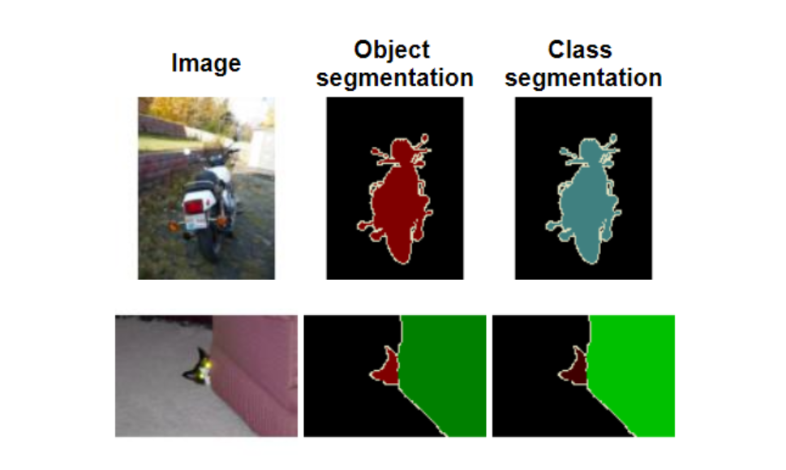
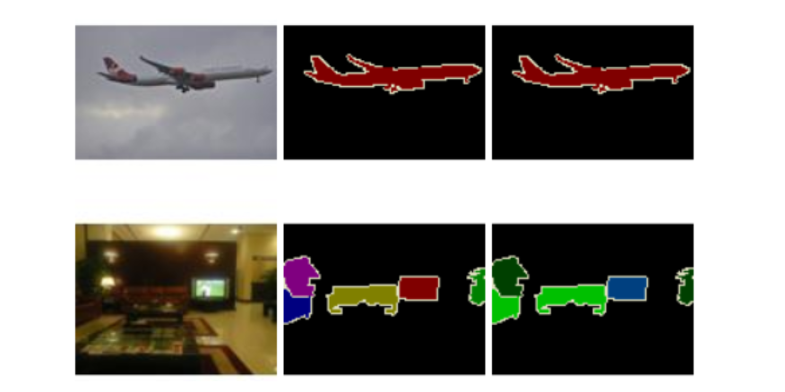
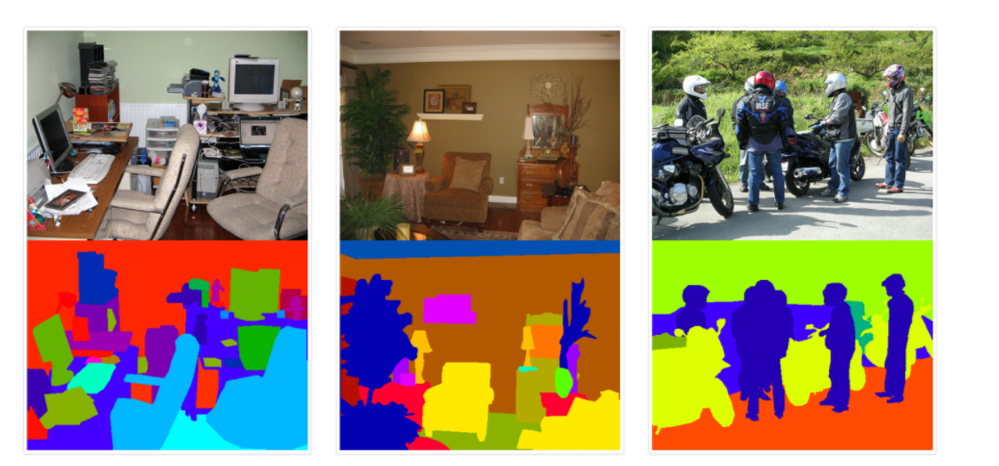
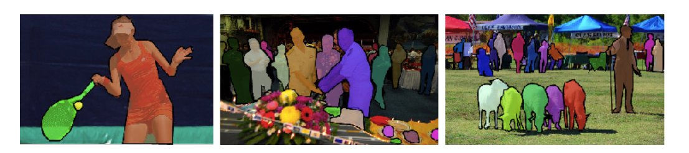
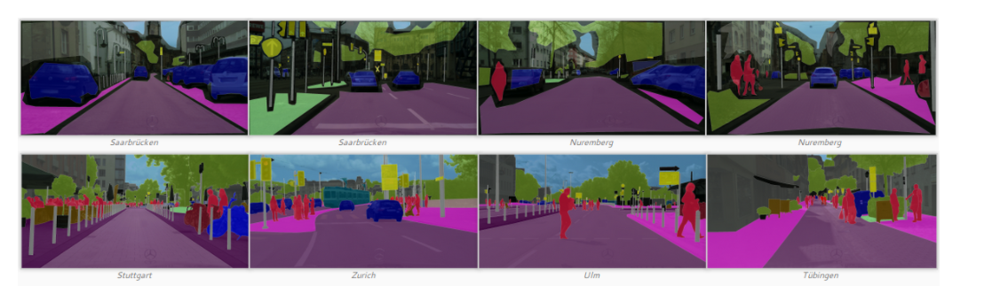

# 常用数据集

---

## PASCAL 视觉对象类 (PASCAL VOC)

PASCAL VOC 数据集 (2012) 是众所周知的常用于对象检测和分割的数据集。超过 11k 幅图像组成了训练和验证数据集，而 10k 幅图像专用于测试数据集。

分割挑战使用[平均交叉联合 (mIoU)](https://www.tensorflow.org/api_docs/python/tf/metrics/mean_iou)指标进行评估。Intersection over Union (IoU) 是一种也用于对象检测的度量，用于评估预测位置的相关性。IoU是ground truth和预测区域之间的重叠区域和联合区域之间的比率。mIoU 是分割对象在测试数据集的所有图像上的 IoU 之间的平均值。

用于图像分割的 2012 PASCAL VOC 数据集示例。来源：[http://host.robots.ox.ac.uk/pascal/VOC/voc2012/index.html](http://host.robots.ox.ac.uk/pascal/VOC/voc2012/index.html)

## PASCAL-上下文

PASCAL-Context 数据集 (2014) 是 2010 PASCAL VOC 数据集的扩展。它包含大约 10k 用于训练的图像，10k 用于验证和 10k 用于测试。这个新版本的特点是整个场景被分割提供了 400 多个类别。请注意，图像已由六名内部注释者在三个月内进行了注释。

PASCAL-Context 挑战的官方评估指标是 mIoU。其他几个指标由研究发布为像素精度 (pixAcc)。在这里，性能将仅与 mIoU 进行比较。

PASCAL-Context 数据集的示例。资料来源：[https ://cs.stanford.edu/~roozbeh/pascal-context/](https://cs.stanford.edu/~roozbeh/pascal-context/*)

## 上下文中的公共对象（COCO）

图像语义分割（“物体检测”和“物体分割”）有两个 COCO 挑战（2017 年和 2018 年）。“对象检测”任务包括将对象分割和分类为 80 个类别。“东西分割”任务使用图像的大部分分割部分（天空、墙壁、草）的数据，它们包含几乎所有的视觉信息。在这篇博文中，将只比较“对象检测”任务的结果，因为引用的研究论文中很少有关于“物体分割”任务的结果。

用于对象分割的 COCO 数据集由超过 200k 的图像和超过 500k 的对象实例分割组成。它包含一个训练数据集、一个验证数据集、一个用于研究人员的测试数据集（test-dev）和一个用于挑战的测试数据集（test-challenge）。两个测试数据集的注释都不可用。这些数据集包含 80 个类别，并且仅分割了相应的对象。此挑战使用与对象检测挑战相同的指标：平均精度 (AP) 和平均召回率 (AR) 均使用联合交集 (IoU)。

有关 IoU 和 AP 指标的详细信息，请参阅我[之前的博客文章](https://medium.com/comet-app/review-of-deep-learning-algorithms-for-object-detection-c1f3d437b852)。例如 AP，Average Recall 是使用具有特定重叠值范围的多个 IoU 计算的。对于固定的 IoU，具有相应测试/地面实况重叠的对象被保留。然后为检测到的对象计算召回指标。最终的 AR 指标是所有 IoU 范围值的计算召回率的平均值。基本上，用于分割的 AP 和 AR 度量与对象检测的工作方式相同，除了 IoU 是按像素计算的，用于语义分割的非矩形形状。

用于对象分割的 COCO 数据集示例。来源：[http ://cocodataset.org/](http://cocodataset.org/*)

## 城市景观

Cityscapes 数据集于 2016 年发布，包含来自 50 个城市的复杂分段城市场景。它由 23.5k 用于训练和验证的图像（精细和粗略注释）和 1.5 张用于测试的图像（仅精细注释）组成。图像是完全分割的，例如具有 29 个类别的 PASCAL-Context 数据集（在 8 个超类别内：平面、人类、车辆、建筑、物体、自然、天空、虚空）。由于其复杂性，它通常用于评估语义分割模型。它还因其与自动驾驶应用的真实城市场景的相似性而闻名。语义分割模型的性能是使用 mIoU 指标计算的，例如 PASCAL 数据集。

Cityscapes 数据集的示例。顶部：粗略的注释。底部：精细注释。来源：[https ://www.cityscapes-dataset.com/](https://www.cityscapes-dataset.com/*)

