## 机器学习术语表

本术语表整理谷歌收录词条，以Ａ-Z的首字母进行排序。
下面列出了一般的机器学习术语和 TensorFlow 专用术语的定义。

### A

#### A/B 测试 (A/B testing)

一种统计方法，用于将两种或多种技术进行比较，通常是将当前采用的技术与新技术进行比较。A/B 测试不仅旨在确定哪种技术的效果更好，而且还有助于了解相应差异是否具有显著的统计意义。A/B 测试通常是采用一种衡量方式对两种技术进行比较，但也适用于任意有限数量的技术和衡量方式。

#### 准确率 (accuracy)

[**分类模型**]的正确预测所占的比例。在[**多类别分类**]中，准确率的定义如下：
$$
准确率 = \frac{正确的预测数}{样本总数}
$$
准确率正确的预测数样本总数准确率=正确的预测数样本总数

在**二元分类**中，准确率的定义如下：
$$
准确率 = \frac{正例数+负例数}{样本总数}
$$
准确率正例数负例数样本总数准确率=正例数+负例数样本总数

请参阅[**正例**]和[**负例**]。

#### 激活函数 (activation function)

一种函数（例如 [**ReLU**]或 [**S 型函数**]），用于对上一层的所有输入求加权和，然后生成一个输出值（通常为非线性值），并将其传递给下一层。

#### 主动学习(Active learning)

一种算法从学习的数据中选择一些数据的训练方法。当有标记的例子很少或很难获得时，主动学习特别有价值。主动学习算法不是盲目地寻找各种各样的有标记的例子，而是选择性地寻找它需要学习的特定范围的例子。

#### AdaGrad

一种先进的梯度下降法，用于重新调整每个参数的梯度，以便有效地为每个参数指定独立的[**学习速率**](https://developers.google.com/machine-learning/glossary/#learning_rate)。如需查看完整的解释，请参阅[这篇论文](http://www.jmlr.org/papers/volume12/duchi11a/duchi11a.pdf)。

#### 层次聚类(agglomerative clustering)

请参阅[**hierarchical clustering**]。

#### 增强现实(AR)

Augmented Reality的缩写，简称AR。
一种将计算机生成的图像叠加在用户对真实世界的视图上，从而提供合成视图的技术。

#### PR曲线下的区域(Area under the PR curve)

通过对分类阈值的不同值绘制(召回率，精度)点，得到的插值精度-召回率曲线下的区域。根据计算方法的不同，PR AUC可能等价于模型的平均精度。

#### ROC 曲线下面积 (AUC, Area under the ROC Curve)

一种会考虑所有可能[**分类阈值**]的评估指标。

[ROC 曲线]下面积是，对于随机选择的正类别样本确实为正类别，以及随机选择的负类别样本为正类别，分类器更确信前者的概率。换言之，分类器更有可能确信随机选择的正例实际上是正的概率，而不是随机选择的负例是正的概率。

#### 通用人工智能(artificial general intelligence)

一种非人机制，表现出广泛的问题解决能力、创造力和适应性。例如，一个演示人工通用智能的程序可以翻译文本、谱写交响乐，并擅长于尚未发明的游戏。

#### 人工智能(artificial intelligence)

可以解决复杂任务的非人类程序或模型。例如，翻译文本的程序或模型或从放射线图像识别疾病的程序或模型都表现出人工智能。

正式地，[**机器学习**]是人工智能的一个子领域。但是，近年来，一些组织已开始互换使用*人工智能*和*机器学习*这两个术语。

#### 属性(attribute)

Feature特征的同义词。公平地说，属性通常指与个人有关的特征。

#### 自动化偏差(automation bias) 

当人类决策者偏向自动化决策系统提出的建议胜过非自动化决策时，即使自动化决策系统出错了。

#### 平均精度(average precision)

汇总排名结果序列的效果的指标。平均精度是通过取每个相关结果的[**精度**](https://developers.google.com/machine-learning/glossary#precision)值的平均值 （排名列表中每个结果的召回率相对于先前结果而言）来计算的。

另请参见[**PR曲线下的面积**]。

---

### B

#### 反向传播算法 (backpropagation)

在[**神经网络**]上执行[**梯度下降法**]的主要算法。该算法会先按前向传播方式计算（并缓存）每个节点的输出值，然后再按反向传播遍历图的方式计算损失函数值相对于每个参数的[偏导数]。

#### 词袋(Bag of words模型)

短语或段落中单词的表示形式，与顺序无关。例如，词袋表示以下三个相同地短语：

- the dog jumps
- jumps the dog
- dog jumps the

每个单词都映射到[**稀疏向量**]的索引，其中向量对词汇表中的每个单词都有一个索引。例如，将*dog dog跳跃*的短语映射到在对应于单词*the*，*dog*和 *jumps*的三个索引处具有非零值的特征向量。非零值可以是以下任意值：

- 1表示单词的存在。
- 一个单词出现在书包中的次数计数。例如，如果短语*“栗色狗”是带有栗色毛皮的狗*，则 *栗色*和*dog*都将表示为2，而其他单词将表示为1。
- 其他一些值，例如单词出现在书包中的次数的对数。

#### 基准 (baseline)

一种简单的[**模型**]或启发法，用作比较模型效果时的参考点。
基准有助于模型开发者针对特定问题量化最低预期效果。

#### 批次 (batch)

[**模型训练**]的一次[**迭代**]（即一次[**梯度**]更新）中使用的样本集。

另请参阅[**批次大小**]。

#### 批次归一化

在 [**隐藏层中**]　[**归一化**]　[**激活函数**]的输入或输出 。批量规范化可以提供以下好处：

- 通过防止[**离群值**]权重使[**神经网络**]更稳定。

- 提高[**学习率**]。

- 减少[**过拟合**]。

  

#### 批次大小 (batch size)

一个[**批次**](https://developers.google.com/machine-learning/glossary/#batch)中的样本数。例如，[**SGD**](https://developers.google.com/machine-learning/glossary/#SGD) 的批次大小为 1，而[**小批次**](https://developers.google.com/machine-learning/glossary/#mini-batch)的大小通常介于 10 到 1000 之间。批次大小在训练和推断期间通常是固定的；不过，TensorFlow 允许使用动态批次大小。

#### 贝叶斯神经网络

一种考虑[**权重**]和输出不确定性的概率[**神经网络**]。一个标准的神经网络回归模型通常[**预测**]一个标量值;
例如，一个模型预测房价为853,000。相比之下，贝叶斯神经网络预测值的分布;例如，一个模型预测的房价是853,000，标准差是67200。贝叶斯神经网络依靠贝叶斯定理来计算权重和预测中的不确定性。贝叶斯神经网络在对不确定性进行量化时很有用，比如在与药品相关的模型中。贝叶斯神经网络也有助于防止[**过拟合**]。

#### 偏差 (bias)

距离原点的截距或偏移。偏差（也称为**偏差项**）在机器学习模型中用 b 或 w0 表示。例如，在下面的公式中，偏差为 b：
$$
y' = b + w_1x_1 + w_2x_2 + ... + w_nx_n
$$
请勿与[**预测偏差**]混淆。

#### 二元分类 (binary classification)

一种分类任务，可输出两种互斥类别之一。例如，对电子邮件进行评估并输出“垃圾邮件”或“非垃圾邮件”的机器学习模型就是一个二元分类器。

#### 边界框(bounding box)

在图像中，一个感兴趣区域周围的矩形(x, y)坐标，例如下图中的狗。

#### 分箱 (binning)

请参阅[**分桶**](https://developers.google.com/machine-learning/glossary/#bucketing)。

#### 分桶 (bucketing)

将一个特征（通常是[**连续**]特征）转换成多个二元特征（称为桶或箱），通常根据值区间进行转换。例如，您可以将温度区间分割为离散分箱，而不是将温度表示成单个连续的浮点特征。假设温度数据可精确到小数点后一位，则可以将介于 0.0 到 15.0 度之间的所有温度都归入一个分箱，将介于 15.1 到 30.0 度之间的所有温度归入第二个分箱，并将介于 30.1 到 50.0 度之间的所有温度归入第三个分箱。

---

### C

#### 校准层 (calibration layer)

一种预测后调整，通常是为了降低[**预测偏差**]的影响。
调整后的预测和概率应与观察到的标签集的分布一致。

#### 候选集(candidate generation)

推荐系统所选择的初始推荐集。例如，考虑一家提供10万种图书的书店。候选生成阶段为特定用户创建一个更小的适合的图书列表，比如500本。但即使是500本书也太多了，无法向用户推荐。随后的推荐系统阶段(如评分和重新排名)会将这500个推荐缩减为一个更小、更有用的推荐集。

#### 候选采样 (candidate sampling)

一种训练时进行的优化，会使用某种函数（例如 softmax）针对所有正类别标签计算概率，但对于负类别标签，则仅针对其随机样本计算概率。
例如，如果某个样本的标签为“小猎犬”和“狗”，则候选采样将针对“小猎犬”和“狗”类别输出以及其他类别（猫、棒棒糖、栅栏）的随机子集计算预测概率和相应的损失项。
这种采样基于的想法是，只要[**正类别**]始终得到适当的正增强，[**负类别**]就可以从频率较低的负增强中进行学习，这确实是在实际中观察到的情况。候选采样的目的是，通过不针对所有负类别计算预测结果来提高计算效率。

#### 分类数据 (categorical data)

具有一组离散的可能值的[**特征**]。
以某个名为 `house style` 的分类特征为例，该特征拥有一组离散的可能值（共三个），即 `Tudor, ranch, colonial`。通过将 `house style` 表示成分类数据，相应模型可以学习 `Tudor`、`ranch` 和 `colonial` 分别对房价的影响。

有时，离散集中的值是互斥的，只能将其中一个值应用于指定样本。
例如，`car maker` 分类特征可能只允许一个样本有一个值 (`Toyota`)。
在其他情况下，则可以应用多个值。一辆车可能会被喷涂多种不同的颜色，因此，`car color` 分类特征可能会允许单个样本具有多个值（例如 `red` 和 `white`）。

分类特征有时称为[**离散特征**]。
与[**数值数据**]相对。

#### 形心 (centroid)

聚类的中心，由 [**k-means**]或 [**k-median**]算法决定。
例如，如果 k 为 3，则 k-means 或 k-median 算法会找出 3 个形心。

#### 基于质心的聚类(Centroid-based clustering)

一种聚类算法，将数据组织成非层次的聚类。K-means是应用最广泛的基于质心的聚类算法。

对比分层聚类算法。

#### 检查点 (checkpoint)

用于捕获模型变量在特定时间的状态的一种数据。
借助检查点，可以导出模型[**权重**]，跨多个会话执行训练，以及使训练在发生错误之后得以继续（例如作业抢占）。请注意，[**图**]本身不包含在检查点中。

#### 类别 (class)

为标签枚举的一组目标值中的一个。例如，在检测垃圾邮件的[**二元分类**]模型中，两种类别分别是“垃圾邮件”和“非垃圾邮件”。在识别狗品种的[**多类别分类**]模型中，类别可以是“贵宾犬”、“小猎犬”、“哈巴犬”等等。

#### 分类不平衡的数据集 (class-imbalanced data set)

一种[**二元分类**]问题，在此类问题中，两种类别的[**标签**]在出现频率方面具有很大的差距。
例如，在某个疾病数据集中，0.0001 的样本具有正类别标签，0.9999 的样本具有负类别标签，这就属于分类不平衡问题；但在某个足球比赛预测器中，0.51 的样本的标签为其中一个球队赢，0.49 的样本的标签为另一个球队赢，这就不属于分类不平衡问题。

#### 分类模型 (classification model)

一种机器学习模型，用于区分两种或多种离散类别。例如，某个自然语言处理分类模型可以确定输入的句子是法语、西班牙语还是意大利语。请与[**回归模型**]进行比较。

#### 分类阈值 (classification threshold)

一种标量值条件，应用于模型预测的得分，旨在将[**正类别**]与[**负类别**]区分开。
将[**逻辑回归**]结果映射到[**二元分类**]时使用。以某个逻辑回归模型为例，该模型用于确定指定电子邮件是垃圾邮件的概率。如果分类阈值为 0.9，那么逻辑回归值高于 0.9 的电子邮件将被归类为“垃圾邮件”，低于 0.9 的则被归类为“非垃圾邮件”。

#### 剪裁(clipping)

一种处理异常值的技术。具体来说，就是将大于某一设定最大值的特性值减少到该最大值。同时，将小于某一特定最小值的特征值增加到该最小值。

例如，假设只有少数特性值位于40-60范围之外。在这种情况下，您可以执行以下操作:

- 将所有超过60的值剪辑为60。

- 将40以下的所有值剪辑为40。

除了将输入值带入指定范围外，裁剪还可以用于在训练期间强制在指定范围内设置渐变值。

#### Cloud TPU 

一个专门的硬件加速器，旨在加快谷歌云平台上的机器学习工作负载。

#### 聚类 (clustering)

将关联的[**样本**]分成一组，一般用于[**非监督式学习**]。在所有样本均分组完毕后，相关人员便可选择性地为每个聚类赋予含义。

聚类算法有很多。例如，[**k-means**]算法会基于样本与[**形心**]的接近程度聚类样本，如下图所示：

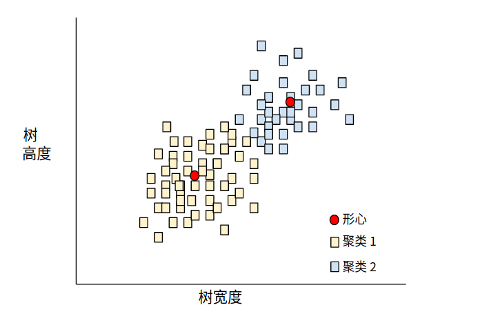

之后，研究人员便可查看这些聚类并进行其他操作，例如，将聚类 1 标记为“矮型树”，将聚类 2 标记为“全尺寸树”。
再举一个例子，例如基于样本与中心点距离的聚类算法，如下所示：

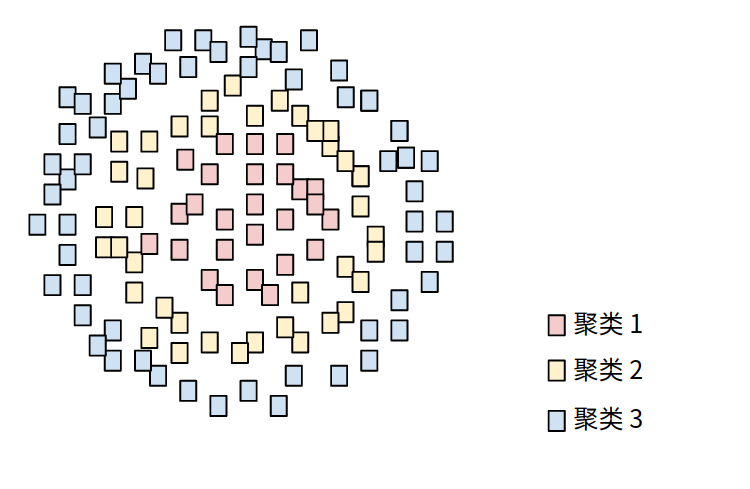

#### 协同适应(co-adaptation)

神经元预测训练数据中的模式时，几乎完全依赖于其他特定神经元的输出，而不是依赖于整个网络的行为。
当导致共同适应的模式在验证数据中不存在时，协同适应就会导致过拟合。Dropout正则化减少了协同适应，因为Dropout确保神经元不能单独依赖于特定的其他神经元。

#### 协同过滤(collaborative filtering)

根据许多其他用户的兴趣对一个用户的兴趣进行预测。协同过滤在推荐系统中经常使用。

#### 确认偏误(*Confirmation* *Bias*) 

一种寻找、解释、偏好和回忆信息的倾向，以确认一个人先前存在的信念或假设。机器学习开发人员可能会无意中收集或标记数据，从而影响支持他们现有信念的结果。确认偏见是内隐偏见的一种形式。

实验者的偏见是一种确认偏见，即实验者继续训练模型，直到先前存在的假设被证实。

#### 混淆矩阵 (confusion matrix)

一种 NxN 表格，用于总结[**分类模型**]的预测效果；即标签和模型预测的分类之间的关联。在混淆矩阵中，一个轴表示模型预测的标签，另一个轴表示实际标签。N 表示类别个数。在[**二元分类**]问题中，N=2。例如，下面显示了一个二元分类问题的混淆矩阵示例

|                    | 肿瘤（预测的标签） | 非肿瘤（预测的标签） |
| ------------------ | :----------------: | :------------------: |
| 肿瘤（实际标签）   |         18         |          1           |
| 非肿瘤（实际标签） |         6          |         452          |

上面的混淆矩阵显示，在 19 个实际有肿瘤的样本中，该模型正确地将 18 个归类为有肿瘤（18 个正例），错误地将 1 个归类为没有肿瘤（1 个假负例）。同样，在 458 个实际没有肿瘤的样本中，模型归类正确的有 452 个（452 个负例），归类错误的有 6 个（6 个假正例）。

多类别分类问题的混淆矩阵有助于确定出错模式。例如，某个混淆矩阵可以揭示，某个经过训练以识别手写数字的模型往往会将 4 错误地预测为 9，将 7 错误地预测为 1。

混淆矩阵包含计算各种效果指标（包括[**精确率**]和[**召回率**]）所需的充足信息。

#### 连续特征 (continuous feature)

一种浮点特征，可能值的区间不受限制。与[**离散特征**]相对。

#### 随机抽样(Convenience Sampling)

使用未经科学收集的数据集来进行快速实验。之后，有必要切换到科学收集的数据集。

#### 收敛 (convergence)

通俗来说，收敛通常是指在训练期间达到的一种状态，即经过一定次数的迭代之后，训练[**损失**]和验证损失在每次迭代中的变化都非常小或根本没有变化。也就是说，如果采用当前数据进行额外的训练将无法改进模型，模型即达到收敛状态。在深度学习中，损失值有时会在最终下降之前的多次迭代中保持不变或几乎保持不变，暂时形成收敛的假象。

另请参阅[**早停法**。

另请参阅 Boyd 和 Vandenberghe 合著的 [Convex Optimization](https://web.stanford.edu/~boyd/cvxbook/bv_cvxbook.pdf)（《凸优化》）。

#### 凸函数 (convex function)

一种函数，函数图像以上的区域为[**凸集**]。典型凸函数的形状类似于字母 **U**。例如，以下都是凸函数：

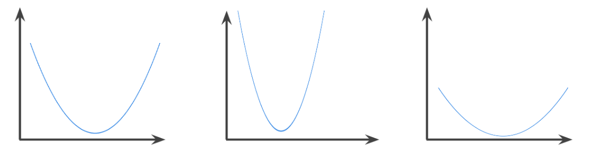

相反，以下函数则不是凸函数。请注意图像上方的区域如何不是凸集：

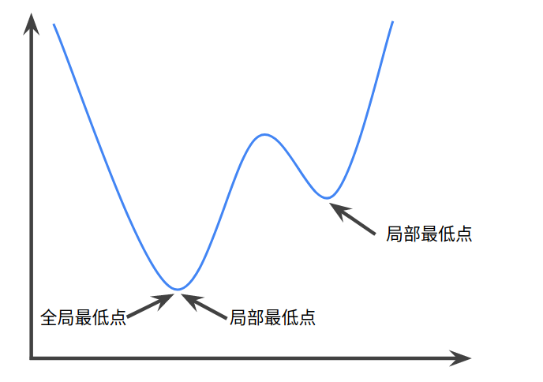

严格凸函数只有一个局部最低点，该点也是全局最低点。经典的 U 形函数都是严格凸函数。不过，有些凸函数（例如直线）则不是这样。

很多常见的[**损失函数**]（包括下列函数）都是凸函数：

- [**L2 损失函数**]
- [**对数损失函数**]
- [**L1 正则化**]
- [**L2 正则化**]

[**梯度下降法**]的很多变体都一定能找到一个接近严格凸函数最小值的点。
同样，[**随机梯度下降法**]的很多变体都有很高的可能性能够找到接近严格凸函数最小值的点（但并非一定能找到）。

两个凸函数的和（例如 L2 损失函数 + L1 正则化）也是凸函数。

[**深度模型**]绝不会是凸函数。
值得注意的是，专门针对[**凸优化**]设计的算法往往总能在深度网络上找到非常好的解决方案，虽然这些解决方案并不一定对应于全局最小值。

#### 凸优化 (convex optimization)

使用数学方法（例如[**梯度下降法**]寻找[**凸函数**]最小值的过程。
机器学习方面的大量研究都是专注于如何通过公式将各种问题表示成凸优化问题，以及如何更高效地解决这些问题。

如需完整的详细信息，请参阅 Boyd 和 Vandenberghe 合著的 [Convex Optimization](https://web.stanford.edu/~boyd/cvxbook/bv_cvxbook.pdf)（《凸优化》）。

#### 凸集 (convex set)

欧几里得空间的一个子集，其中任意两点之间的连线仍完全落在该子集内。例如，下面的两个图形都是凸集：
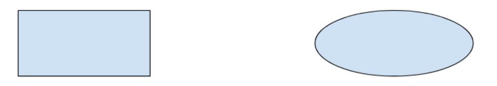
相反，下面的两个图形都不是凸集：

#### 卷积 (convolution)

简单来说，卷积在数学中指两个函数的组合。在机器学习中，卷积结合使用卷积过滤器和输入矩阵来训练权重。

机器学习中的“卷积”一词通常是[**卷积运算**]或[**卷积层**]的简称。

如果没有卷积，机器学习算法就需要学习大张量中每个单元格各自的权重。
例如，用 2K x 2K 图像训练的机器学习算法将被迫找出 400 万个单独的权重。
而使用卷积，机器学习算法只需在[**卷积过滤器**]中找出每个单元格的权重，大大减少了训练模型所需的内存。
在应用卷积过滤器后，它只需跨单元格进行复制，每个单元格都会与过滤器相乘。

#### 卷积过滤器 (convolutional filter)

[**卷积运算**]中的两个参与方之一。（另一个参与方是输入矩阵切片。）
卷积过滤器是一种矩阵，其[**等级**]与输入矩阵相同，但形状小一些。以 28×28 的输入矩阵为例，过滤器可以是小于 28×28 的任何二维矩阵。

在图形操作中，卷积过滤器中的所有单元格通常按照固定模式设置为 1 和 0。在机器学习中，卷积过滤器通常先选择随机数字，然后由网络训练出理想值。

#### 卷积层 (convolutional layer)

深度神经网络的一个层，[**卷积过滤器**]会在其中传递输入矩阵。
以下面的 3x3 [**卷积过滤器**]为例：

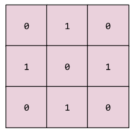

下面的动画显示了一个由 9 个卷积运算（涉及 5x5 输入矩阵）组成的卷积层。请注意，每个卷积运算都涉及一个不同的 3x3 输入矩阵切片。由此产生的 3×3 矩阵（右侧）就包含 9 个卷积运算的结果：

#### 卷积神经网络 (convolutional neural network)

一种神经网络，其中至少有一层为[**卷积层**]。典型的卷积神经网络包含以下几层的组合：

- 卷积层
- 池化层
- 密集层

卷积神经网络在解决某些类型的问题（如图像识别）上取得了巨大成功。

#### 卷积运算 (convolutional operation)

如下所示的两步数学运算：

1. 对[**卷积过滤器**]和输入矩阵切片执行元素级乘法。（输入矩阵切片与卷积过滤器具有相同的等级和大小。）
2. 对生成的积矩阵中的所有值求和。

以下面的 5x5 输入矩阵为例

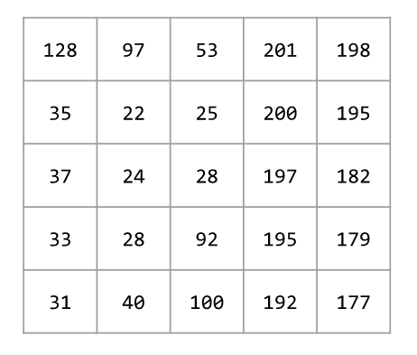
现在，以下面这个 2x2 卷积过滤器为例：

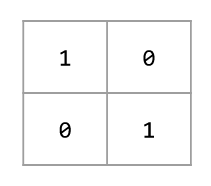

每个卷积运算都涉及一个 2x2 输入矩阵切片。例如，假设我们使用输入矩阵左上角的 2x2 切片。这样一来，对此切片进行卷积运算将如下所示：

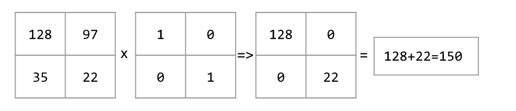

[**卷积层**]由一系列卷积运算组成，每个卷积运算都针对不同的输入矩阵切片。

#### 成本 (cost)

与[**损失**]的含义相同。

#### 交叉熵 (cross-entropy)

[**对数损失函数**]向[**多类别分类问题**]的一种泛化。

交叉熵可以量化两种概率分布之间的差异。

另请参阅[**困惑度**]。

#### 交叉验证(cross-validation)

通过对保留在训练集中的一个或多个非重叠数据子集测试模型，来估计模型如何很好地推广到新数据的一种机制。

#### 自定义 Estimator (custom Estimator)

您按照[这些说明](https://www.tensorflow.org/extend/estimators)自行编写的 [**Estimator**]。

与[**预创建的 Estimator**]相对。

### D

#### 数据分析 (data analysis)

根据样本、测量结果和可视化内容来理解数据。数据分析在首次收到数据集、构建第一个模型之前特别有用。此外，数据分析在理解实验和调试系统问题方面也至关重要。

#### 数据增强(data augmentation)

通过将现有示例转换为创建额外示例，人为地提高训练示例的范围和数量。例如，假设图像是您的特性之一，但您的数据集没有包含足够的图像示例，因此模型无法学习有用的关联。理想情况下，您应该向您的数据集添加足够的标记图像，以使您的模型能够正确地训练。如果这是不可能的，数据增强可以旋转、拉伸和反射每一张图像来产生原始图像的许多变体，可能产生足够的标记数据来进行出色的训练。

#### DataFrame

一种热门的数据类型，用于表示 Pandas 中的数据集。DataFrame 类似于表格。DataFrame 的每一列都有一个名称（标题），每一行都由一个数字标识。

#### 数据集 (data set)

一组[**样本**]的集合。

#### Dataset API (tf.data)

一种高级别的 TensorFlow API，用于读取数据并将其转换为机器学习算法所需的格式。
`tf.data.Dataset` 对象表示一系列元素，其中每个元素都包含一个或多个[**张量**]。
`tf.data.Iterator` 对象可获取 `Dataset` 中的元素。

如需详细了解 Dataset API，请参阅《TensorFlow 编程人员指南》中的[导入数据]。

#### 决策边界 (decision boundary)

在[**二元分类**]或[**多类别分类问题**]中，模型学到的类别之间的分界线。例如，在以下表示某个二元分类问题的图片中，决策边界是橙色类别和蓝色类别之间的分界线：

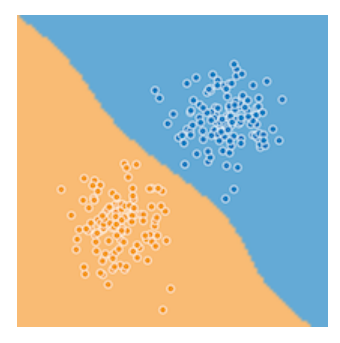

#### 决策阈值(decision threshold)

同义词为[**分类阈值**]。

#### 决策树(decision tree)

用分支语句序列表示的模型。例如，下面这个过于简化的决策树通过几次分叉来预测房子的价格(以几千美元为单位)。根据这棵决策树，一栋面积超过160平方米、有三个以上卧室、建造时间不到10年的房子，预计价格为51万美元。
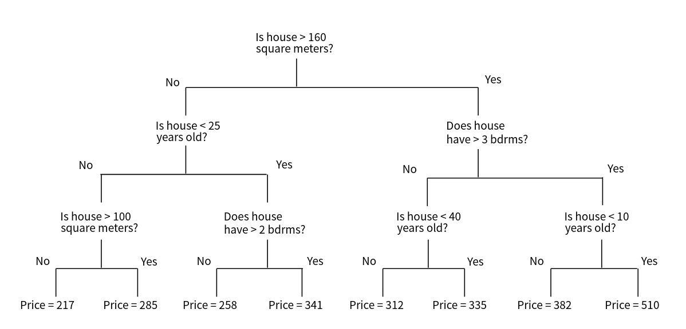

机器学习可以生成深度决策树。

#### 深度模型(deep model)

一种包含多个隐含层的神经网络。

与宽模式形成对比。

#### 深度(depth)

神经网络中学习权重的的层数(包括任何嵌入层)。例如，有5个隐含层和1个输出层的神经网络的深度为6。

#### 维度(dimensions)

具有以下任何定义的重载术语：

- [**张量**]的坐标级数。例如：

  - 标量的尺寸为零；标量的尺寸为0。例如，`["Hello"]`。
  - 向量具有一维。例如，`[3, 5, 7, 11]`。
  - 矩阵有两个维度。例如，`[[2, 4, 18], [5, 7, 14]]`。

  您可以在具有一个坐标的一维向量中唯一地指定特定单元格；您需要两个坐标才能在二维矩阵中唯一指定特定单元格。

- [**特征向量**]的条目数。

- [**嵌入**]层中的元素数。

#### 降采样(downsampling)

重载术语可能表示以下任一情况：

- 减少要素中的信息量，以便更有效地训练模型。例如，在训练图像识别模型之前，先将高分辨率图像降采样为较低分辨率格式。
- 培训比例过高的课堂实例比例过低，以改进代表性不足的课程的模型培训。例如，在一个[**类别不平衡的数据集中**]，模型倾向于了解很多关于 [**多数类别的知识**]，而对于[**少数类别的知识则**]不够 。下采样有助于平衡多数和少数类的培训量。

#### 密集特征 (dense feature)

一种大部分值是非零值的[**特征**]，通常是浮点值[**张量**]。与[**稀疏特征**]相对。｜

#### 离散特征 (discrete feature)

一种[**特征**]，包含有限个可能值。例如，某个值只能是“动物”、“蔬菜”或“矿物”的特征便是一个离散特征（或分类特征）。与[**连续特征**]相对。

#### 设备 (device)

一类可运行 TensorFlow 会话的硬件，包括 CPU、GPU 和 TPU。

#### 丢弃正则化 (dropout regularization)

[**正则化**]的一种形式，在训练[**神经网络**]方面非常有用。丢弃正则化的运作机制是，在一个梯度步长中移除从神经网络层中随机选择的固定数量的单元。丢弃的单元越多，正则化效果就越强。这类似于训练神经网络以模拟较小网络的指数级规模集成学习。如需完整的详细信息，请参阅 [Dropout: A Simple Way to Prevent Neural Networks from Overfitting](http://jmlr.org/papers/volume15/srivastava14a.old/srivastava14a.pdf)（《丢弃：一种防止神经网络过拟合的简单方法》）。

#### 动态模型 (dynamic model)

一种[**模型**]，以持续更新的方式在线接受训练。也就是说，数据会源源不断地进入这种模型。

### E

#### 早停法 (early stopping)

一种[**正则化**]方法，是指在训练损失仍可以继续降低之前结束模型训练。
使用早停法时，您会在[**验证数据集**]的损失开始增大（也就是[**泛化**]效果变差）时结束模型训练。

#### 嵌套 (embeddings)

一种分类特征，以连续值特征表示。通常，嵌套是指将高维度向量映射到低维度的空间。例如，您可以采用以下两种方式之一来表示英文句子中的单词：

- 表示成包含百万个元素（高维度）的[**稀疏向量**]，其中所有元素都是整数。向量中的每个单元格都表示一个单独的英文单词，单元格中的值表示相应单词在句子中出现的次数。由于单个英文句子包含的单词不太可能超过 50 个，因此向量中几乎每个单元格都包含 0。少数非 0 的单元格中将包含一个非常小的整数（通常为 1），该整数表示相应单词在句子中出现的次数。
- 表示成包含数百个元素（低维度）的[**密集向量**]，其中每个元素都存储一个介于 0 到 1 之间的浮点值。这就是一种嵌套。

在 TensorFlow 中，会按[反向传播] [损失]训练嵌套，和训练[**神经网络**]中的任何其他参数一样。

#### 经验风险最小化 (ERM, empirical risk minimization)

用于选择可以将基于训练集的损失降至最低的函数。与[**结构风险最小化**]相对。

#### 集成学习 (ensemble)

多个[**模型**]的预测结果的并集。您可以通过以下一项或多项来创建集成学习：

- 不同的初始化
- 不同的[**超参数**]
- 不同的整体结构

[深度模型和宽度模型]属于一种集成学习。

#### 周期 (epoch)

在训练时，整个数据集的一次完整遍历，以便不漏掉任何一个样本。
因此，一个周期表示（`N`/[**批次大小**]）次训练[**迭代**]，其中 `N` 是样本总数。

#### Estimator

`tf.Estimator` 类的一个实例，用于封装负责构建 TensorFlow 图并运行 TensorFlow 会话的逻辑。
您可以创建[**自定义 Estimator**]（如需相关介绍，请[点击此处](https://www.tensorflow.org/extend/estimators)），也可以实例化其他人[**预创建的 Estimator**](https://developers.google.com/machine-learning/glossary/#pre-made_Estimator)。

#### 样本 (example)

数据集的一行。一个样本包含一个或多个[**特征**]，此外还可能包含一个[**标签**](https://developers.google.com/machine-learning/glossary/#label)。

另请参阅[**有标签样本**]和[**无标签样本**]。

### F

#### 假负例 (FN, false negative)

被模型错误地预测为[**负类别**]的样本。
例如，模型推断出某封电子邮件不是垃圾邮件（负类别），但该电子邮件其实是垃圾邮件。

#### 假正例 (FP, false positive)

被模型错误地预测为[**正类别**](https://developers.google.com/machine-learning/glossary/#positive_class)的样本。例如，模型推断出某封电子邮件是垃圾邮件（正类别），但该电子邮件其实不是垃圾邮件。

#### 假正例率（false positive rate, 简称 FP 率）

[**ROC 曲线**]中的 x 轴。FP 率的定义如下：
$$
假正例率 = \frac{假正例数}{假正例数+负例数} \\
FP率 = \frac{FP}{FP + FN}
$$

#### 特征 (feature)

在进行[**预测**]时使用的输入变量。

#### 特征列 (tf.feature_column)

指定模型应该如何解读特定特征的一种函数。此类函数的输出结果是所有 [**Estimators**](https://developers.google.com/machine-learning/glossary/#Estimators) 构造函数的必需参数。

借助 `tf.feature_column` 函数，模型可对输入特征的不同表示法轻松进行实验。
有关详情，请参阅《TensorFlow 编程人员指南》中的[特征列]一章。

“特征列”是 Google 专用的术语。特征列在 Yahoo/Microsoft 使用的 [VW](https://en.wikipedia.org/wiki/Vowpal_Wabbit) 系统中称为“命名空间”，也称为[场](https://www.csie.ntu.edu.tw/~cjlin/libffm/)。

#### 特征组合 (feature cross)

通过将单独的特征进行组合（求笛卡尔积）而形成的[**合成特征**]。
特征组合有助于表达非线性关系。

#### 特征工程 (feature engineering)

指以下过程：确定哪些[**特征**]可能在训练模型方面非常有用，然后将日志文件及其他来源的原始数据转换为所需的特征。在 TensorFlow 中，特征工程通常是指将原始日志文件条目转换为 [**tf.Example**]协议缓冲区。另请参阅 [tf.Transform](https://github.com/tensorflow/transform)。

特征工程有时称为**特征提取**。

#### 特征集 (feature set)

训练机器学习模型时采用的一组[**特征**]。例如，对于某个用于预测房价的模型，邮政编码、房屋面积以及房屋状况可以组成一个简单的特征集。

#### 特征规范 (feature spec)

用于描述如何从 [**tf.Example**](https://developers.google.com/machine-learning/glossary/#tf.Example) 协议缓冲区提取[**特征**]数据。由于 tf.Example 协议缓冲区只是一个数据容器，因此您必须指定以下内容：

- 要提取的数据（即特征的键）
- 数据类型（例如 float 或 int）
- 长度（固定或可变）

[**Estimator API**]提供了一些可用来根据给定 [**FeatureColumns**]列表生成特征规范的工具。

#### 少量样本学习 (few-shot learning)

一种机器学习方法（通常用于对象分类），旨在仅通过少量训练样本学习有效的分类器。

另请参阅[**单样本学习**]。

#### 完整 softmax (full softmax)

请参阅 [**softmax**]。与[**候选采样**]相对。

#### 全连接层 (fully connected layer)

一种[**隐藏层**]，其中的每个[**节点**]均与下一个隐藏层中的每个节点相连。

全连接层又称为[**密集层**]。

### G

#### 泛化 (generalization)

指的是模型依据训练时采用的数据，针对以前未见过的新数据做出正确预测的能力。

#### 广义线性模型 (generalized linear model)

[**最小二乘回归**]模型（基于[高斯噪声]）向其他类型的模型（基于其他类型的噪声，例如[泊松噪声](https://en.wikipedia.org/wiki/Shot_noise)或分类噪声）进行的一种泛化。广义线性模型的示例包括：

- [**逻辑回归**]
- 多类别回归
- 最小二乘回归

可以通过[凸优化]找到广义线性模型的参数。

广义线性模型具有以下特性：

- 最优的最小二乘回归模型的平均预测结果等于训练数据的平均标签。
- 最优的逻辑回归模型预测的平均概率等于训练数据的平均标签。

广义线性模型的功能受其特征的限制。与深度模型不同，广义线性模型无法“学习新特征”。

#### 梯度 (gradient)

[**偏导数**]相对于所有自变量的向量。在机器学习中，梯度是模型函数偏导数的向量。梯度指向最高速上升的方向。

#### 梯度裁剪 (gradient clipping)

在应用[**梯度**]值之前先设置其上限。
梯度裁剪有助于确保数值稳定性以及防止[梯度爆炸]。

#### 梯度下降法 (gradient descent)

一种通过计算并且减小梯度将[**损失**]降至最低的技术，它以训练数据为条件，来计算损失相对于模型参数的梯度。通俗来说，梯度下降法以迭代方式调整参数，逐渐找到[**权重**]和偏差的最佳组合，从而将损失降至最低。

#### 图 (graph)

TensorFlow 中的一种计算规范。图中的节点表示操作。
边缘具有方向，表示将某项操作的结果（一个[张量]）作为一个操作数传递给另一项操作。
可以使用 [**TensorBoard**]() 直观呈现图。

### H

#### 启发法 (heuristic)

一种非最优但实用的问题解决方案，足以用于进行改进或从中学习。

#### 隐藏层 (hidden layer)

[**神经网络**]中的合成层，介于[**输入层**]（即特征）和[**输出层**]（即预测）之间。
神经网络包含一个或多个隐藏层。

#### 合页损失函数 (hinge loss)

一系列用于[**分类**]的[**损失**]函数，旨在找到距离每个训练样本都尽可能远的[**决策边界**]，从而使样本和边界之间的裕度最大化。 [**KSVM**]使用合页损失函数（或相关函数，例如平方合页损失函数）。对于二元分类，合页损失函数的定义如下：
$$
loss = max(0, 1- (y'*y))
$$
其中"y"表示分类器模型的原始输出：
$$
y' = b + w_1x_1 + w_2x_2 + ... + w_nx_n
$$
“y”表示真标签，值为 -1 或 +1。

因此，合页损失与 (y * y') 的关系图如下所示：

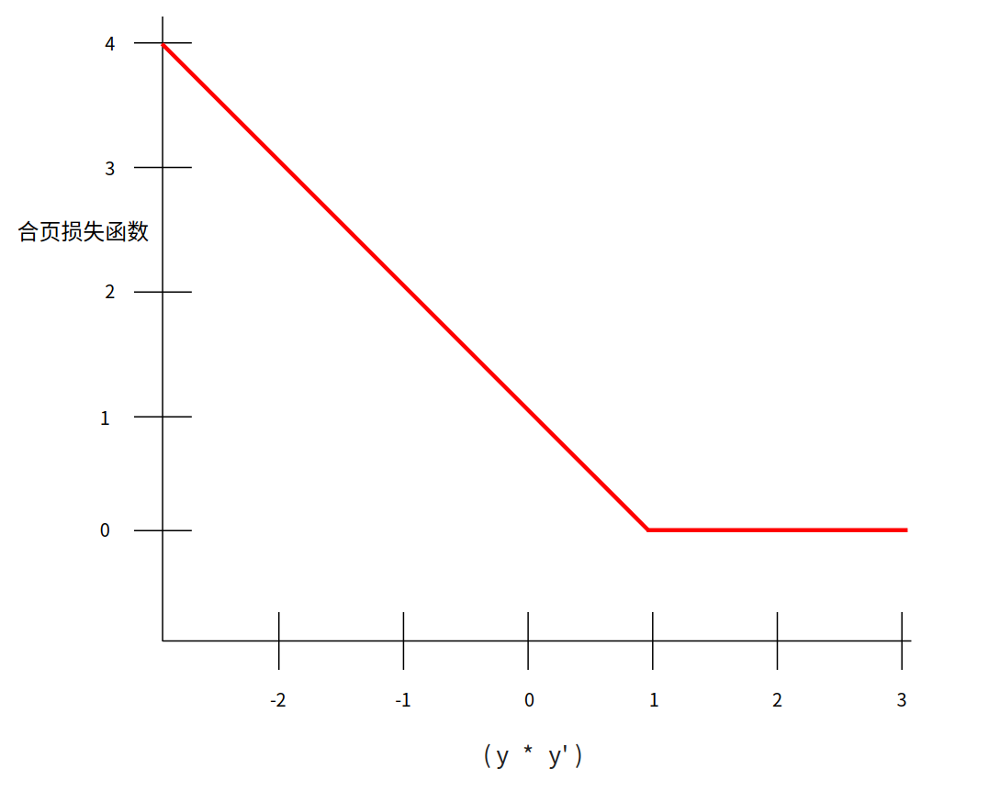

#### 维持数据 (holdout data)

训练期间故意不使用（“维持”）的[**样本**]。
[**验证数据集**]和[**测试数据集**]都属于维持数据。
维持数据有助于评估模型向训练时所用数据之外的数据进行泛化的能力。
与基于训练数据集的损失相比，基于维持数据集的损失有助于更好地估算基于未见过的数据集的损失。

#### 超参数 (hyperparameter)

在模型训练的连续过程中，您调节的“旋钮”。
例如，[**学习速率**]就是一种超参数。与[**参数**]相对。

#### 超平面 (hyperplane)

将一个空间划分为两个子空间的边界。
例如，在二维空间中，直线就是一个超平面，在三维空间中，平面则是一个超平面。
在机器学习中更典型的是：超平面是分隔高维度空间的边界。
[**核支持向量机**]利用超平面将正类别和负类别区分开来（通常是在极高维度空间中）。

### I

#### 独立同等分布 (i.i.d, independently and identically distributed)

从不会改变的分布中提取的数据，其中提取的每个值都不依赖于之前提取的值。
i.i.d. 是机器学习的[理想气体](https://en.wikipedia.org/wiki/Ideal_gas) - 一种实用的数学结构，但在现实世界中几乎从未发现过。
例如，某个网页的访问者在短时间内的分布可能为 i.i.d.，即分布在该短时间内没有变化，且一位用户的访问行为通常与另一位用户的访问行为无关。不过，如果将时间窗口扩大，网页访问者的分布可能呈现出季节性变化。

#### 推断 (inference)

在机器学习中，推断通常指以下过程：通过将训练过的模型应用于[**无标签样本**]来做出预测。
在统计学中，推断是指在某些观测数据条件下拟合分布参数的过程。
（请参阅[维基百科中有关统计学推断的文章](https://en.wikipedia.org/wiki/Statistical_inference)。）

#### 输入函数 (input function)

在 TensorFlow 中，用于将输入数据返回到 [**Estimator**](的训练、评估或预测方法的函数。
例如，训练输入函数会返回[**训练集**]中的[**一批**]特征和标签。

#### 输入层 (input layer)

[**神经网络**]中的第一层（接收输入数据的层）。

#### 实例 (instance)

与[**样本**]的含义相同。

#### 可解释性 (interpretability)

模型的预测可解释的难易程度。深度模型通常不可解释，也就是说，很难对深度模型的不同层进行解释。
相比之下，线性回归模型和[**宽度模型**]的可解释性通常要好得多。

#### 评分者间一致性信度 (inter-rater agreement)

一种衡量指标，用于衡量在执行某项任务时评分者达成一致的频率。
如果评分者未达成一致，则可能需要改进任务说明。有时也称为**注释者间一致性信度**或**评分者间可靠性信度**。
另请参阅 [Cohen's kappa](https://en.wikipedia.org/wiki/Cohen's_kappa)（最热门的评分者间一致性信度衡量指标之一）。

#### 迭代 (iteration)

模型的权重在训练期间的一次更新。
迭代包含计算参数在单[**批次**]数据上的梯度损失。

### K

#### k-means

一种热门的[**聚类**]算法，用于对非监督式学习中的样本进行分组。k-means 算法基本上会执行以下操作：

- 以迭代方式确定最佳的 k 中心点（称为[**形心**]）。
- 将每个样本分配到最近的形心。与同一个形心距离最近的样本属于同一个组。

k-means 算法会挑选形心位置，以最大限度地减小每个样本与其最接近形心之间的距离的累积平方。

以下面的小狗高度与小狗宽度的关系图为例：

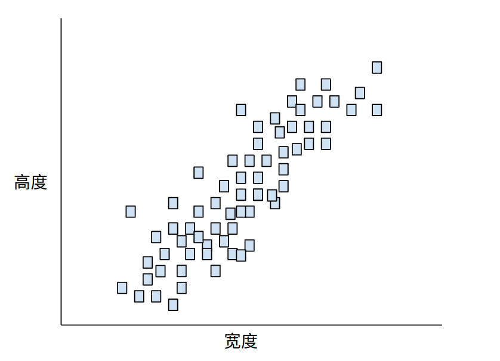

如果 k=3，则 k-means 算法会确定三个形心。每个样本都被分配到与其最接近的形心，最终产生三个组：

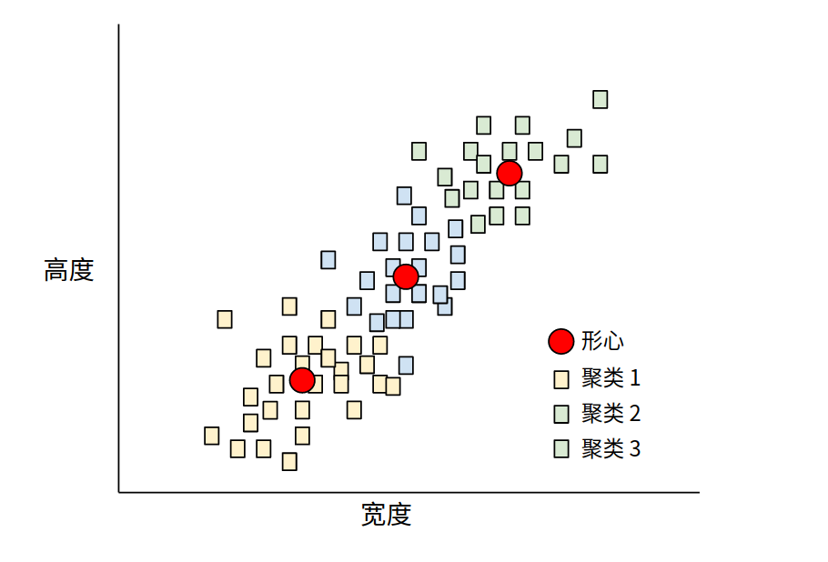

假设制造商想要确定小、中和大号狗毛衣的理想尺寸。在该聚类中，三个形心用于标识每只狗的平均高度和平均宽度。因此，制造商可能应该根据这三个形心确定毛衣尺寸。请注意，聚类的形心通常不是聚类中的样本。

上图显示了 k-means 应用于仅具有两个特征（高度和宽度）的样本。请注意，k-means 可以跨多个特征为样本分组。

#### k-median

与 [**k-means**]紧密相关的聚类算法。两者的实际区别如下：

- 对于 k-means，确定形心的方法是，最大限度地减小候选形心与它的每个样本之间的距离平方和。
- 对于 k-median，确定形心的方法是，最大限度地减小候选形心与它的每个样本之间的距离总和。

请注意，距离的定义也有所不同：

- k-means 采用从形心到样本的[欧几里得距离]。（在二维空间中，欧几里得距离即使用勾股定理来计算斜边。）例如，(2,2) 与 (5,-2) 之间的 k-means 距离为：

$$
欧几里德距离=\sqrt{(2-5)^2 + (2 - (-2))^2} = 5
$$

- k-median 采用从形心到样本的[曼哈顿距离]。这个距离是每个维度中绝对差异值的总和。例如，(2,2) 与 (5,-2) 之间的 k-median 距离为：
  $$
  曼哈顿距离 = |2-5|+|2 - (-2)| = 7
  $$
  

#### Keras

一种热门的 Python 机器学习 API。
[Keras](https://keras.io/) 能够在多种深度学习框架上运行，其中包括 TensorFlow（在该框架上，Keras 作为 [**tf.keras**](https://www.tensorflow.org/api_docs/python/tf/keras) 提供）。

#### 核支持向量机 (KSVM, Kernel Support Vector Machines)

一种分类算法，旨在通过将输入数据向量映射到更高维度的空间，来最大化[**正类别**]和[**负类别**]之间的裕度。
以某个输入数据集包含一百个特征的分类问题为例。
为了最大化正类别和负类别之间的裕度，KSVM 可以在内部将这些特征映射到百万维度的空间。
KSVM 使用[合页损失函数]。

### L

#### L1 损失函数 (L₁ loss)

一种[**损失**]函数，基于模型预测的值与[**标签**]的实际值之差的绝对值。
与 [**L2 损失函数**]相比，L1 损失函数对离群值的敏感性弱一些。

#### L1 正则化 (L₁ regularization)

一种[**正则化**]，根据权重的绝对值的总和来惩罚权重。
在依赖[**稀疏特征**]的模型中，L1 正则化有助于使不相关或几乎不相关的特征的权重正好为 0，从而将这些特征从模型中移除。与 [**L2 正则化**]相对。

#### L2 损失函数 (L₂ loss)

请参阅[**平方损失函数**]。

#### L2 正则化 (L₂ regularization)

一种[**正则化**]，根据权重的平方和来惩罚权重。
L2 正则化有助于使离群值（具有较大正值或较小负值）权重接近于 0，但又不正好为 0。（与 [**L1 正则化**]相对。）在线性模型中，L2 正则化始终可以改进泛化。

#### 标签 (label)

在监督式学习中，标签指[**样本**]的“答案”或“结果”部分。有标签数据集中的每个样本都包含一个或多个特征以及一个标签。例如，在房屋数据集中，特征可能包括卧室数、卫生间数以及房龄，而标签则可能是房价。在垃圾邮件检测数据集中，特征可能包括主题行、发件人以及电子邮件本身，而标签则可能是“垃圾邮件”或“非垃圾邮件”。

#### 有标签样本 (labeled example)

包含[**特征**]和[**标签**]的样本。在监督式训练中，模型从有标签样本中学习规律。

#### lambda

与[**正则化率**]的含义相同。

（多含义术语，我们在此关注的是该术语在[**正则化**]中的定义。）

#### 层 (layer)

[**神经网络**]中的一组[**神经元**]，负责处理一组输入特征，或一组神经元的输出。

此外还指 TensorFlow 中的抽象层。层是 Python 函数，以[**张量**]和配置选项作为输入，然后生成其他张量作为输出。当必要的张量组合起来后，用户便可以通过[**模型函数**]将结果转换为 [**Estimator**]。

#### Layers API (tf.layers)

一种 TensorFlow API，用于以层组合的方式构建[**深度**]神经网络。通过 Layers API，您可以构建不同类型的[**层**]，例如：

- 通过 `tf.layers.Dense` 构建[**全连接层**]。
- 通过 `tf.layers.Conv2D` 构建卷积层。

在编写[**自定义 Estimator**](时，您可以编写“层”对象来定义所有[**隐藏层**]的特征。

Layers API 遵循 [**Keras**] layers API 规范。也就是说，除了前缀不同以外，Layers API 中的所有函数均与 Keras layers API 中的对应函数具有相同的名称和签名。

#### 学习速率 (learning rate)

在训练模型时用于梯度下降的一个标量。在每次迭代期间，[**梯度下降法**]都会将学习速率与梯度相乘。得出的乘积称为**梯度步长**。

学习速率是一个重要的[**超参数**]。

#### 最小二乘回归 (least squares regression)

一种通过最小化 [**L2 损失**]训练出的线性回归模型。

#### 线性回归 (linear regression)

一种[**回归模型**]，通过将输入特征进行线性组合输出连续值。

#### 逻辑回归 (logistic regression)

一种模型，通过将 [**S 型函数**]应用于线性预测，生成分类问题中每个可能的离散标签值的概率。虽然逻辑回归经常用于[**二元分类**]问题，但也可用于[**多类别**]分类问题（其叫法变为**多类别逻辑回归**或**多项回归**）。

#### 对数 (logits)

分类模型生成的原始（非标准化）预测向量，通常会传递给标准化函数。如果模型要解决多类别分类问题，则对数通常变成 [softmax 函数]的输入。之后，softmax 函数会生成一个（标准化）概率向量，对应于每个可能的类别。

此外，对数有时也称为 [**S 型函数**]的元素级反函数。
如需了解详细信息，请参阅 [tf.nn.sigmoid_cross_entropy_with_logits](https://www.tensorflow.org/api_docs/python/tf/nn/sigmoid_cross_entropy_with_logits)。

#### 对数损失函数 (Log Loss)

二元[**逻辑回归**](中使用的[**损失**]函数。

#### 对数几率 (log-odds)

某个事件几率的对数。

如果事件涉及二元概率，则**几率**指的是成功概率 (p) 与失败概率 (1-p) 之比。例如，假设某个给定事件的成功概率为 90％，失败概率为 10％。在这种情况下，几率的计算公式如下：
$$
几率 = \frac{p}{(1-p)} = \frac{.9}{.1} = 9
$$
简单来说，对数几率即几率的对数。按照惯例，“对数”指自然对数，但对数的基数其实可以是任何大于 1 的数。若遵循惯例，上述示例的对数几率应为：
$$
对数几率 = ln(9) = 2.2
$$
对数几率是 [**S 型函数**]的反函数。

#### 损失 (Loss)

一种衡量指标，用于衡量模型的[**预测**](偏离其[**标签**]的程度。或者更悲观地说是衡量模型有多差。要确定此值，模型必须定义损失函数。例如，线性回归模型通常将[**均方误差**]用作损失函数，而逻辑回归模型则使用[**对数损失函数**]。

### M

#### 机器学习 (machine learning)

一种程序或系统，用于根据输入数据构建（训练）预测模型。这种系统会利用学到的模型根据从分布（训练该模型时使用的同一分布）中提取的新数据（以前从未见过的数据）进行实用的预测。机器学习还指与这些程序或系统相关的研究领域。

#### 均方误差 (MSE, Mean Squared Error)

每个样本的平均平方损失。
MSE 的计算方法是[**平方损失**]除以[**样本**]数。
[**TensorFlow Playground**]显示的“训练损失”值和“测试损失”值都是 MSE。

#### 指标 (metric)

您关心的一个数值。可能可以也可能不可以直接在机器学习系统中得到优化。您的系统尝试优化的指标称为[**目标**]。

#### Metrics API (tf.metrics)

一种用于评估模型的 TensorFlow API。
例如，`tf.metrics.accuracy` 用于确定模型的预测与标签匹配的频率。
在编写[**自定义 Estimator**]时，您可以调用 Metrics API 函数来指定应如何评估您的模型。

#### 小批次 (mini-batch)

从整批[**样本**]内随机选择并在训练或推断过程的一次迭代中一起运行的一小部分样本。
小批次的[**批次大小**]通常介于 10 到 1000 之间。与基于完整的训练数据计算损失相比，基于小批次数据计算损失要高效得多。

#### 小批次随机梯度下降法 (SGD, mini-batch stochastic gradient descent)

一种采用[**小批次**]样本的[**梯度下降法**]。也就是说，小批次 SGD 会根据一小部分训练数据来估算梯度。[**Vanilla SGD**] 使用的小批次的大小为 1。

#### ML

[**机器学习**]的缩写。

#### 模型 (model)

机器学习系统从训练数据学到的内容的表示形式。多含义术语，可以理解为下列两种相关含义之一：

- 一种 [**TensorFlow**]图，用于表示预测的计算结构。
- 该 TensorFlow 图的特定权重和偏差，通过[**训练**]决定。

#### 模型函数 (model function)

[**Estimator**]中的函数，用于实现机器学习训练、评估和推断。例如，模型函数的训练部分可以处理以下任务：定义深度神经网络的拓扑并确定其[**优化器**]函数。如果使用[**预创建的 Estimator**]，则有人已为您编写了模型函数。如果使用[**自定义 Estimator**]，则必须自行编写模型函数。

有关编写模型函数的详细信息，请参阅[创建自定义 Estimator](https://www.tensorflow.org/get_started/custom_estimators)。

#### 模型训练 (model training)

确定最佳[**模型**]的过程。

#### 动量 (Momentum)

一种先进的梯度下降法，其中学习步长不仅取决于当前步长的导数，还取决于之前一步或多步的步长的导数。
动量涉及计算梯度随时间而变化的指数级加权移动平均值，与物理学中的动量类似。
动量有时可以防止学习过程被卡在局部最小的情况。

#### 多类别分类 (multi-class classification)

区分两种以上类别的分类问题。
例如，枫树大约有 128 种，因此，确定枫树种类的模型就属于多类别模型。
反之，仅将电子邮件分为两类（“垃圾邮件”和“非垃圾邮件”）的模型属于[**二元分类模型**]。

## 多项分类 (multinomial classification)

与[**多类别分类**]的含义相同。

#### N 

#### NaN 陷阱 (NaN trap)

模型中的一个数字在训练期间变成 [NaN]，这会导致模型中的很多或所有其他数字最终也会变成 NaN。
NaN 是“非数字”的缩写。

#### 负类别 (negative class)

在[**二元分类**]中，一种类别称为正类别，另一种类别称为负类别。正类别是我们要寻找的类别，负类别则是另一种可能性。例如，在医学检查中，负类别可以是“非肿瘤”。在电子邮件分类器中，负类别可以是“非垃圾邮件”。另请参阅[**正类别**]。

#### 神经网络 (neural network)

一种模型，灵感来源于脑部结构，由多个层构成（至少有一个是[**隐藏层**]），每个层都包含简单相连的单元或[**神经元**]（具有非线性关系）。

#### 神经元 (neuron)

[**神经网络**]中的节点，通常会接收多个输入值并生成一个输出值。
神经元通过将[**激活函数**]（非线性转换）应用于输入值的加权和来计算输出值。

#### 节点 (node)

多含义术语，可以理解为下列两种含义之一：

- [**隐藏层**])中的神经元。
- TensorFlow [**图**]中的操作。

#### 标准化 (normalization)

将实际的值区间转换为标准的值区间（通常为 -1 到 +1 或 0 到 1）的过程。
例如，假设某个特征的自然区间是 800 到 6000。通过减法和除法运算，您可以将这些值标准化为位于 -1 到 +1 区间内。

另请参阅[**缩放**]。

#### 数值数据 (numerical data)

用整数或实数表示的[**特征**]。
例如，在房地产模型中，您可能会用数值数据表示房子大小（以平方英尺或平方米为单位）。如果用数值数据表示特征，则可以表明特征的值相互之间具有数学关系，并且与标签可能也有数学关系。例如，如果用数值数据表示房子大小，则可以表明面积为 200 平方米的房子是面积为 100 平方米的房子的两倍。此外，房子面积的平方米数可能与房价存在一定的数学关系。

并非所有整数数据都应表示成数值数据。例如，世界上某些地区的邮政编码是整数，但在模型中，不应将整数邮政编码表示成数值数据。这是因为邮政编码 `20000` 在效力上并不是邮政编码 10000 的两倍（或一半）。此外，虽然不同的邮政编码确实与不同的房地产价值有关，但我们也不能假设邮政编码为 20000 的房地产在价值上是邮政编码为 10000 的房地产的两倍。邮政编码应表示成[**分类数据**]。

数值特征有时称为[**连续特征**]。

#### Numpy

一个[开放源代码数学库](http://www.numpy.org/)，在 Python 中提供高效的数组操作。
[**Pandas**]建立在 Numpy 之上。

### O

#### 目标 (objective)

算法尝试优化的指标。

#### 离线推断 (offline inference)

生成一组[**预测**]，存储这些预测，然后根据需求检索这些预测。与[**在线推断**]相对。

#### 独热编码 (one-hot encoding)

一种稀疏向量，其中：

- 一个元素设为 1。
- 所有其他元素均设为 0。

独热编码常用于表示拥有有限个可能值的字符串或标识符。例如，假设某个指定的植物学数据集记录了 15000 个不同的物种，其中每个物种都用独一无二的字符串标识符来表示。在特征工程过程中，您可能需要将这些字符串标识符编码为独热向量，向量的大小为 15000。

#### 单样本学习（one-shot learning，通常用于对象分类）

一种机器学习方法，通常用于对象分类，旨在通过单个训练样本学习有效的分类器。

另请参阅[**少量样本学习**]。

#### 一对多 (one-vs.-all)

假设某个分类问题有 N 种可能的解决方案，一对多解决方案将包含 N 个单独的[**二元分类器**]- 一个二元分类器对应一种可能的结果。例如，假设某个模型用于区分样本属于动物、蔬菜还是矿物，一对多解决方案将提供下列三个单独的二元分类器：

- 动物和非动物
- 蔬菜和非蔬菜
- 矿物和非矿物

#### 在线推断 (online inference)

根据需求生成[**预测**]。与[**离线推断**]相对。

#### 操作 (op, Operation)

TensorFlow 图中的节点。在 TensorFlow 中，任何创建、操纵或销毁[**张量**]的过程都属于操作。例如，矩阵相乘就是一种操作，该操作以两个张量作为输入，并生成一个张量作为输出。

#### 优化器 (optimizer)

[**梯度下降法**]的一种具体实现。TensorFlow 的优化器基类是 [tf.train.Optimizer]。不同的优化器可能会利用以下一个或多个概念来增强梯度下降法在指定[**训练集**]中的效果：

- [动量] (Momentum)
- 更新频率（[AdaGrad](https://www.tensorflow.org/api_docs/python/tf/train/AdagradOptimizer) = ADAptive GRADient descent；[Adam](https://www.tensorflow.org/api_docs/python/tf/train/AdamOptimizer) = ADAptive with Momentum；RMSProp）
- 稀疏性/正则化 ([Ftrl](https://www.tensorflow.org/api_docs/python/tf/train/FtrlOptimizer))
- 更复杂的数学方法（[Proximal](https://www.tensorflow.org/api_docs/python/tf/train/ProximalGradientDescentOptimizer)，等等）

甚至还包括 [NN 驱动的优化器](https://arxiv.org/abs/1606.04474)。

#### 离群值 (outlier)

与大多数其他值差别很大的值。在机器学习中，下列所有值都是离群值。

- 绝对值很高的[**权重**]。
- 与实际值相差很大的预测值。
- 值比平均值高大约 3 个标准偏差的输入数据。

离群值常常会导致模型训练出现问题。

#### 输出层 (output layer)

神经网络的“最后”一层，也是包含答案的层。

#### 过拟合 (overfitting)

创建的模型与[**训练数据**]过于匹配，以致于模型无法根据新数据做出正确的预测。

#### P

#### Pandas

面向列的数据分析 API。很多机器学习框架（包括 TensorFlow）都支持将 Pandas 数据结构作为输入。
请参阅 [Pandas 文档](http://pandas.pydata.org/)。

#### 参数 (parameter)

机器学习系统自行训练的模型的变量。
例如，[**权重**]就是一种参数，它们的值是机器学习系统通过连续的训练迭代逐渐学习到的。与[**超参数**]相对。

#### 参数服务器 (PS, Parameter Server)

一种作业，负责在分布式设置中跟踪模型[**参数**]。

#### 参数更新 (parameter update)

在训练期间（通常是在[**梯度下降法**]的单次迭代中）调整模型[**参数**]的操作。

#### 偏导数 (partial derivative)

一种导数，除一个变量之外的所有变量都被视为常量。例如，f(x, y) 对 x 的偏导数就是 f(x) 的导数（即，使 y 保持恒定）。f 对 x 的偏导数仅关注 x 如何变化，而忽略公式中的所有其他变量。

#### 划分策略 (partitioning strategy)

在[**参数服务器**]间分割变量的算法。

#### 性能 (performance)

多含义术语，具有以下含义：

- 在软件工程中的传统含义。即：相应软件的运行速度有多快（或有多高效）？
- 在机器学习中的含义。在机器学习领域，性能旨在回答以下问题：相应[**模型**]的准确度有多高？即模型在预测方面的表现有多好？

#### 困惑度 (perplexity)

一种衡量指标，用于衡量[**模型**]能够多好地完成任务。例如，假设任务是读取用户使用智能手机键盘输入字词时输入的前几个字母，然后列出一组可能的完整字词。此任务的困惑度 (P) 是：为了使列出的字词中包含用户尝试输入的实际字词，您需要提供的猜测项的个数。

困惑度与[**交叉熵**]的关系如下：
$$
P = 2^{-cross \quad entropy}
$$

#### 流水线 (pipeline)

机器学习算法的基础架构。流水线包括收集数据、将数据放入训练数据文件、训练一个或多个模型，以及将模型导出到生产环境。

#### 池化 (pooling)

将一个或多个由前趋的[**卷积层**]创建的矩阵压缩为较小的矩阵。
池化通常是取整个池化区域的最大值或平均值。以下面的 3x3 矩阵为例：

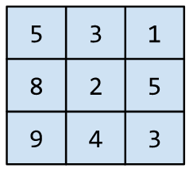

池化运算与卷积运算类似：将矩阵分割为多个切片，然后按[**步长**]逐个运行卷积运算。例如，假设池化运算按 1x1 步长将卷积矩阵分割为 2x2 个切片。如下图所示，进行了四个池化运算。假设每个池化运算都选择该切片中四个值的最大值：

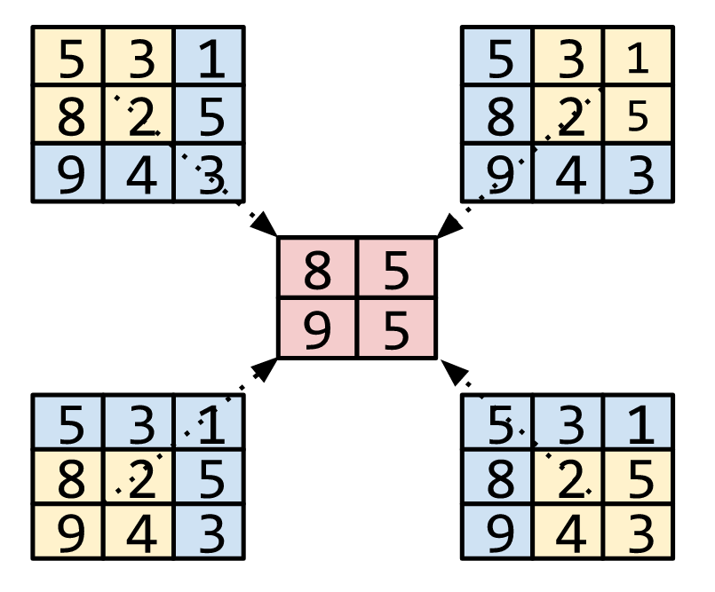

池化有助于在输入矩阵中实现[**平移不变性**]。

对于视觉应用来说，池化的更正式名称为**空间池化**。时间序列应用通常将池化称为**时序池化**。按照不太正式的说法，池化通常称为**下采样**或**降采样**。

#### 正类别 (positive class)

在[**二元分类**]中，两种可能的类别分别被标记为正类别和负类别。正类别结果是我们要测试的对象。（不可否认的是，我们会同时测试这两种结果，但只关注正类别结果。）例如，在医学检查中，正类别可以是“肿瘤”。在电子邮件分类器中，正类别可以是“垃圾邮件”。

与[**负类别**]相对。

#### 精确率 (precision)

一种[**分类模型**]指标。

精确率指模型正确预测[**正类别**]的频率，即：
$$
精确率 = \frac{正例数}{正例数 + 假正例数}
$$

#### 预测 (prediction)

模型在收到输入[**样本**]后的输出。

#### 预测偏差 (prediction bias)

一种值，用于表明[**预测**]平均值与数据集中[**标签**]的平均值相差有多大。

#### 预创建的 Estimator (pre-made Estimator)

其他人已建好的 [**Estimator**]。
TensorFlow 提供了一些预创建的 Estimator，包括 `DNNClassifier`、`DNNRegressor` 和 `LinearClassifier`。您可以按照[这些说明](https://www.tensorflow.org/extend/estimators)构建自己预创建的 Estimator。

#### 预训练模型 (pre-trained model)

已经过训练的模型或模型组件（例如[**嵌套**]）。
有时，您需要将预训练的嵌套馈送到[**神经网络**]。
在其他时候，您的模型将自行训练嵌套，而不依赖于预训练的嵌套。

#### 先验信念 (prior belief)

在开始采用相应数据进行训练之前，您对这些数据抱有的信念。
例如，[**L2 正则化**]依赖的先验信念是[**权重**]应该很小且应以 0 为中心呈正态分布。

### Q

#### 队列 (queue)

一种 TensorFlow [**操作**]，用于实现队列数据结构。通常用于 I/O 中。

### R

#### 等级 (rank)

机器学习中的一个多含义术语，可以理解为下列含义之一：

- [**张量**]中的维数。例如，标量等级为 0，向量等级为 1，矩阵等级为 2。
- 在将类别从最高到最低进行排序的机器学习问题中，类别的顺序位置。例如，行为排序系统可以将狗狗的奖励从最高（牛排）到最低（枯萎的羽衣甘蓝）进行排序。

#### 评分者 (rater)

为[**样本**]提供[**标签**]的人。有时称为“注释者”。

#### 召回率 (recall)

一种[**分类模型**]指标，用于回答以下问题：在所有可能的正类别标签中，模型正确地识别出了多少个？即：
$$
召回率＝ \frac{正例数}{正例数 + 假正例数}
$$

#### 修正线性单元 (ReLU, Rectified Linear Unit)

一种[**激活函数**]，其规则如下：

- 如果输入为负数或 0，则输出 0。
- 如果输入为正数，则输出等于输入。

#### 回归模型 (regression model)

一种模型，能够输出连续的值（通常为浮点值）。
请与[**分类模型**]进行比较，分类模型会输出离散值，例如“黄花菜”或“虎皮百合”。

#### 正则化 (regularization)

对模型复杂度的惩罚。
正则化有助于防止出现[**过拟合**]，包含以下类型：

- [**L1 正则化**]
- [**L2 正则化**]
- [**丢弃正则化**]
- [**早停法**]（这不是正式的正则化方法，但可以有效限制过拟合）

#### 正则化率 (regularization rate)

一种标量值，以 lambda 表示，用于指定正则化函数的相对重要性。
从下面简化的[**损失**]公式中可以看出正则化率的影响：
$$
最小化(损失方程 + \lambda(正则化方程))
$$
提高正则化率可以减少[**过拟合**]，但可能会使模型的[**准确率**]降低。

#### 表示法 (representation)

将数据映射到实用[**特征**]的过程。

#### 受试者工作特征曲线（receiver operating characteristic，简称 ROC 曲线）

不同[**分类阈值**]下的[**正例率**]和[**假正例率**]构成的曲线。
另请参阅[**曲线下面积**]。

#### 根目录 (root directory)

您指定的目录，用于托管多个模型的 TensorFlow 检查点和事件文件的子目录。

#### 均方根误差 (RMSE, Root Mean Squared Error)

[**均方误差**]的平方根。

#### 旋转不变性 (rotational invariance)

在图像分类问题中，即使图像的方向发生变化，算法也能成功地对图像进行分类。例如，无论网球拍朝上、侧向还是朝下放置，该算法仍然可以识别它。请注意，并非总是希望旋转不变；例如，倒置的“9”不应分类为“9”。

另请参阅[**平移不变性**]和[**大小不变性**]。

### S

#### SavedModel

保存和恢复 TensorFlow 模型时建议使用的格式。
SavedModel 是一种独立于语言且可恢复的序列化格式，使较高级别的系统和工具可以创建、使用和转换 TensorFlow 模型。

如需完整的详细信息，请参阅《TensorFlow 编程人员指南》中的[保存和恢复](https://www.tensorflow.org/programmers_guide/saved_model)。

#### Saver

一种 [TensorFlow 对象]，负责保存模型检查点。

#### 缩放 (scaling)

[**特征工程**]中的一种常用做法，是指对某个特征的值区间进行调整，使之与数据集中其他特征的值区间一致。例如，假设您希望数据集中所有浮点特征的值都位于 0 到 1 区间内，如果某个特征的值位于 0 到 500 区间内，您就可以通过将每个值除以 500 来缩放该特征。

另请参阅[**标准化**]。

#### scikit-learn

一个热门的开放源代码机器学习平台。

请访问 [www.scikit-learn.org](http://www.scikit-learn.org/)。

#### 半监督式学习 (semi-supervised learning)

训练模型时采用的数据中，某些训练样本有标签，而其他样本则没有标签。半监督式学习采用的一种技术是推断无标签样本的标签，然后使用推断出的标签进行训练，以创建新模型。如果获得有标签样本需要高昂的成本，而无标签样本则有很多，那么半监督式学习将非常有用。

#### 序列模型 (sequence model)

一种模型，其输入具有序列依赖性。

例如，根据之前观看过的一系列视频对观看的下一个视频进行预测。

#### 会话 (tf.session)

封装了 TensorFlow 运行时状态的对象，用于运行全部或部分[**图**]。在使用底层 TensorFlow API 时，您可以直接创建并管理一个或多个 `tf.session` 对象。在使用 Estimator API 时，Estimator 会为您创建会话对象。

#### S 型函数 (sigmoid function)

一种函数，可将逻辑回归输出或多项回归输出（对数几率）映射到概率，以返回介于 0 到 1 之间的值。S 型函数的公式如下：
$$
y = \frac{1}{1 + e^{-\sigma}}
$$
在[**逻辑回归**]问题中，σ 非常简单：
$$
\sigma = b + w_1x_1 + w_2x_2 + ... + w_nx_n
$$
换句话说，S 型函数可将$\sigma$转换为介于 0 到 1 之间的概率。
在某些[**神经网络**]中，S 型函数可作为[**激活函数**]使用。

#### 大小不变性 (size invariance)

在图像分类问题中，即使图像的大小发生变化，算法也能成功地对图像进行分类。例如，无论一只猫以 200 万像素还是 20 万像素呈现，该算法仍然可以识别它。请注意，即使是最好的图像分类算法，在大小不变性方面仍然会存在切实的限制。例如，对于仅以 20 像素呈现的猫图像，算法（或人）不可能正确对其进行分类。

另请参阅[**平移不变性**]和[**旋转不变性**]。

#### softmax

一种函数，可提供[**多类别分类模型**]中每个可能类别的概率。这些概率的总和正好为 1.0。例如，softmax 可能会得出某个图像是狗、猫和马的概率分别是 0.9、0.08 和 0.02。（也称为**完整 softmax**。）

与[**候选采样**]相对。

#### 稀疏特征 (sparse feature)

一种[**特征**]向量，其中的大多数值都为 0 或为空。例如，某个向量包含一个为 1 的值和一百万个为 0 的值，则该向量就属于稀疏向量。再举一个例子，搜索查询中的单词也可能属于稀疏特征 - 在某种指定语言中有很多可能的单词，但在某个指定的查询中仅包含其中几个。

与[**密集特征**]相对。

#### 稀疏表示法 (sparse representation)

一种张量[**表示法**]，仅存储非零元素。

例如，英语中包含约一百万个单词。表示一个英语句子中所用单词的数量，考虑以下两种方式：

- 要采用**密集表示法**来表示此句子，则必须为所有一百万个单元格设置一个整数，然后在大部分单元格中放入 0，在少数单元格中放入一个非常小的整数。
- 要采用稀疏表示法来表示此句子，则仅存储象征句子中实际存在的单词的单元格。因此，如果句子只包含 20 个独一无二的单词，那么该句子的稀疏表示法将仅在 20 个单元格中存储一个整数。

例如，假设以两种方式来表示句子“Dogs wag tails.”。如下表所示，密集表示法将使用约一百万个单元格；稀疏表示法则只使用 3 个单元格：

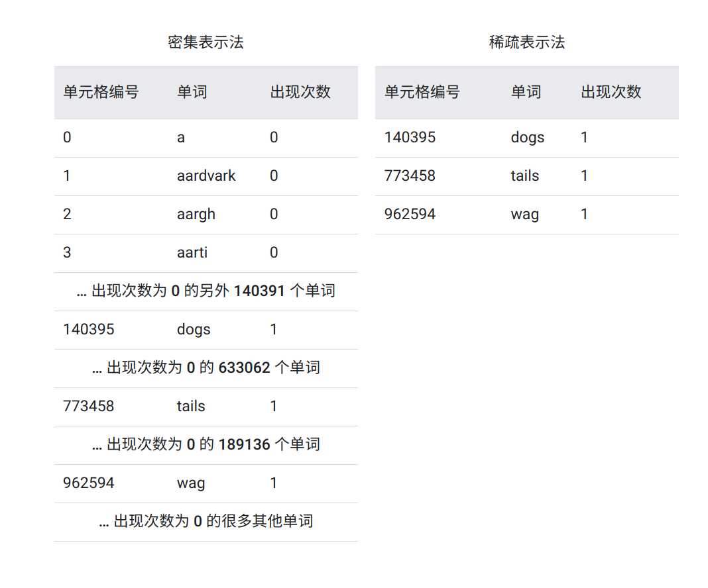

#### 稀疏性 (sparsity)

向量或矩阵中设置为 0（或空）的元素数除以该向量或矩阵中的条目总数。
以一个 10x10 矩阵（其中 98 个单元格都包含 0）为例。
稀疏性的计算方法如下：
$$
稀疏性 = \frac{98}{100} = 0.98
$$
**特征稀疏性**是指特征向量的稀疏性；**模型稀疏性**是指模型权重的稀疏性。

#### 空间池化 (spatial pooling)

请参阅[**池化**]。

#### 平方合页损失函数 (squared hinge loss)

[**合页损失函数**]的平方。与常规合页损失函数相比，平方合页损失函数对离群值的惩罚更严厉。

#### 平方损失函数 (squared loss)

在[**线性回归**]中使用的[**损失**]函数（也称为 **L2 损失函数**）。
该函数可计算模型为有标签[**样本**]预测的值和[**标签**]的实际值之差的平方。由于取平方值，因此该损失函数会放大不佳预测的影响。也就是说，与 [**L1 损失函数**]相比，平方损失函数对离群值的反应更强烈。

#### 静态模型 (static model)

离线训练的一种模型。

#### 平稳性 (stationarity)

数据集中数据的一种属性，表示数据分布在一个或多个维度保持不变。这种维度最常见的是时间，即表明平稳性的数据不随时间而变化。例如，从 9 月到 12 月，表明平稳性的数据没有发生变化。

#### 步 (step)

对一个[**批次**]的向前和向后评估。

#### 步长 (step size)

与[**学习速率**]的含义相同。

#### 随机梯度下降法 (SGD, stochastic gradient descent)

批次大小为 1 的一种[**梯度下降法**]。
换句话说，SGD 依赖于从数据集中随机均匀选择的单个样本来计算每步的梯度估算值。

#### 结构风险最小化 (SRM, structural risk minimization)

一种算法，用于平衡以下两个目标：

- 期望构建最具预测性的模型（例如损失最低）。
- 期望使模型尽可能简单（例如强大的正则化）。

例如，旨在将基于训练集的损失和正则化降至最低的函数就是一种结构风险最小化算法。

如需更多信息，请参阅 http://www.svms.org/srm/。

与[**经验风险最小化**]相对。

#### 步长 (stride)

在卷积运算或池化中，下一个系列的输入切片的每个维度中的增量。
例如，下面的动画演示了卷积运算过程中的一个 (1,1) 步长。
因此，下一个输入切片是从上一个输入切片向右移动一个步长的位置开始。
当运算到达右侧边缘时，下一个切片将回到最左边，但是下移一个位置。

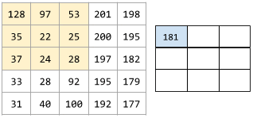

前面的示例演示了一个二维步长。如果输入矩阵为三维，那么步长也将是三维。

#### 下采样 (subsampling)

请参阅[**池化**]。

#### 总结 (summary)

在 TensorFlow 中的某一[**步**]计算出的一个值或一组值，通常用于在训练期间跟踪模型指标。

#### 监督式机器学习 (supervised machine learning)

根据输入数据及其对应的[**标签**]来训练[**模型**]。监督式机器学习类似于学生通过研究一系列问题及其对应的答案来学习某个主题。在掌握了问题和答案之间的对应关系后，学生便可以回答关于同一主题的新问题（以前从未见过的问题）。
请与[**非监督式机器学习**]进行比较。

#### 合成特征 (synthetic feature)

一种[**特征**]，不在输入特征之列，而是从一个或多个输入特征衍生而来。合成特征包括以下类型：

- 对连续特征进行[**分桶**]，以分为多个区间分箱。
- 将一个特征值与其他特征值或其本身相乘（或相除）。
- 创建一个[**特征组合**]。

仅通过[**标准化**]或[**缩放**]创建的特征不属于合成特征。

### T

#### 目标 (target)

与[**标签**]的含义相同。

#### 时态数据 (temporal data)

在不同时间点记录的数据。例如，记录的一年中每一天的冬外套销量就属于时态数据。

#### 张量 (Tensor)

TensorFlow 程序中的主要数据结构。
张量是 N 维（其中 N 可能非常大）数据结构，最常见的是标量、向量或矩阵。
张量的元素可以包含整数值、浮点值或字符串值。

#### 张量处理单元 (TPU, Tensor Processing Unit)

一种 ASIC（应用专用集成电路），用于优化 TensorFlow 程序的性能。

#### 张量等级 (Tensor rank)

请参阅[**等级**]。

#### 张量形状 (Tensor shape)

[**张量**]在各种维度中包含的元素数。
例如，张量 [5, 10] 在一个维度中的形状为 5，在另一个维度中的形状为 10。

#### 张量大小 (Tensor size)

[**张量**]包含的标量总数。
例如，张量 [5, 10] 的大小为 50。

#### TensorBoard

一个信息中心，用于显示在执行一个或多个 TensorFlow 程序期间保存的摘要信息。

#### TensorFlow

一个大型的分布式机器学习平台。该术语还指 TensorFlow 堆栈中的基本 API 层，该层支持对数据流图进行一般计算。

虽然 TensorFlow 主要应用于机器学习领域，但也可用于需要使用数据流图进行数值计算的非机器学习任务。

#### TensorFlow Playground

一款用于直观呈现不同的[**超参数**]对模型（主要是神经网络）训练的影响的程序。

要试用 TensorFlow Playground，请前往 [http://playground.tensorflow.org](http://playground.tensorflow.org/)。

#### TensorFlow Serving

一个平台，用于将训练过的模型部署到生产环境。

#### 测试集 (test set)

数据集的子集，用于在[**模型**]经由验证集的初步验证之后测试模型。

与[**训练集**]和[**验证集**]相对。

#### tf.Example

一种标准[协议缓冲区]，旨在描述用于机器学习模型训练或推断的输入数据。

#### 时间序列分析 (time series analysis)

机器学习和统计学的一个子领域，旨在分析[**时态数据**]。
很多类型的机器学习问题都需要时间序列分析，其中包括分类、聚类、预测和异常检测。例如，您可以利用时间序列分析根据历史销量数据预测未来每月的冬外套销量。

#### 训练 (training)

确定构成模型的理想[**参数**]的过程。

#### 训练集 (training set)

数据集的子集，用于训练模型。

与[**验证集**]和[**测试集**]相对。

#### 迁移学习 (transfer learning)

将信息从一个机器学习任务迁移到另一个机器学习任务。例如，在多任务学习中，一个模型可以完成多项任务，例如针对不同任务具有不同输出节点的[**深度模型**]。迁移学习可能涉及将知识从较简单任务的解决方案迁移到较复杂的任务，或者将知识从数据较多的任务迁移到数据较少的任务。

大多数机器学习系统都只能完成一项任务。迁移学习是迈向人工智能的一小步；在人工智能中，单个程序可以完成多项任务。

#### 平移不变性 (translational invariance)

在图像分类问题中，即使图像中对象的位置发生变化，算法也能成功对图像进行分类。例如，无论一只狗位于画面正中央还是画面左侧，该算法仍然可以识别它。

另请参阅[**大小不变性**]和[**旋转不变性**]。

#### 负例 (TN, true negative)

被模型正确地预测为[**负类别**]的样本。例如，模型推断出某封电子邮件不是垃圾邮件，而该电子邮件确实不是垃圾邮件。

#### 正例 (TP, true positive)

被模型正确地预测为[**正类别**]的样本。例如，模型推断出某封电子邮件是垃圾邮件，而该电子邮件确实是垃圾邮件。

#### 正例率（true positive rate, 简称 TP 率）

与[**召回率**]的含义相同，即：
$$
正例率　= \frac{正例数}{正例数+假负例数}
$$
正例率是 [**ROC 曲线**]的 y 轴。

### U

#### 无标签样本 (unlabeled example)

包含[**特征**]但没有[**标签**]的样本。
无标签样本是用于进行[**推断**]的输入内容。
在[**半监督式**]和[**非监督式**]学习中，在训练期间会使用无标签样本。

#### 非监督式机器学习 (unsupervised machine learning)

训练[**模型**]，以找出数据集（通常是无标签数据集）中的规律。

非监督式机器学习最常见的用途是将数据分为不同的聚类，使相似的样本位于同一组中。
例如，非监督式机器学习算法可以根据音乐的各种属性将歌曲分为不同的聚类。
所得聚类可以作为其他机器学习算法（例如音乐推荐服务）的输入。
在很难获取真标签的领域，聚类可能会非常有用。
例如，在反滥用和反欺诈等领域，聚类有助于人们更好地了解相关数据。

非监督式机器学习的另一个例子是[**主成分分析 (PCA)**]。
例如，通过对包含数百万购物车中物品的数据集进行主成分分析，可能会发现有柠檬的购物车中往往也有抗酸药。

请与[**监督式机器学习**]进行比较。

### V

#### 验证集 (validation set)

数据集的一个子集，从训练集分离而来，用于调整[**超参数**]。

与[**训练集**]和[**测试集**]相对。

### W

#### 权重 (weight)

线性模型中[**特征**]的系数，或深度网络中的边。训练线性模型的目标是确定每个特征的理想权重。如果权重为 0，则相应的特征对模型来说没有任何贡献。

#### 宽度模型 (wide model)

一种线性模型，通常有很多[**稀疏输入特征**]。
我们之所以称之为“宽度模型”，是因为这是一种特殊类型的[**神经网络**]，其大量输入均直接与输出节点相连。与深度模型相比，宽度模型通常更易于调试和检查。虽然宽度模型无法通过[**隐藏层**]来表示非线性关系，但可以利用[**特征组合**]、[**分桶**]等转换以不同的方式为非线性关系建模。

与[**深度模型**]相对。