## 一、目标检测之性能指标

对于目标检测，我们从两个方向来进行评估，一方面是：检测精度，也就是检测的准确程度，另一方面是检测速度，也就是返回检测结果的快慢。

### **1.1检测精度**：

- Precision(准确率，精度), Recall(召回率), F1 score(精确率和召回率的调和平均数，最大为1，最小为0。)
- loU(Intersection over Union)(交并比)
- P-R curve(Precision-Recall curve)(精度召回曲线)
- AP(Average Precision)(平均正确率)
- mAP(mean Average Precision)(平均精度均值)

#### 1.1.1 Precision, Recall, F1 score

我们将**预测情况**与**实际情况**作为两个维度进行考虑，其中预测会有两种结果，也即为Positive(肯定的)与Negative(否定的);同时实际情况也分为两种，即为True(是)或False(否)，分别将两个维度下的四种结果进行两两叠加即得下列的混淆矩阵：

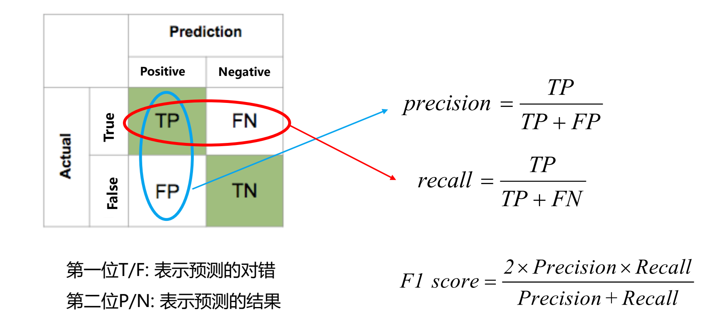

在这个矩阵中，第一位T/F:表示预测的对错，第二位P/N：表示预测的结果。
若假设我们对苹果、香蕉、西瓜进行训练和预测，
那么由此，就可以得出以下分析：

**TP**：TP即为预测正确，且预测结果与真实结果一致。
	    举例说明就是，当前真实值为苹果，由于模型收敛的还算不错，正确预测为苹果，
	    且预测结果与真实值都是苹果，这就是我们期望得到的结果。
**FP**：FP即为预测错误，且预测结果与真实结果一致。
		举例说明就是，当前真实值为香蕉，但由于模型和参数训练等问题，原本正确的预测应为苹果，
		但错误预测为香蕉，反而使得预测结果与真实值都是香蕉，这属于是误打误撞的成功。
**FN**：FN即为预测错误，且预测结果与真实结果不一致。
		举例说明就是，当前真实值为香蕉，但由于某种原因和问题，
		导致错误预测的结果为苹果，此时与真实结果不一致。
**TN**：TN即为预测正确，且预测结果与真实结果不一致。
	    举例说明就是，当前真实值为香蕉，根据预测的置信度和类别标签却正确预测为苹果，
		那么此时预测结果与真实结果也不一致。

从而就有：

- **精度Precision**(查准率)是评估预测的**准不准**(看预测行)
- **召回率Recall(查全率)**是评估找的**全不全**(看实际行)
- **F1 score**是精确率和召回率的调和平均数

再来看下面这张图或许也能帮助大家理解：
可以看到图中有若干个实心点和空心点，其中左边绿色部分的半圆形区域为TP(True Postives)，左边剩余部分的区域则为FN(False Negatives)，类似地，右边红色部分的半圈形区域为FP(False Positives)，右边剩余部分的区域则为TN(True Negatives)。

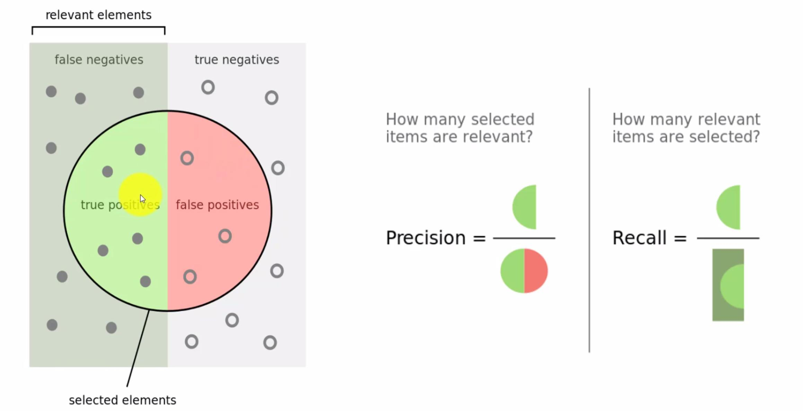

那么在图中怎么表示精度和召回率呢？
可以看到，若我们将整个圆形部分作为分母，以TP绿色部分作为分子，那么这时候FP红色部分的面积和点数量越小，则整体的精度就越高。

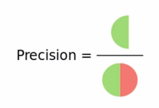

同样地，若我们将全部的绿色部分作为分母，绿色圆形部分TP作为分母，这时若绿宝圆形部分占整体绿色面积的比率越大，也就是绿色圆形部分覆盖的实心点数量越多，则整体查找的范围就越大。

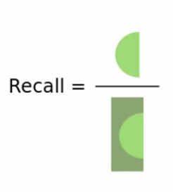

#### 1.1.2 IoU(Intersection over Union)

当然，对于目标检测任务而言，不仅包含分类，同时还有边界框回归。
为了评估边界框回归准确与否，这里使用IoU(交并比)指标进行评估。

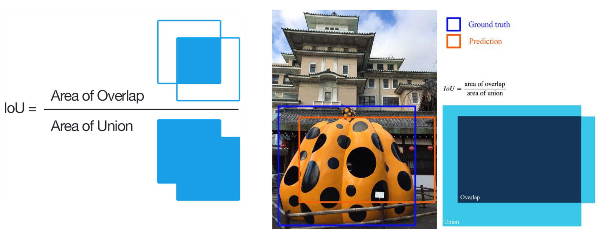

由图所示，我们令蓝色边框部分为Ground truth(基本事实)为标定的框，黄色边框部分为Prediction(预测结果)，那么如何来描述预测结果与基本事实之间吻合的程度呢？这里用一个参数比率IoU：**两个框的交集/两个框的并集来进行衡量**，也称作**交并比**。若交并比，也就是两个框之前的重叠程度越高，则说明预测的框体越准确。

Iou表示预测的边界框和真实边界框之间的重叠程度。您可以为 Iou 设置阈值以确定对象检测是否有效。假设您将 Iou 设置为 0.5，在这种情况下

- 如果Iou ≥ 0.5，则将对象检测分类为True Positive(TP)。
- 如果Iou ≤ 0.5，那么这是一个错误的检测并将其归类为False Positive(FP)。
- 当图像中存在Ground Truth(基本事实)并且模型未能检测到对象时，将其分类为False Negative(FN)。
- True Negative(TN)是我们没有预测对象的图像的每个部分，这个指标对对象检测没有用，因此我们忽略了 TN。

**从IoU的角度来看Precision、Recall等**

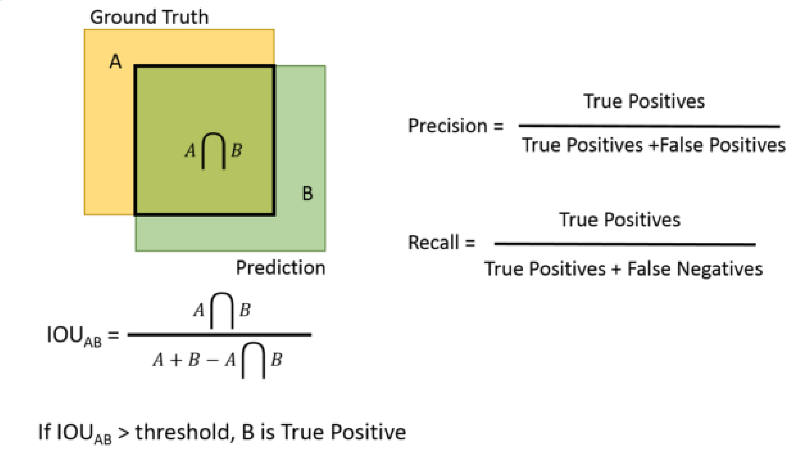

#### 1.1.3 P-R curve

　　P-R曲线是以召回率R为横轴，准确率P为纵轴，然后根据模型的预测结果对样本进行排序，把最有可能是正样本的个体排在前面，而后面的则是模型认为最不可能为正例的样本，再按此顺序逐个把样本作为“正例”进行预测并计算出当前的准确率和召回率得到的曲线。

　　通过上图我们可以看到，当我们只把最可能为正例的个体预测为正样本时，其准确率最高位1.0，而此时的召回率则几乎为0，而我们如果把所有的个体都预测为正样本的时候，召回率为1.0，此时准确率则最低。

#### 1.1.4 AP(Average Precision)

用一个简单的例子来演示平均精度(AP)的计算。
假设数据集中总共有5个苹果。我们收集模型为苹果作的所有预测，并根据预测的置信水平(从最高到最低)对其进行排名。
第二列表示预测是否正确。如果它与ground truth匹配并且IoU$\ge$0.5，则是正确的。

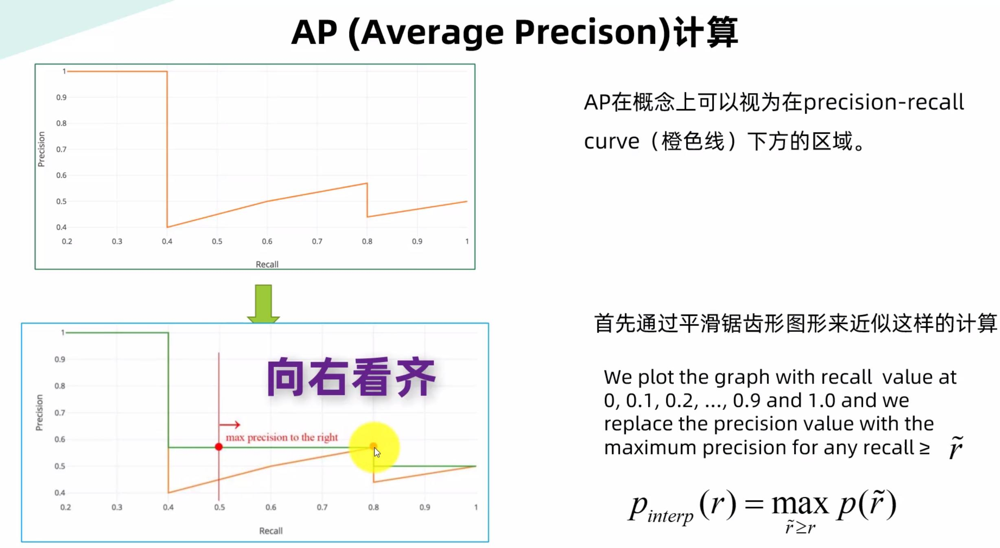

AP计算之11点法 

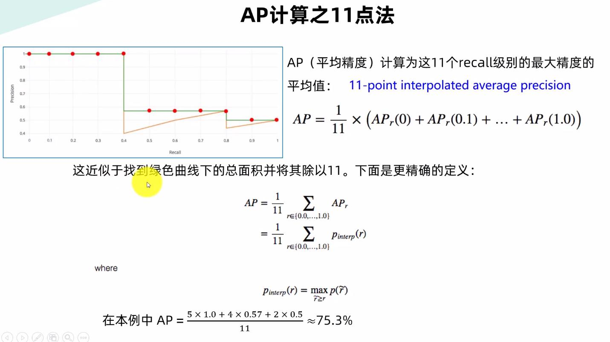

对于PASCAL VOC挑战来说，如果Iou>0.5，则预测为正样本(TP)。

但是，如果检测到同一目标的多个检测，则视第一个检测为正样本(TP)，而视其余检测为负样本(FP)。

上面的计算方法是2010年以前的计算方法，2010年之后则改用了积分的方法来进行计算最后的AP值，相较于之前更加准确。

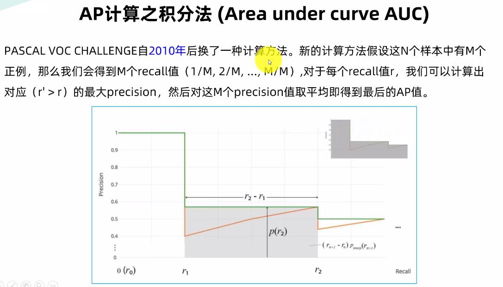

将上图进行划分为四个不同面积大小的区域，则总体的AP就等于四者之和。

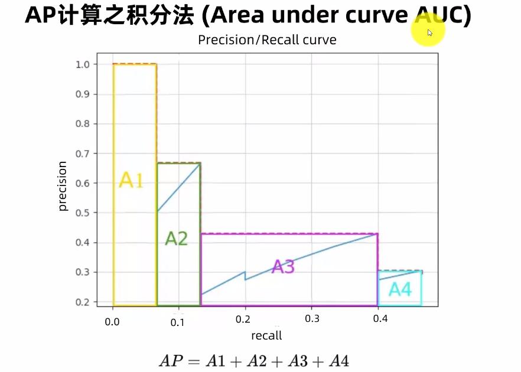

最后做一个小结：

- Pascal VOC2007 uses 11 Recall Points on PR curve.
  在PR曲线上使用11个回忆点。

- Pascal VOC2010-2012 uses(all points)Area Under Curve(AUC)on PR curve.
  在PR曲线上使用(所有点)曲线下面积(AUC)。

- MS COCO uses 101 Recall points on PR curve as well as different IoU thresholds。

  在PR曲线上使用101个召回点以及不同的IoU阈值，划分更加精细。

  

#### 1.1.5 mAP(mean Average Precision)

Average Precision(AP)衡量出来的是学习出来的模型在每个类别上的好坏；
mean Average Precision(mAP)衡量的是学出的模型在所有类别上的好坏，实际上mAP就是取所有类别上AP的平均值。

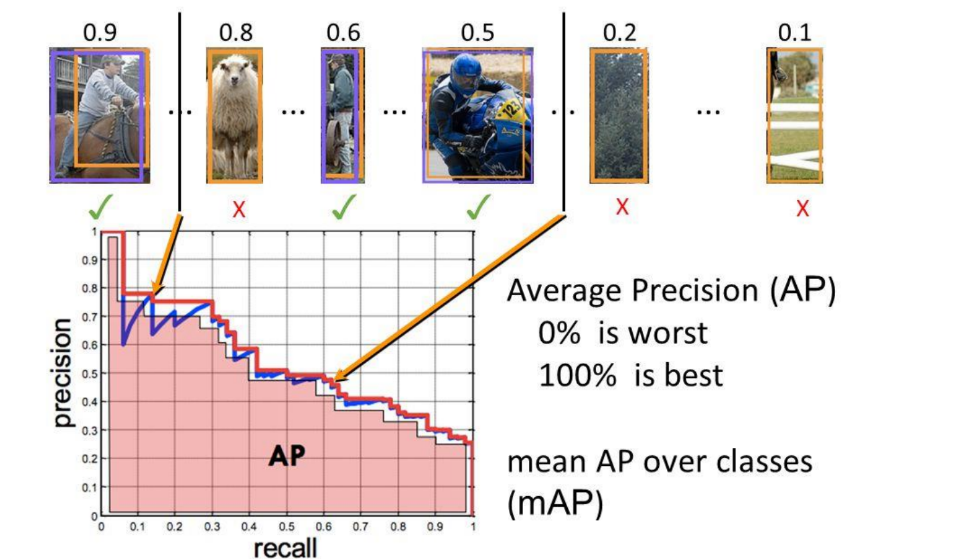

下面来看这张表，这里呈现的是，对于不同的网络，例如：VGG-16、ResNet-101、ResNet-101在相同数据下的不同类别精度数据表现以及平均精度表现。

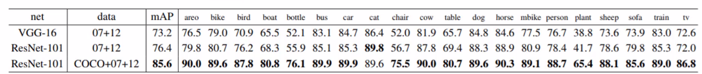

#### 1.1.6COCO AP

以COCO数据集为例，AP是多个IOU的平均值（考虑Positive匹配的最小IOU）
mAP@[.5:.95]对应于Iou的平均AP，从0.5到0.95，步长为0.05。
在COCO竞赛中，AP是80个类别中超过10个Iou levels的平均值
mAP@.75的意思是Iou的平均检测精度mAP为0.75。

- 这里可以引申出一个问题：是否Iou越大越好？

  从下图可以看出，随着Iou的增加，Precision-Recall曲线中Recall的也随之下降，即为增加Iou后的查全率下降了，也就是说查找的框体随着Iou边界逼近重叠而减少了，很多预测框不准的都不认为是重要的。

下面是关于COCO数据集AP的一些简单介绍
其中AP at IoU=.95:.05:.95(primary challenge metric)是主要的一种指标。
IoU=0.50的时，与PASCAL VOC的AP metric相同。若IoU=0.75时，则相对比较严格。
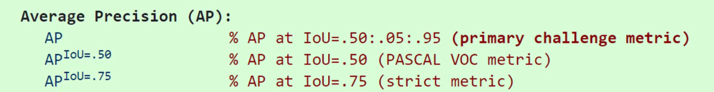

**不同尺度大小下的AP**
这里将small(小)、medium(中)、large(大)进行不同的区分
其中Small小目标的定义是：像素面积area<32^2;
medium中等目标的定义是：像素面积area > 32^2且area < 96^2
large大目标的定义是：像素面积area > 96^2
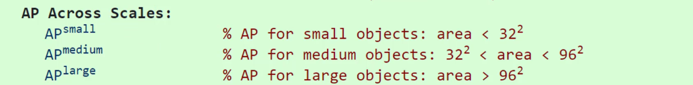

**平均召回率**

下面max对应的分别是每张图片下包含的目标个数
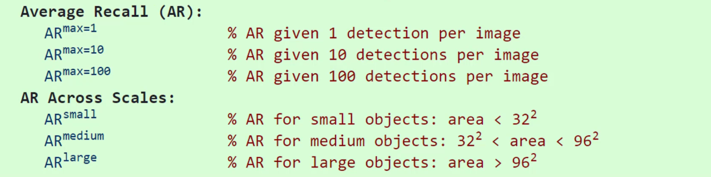

### 1.2 检测速度

- 前传耗时
- 每秒帧数FPS(Frames Per Second)(每秒传输帧率)
- 浮点运算量(FLOPS)

#### 1.2.1 前传耗时

从输入一张图像到输出最终结果所消耗的时间，包含前处理耗时(如图像归一化)、网络前传耗时、后处理耗时(如非极大值抑制nms)。

#### 1.2.2 FPS(Frames Per Second)

FPS是图像领域中的定义，是指画面每秒传输帧数，通俗来讲就是指动画或视频的画面数。FPS是测量用于保存、显示动态视频的信息数量。每秒钟帧数越多，所显示的动作就会越流畅。通常，要避免动作不流畅的最低是30。某些计算机视频格式，每秒只能提供15帧。

FPS也可以理解为我们常说的“刷新率（单位为Hz）”，例如我们常在游戏里说的“FPS值”。我们在装机选购显卡和显示器的时候，都会注意到“刷新率”。一般我们设置缺省刷新率都在75Hz（即75帧/秒）以上。例如：75Hz的刷新率刷也就是指屏幕一秒内只扫描75次，即75帧/秒。而当刷新率太低时我们肉眼都能感觉到屏幕的闪烁，不连贯，对图像显示效果和视觉感观产生不好的影响。

电影以每秒24张画面的速度播放，也就是一秒钟内在屏幕上连续投射出24张静止画面。有关动画播放速度的单位是fps，其中的f就是英文单词Frame（画面、帧），p就是Per（每），s就是Second（秒）。用中文表达就是多少帧每秒，或每秒多少帧。电影是24fps，通常简称为24帧。

结合以上性能指标描述，下面可以更容易理解下列表格中不同模型之间的性能差异及表现效果。

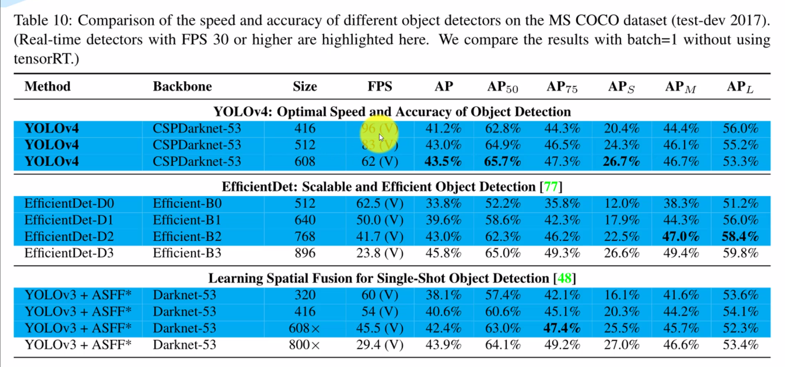

#### 1.2.3 浮点运算量(FLOPS)

处理一张图像所需要的浮点运算数量，跟具体软硬件没有关系，可以公平地比较不同算法之间的检测速度。