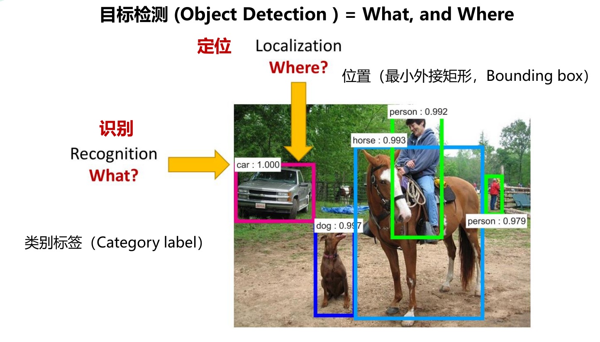

## 目标检测任务理解与总结

---

从字面意义理解，所谓目标检测任务，就是定位并检测目标，也就是说计算机在处理图像的时候需要解决两个问题：
1.What? —— 图像中是什么东西？我们的目标是要检测什么东西？—— **识别** Recognition
2.Where? —— 在图像的什么位置？目标的定位坐标大致范围是多少？—— **定位** Localization

在目标检测算法中，通过**最小外接矩形**(Bounding box)来进行**目标定位**，同时利用预设**类别标签**(Category label)来进行目标对象类别的区分，于是这个图像检索的问题就被描述成，计算机在进行目标检测任务时，只需要识别出对应的框体和类别名称，即解决了当前图像的目标检测问题。

其中有两项比较重要的参数是帮助描述和实现目标检测任务的关键：**类别标签**和**置信度得分**。

- 类别标签(Category label)：对于当前标记目标类别的标签名称或标记符号称为类别标签。
- 置信度得分(Confidence score)： 用来描述和确认当前检测目标为某一个标记类别的接近程度。

与其他类型(图像分类、实例分割)任务相比
从单目标对象的角度来看，分类仅针图像中的目标本身，而分类+定位则需要在分类的基础上框选其目标范围；
从多目标对象的角度来看，目标检测需要对图像中的不同目标进行最小外界矩形定位和标签分类，而实例分割则需要对图像中的不同目标边界轮廓进行包围标注和标签分类。

具体地来说，我们将定位和检测这两种不同的问题，描述为以下的任务：
定位和检测：

- **定位**：定位是找到检测图像中带有一个给定标签的**单个目标**
- **检测**：检测是找到图像中带有给定标签的**所有目标**。