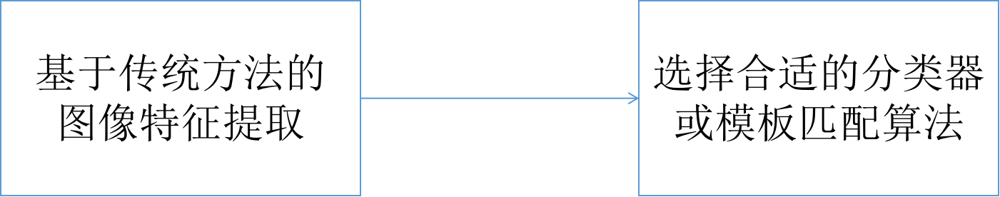

# 目标检测算法综述学习总结

---

## 摘要

近年来，CNN的飞速发展促进了计算机视觉算法的成熟。本文简要介绍了几种具有代表性的目标检测算法，并根据其优缺点，系统地分析了算法存在的问题、改进方法和未来的发展方向。
它一般分为单级检测模型和双级检测模型，基于目标检测过程中是否需要提取候选区域的检测模型进一步任务的检测。在双级检测模型中具有缩放功能算法分为单尺度检测和多尺度检测可以适当地与网络结构集成，从而提高面向小目标的网络模型。同时，在单级anchor检测模型的发展基础上也延伸出anchor-base和anchor-free。可预测的目标检测算法的发展将向我们展示未来。

关键词:计算机视觉，目标检测，卷积神经网络

---

## 一、引言

在当今社会不断发展的今天，计算机视觉技术已经融入到生活的各个方面。目标检测是计算机视觉技术中一项非常基础而又非常重要的任务。目标检测应用于社会安全管理、交通车辆监测、环境污染检测、森林灾害等领域。在预警和国防安全领域有非常突出的应用成果。目标检测的任务主要包括数字图像中单个或多个感兴趣目标的识别和定位。人们对包含目标的训练图像进行处理，提取稳定的、独特的特征或特定的抽象语义信息特征，然后将这些可区分的特征进行匹配或使用分类算法对每个类别赋予置信度进行分类。

目标检测算法已研究多年。20世纪90年代，出现了许多有效的传统目标检测算法。它们主要是利用传统的特征提取算法提取特征，然后结合模板匹配算法或分类器进行目标识别。然而，由于缺乏强语义信息和复杂的计算，传统算法在发展中遇到了瓶颈。

2014年，Ross Girshick提出了一种基于卷积网络的目标检测模型RCNN[1]，该模型检测精度高，特异性鲁棒性和泛化能力强，使人们更加重视利用卷积神经网络提取图像的高级语义信息，并提出了许多优秀的卷积神经网络检测模型。

---

## 二、传统的目标检测算法模型

传统的目标检测训练模型大致可以分为两个步骤

基于图像特征采集的不同模式可分为两大类：

基于**特征区域**的特征算法模型。(Haar, LBP, HOG特征等)，主要通过选择合适的检测帧或特征模板来获得易于区分的特征向量。

基于**特征点**的特征算法模型。(SIFT， SURF， ORB feature等)，主要定位复杂场景中一些稳定且独特的特征点，如极值点、明亮区域中的暗点、黑暗区域中的亮点。然后使用具有较高可分辨性的特征点描述符来区分不同的特征点

传统方法中使用的分类匹配方法很多，可以分为**相似度模型**(K-Nearest Neighbor， Rocchio)概率模型(Bayes)线性模型(SVM)非线性模型(decision tree[9])集成分类器(Adaboost)。

---

## 三、卷积神经网络

2014年，RCNN卷积网络的提出开启了目标检测发展的新阶段。它的精度和稳定性大大超过了传统的目标检测算法，因此很快被人们所接受。卷积神经网络的检测模型主要分为单级和两级检测模型。不同的是，两阶段检测模型需要训练候选区域网络(region proposal network,RPN)，但增加了计算复杂度，模型难以实现实时检测。单级模型摒弃了这一环节，将目标检测问题转化为回归问题。虽然牺牲了模型的精度，但大大提高了模型的计算速度，并且模型可以实时检测。

### 3.1 卷积神经网络检测的过程

卷积神经网络目标检测与传统检测也有一定的相似之处，可以看作是特征提取和利用特征来识别目标。特征提取网络主干和“detection head(检测头)”

卷积神经网络利用卷积网络提取图像的高级语义特征，这些特征特征通常是网络的主干，然后对特征映射进行处理，如将一个全连接的网络与softmax或svm连接，形成一个classification head(分类头)来完成分类任务。将核心处理为特征维度，利用位置损失函数进行目标定位。

网络通过损失函数判断误差，并通过网络的反向梯度传播更新网络权值参数，从而不断减小损失函数的值，提高检测精度。检测网络通过大量的训练数据进行多次计算，可以从这组数据中学习一组最优的权值来预测检测目标

### 3.2 卷积神经网络模型的骨干网络

目前比较著名的骨干网络有:
(1998) LeNet-5 
(2012) AlexNet 
(2013) ZFNet 
(2014) GoogLeNet 
(2014) VGGNet 
(2015) ResNet 
(2016) ResNet v2 
(2017) ReNetXt 
(2018) DenseNet 
(2019) VoVNet和VoVNet 
(2020) VoVNet-v2

基本上是将图像的图像按照一定的空间位置通过各种卷积核进行乘法和累加，得到下一级特征图像。

## 四、卷积神经网络骨干网络的发展

### 4.1 LeNet-5

最早的经典卷积特征骨干网络是Lecun等人在1995年提出的LeNet-5[11]。虽然当时的网络模型比较简单，但在卷积神经网络中已经包含了最基本的卷积池。转换层和全连通层对卷积神经网络的发展起到了指导作用，卷积神经网络主要用于手写识别。

### 4.2 AlexNet

卷积神经网络在2012年开始流行。其中，Alex Krizhevsky提出AlexNet网络[12]的结构总体上与LeNet相似，即先卷积后全连接。但网络更复杂，使用了五层卷积，三层全连接网络，最后的输出层是为1000个通道的softmax。AlexNet使用两个gpu进行计算，大大提高了计算效率。在ILSVRC-2012竞赛中，它获得了前5名的错误率为15.3%。

为了获得更大的接受野，网络的第一层使用了一个11*11的卷积核，并在每个卷积层添加LRN局部响应归一化以提高精度， 但在2015年，用于大规模图像识别的深度卷积网络。提到LRN基本上是没有用的。

### 4.3 ZFNet

由于人们想要了解卷积神经网络的工作原理，ZFNet[13]在2013年被提出，它提供了一个可视化的网络来了解卷积网络的各个层次。AlexNet的主要改进是在使用deconvnet和visual feature map来可视化它的同时，使用更小的卷积来降低时间复杂度，同时赢得了ILSVRC冠军。通过对神经网络的可视化可以看出，低级网络提取了图像的边缘纹理特征，高级网络提取了图像的抽象特征。该特征具有平移和尺度不变性，但不具有旋转不变性。

### 4.4 GoogLeNet

为了进一步提高神经网络的性能,最直接的方法是增加网络的深度和广度,但它会导致太多的参数增加的计算量,和有限的训练集将导致如梯度扩散或过度拟合的问题。例如，22层的AlexNet有大约6000万个参数。2014年提出的GoogLeNet在相同情况下只有500万个参数。它主要使用卷积的解决方案。GoogLeNe v1将一个5x5的卷积运算分解为两个3x3的卷积运算。当他们获得相同的接受域时，参数减少了2.78倍。GoogLeNe v2除3x3卷积运算分解为1x3和3x1卷积运算。GoogLeNe V3将7*7卷积核分解为7*1和1*7卷积核，深化了网络的深度，减少了参数。GoogLeNe v4是在GoogLeNe v3的基础上增加残留网络，大大增加了深度。

### 4.5 VGGNet

Karen Simonyan等人在2014年提出的VGGNet[18]相当于AlexNet的网络深化版，由卷积层和全连接层两部分组成。所有激活层使用relu，池化层使用最大池化。其结构简单，特征提取能力强，在ILSVRC2014和2014的分类项目中排名第二在定位项目中排名第一。测试中使用的VGGNet使用了一个1*1的卷积核对全连通层进行改进，成为一个有卷积的全连通层。这克服了传统全连接层需要固定输入尺寸的缺点。因此，采用多尺度训练，训练图像尺度在[256,512]边长范围内随机选取。这种尺度抖动方法可以增强训练集。

### 4.6 ResNet series

随着网络深度的增加，获得的特征越来越丰富，但优化效果较差，由于梯度爆炸和消失等原因使得检测精度降低。对于较浅的网络，可以对每一层的输入数据进行归一化，使网络收敛。但深度网络仍存在优化问题。因此，何凯明在2015年提出了ResNet来打破这一瓶颈，主要采用了跳跃连接结构。

在2016年提出的ResNet v2[20]的基础上，通过改变归一层、池化层和卷积层的顺序，得到一组性能最好的跳变结构(图22)，ReNetXt[21]是在2017年提出的，它借鉴了GoogLeNet的思想，在卷积层的两边增加了1*1的卷积，减少了控制核的数量，参数减少了约三分之二。

### 4.7 DenseNet

以前的卷积网络要么像GoogLeNet一样宽，要么像ResNet一样深。2018年发表的DenseNet[22]作者通过实验发现了两种神经网络的两个特征:

- 1.去掉中间层后，下一层直接与上一层连接，即神经网络不是递进的层次结构，不需要将相邻层连接起来。

- ResNet的许多层是在训练过程中随机删除，不会影响算法的收敛性和预测结果，该网络证明了ResNet具有明显的冗余性，网络中的每一层只提取一个几乎没有特征（所谓的残差）。与ResNet相比，DenseNet具有明显的优势，提高了性能，减少了参数。

  

### 4.8 SENet

SENet[23]于2019年发布，针对检测任务，并提出了一种结合注意抑制对当前任务无用特征的思想的信道权值。SE模块主要用于卷积层的权值分配。这种子模块形式使其与其他网络兼容。本文主要应用于ResNet网络。SE模块嵌入在ResNeXt、BN-Inception、Inception-ResNet-v2中，并且已经取得了很大的进展。由此可以看出，SE的增益效应不仅局限于某些特殊的网络结构，而且具有很强的泛化性。

### 4.9  EfficientNet

考虑到以前的网络主要通过单一的宽度(WideResNet和mobilenet)、深度和网络模型的分辨率来提高网络的准确性。EfficientNet网络模型[24]量化了这三个维度之间的关系，并使用一个恒定的比率来简单地增加，以同时平衡网络的三个维度。

### 4.10  VoVNet series

2019年提出的VoVNet网络[25]已经完全超越ResNet，可以用作实时目标检测的骨干网。考虑到能量消耗和模型推理速度等因素，优化内存访问成本(输入输出通道数相同时效率最高)和GPU计算效率(GPU处理大张量强，CPU处理小张量强)更为关键。

同时,在改进的2020 CenterMask文章中,剩余块和eSE模块添加(在原来的SE模块改进中，使用一个FC代替原来的两个FC以减少信息损失)大大增加其性能和VoVNet v2结构形式。与ResNet相比，VoVNet网络具有更强的小目标提取能力，速度和精度都更好。

---

## 五、目标检测的网络模型

网络模型通常用于检测图像中的子区域。因为遍历检测由于滑动框架需要大量计算，因此使用候选框架，首先要定位感兴趣的区域，然后检测每个候选区域，以极大地降低成本计算网络复杂度，通过这种算法提取候选区域，然后检测和定位目标称为两阶段检测算法。两阶段检测算法的准确率较高，但计算量仍较大，难以实现实时检测。

考虑到两阶段检测的实用性，单阶段检测算法不需要提取候选区域，而是对每个feature map进行回归预测，大大降低了网络算法的时间复杂度。近年来单级检测算法在保持较高检测速度的同时，其准确率已经接近两级检测算法，使得其发展受到了越来越多的人的关注。

### 5.1 二阶段目标检测网络模型

两阶段检测模型的发展从最初的RCNN开始，围绕RCNN模型有很多改进的模型，如SPP-Net、Fast-RCNN、Fast-RCNN、R-FCN等。这些模型都改进了RCNN网络在单尺度上的特征，大大提高了精度和速度。

结合多尺度特征融合的思想，对RCNN网络进行了改进。如ION、FPN、MASK-RCNN等，这种多尺度特征融合提高了网络模型检测小目标的能力

#### 5.1.1 基于单尺度特征模型

Ross Girshick等人在2014年提出的R-CNN[26]过程相对简单。首先,选择超过2000个候选帧随机利用输入图像(选择性搜索),然后放大到227 * 227,然后使用AlexNet CNN提取特性来获得一个2000 * 4096的矩阵,然后使用支持向量机算法进行分类,也就是说,用特征矩阵的矩阵4096 * 20(代表20类)。分数大于某一阈值的类别被判定为这个类。R-CNN模型在VOC 2010上的准确率达到了53.7mAP。

何凯明等人在2015年提出的SPP-Net[27]解决了当时RCNN网络的两个纯粹问题:

- 1.从原始图像中随机选取候选帧，并对每一候选帧进行特征网络处理。这种重复卷积计算的提取大大增加了计算量。
- 2.需要固定大小的输入图像，因此需要裁剪或缩放原始图像。

这些操作可能导致目标信息丢失，影响目标的准确性。
第一个问题使用共享特征卷积层，最后一个卷积层选择候选区域，减少计算量。
对于第二个问题，根本原因是全连通层需要输入一个固定维的特征向量。

为了解决这一问题，SPP-Net在特征网络的最后一个卷积层(feature map)上增加了金字塔池化层，用于有序输出。SPP-Net(ZF5)模型对VOC 2007的精度达到59.2mAP。

Ross Girshick等人在2015年提出的Fast-RCNN[28]借鉴了中共享卷积图像特征层的方法。

所有预测框共享一个卷积网络映射到特征映射层，同时在特征映射的最后一层中，提出了SPP-Net的特征池层的简化版本，以输出固定维特征向量，然后连接到完全连接的层以进行后续操作。

结合SPP-Net的思想对RCNN网络进行优化，大大降低了网络的时间复杂度(但使用选择性搜索候选框仍然非常耗时)。为Faster-RCNN未来的发展奠定了基础。SPP-Net模型对VOC 2007的精度达到66.9mAP。

任少青等人2016提出了Faster-RCNN[29]，解决了Fast-RCNN中的两个问题:

- 1.建议框使用选择性搜索算法，这大大增加了网络计算的数量。
- 2.在定位框架的目标损失函数在最优解不稳定处，使用L1距离点。

Faster-RCNN训练网络是端到端网络，实现了大部分计算的共享，具有较高的检测精度和抗干扰性。虽然实时性不高，但其独特的区域建议网络RPN为整个阶段检测的目标开辟了新的思路。Faster-RCNN(VGG-16)模型对VOC 2007的准确率达到69.9mAP。

Jifeng Dai等人在2016年提出的R-FCN[30]解决了Faster-RCNN网络模型的问题，因为集合ROI层中的每个建议框都需要单独连接到完全连接的层进行分类和定位。每个特征点会生成9个建议框，消耗大量计算资源。R-FCN在通过ROI后与所有的建议框共享计算结果。骨干特征网络使用更深的残差网络，但由于深度的增加，特征图进一步减小。当原始图像上的物体发生位移时，经过卷积网络后特征地图上的感知能力变弱，网络的平移变异性发生变化。

两者的区别：(分类任务需要更好的翻译不变性，定位任务需要更好的翻译可变性)因此R-FCN添加了一个位置敏感的得分图来解决这个问题。R-FCN(ResNet-101)模型对VOC 2007和VOC 2012的精度达到75.5mAP。

#### 5.1.2 基于多尺度特征融合模型

Sean Bell等人在2015年提出的ION[31]模型在当时的目标检测模型上存在两个问题:

- 1.1.当时，Fast-RCNN或SPP-Net检测到提议的建议框

  目标周围，也就是建议框体的外部缺少上下文信息。

- 2.两者都只使用最后一层的特征图，只使用高级的语义特征，而缺乏对低级细节特征的使用。

对于问题1，ION网络模型采用递归神经网络的思想，通过连接两个IRNN单元来提取上下文信息。

对于问题2，采用多尺度特征融合检测。
ION网络模型利用上下文信息获取相对宽泛的图像特征信息，结合多通道融合获得的图像细节信息，以获得更好的预测结果。从而提高了小目标的检测精度，并提出了被遮挡目标的检测精度。ION模型在COCO数据集上的精度达到33.1AP。

Tsung Yi Lin等人在2017年[32]提出的FPN利用底层网络结构的高级语义信息融合来提高特征图的分辨率，在更大的特征图上进行预测有助于获得更多的小目标。

这些特征信息，使得小目标预测效果明显提高。该FPN模型在COCO数据集上的精度达到了59.1AP。

何开明等人在2018年提出的Mask-RCNN在结构上与Faster-RCNN相似。它是一个灵活的多任务检测框架，可以完成: 目标检测、目标实例分割和目标关键点检测。

简单地说，就是一个“探测头”（分割任务层）添加到Faster-RCNN框架结构中。由于引入了Mask layer层，网络能够处理segmentation分割任务和key point关键点任务。ROI Align避免了两种Faster-RCNN并提高检测精度。COCO上Mask-RCNN模型的精度达到36.4AP。

### 5.2 单阶段目标检测网络模型

最早的单级检测模型是YOLO v1。一种改进是在特征提取网络获得的特征图上使用anchor-base锚基，根据预先设定的anchor frame锚帧，逐点检测目标，如SSD、YOLO V2、RetinaNet、YOLO V3、YOLO V4、EfficientDet等

同时，另一种改进是利用anchor-free无锚思想，通过网络直接点对目标的两个角点和中心点，利用这些关键点来实现目标的返回定位任务。如:CornerNet、CenterNet、CornerNet- lite、FCOS、CenterMask等。

anchor-free无锚模型克服了锚基模型的以下五个缺点:

- 1.检测性能对锚帧的大小、宽高比和数量非常敏感，因此需要仔细调整锚帧相关的超参数。
- 2.锚架尺寸和宽高比确定。因此，对于大变形的候选目标，特别是小变形目标，检测器的处理是很困难的。
- 3.预定义的锚箱也限制了检测器的泛化能力，因为它们需要为不同的对象大小或宽高比设计。
- 4.为了提高recall rate(召回率)，需要在图像上放置密集的anchor frames(锚定帧)。这些anchor boxes(锚框)大多属于负样本，导致正样本和负样本不平衡。
- 5.大量的anchor boxes(锚框)增加了计算交集比时的计算量和内存使用量。

#### 5.2.1 基于anchor-base锚基检测模型

Wei Liu等人在2016年提出的SSD[34]网络模型对Yolo v1目标检测帧定位不准确和小目标检测不佳的问题提出了两种改进。

- 1.SSD采用多尺度融合来提高检测精度(即在包含丰富空间细节信息的大规模feature maps特征图上预测小目标对象，在包含高度抽象语义信息的高级feature maps特征图上预测较大目标对象)。
- 2.SSD使用了与Faster-RCNN类似的Anchors锚点(不同纵横比的候选帧)，在一定程度上克服了YOLO v1算法定位不准确和小目标定位困难的问题。SSD(512)模型在可可上的精度达到了26.8AP

Joseph RedmonR等人在2016年提出的YOLO V2[35]改进了YOLO V1模型中小目标检测和不准确目标帧定位的难度。YOLO V2首先使用Darknet-19特征提取网络来取代YOLO V1的GoogleNet。

使用更高分辨率的特征图进行预测，并使用多标签模型来组合数据集，使扁平的网络结构简化为structure tree结构树。

同时，采用联合训练分类和检测数据机制来扩展训练数据集，提高检测准确率，其准确率超过了两阶段Faster-RCNN。YOLO V2模型在COCO上的精度达到21.6AP。

Tsung Yi Lin等人在2018年提出的RetinaNet模型在训练期间通常具有比正样本多得多的负样本。这种不平衡(往往导致最终计算出的训练损失占绝对多数，但包含了信息量小的负样本为主的负样本。但是提供的关键信息的一些正向的样本不能发挥正常的作用，以至于通常使用训练时几乎不可能按照正确的指导模型进行训练从而描绘出损失)

所以RetinaNet将样本划分为hard固定样本时，会产生很大的准确性误差，在(0.4<IOU<0.5)范围内难以区分样本。

采用Focal Loss(消除类别不平衡+挖掘难度大的样本)提高精度。retavanet (ResNeXt-101-FPN)模型在COCO上的准确性达到40.8AP。

Joseph Redmon等人在2018年提出的YOLO v3[37]是YOLO v3在YOLO V2基础上的进一步改进，其检测更加准确，速度仍然非常快。

主要改变是使用Darknet-53取代Darknet-19主干特征提取网络（YOLO v3）使用darknet-53的前52层（无全连接层）。

加上多尺度融合检测，在不同的层中获得y1、y2和y3的三个输出（每个预测尺度的特征映射点上只有三个先验框）。并修正了损失。YOLO v3(Darknet-53)模型COCO上数据的准确性达到33.0AP。

Alexey Bochkovskiy等人在2020年提出的YOLO v4[38]，在传统YOLO系列的框架上，采用了CNN领域近年来的最佳优化策略，从数据处理、backbone骨干网络、网络训练、activation激活函数、Loss函数等方面进行优化。

由Mingxing Tan等人在2020年提出的EfficientDet[39]在保持低浮点运算量的情况下实现了高精度。根据不同的精度要求，EfficientDet模型尺寸从D0增加到D7。

EfficientSet主要使用FPN网络和

将不同层次的特征图进行多层特征融合，形成BiFPN层次结构，并遵循高效网特征提取网络的思想，用一个简单的参数φ来实现其主干网络、特征融合网络BiFPN、Box/Class预测了网络规模，使网络更高效。

EfficientSet-D0(512)模型在COCO上的的准确度达到34.6AP，EfficientSet-D7x(1536)模型在COCO上的的准确度达到55.1AP。

#### 5.2.2 基于anchor-free无锚检测模型

Joseph Redmon等人在2016年首次提出了更经典的单阶段YOLO V1[40]模型。为了提高检测速度，单级检测去除两级RPN(区域提议网络)，直接在输出层确定目标类别和目标帧。

目标的定位以整个图像为输入，将目标检测任务转化为回归任务。早期的Yolo v1算法结构简洁，能很好地反映单级检测网络模型的特点。YOLO v1模型在COCO上的准确率达到57.9mAP。

Hei Law等人在2018年提出的CornerNet[41]利用单个卷积网络改变目标边界来预测一对关键点(即目标框的左上角和右下角)。

该设计可以消除常用的单级检测，预测锚杆的需求。同时，对池化层进行了改进，Corner Pooling角点池化可以用来定位包围框的角点(图46)。在MS COCO数据集上实现了42.1%的AP，优于当时所有单级探测器的检测性能，与两级检测器的检测性能相当。

CornerNet511(单尺度，Hourglass-104)模型在COCO上的的精度达到40.6AP，而CornerNet511(多尺度，Hourglass-104)模型在COCO上的的精度达到42.2AP。

Kaiwen Duan等人在2019年提出的CenterNet[42]也是一种单级无锚框架网络模型。对于CornerNet，只通过检测目标的左上角和右下角来确定目标。该方法没有充分利用目标内部的特征信息，因此针对误检测帧的现象，提出了一种改进的具有更丰富语义信息的级联Corner Pooling角点池化算法和一种用于检测目标Center Point中心点特征的中心池算法。利用三重组关键点对目标进行检测，大大提高了检测精度，成为当时最好的单级检测模型，速度约为270ms(52层特征网络)和340ms(104层特征网络)。

CenterNet 511(单尺度，沙漏-104)模型在CCOCO上的精度达到44.9AP, CenterNet 511(多尺度，沙漏-104)模型在COCO上的精度达到47.0AP。

Hei Law等人在2019年提出的CornerNet- lite[43]在CornerNet的基础上对骨干网络进行了优化，形成了CornerNet- squeeze。

该算法利用注意机制进行裁剪，去除网络检测目标的冗余图像部分(类似于两阶段检测，首先将目标的近似区域裁剪出来进行检测)。

该方法在速度和精度上取得了很好的突破，达到了当时单级探测器的最高精度(47.0%)。CornerNet-Saccade模型在COCO上的准确性达到43.2AP。

2019年Zhi Tian等人提出的FCOS[44]网络模型大致由FPN特征金字塔和三个分支检测头组成。FCOS摒弃了传统的锚框，直接对feature map上的每个点进行回归操作。

而FPN的多尺度分层检测大大减少了同一位置多个检测帧产生的模糊样本。中心度加权与非最大抑制(non-maximum suppression, non-maximum suppression)相结合是抑制低质量BB距离的一种很好的方法。

与一些最主流的一阶和二阶检测器相比，FCOS在检测效率上优于Faster R-CNN、YOLO、SSD等经典算法。FCOS为了提高准确度而缺乏速度，但在准确度和速度上优于RetinaNet。FCOS(ResNeXt-64x4d-101-FPN)模型在coco上的精度达到了44.7AP。

Youngwan Lee等人在2020年提出的CenterMask[45]是基于FCOS的，在注意机制中加入SAG-Mask实例分割模块，替代了其特征提取骨干网络(VoVNet-V2)。

使用ResNet101-FPN骨干网络可以达到38.3%的Mask_AP，超过以往所有网络，但速度只有13.9FPS。轻量级的CenterMask-Lite可以达到33.4%的Mask_AP和38%的Box_AP，速度可以达到35 FPS，可以满足实时性要求。CenterMask (V-39-FPN)模型在COCO上的精度达到了36.3AP_mask。

---

## 六、目标检测算法的未来发展方向和总结

为了追求更快、更准确的目标检测算法模型，该算法模型将合并更多其他先进的模型算法，单阶段方法和两阶段方法将逐渐合并。

例如，单级算法提出的目标位置估计的CornerNet Lite模型是伪模型，两阶段模型采用了两阶段目标检测的思想。

随着检测任务需求的多样化，目标检测模型不再是单一的任务模型，增加了实例分割(类似于多目标检测，全景分割(它是语义分割和实例分割的结合：语义分割是指为图像上的每个像素指定一个类别（可以通过颜色区分），但不区分个体）。经过全景分割，我们可以知道哪个个体图像上的每个像素属于哪个类别，这是一个更精细的分类任务。同时，还有检测人体姿态的关键点(即用点替换人体的关节，用相邻线段连接，抽象地表示人体姿态动作)。

## 七、参考材料

Summary of Target Detection Algorithms2021